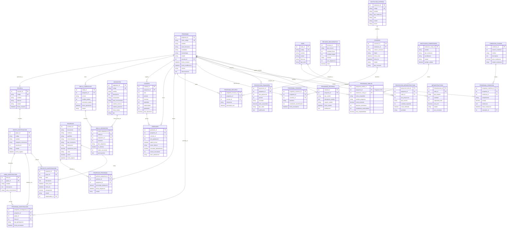

## Esquema propuesto para Base de datos

```mermaid
erDiagram
    %% ENTIDADES CENTRALES
    PROGRAMA {
        int programa_id PK
        string snies_codigo UK
        string nombre
        string nivel_formacion
        string modalidad
        string metodologia
        string estado
        int escuela_id FK
        datetime fecha_creacion
        datetime fecha_modificacion
        string version
        text observaciones
    }
    
    ESCUELA {
        int escuela_id PK
        string codigo UK
        string nombre
        string director
        string estado
        datetime fecha_creacion
    }
    
    %% ESTRUCTURA ACADÉMICA
    MALLA_CURRICULAR {
        int malla_id PK
        int programa_id FK
        string version
        int creditos_totales
        int semestres_totales
        datetime fecha_aprobacion
        string estado
    }
    
    ASIGNATURA {
        int asignatura_id PK
        string codigo UK
        string nombre
        text descripcion
        string componente
        string area_conocimiento
        int creditos_teoricos
        int creditos_practicos
        int horas_totales
        string tipo
    }
    
    MALLA_ASIGNATURA {
        int malla_asignatura_id PK
        int malla_id FK
        int asignatura_id FK
        int semestre
        string tipo_asignatura
        boolean es_electiva
        int orden_secuencial
        text prerrequisitos
    }
    
    %% RECURSOS HUMANOS
    PROFESOR {
        int profesor_id PK
        string documento UK
        string nombres
        string apellidos
        string nivel_formacion
        string tipo_vinculacion
        string dedicacion
        decimal experiencia_anos
        string cvlac
        boolean activo
        datetime fecha_ingreso
    }
    
    PROFESOR_PROGRAMA {
        int profesor_programa_id PK
        int profesor_id FK
        int programa_id FK
        decimal porcentaje_dedicacion
        datetime fecha_asignacion
        string estado
    }
    
    %% ESTUDIANTES Y ESTADÍSTICAS
    COHORTE {
        int cohorte_id PK
        int programa_id FK
        int ano
        int periodo
        int inscritos
        int admitidos
        int matriculados
        int graduados
        decimal tasa_desercion
    }
    
    GRADUADO {
        int graduado_id PK
        int programa_id FK
        int cohorte_id FK
        int ano_graduacion
        decimal salario_inicial
        string sector_laboral
        boolean vinculado_laboralmente
        int meses_vinculacion
        string nivel_satisfaccion
    }
    
    %% INFRAESTRUCTURA Y RECURSOS
    SEDE {
        int sede_id PK
        string codigo UK
        string nombre
        string ciudad
        string direccion
        string tipo_sede
    }
    
    INFRAESTRUCTURA {
        int infraestructura_id PK
        int sede_id FK
        string tipo_espacio
        int cantidad
        int capacidad_total
        decimal area_m2
        string estado
        int ano_inventario
    }
    
    RECURSO_BIBLIOGRAFICO {
        int recurso_id PK
        string tipo_recurso
        int cantidad_fisica
        int cantidad_digital
        string formato
        int ano_adquisicion
        decimal costo
    }
    
    PROGRAMA_RECURSO {
        int programa_recurso_id PK
        int programa_id FK
        int recurso_id FK
        string relevancia
        decimal porcentaje_uso
    }
    
    %% INVESTIGACIÓN
    GRUPO_INVESTIGACION {
        int grupo_id PK
        string codigo UK
        string nombre
        string categoria_colciencias
        int escuela_id FK
        string estado
        datetime fecha_registro
    }
    
    LINEA_INVESTIGACION {
        int linea_id PK
        int grupo_id FK
        string nombre
        text descripcion
        string area_conocimiento
    }
    
    PROGRAMA_INVESTIGACION {
        int programa_investigacion_id PK
        int programa_id FK
        int grupo_id FK
        int linea_id FK
        string tipo_participacion
        datetime fecha_vinculacion
    }
    
    PROYECTO_INVESTIGACION {
        int proyecto_id PK
        int grupo_id FK
        string titulo
        text descripcion
        datetime fecha_inicio
        datetime fecha_fin
        decimal presupuesto
        string estado
        int responsable_id FK
    }
    
    %% CONVENIOS Y ALIANZAS
    INSTITUCION_EXTERNA {
        int institucion_id PK
        string codigo UK
        string nombre
        string tipo_institucion
        string pais
        string ciudad
        string sector
    }
    
    CONVENIO {
        int convenio_id PK
        int institucion_id FK
        string numero_convenio
        string objeto
        datetime fecha_inicio
        datetime fecha_fin
        string estado
        string tipo_convenio
    }
    
    PROGRAMA_CONVENIO {
        int programa_convenio_id PK
        int programa_id FK
        int convenio_id FK
        string beneficio
        int estudiantes_beneficiados
        datetime fecha_vinculacion
    }
    
    %% PROGRAMAS SIMILARES Y BENCHMARKING
    INSTITUCION_COMPETIDORA {
        int institucion_comp_id PK
        string nombre
        string tipo_institucion
        string acreditacion
        string ciudad
        decimal puntaje_calidad
    }
    
    PROGRAMA_SIMILAR {
        int programa_similar_id PK
        int programa_id FK "Programa CUN"
        int institucion_comp_id FK
        string snies_competidor
        string nombre_programa
        decimal costo_semestre
        int duracion_semestres
        int estudiantes_matriculados
        decimal tasa_empleabilidad
    }
    
    %% EVALUACIÓN Y CALIDAD
    CONDICION_CALIDAD {
        int condicion_id PK
        int numero_condicion
        string nombre
        text descripcion
        decimal peso_evaluacion
        string estado_evaluacion
    }
    
    PROGRAMA_CONDICION {
        int programa_condicion_id PK
        int programa_id FK
        int condicion_id FK
        string cumplimiento
        decimal puntaje
        text evidencias
        datetime fecha_evaluacion
        int evaluador_id FK
    }
    
    %% PROYECCIONES Y FINANZAS
    PROYECCION_FINANCIERA {
        int proyeccion_id PK
        int programa_id FK
        int ano_proyeccion
        int periodo
        string concepto
        decimal valor_proyectado
        string tipo_rubro
        text justificacion
    }
    
    PROYECCION_INFRAESTRUCTURA {
        int proyeccion_infra_id PK
        int programa_id FK
        int sede_id FK
        int ano_proyeccion
        string tipo_recurso
        int cantidad_requerida
        decimal costo_estimado
        string prioridad
    }
    
    %% HISTORIAL Y AUDITORÍA
    PROGRAMA_HISTORIAL {
        int historial_id PK
        int programa_id FK
        string tipo_cambio
        text descripcion_cambio
        string usuario_cambio
        datetime fecha_cambio
        text justificacion
    }
    
    %% RELACIONES
    PROGRAMA ||--|| ESCUELA : "pertenece_a"
    PROGRAMA ||--o{ MALLA_CURRICULAR : "tiene"
    PROGRAMA ||--o{ COHORTE : "registra"
    PROGRAMA ||--o{ GRADUADO : "forma"
    PROGRAMA ||--o{ PROFESOR_PROGRAMA : "asigna"
    PROGRAMA ||--o{ PROGRAMA_RECURSO : "utiliza"
    PROGRAMA ||--o{ PROGRAMA_INVESTIGACION : "participa_en"
    PROGRAMA ||--o{ PROGRAMA_CONVENIO : "beneficia_de"
    PROGRAMA ||--o{ PROGRAMA_SIMILAR : "compara_con"
    PROGRAMA ||--o{ PROGRAMA_CONDICION : "cumple"
    PROGRAMA ||--o{ PROYECCION_FINANCIERA : "proyecta"
    PROGRAMA ||--o{ PROYECCION_INFRAESTRUCTURA : "planifica"
    PROGRAMA ||--o{ PROGRAMA_HISTORIAL : "registra_cambios"
    
    ESCUELA ||--o{ GRUPO_INVESTIGACION : "coordina"
    
    MALLA_CURRICULAR ||--o{ MALLA_ASIGNATURA : "contiene"
    ASIGNATURA ||--o{ MALLA_ASIGNATURA : "forma_parte_de"
    
    PROFESOR ||--o{ PROFESOR_PROGRAMA : "asignado_a"
    PROFESOR ||--o{ PROYECTO_INVESTIGACION : "lidera"
    
    COHORTE ||--o{ GRADUADO : "genera"
    
    SEDE ||--o{ INFRAESTRUCTURA : "posee"
    SEDE ||--o{ PROYECCION_INFRAESTRUCTURA : "requiere"
    
    RECURSO_BIBLIOGRAFICO ||--o{ PROGRAMA_RECURSO : "asignado_a"
    
    GRUPO_INVESTIGACION ||--o{ LINEA_INVESTIGACION : "desarrolla"
    GRUPO_INVESTIGACION ||--o{ PROGRAMA_INVESTIGACION : "colabora_con"
    GRUPO_INVESTIGACION ||--o{ PROYECTO_INVESTIGACION : "ejecuta"
    
    LINEA_INVESTIGACION ||--o{ PROGRAMA_INVESTIGACION : "vincula"
    
    INSTITUCION_EXTERNA ||--o{ CONVENIO : "establece"
    CONVENIO ||--o{ PROGRAMA_CONVENIO : "beneficia"
    
    INSTITUCION_COMPETIDORA ||--o{ PROGRAMA_SIMILAR : "ofrece"
    
    CONDICION_CALIDAD ||--o{ PROGRAMA_CONDICION : "evalua"
```