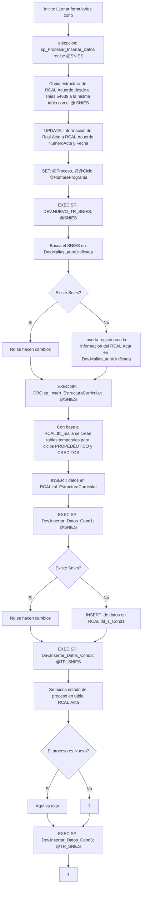

## SISTEMA REGISTRO CALIFICADO

### Diagrama de flujo

```mermaid
flowchart TD
    A[Inicio: LLenar formularios zoho] --> B[ejecucion: sp_Procesar_Insertar_Datos recibe @SNIES]
    B --> C[Copia estructura de RCAL.Acuerdo desde el snies 54639 a la misma tabla con el @ SNIES]
    C --> D[UPDATE: Informacion de Rcal.Acta a RCAL.Acuerdo NumeroActa y Fecha]
    D --> E[SET: @Proceso, @@Ciclo, @NombrePrograma]
    E --> F[EXEC SP: DEV.NUEVO_TR_SNIES; @SNIES]
    F --> G[Busca el SNIES en Dev.MallasLauraUnificada]
    G --> H{Existe Snies?}
    H -->|Sí| I[No se hacen cambios]
    H -->|No| J[Inserta registro con la informacion del RCAL.Acta en Dev.MallasLauraUnificada]
    I --> K[EXEC SP:  DBO.sp_Insert_EstructuraCurricular; @SNIES]
    J --> K
    K --> L[Con base a RCAL.tbl_malla se crean tablas temporales para ciclos PROPEDÉUTICO y CREDITOS]
    L --> M[INSERT: datos en RCAL.tbl_EstructuraCurricular]
    M --> N[EXEC SP: Dev.Insertar_Datos_Cond1; @SNIES]
    N --> O{Existe Snies?}
    O -->|Sí| P[No se hacen cambios]
    O -->|No| Q[INSERT  de datos en RCAL.tbl_1_Cond1]
    P --> R
    Q --> R[EXEC SP: Dev.Insertar_Datos_Cond2; @TR_SNIES]
    R --> S[Se busca estado de proceso en tabla RCAL.Acta]
    S --> T{El proceso es Nuevo?}
    T --> |Si| U[Aqui va algo]
    T --> |No| V[?]
    U --> W[EXEC SP: Dev.Insertar_Datos_Cond3; @TR_SNIES]
    V --> W
    W --> X[s]
```