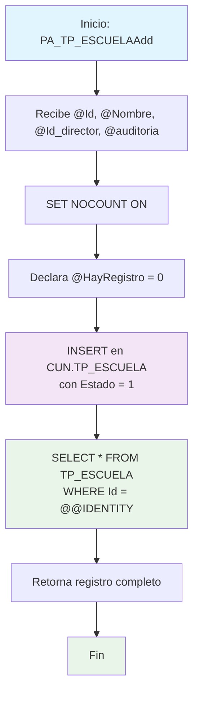

### PA_TP_ESCUELAAdd

Procedimiento CRUD para crear un nuevo registro de escuela en el sistema. Inserta una nueva escuela con nombre, director y auditoría, estableciendo estado activo por defecto y retornando el registro completo recién creado.

#### Diagrama de flujo



#### Procedimiento almacenado

```sql
-- **********************
-- |PA_TP_ESCUELAAdd|/_
-- Empresa: TiGlobal SAS
-- Procedimiento: [API].[PA_TP_ESCUELAAdd]
-- Creado Por: mc.diaz
-- Fecha: Aug 12 2024 9:55AM
-- Proyecto: ProyectoGenerado
--Descripcion: Parte del CRUD Básico, procedimiento para Crear un nuevo registros
-- **************************
Create Procedure [api].[PA_TP_ESCUELAAdd] @Id Int, @Nombre VarChar(160), @Id_director NVarChar(450), @auditoria VarChar(MAX)
AS
Set Nocount ON
declare @HayRegistro int
BEGIN
set @HayRegistro = 0
insert into [CUN].[TP_ESCUELA]
(Nombre, Id_director, Auditoria, Estado)
values (@Nombre, @Id_director, @Auditoria, 1)
Select _
from [CUN].[TP_ESCUELA]
Where Id = @@identity
END
```
#### Operaciones Principales

- Inserción de registro: Crea nueva escuela con datos proporcionados
- Estado automático: Establece Estado = 1 (activo) por defecto
- Recuperación de ID: Usa @@IDENTITY para obtener ID generado
- Retorno completo: Devuelve todos los campos del registro recién insertado

#### Tablas afectadas

- [CUN].[TP_ESCUELA]: Tabla principal de escuelas (escritura/lectura)
