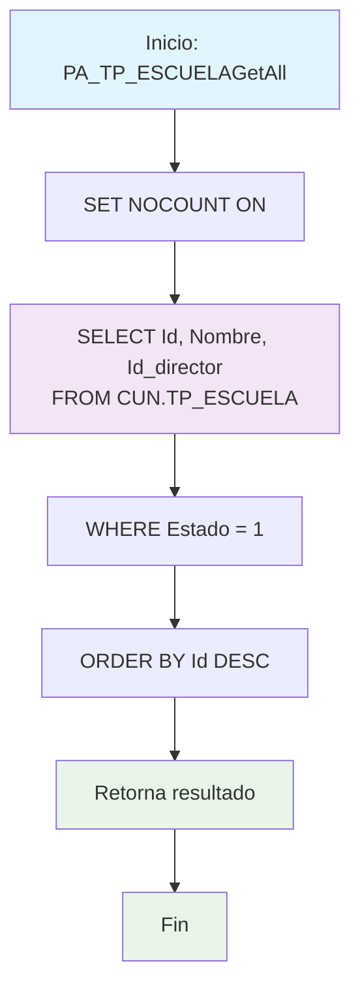

### PA_TP_ESCUELAAll

Procedimiento CRUD para consultar todas las escuelas activas del sistema. Retorna una lista completa de escuelas con ID, nombre y director, excluyendo registros inactivos y campos tipo BLOB por rendimiento.

#### Diagrama de flujo



#### Procedimiento almacenado

```sql
PA_TPESCUELAGetAll|/
Empresa: TiGlobal SAS
Procedimiento: [API].[PA_TPESCUELAAll]
Creado Por: mc.diaz
Fecha: Aug 12 2024 9:55AM
Proyecto: ProyectoGenerado
Descripcion: Parte del CRUD Básico, procedimiento de consulta de todos los registros no devuelve campos tipo BLOB
/
Create Procedure [api].[PA_TP_ESCUELAGetAll]
AS
Set Nocount ON
BEGIN
Select Id,Nombre,Id_director
From [CUN].[TP_ESCUELA]
where Estado=1
order by 1 desc
END
```

#### Operaciones Principales

- Consulta filtrada: Selecciona solo registros con Estado = 1 (activos)
- Campos específicos: Retorna solo ID, Nombre e Id_director (excluye BLOB)
- Ordenamiento: Ordena por ID descendente (más recientes primero)
- Optimización: Usa SET NOCOUNT ON para mejor rendimiento

#### Tablas afectadas

- [CUN].[TP_ESCUELA]: Tabla principal de escuelas (solo lectura)

#### Procedimientos Almacenados Anidados