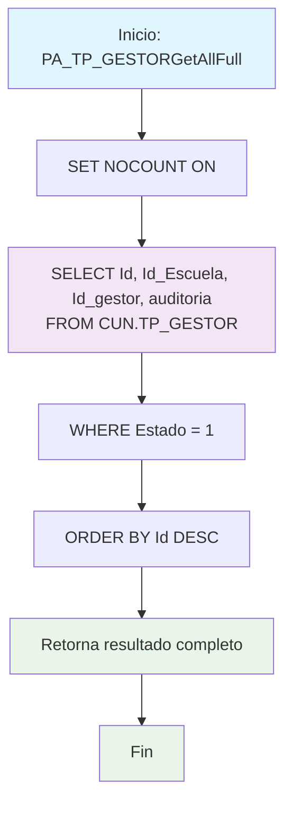

### PA_TP_GESTORAllFull

Procedimiento CRUD para consultar todos los gestores activos incluyendo información completa de auditoría. Similar al GetAll básico pero retorna el campo adicional de auditoría para trazabilidad completa de registros.

#### Diagrama de flujo


#### Procedimiento almacenado
```sql
/*
|PA_TP_GESTORGetAllFull|/_
Empresa: TiGlobal SAS
Procedimiento: [API].[PA_TP_GESTORAllFull]
Creado Por: mc.diaz
Fecha: Aug 12 2024 9:55AM
Proyecto: ProyectoGenerado
Descripcion: Parte del CRUD Básico, procedimiento de consulta de todos los registros
*/
Create Procedure [api].[PA_TP_GESTORGetAllFull]
AS
Set Nocount ON
BEGIN
Select Id,Id_Escuela,Id_gestor,auditoria
From [CUN].[TP_GESTOR]
where Estado=1
order by 1 desc
END
```
#### Operaciones Principales

- Consulta completa: Selecciona registros activos incluyendo campo auditoría
- Filtro por estado: Solo registros con Estado = 1 (activos)
- Información de trazabilidad: Incluye campo auditoría para seguimiento
- Ordenamiento: Por ID descendente (más recientes primero)

#### Tablas afectadas

- [CUN].[TP_GESTOR]: Tabla principal de gestores (solo lectura)

#### Procedimientos Almacenados Anidados