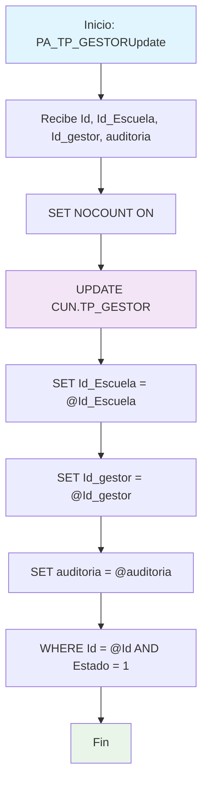

### PA_TP_GESTORUpdate

Procedimiento de actualización que modifica registros activos de gestores en la tabla TP_GESTOR. Actualiza la asociación escuela-gestor y la auditoría para un registro específico, validando que el registro esté en estado activo antes de proceder.

#### Diagrama de flujo


#### Procedimiento almacenado
```sql
/*|PA_TP_GESTORUpdate|/_
Empresa: TiGlobal SAS
Procedimiento: [API].[PA_TP_GESTORUpdate]
Creado Por: mc.diaz
Fecha: Aug 12 2024 9:55AM
Proyecto: ProyectoGenerado
Descripcion: Parte del CRUD Básico, procedimiento para Actualizar un registro
*/
Create Procedure [api].[PA_TP_GESTORUpdate] @Id Int, @Id_Escuela Int, @Id_gestor NVarChar(450), @auditoria VarChar(MAX)
AS
Set Nocount ON
BEGIN
Update [CUN].[TP_GESTOR]
set Id_Escuela = @Id_Escuela,
Id_gestor = @Id_gestor,
auditoria = @auditoria
where Id = @Id
and Estado=1
END;
```
#### Operaciones Principales

- Configuración: SET NOCOUNT ON para optimizar rendimiento
- Actualización selectiva: UPDATE con filtro por Id específico y Estado activo
- Actualización campos: Id_Escuela, Id_gestor y auditoria simultáneamente
- Validación estado: WHERE Estado = 1 garantiza solo registros activos
- Auditoría: Actualiza campo auditoria con información de trazabilidad
- Operación atómica: Todos los campos se actualizan en una sola transacción

#### Tablas afectadas

##### Actualizadas:

- CUN.TP_GESTOR: Campos Id_Escuela, Id_gestor, auditoria para registro específico activo

#### Procedimientos Almacenados Anidados