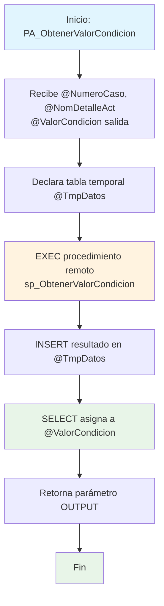

### PA_ObtenerValorCondicion

Procedimiento wrapper del sistema BPM4US que obtiene el valor de una condición específica de un caso BPM. Actúa como intermediario ejecutando un procedimiento remoto en otra instancia SQL Server y capturando su resultado a través de una tabla temporal.

#### Diagrama de flujo



#### Procedimiento almacenado

```sql
/**************************************\*\***************************************
Procedimiento [CUN].[PA_ObtenerValorCondicion]
Proyecto: BPM4US CUN
Descripción: Trae el valor de un detalle actividad dado el numero de caso, corresponde a una condicion en el proyecto en mención.
Creado por: MARIA CRISTINA DIAZ TORRES
Fecha de creación: 2024/08/14
TiGlobal SaS
Ejemplo de ejecución:

---

declare @Vcondicion varchar(MAX)
exec [CUN].[PA_ObtenerValorCondicion] '000000002098 ', 'ajusteSemantico', @Vcondicion output
select @Vcondicion Valor_condicion

---

**************************************\*\*\***************************************/
CREATE Procedure [CUN].[PA_ObtenerValorCondicion] @NumeroCaso varchar(250) , @NomDetalleAct varchar(200), @ValorCondicion varchar(max) output
as

---

-- Declaracion de TABLAS

---

declare @TmpDatos table (VrRetornado VARCHAR(MAX))

---

-- Declaracion de variables

---

declare @v_Valor varchar(MAX)

---

begin

---

-- INICIO --

---

    INSERT INTO  @TmpDatos(VrRetornado)
    EXEC [172.16.41.4\SQLEXPRESS].[BPM4UsCun].CUN.sp_ObtenerValorCondicion  @NumeroCaso, @NomDetalleAct

---

    SELECT @ValorCondicion = VrRetornado
    FROM @TmpDatos

---

-- FIN --

---

END
```
#### Operaciones Principales

- Ejecución remota: Llama procedimiento en servidor remoto 172.16.41.4\SQLEXPRESS
- Captura de resultado: Almacena salida del procedimiento remoto en tabla temporal
- Transferencia de datos: Asigna resultado capturado al parámetro de salida
- Wrapper pattern: Actúa como proxy entre cliente local y servidor remoto

#### Tablas afectadas

- @TmpDatos: Tabla temporal local (escritura/lectura)
- Servidor remoto: [172.16.41.4\SQLEXPRESS].[BPM4UsCun] (acceso remoto)

#### Procedimientos Almacenados Anidados

- [172.16.41.4\SQLEXPRESS].[BPM4UsCun].CUN.sp_ObtenerValorCondicion: Procedimiento remoto que ejecuta la lógica principal para obtener valores de condiciones BPM