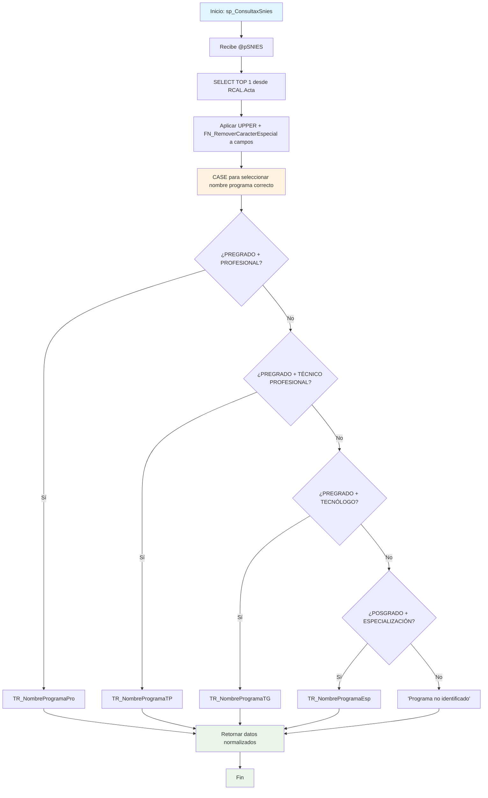

### sp_ConsultaxSnies

Procedimiento que consulta información básica de un programa académico por código SNIES. Normaliza datos aplicando función de limpieza de caracteres especiales y mayúsculas, selecciona el nombre del programa según nivel y ciclo específico mediante lógica condicional.

#### Diagrama de flujo


#### Procedimiento almacenado
```sql
/*|sp_ConsultaxSnies|_-=================================================================================================================================================================
Author: Johana Henao
Create Date: 18/10/2024
Description:
Version: 01
EXEC CUN.sp_ConsultaxSnies '54639'
EXEC CUN.sp_ConsultaxSnies '20241120'
EXEC CUN.sp_ConsultaxSnies '2024002'
EXEC CUN.sp_ConsultaxSnies '202400157'
--=================================================================================================================================================================*/

CREATE Procedure [CUN].[sp_ConsultaxSnies]
( @pSNIES varchar(255)
)
AS

BEGIN
SELECT top (1) upper(CUN.FN_RemoverCaracterEspecial(a.TR_Proceso)) TipoProceso,
upper(CUN.FN_RemoverCaracterEspecial(a.TR_ciclo)) NivelFormacion,
case
when a.tr_nivel = 'PREGRADO' AND a.TR_Ciclo = 'PROFESIONAL' then upper(CUN.FN_RemoverCaracterEspecial(a.TR_NombreProgramaPro))
when a.tr_nivel = 'PREGRADO' AND a.TR_Ciclo = 'TÉCNICO PROFESIONAL' then upper(CUN.FN_RemoverCaracterEspecial(a.TR_NombreProgramaTP))
when a.tr_nivel = 'PREGRADO' AND a.TR_Ciclo = 'TECNÓLOGO' then upper(CUN.FN_RemoverCaracterEspecial(a.TR_NombreProgramaTG))
when a.tr_nivel = 'POSGRADO' AND a.TR_Ciclo in ( 'ESPECIALIZACIÓN', 'ESPECIALIZACION') then upper(CUN.FN_RemoverCaracterEspecial(a.TR_NombreProgramaEsp))
else upper('Programa no identificado')  
 end NombreProgramaPro,
upper(CUN.FN_RemoverCaracterEspecial(a.TR_NombreProgramaTP)) NombreProgramaTP,
upper(CUN.FN_RemoverCaracterEspecial(a.TR_NombreProgramaTG)) NombreProgramaTG,
upper(CUN.FN_RemoverCaracterEspecial(a.TR_Modalidad)) Modalidad
--,a.TR_SNIES
--,b.TR_NivelFormacion
FROM [RCAL].[Acta] a
-- LEFT JOIN [RCAL].[Tbl_1_Cond1] b
-- ON A.TR_SNIES = B.TR_SNIES
WHERE a.TR_SNIES = @pSNIES
END
```
#### Operaciones Principales

- Consulta específica: SELECT TOP 1 por código SNIES exacto
- Normalización texto: UPPER + FN_RemoverCaracterEspecial para limpieza consistente
- Lógica condicional: CASE WHEN anidado para seleccionar nombre programa correcto
- Mapeo por nivel/ciclo: Combinación TR_Nivel + TR_Ciclo determina campo fuente
- Manejo casos especiales: Incluye variante 'ESPECIALIZACION' sin tilde
- Valor por defecto: 'Programa no identificado' para combinaciones no contempladas

#### Tablas afectadas

##### Consultadas:

- RCAL.Acta: Fuente única de datos del programa académico

#### Procedimientos Almacenados Anidados

- CUN.FN_RemoverCaracterEspecial: Función de limpieza aplicada a múltiples campos (6 llamadas)