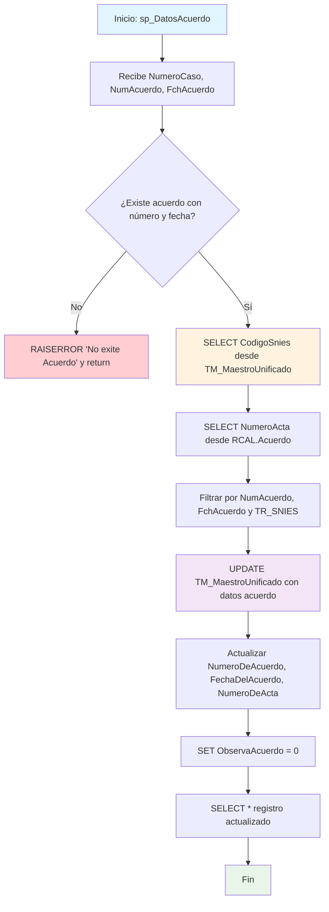

### sp_DatosAcuerdo

Procedimiento que actualiza datos de acuerdo académico en el maestro unificado del sistema BPM. Valida existencia del acuerdo, obtiene código SNIES del caso, extrae número de acta correlacionado y actualiza el registro maestro con información del acuerdo procesado.

#### Diagrama de flujo


#### Procedimiento almacenado
```sql
-- |sp_DatosAcuerdo|--=================================================================================================================================================================
--Author: María Cristina Díaz Torres
--Create Date: 14/08/2024
--Description: 1.Procedimiento almacenado para capturar los datos del conjunto de datos y consolidarlos en maestro unificado [CUN].[TM_MaestroUnificado]
--Modificado por: María Cristina Díaz Torres
--Fecha Modifiacion: 24/07/2025
--Descripcion: La consulta del acuerdo se complementa con el codigo snies, para su precision.
--Version: 02
-- EXEC CUN.sp_DatosAcuerdo '52606','000000002045',1,2
--=================================================================================================================================================================

CREATE Procedure [CUN].[sp_DatosAcuerdo] @NumeroCaso varchar(250), @NumAcuerdo int , @FchAcuerdo varchar(255)

AS

---

declare @NumeroActa varchar(255)
declare @FechaActa datetime
declare @TipoAcuerdo Varchar(50)
declare @CodigoSnies varchar(255)

---

BEGIN

---

if not exists (select top 1 1
from RCAL.Acuerdo
where F_NumeroAcuerdo = @NumAcuerdo
and F_FechaAcuerdo = @FchAcuerdo)
begin  
 raiserror('No exite Acuerdo',18,18)  
 return  
 end

---

select @CodigoSnies = CodigoSnies
from CUN.TM_MaestroUnificado
where NumeroCaso = @NumeroCaso

---

select @NumeroActa = TR_NumeroActa
-- ,@FechaActa = TR_FechaActa
-- ,@TipoAcuerdo = TR_TipoAcuerdo
from RCAL.Acuerdo
where F_NumeroAcuerdo = @NumAcuerdo
and F_FechaAcuerdo = @FchAcuerdo
and TR_SNIES = @CodigoSnies

---

update [CUN].[TM_MaestroUnificado]
set NumeroDeAcuerdo = @NumAcuerdo
,FechaDelAcuerdo = @FchAcuerdo
,NumeroDeActa = @NumeroActa
-- ,tipo
,ObservaAcuerdo = 0
where NumeroCaso = @NumeroCaso

---

    SELECT 	*
    FROM [CUN].[TM_MaestroUnificado]
    WHERE NumeroCaso = @NumeroCaso

---

END
```
#### Operaciones Principales

-Validación acuerdo: Verifica existencia en RCAL.Acuerdo por número y fecha
- Obtención código SNIES: Extrae CodigoSnies del maestro unificado por NumeroCaso
- Correlación datos: SELECT NumeroActa con triple filtro (número, fecha, SNIES)
- Actualización maestro: UPDATE con datos del acuerdo validado
- Reset observaciones: ObservaAcuerdo = 0 para limpiar estado
- Retorno registro: SELECT completo del registro actualizado

#### Tablas afectadas

##### Actualizadas:

- CUN.TM_MaestroUnificado: Campos NumeroDeAcuerdo, FechaDelAcuerdo, NumeroDeActa, ObservaAcuerdo

##### Consultadas:

- RCAL.Acuerdo: Validación existencia y obtención de NumeroActa
- CUN.TM_MaestroUnificado: Obtención CodigoSnies y actualización final

#### Procedimientos Almacenados Anidados