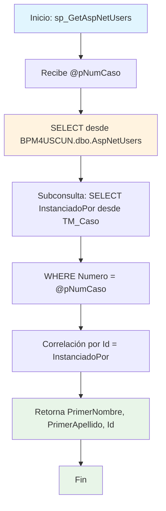

### sp_GetAspNetUsers

Procedimiento que obtiene información básica del usuario (PrimerNombre, PrimerApellido, Id) que instanció un caso específico en el sistema BPM. Realiza una consulta anidada para correlacionar el número de caso con el usuario responsable de su creación.

#### Diagrama de flujo


#### Procedimiento almacenado
```sql
CREATE PROCEDURE [dbo].[sp_GetAspNetUsers]
@pNumCaso VARCHAR(250)
AS
BEGIN
SELECT PrimerNombre, PrimerApellido, Id
FROM BPM4USCUN.dbo.AspNetUsers
WHERE Id = (SELECT InstanciadoPor
FROM BPM4UsCun.casos.TM_Caso
WHERE Numero = @pNumCaso);
END;
```
#### Operaciones Principales

- Consulta principal: SELECT desde tabla AspNetUsers para datos del usuario
- Subconsulta correlacionada: Obtiene InstanciadoPor desde TM_Caso por número específico
- Filtrado por caso: WHERE con número de caso como parámetro de entrada
- Correlación usuarios: JOIN implícito por Id = InstanciadoPor
- Retorno información: Campos básicos del usuario que creó el caso

#### Tablas afectadas

##### Consultadas:

- BPM4USCUN.dbo.AspNetUsers: Tabla de usuarios del sistema de identidad ASP.NET
- BPM4UsCun.casos.TM_Caso: Tabla de casos del sistema BPM con información de instanciación

#### Procedimientos Almacenados Anidados