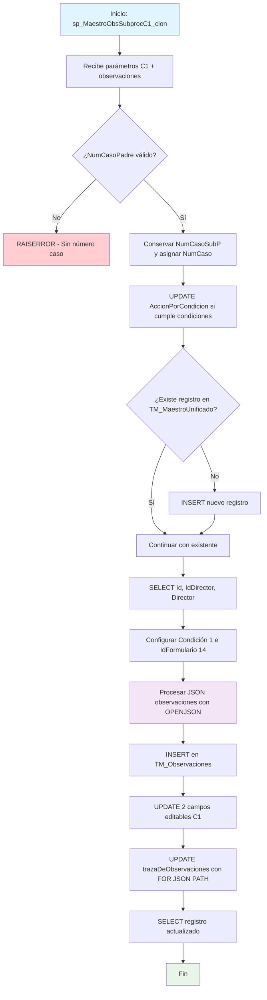

### sp_MaestroObsSubprocC1_clon

Procedimiento especializado para procesar observaciones y actualizaciones de la Condición 1 (Denominación) en el sistema BPM. Es una versión clonada que maneja observaciones JSON y actualiza 2 campos editables específicos relacionados con ajustes semánticos y análisis de correspondencia de títulos.

#### Diagrama de flujo


#### Procedimiento almacenado
```sql
/*--=================================================================================================================================================================
Author: Johana Henao
Create Date: 02/07/2024
Description: Procedimiento almacenado para el llamado de observaciones de los subprocesos (c/u de las condiciones) y realizar almacenamiento en TM_Observaciones
Se realiza además el proceso de actualización de los campos que requiera actualizar en cada condición en TM_MaestroUnificado
Este sp hace un llamado a CUN.sp_ConsultaObservaciones de la db BPM4UsCun
Version: 01
Modificado por: María Cristina Díaz Torres
Fecha Modificacion: 20240904
Observacion: Se elimina los llamados de procedimientos a través del link server.
Version: 02

EXEC [CUN].[sp_MaestroObsSubprocC1] '000000002088'
EXEC [CUN].[sp_MaestroObsSubprocC1] '000000002098'

update [CUN].[TM_MaestroUnificado] set AccionPorCondicion = 0 where id = 67

--=================================================================================================================================================================\*/

CREATE Procedure [CUN].[sp_MaestroObsSubprocC1_clon] @pNumCaso VARCHAR(250), @pNumCasoPadre varchar(250), @pAccionPorCondicion varchar(max),
@pC1_AjusteSemanticoEdt varchar(max), @pC1_AnalisisCorrespondenciaTituloEdt varchar(max),
@pObservaciones varchar(max)
AS
Set Nocount ON

---

-- DECLARACION DE TABLAS

---

CREATE TABLE #ListaObservaciones (IdFormulario INT
,NumCaso VARCHAR(250)
,Condicion VARCHAR(250)
,API VARCHAR(200)
,Nombre VARCHAR(500)
,FchObservacion DATETIME
,Observaciones VARCHAR(MAX)
,Usuario VARCHAR(200));

---

-- DECLARACION DE VARIABLES

---

DECLARE @NumCasoSubP VARCHAR(250)  
 DECLARE @Id_TM_MaestroUnificado INT
DECLARE @Condicion VARCHAR(MAX)
DECLARE @IdFormulario int
declare @Id_Director nvarchar(450)
Declare @DirectorNombre varchar(300)
--------------------------------------------------------------
BEGIN -- PROCEDIMIENTO

---

IF ISNULL (@pNumCasoPadre, '') = ''
BEGIN
RAISERROR ('No existe número de caso', 18, 18);
RETURN;
END
--Conservar el número de caso del subproceso para las actualizaciones de campos editables
SET @NumCasoSubP = @pNumCaso
set @pNumCaso = @pNumCasoPadre
--Actualización en MaestroUnificado del campo AccionPorCondicion
UPDATE [CUN].[TM_MaestroUnificado]
SET AccionPorCondicion = @pAccionPorCondicion
WHERE NumeroCaso = @pNumCaso
and @pAccionPorCondicion < 4
AND @pAccionPorCondicion > isnull(AccionPorCondicion,0);

---

-- Inserta solo si no existe un registro con el mismo NumeroCaso
IF NOT EXISTS ( SELECT 1
FROM [CUN].[TM_MaestroUnificado]
WHERE NumeroCaso = @pNumCaso)
BEGIN
INSERT INTO [CUN].[TM_MaestroUnificado] (NumeroCaso)
VALUES (@pNumCaso);
END
-- director con nombre de la tabla Maestro unificado
-- Captura el Id de maestro unificado a partir del número de caso
SELECT @Id_TM_MaestroUnificado = Id
,@Id_Director = IdDirector
,@DirectorNombre = Director
FROM [CUN].[TM_MaestroUnificado]
WHERE NumeroCaso = @pNumCaso

---

Set @Condicion = 'Condición 1 - Denominación'
Set @IdFormulario = 14
--Almacena en la tabla Observaciones los datos enviados por parámetro
INSERT INTO [CUN].[TM_Observaciones] (Fecha,Usuario,Condicion,Observacion,Estado,Auditoria,IdFormulario,Id_TM_MaestroUnificado)
SELECT CONVERT(datetime, SWITCHOFFSET(CONVERT(datetimeoffset, fechaDeLaObservacion), DATENAME(TzOffset, SYSDATETIMEOFFSET())))
,@DirectorNombre
,@Condicion
,observacionesH
,1 estado
,'CUN.sp_MaestroObsSubprocC1_clon: '+@pNumCaso+convert(varchar(200), getdate(), 121) Auditoria
,@IdFormulario
,@Id_TM_MaestroUnificado
FROM OPENJSON(CASE WHEN ISJSON(@pObservaciones) = 1 THEN @pObservaciones ELSE '[]' END) --valida que el campo C.Valor sea un JSON
WITH (personalORolQueHizoLaObservacion NVARCHAR(MAX) '$.personalORolQueHizoLaObservacion',
  		  fechaDeLaObservacion             NVARCHAR(MAX) '$.fechaDeLaObservacion',
observacionesH NVARCHAR(MAX) '$.observacionesH',
  		  personaObservacion               NVARCHAR(MAX) '$.personaObservacion')
--Proceso de actualización campos editables condicion 1
UPDATE A
SET A.AjusteSemantico = ISNULL(@pC1_AjusteSemanticoEdt, A.AjusteSemantico )
,A.F1_AnalisisCorrespondenciaTitulo = ISNULL(@pC1_AnalisisCorrespondenciaTituloEdt, A.F1_AnalisisCorrespondenciaTitulo)
,observaDenominacionC1 = case when @pAccionPorCondicion = 2
then 1 else 0
end
,A.trazaDeObservaciones = (SELECT B.Fecha AS fechaDeLaObservacion
,B.Usuario AS personaObservacion
,B.Condicion AS condicionOFormularioDeOrigen
,B.Observacion AS observacionesH
FROM CUN.TM_Observaciones B
WHERE B.Id_TM_MaestroUnificado = A.Id
FOR JSON PATH )
FROM CUN.TM_MaestroUnificado A
WHERE A.NumeroCaso = @pNumCaso

---

SELECT \*
FROM CUN.TM_MaestroUnificado A
WHERE A.NumeroCaso = @pNumCaso;

---

END; --- FINAL PROCEDIMIENTO
```
#### Operaciones Principales

- Validación y configuración: Verifica número caso padre y conserva subproceso
- Actualización acción: Modifica AccionPorCondicion según condiciones específicas
- Gestión registro: Inserta en TM_MaestroUnificado si no existe
- Procesamiento observaciones: Parsea JSON y almacena en TM_Observaciones
- Actualización campos C1: Modifica 2 campos específicos de denominación
- Consolidación traza: Actualiza trazaDeObservaciones con histórico JSON

#### Tablas afectadas

##### Actualizadas:

- CUN.TM_MaestroUnificado: Campos AccionPorCondicion, AjusteSemantico, F1_AnalisisCorrespondenciaTitulo, observaDenominacionC1, trazaDeObservaciones
- CUN.TM_Observaciones: Inserción de observaciones procesadas

#### Procedimientos Almacenados Anidados