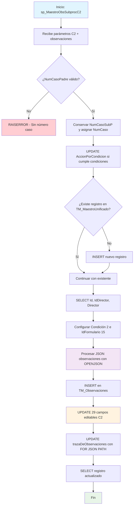

### sp_MaestroObsSubprocC2

Procedimiento especializado para procesar observaciones y actualizaciones de la Condición 2 (Justificación) en el sistema BPM. Es el procedimiento con mayor cantidad de campos editables (29 campos) relacionados con análisis estadísticos, empleabilidad, enfoques académicos, modalidades y justificaciones del programa.

#### Diagrama de flujo


#### Procedimiento almacenado
```sql
/*
|sp_MaestroObsSubprocC2|/\*--=================================================================================================================================================================
Author: María Cristina Díaz Torres
Create Date: 15/08/2024
Description: Procedimiento almacenado para el llamado de observaciones de los subprocesos (c/u de las condiciones) y realizar almacenamiento en TM_Observaciones
Se realiza además el proceso de actualización de los campos que requiera actualizar en cada condición en TM_MaestroUnificado
Este sp hace un llamado a CUN.sp_ConsultaObservaciones de la db BPM4UsCun
Version: 01
Modificado por: María Cristina Díaz Torres
Fecha Modificacion: 20240904
Observacion: Se elimina los llamados de procedimientos a través del link server.
Version: 02

EXEC [CUN].[sp_MaestroObsSubprocC2] '000000002088'
EXEC [CUN].[sp_MaestroObsSubprocC2] '000000002098'

--=================================================================================================================================================================\*/

CREATE Procedure [CUN].[sp_MaestroObsSubprocC2] @pNumCaso VARCHAR(250), @pNumCasoPadre varchar(250), @pAccionPorCondicion varchar(max),
@pC2Edit_ResumenModificacion VARCHAR(MAX),
@pC2Edit_TablaReferentes VARCHAR(MAX),
@pC2Edit_AnalisisReferentes VARCHAR(MAX),
@pC2Edit_ComProgramasInt VARCHAR(MAX),
@pC2Edit_AnalisisProgramaInt VARCHAR(MAX),
@pC2Edit_EstadisticaEstudianteIaM VARCHAR(MAX),
@pC2Edit_AnalisisDeDatos VARCHAR(MAX),
@pC2Edit_PeriodoEstudioRegional VARCHAR(MAX),
@pC2Edit_AnalisisPeriodoRegional VARCHAR(MAX),
@pC2Edit_InscritosAdmitidosMatriculados VARCHAR(MAX),
@pC2Edit_AnalisisEstudiantes VARCHAR(MAX),
@pC2Edit_AnalisisDeDescercion VARCHAR(MAX),
@pC2Edit_TablaEmpleabilidad VARCHAR(MAX),
@pC2Edit_AnalisisEmpleabilidadH VARCHAR(MAX),
@pC2Edit_AporteSociedad VARCHAR(MAX),
@pC2Edit_AportesPlanes VARCHAR(MAX),
@pC2Edit_SectorEmpleabilidad VARCHAR(MAX),
@pC2Edit_JustificacionModalidades VARCHAR(MAX),
@pC2Edit_EnfoqueLogicoMatematico VARCHAR(MAX),
@pC2Edit_EnfoqueDeResposabilidadSocial VARCHAR(MAX),
@pC2Edit_EnfoqueHaciaLaSostenibilidad VARCHAR(MAX),
@pC2Edit_EnfoqueHaciaLaIndustria VARCHAR(MAX),
@pC2Edit_salarios VARCHAR(MAX),
@pC2Edit_expectativaEstudiantil VARCHAR(MAX),
@pC2Edit_planDeDesarrolloNrl VARCHAR(MAX),
@pC2Edit_justificacionDelPlanNrl VARCHAR(MAX),
@pC2Edit_explicacionModalidades VARCHAR(MAX),
@pC2Edit_atributosProgramas VARCHAR(MAX),
@pC2Edit_NumeroPorcentual VARCHAR(MAX),
@pObservaciones varchar(max)
AS
Set Nocount ON

---

-- DECLARACION DE TABLAS

---

CREATE TABLE #ListaObservaciones (IdFormulario INT
,NumCaso VARCHAR(250)
,Condicion VARCHAR(250)
,API VARCHAR(200)
,Nombre VARCHAR(500)
,FchObservacion DATETIME
,Observaciones VARCHAR(MAX)
,Usuario VARCHAR(200));

---

-- DECLARACION DE VARIABLES

---

DECLARE @NumCasoSubP VARCHAR(250)
DECLARE @Id_TM_MaestroUnificado INT
DECLARE @Condicion VARCHAR(MAX)
DECLARE @IdFormulario int
declare @Id_Director nvarchar(450)
Declare @DirectorNombre varchar(300)
--------------------------------------------------------------
BEGIN -- PROCEDIMIENTO

---

IF ISNULL (@pNumCasoPadre, '') = ''
BEGIN
RAISERROR ('No existe número de caso', 18, 18);
RETURN;
END
--Conservar el número de caso del subproceso para las actualizaciones de campos editables
SET @NumCasoSubP = @pNumCaso
set @pNumCaso = @pNumCasoPadre
--Actualización en MaestroUnificado del campo AccionPorCondicion
UPDATE [CUN].[TM_MaestroUnificado]
SET AccionPorCondicion = @pAccionPorCondicion
WHERE NumeroCaso = @pNumCaso
and @pAccionPorCondicion < 4
AND @pAccionPorCondicion > isnull(AccionPorCondicion,0);

---

-- Inserta solo si no existe un registro con el mismo NumeroCaso
IF NOT EXISTS ( SELECT 1
FROM [CUN].[TM_MaestroUnificado]
WHERE NumeroCaso = @pNumCaso)
BEGIN
INSERT INTO [CUN].[TM_MaestroUnificado] (NumeroCaso)
VALUES (@pNumCaso);
END
-- director con nombre de la tabla Maestro unificado
-- Captura el Id de maestro unificado a partir del número de caso
SELECT @Id_TM_MaestroUnificado = Id
,@Id_Director = IdDirector
,@DirectorNombre = Director
FROM [CUN].[TM_MaestroUnificado]
WHERE NumeroCaso = @pNumCaso

---

Set @Condicion = 'Condición 2 - Justificación' --C2_RevPDF
Set @IdFormulario = 15
--Almacena en la tabla Observaciones los datos enviados por parámetro
INSERT INTO [CUN].[TM_Observaciones] (Fecha,Usuario,Condicion,Observacion,Estado,Auditoria,IdFormulario,Id_TM_MaestroUnificado)
SELECT CONVERT(datetime, SWITCHOFFSET(CONVERT(datetimeoffset, fechaDeLaObservacion), DATENAME(TzOffset, SYSDATETIMEOFFSET())))
,@DirectorNombre
,@Condicion
,observacionesH
,1 estado
,'CUN.sp_MaestroObsSubprocC2: '+@pNumCaso+convert(varchar(200), getdate(), 121) Auditoria
,@IdFormulario
,@Id_TM_MaestroUnificado
FROM OPENJSON(CASE WHEN ISJSON(@pObservaciones) = 1 THEN @pObservaciones ELSE '[]' END) --valida que el campo C.Valor sea un JSON
WITH (personalORolQueHizoLaObservacion NVARCHAR(MAX) '$.personalORolQueHizoLaObservacion',
  		  fechaDeLaObservacion             NVARCHAR(MAX) '$.fechaDeLaObservacion',
observacionesH NVARCHAR(MAX) '$.observacionesH',
  		  personaObservacion               NVARCHAR(MAX) '$.personaObservacion')
--Proceso de actualización campos editables condicion 1
--Proceso de actualización campos editables condicion 1
UPDATE TMU
SET TMU.ResumenModificacion = isnull(@pC2Edit_ResumenModificacion ,TMU.ResumenModificacion )
,TMU.tablaReferentes = isnull(@pC2Edit_TablaReferentes ,TMU.tablaReferentes )
,TMU.analisisReferentes = isnull(@pC2Edit_AnalisisReferentes ,TMU.analisisReferentes )
,TMU.ComProgramasInt = isnull(@pC2Edit_ComProgramasInt ,TMU.ComProgramasInt )
,TMU.analisisProgramaInt = isnull(@pC2Edit_AnalisisProgramaInt ,TMU.analisisProgramaInt )
,TMU.estadisticaEstudianteIaM = isnull(@pC2Edit_EstadisticaEstudianteIaM ,TMU.estadisticaEstudianteIaM )
,TMU.analisisDeDatos = isnull(@pC2Edit_AnalisisDeDatos ,TMU.analisisDeDatos )
,TMU.periodoEstudioRegional = isnull(@pC2Edit_PeriodoEstudioRegional ,TMU.periodoEstudioRegional )
,TMU.analisisPeriodoRegional = isnull(@pC2Edit_AnalisisPeriodoRegional ,TMU.analisisPeriodoRegional )
,TMU.inscritosAdmitidosMatriculados = isnull(@pC2Edit_InscritosAdmitidosMatriculados ,TMU.inscritosAdmitidosMatriculados )
,TMU.analisisEstudiantes = isnull(@pC2Edit_AnalisisEstudiantes ,TMU.analisisEstudiantes )
,TMU.analisisDeDescercion = isnull(@pC2Edit_AnalisisDeDescercion ,TMU.analisisDeDescercion )
,TMU.tablaEmpleabilidad = isnull(@pC2Edit_TablaEmpleabilidad ,TMU.tablaEmpleabilidad )
,TMU.analisisEmpleabilidadH = isnull(@pC2Edit_AnalisisEmpleabilidadH ,TMU.analisisEmpleabilidadH )
,TMU.aporteSociedad = isnull(@pC2Edit_AporteSociedad ,TMU.aporteSociedad )
,TMU.aportesPlanes = isnull(@pC2Edit_AportesPlanes ,TMU.aportesPlanes )
,TMU.sectorEmpleabilidad = isnull(@pC2Edit_SectorEmpleabilidad ,TMU.sectorEmpleabilidad )
,TMU.justificacionModalidades = isnull(@pC2Edit_JustificacionModalidades ,TMU.justificacionModalidades )
,TMU.enfoqueLogicoMatematico = isnull(@pC2Edit_EnfoqueLogicoMatematico ,TMU.enfoqueLogicoMatematico )
,TMU.enfoqueDeResposabilidadSocial = isnull(@pC2Edit_EnfoqueDeResposabilidadSocial ,TMU.enfoqueDeResposabilidadSocial )
,TMU.enfoqueHaciaLaSostenibilidad = isnull(@pC2Edit_EnfoqueHaciaLaSostenibilidad ,TMU.enfoqueHaciaLaSostenibilidad )
,TMU.enfoqueHaciaLaIndustria = isnull(@pC2Edit_EnfoqueHaciaLaIndustria ,TMU.enfoqueHaciaLaIndustria )
,TMU.numeroPorcentual = isnull(@pC2Edit_NumeroPorcentual ,TMU.numeroPorcentual )
,TMU.salarios = isnull(@pC2Edit_salarios ,TMU.salarios )
,TMU.expectativaEstudiantil = isnull(@pC2Edit_expectativaEstudiantil ,TMU.expectativaEstudiantil )
,TMU.planDeDesarrolloNrl = isnull(@pC2Edit_planDeDesarrolloNrl ,TMU.planDeDesarrolloNrl )
,TMU.justificacionDelPlanNrl = isnull(@pC2Edit_justificacionDelPlanNrl ,TMU.justificacionDelPlanNrl )
,TMU.explicacionModalidades = isnull(@pC2Edit_explicacionModalidades ,TMU.explicacionModalidades )
,TMU.atributosProgramas = isnull(@pC2Edit_atributosProgramas ,TMU.atributosProgramas )
,TMU.trazaDeObservaciones = (SELECT TOB.Fecha AS fechaDeLaObservacion  
 ,TOB.Usuario AS personaObservacion
,TOB.Condicion AS condicionOFormularioDeOrigen
,TOB.Observacion AS observacionesH
FROM [CUN].[TM_Observaciones] TOB
WHERE TOB.Id_TM_MaestroUnificado = TMU.Id
FOR JSON PATH )
,ObservaJustificacionC2 = case when @pAccionPorCondicion = 2 then 1 else 0 end
FROM [CUN].[TM_MaestroUnificado] TMU
WHERE NumeroCaso = @pNumCaso

---

SELECT TMU.\*
FROM [CUN].[TM_MaestroUnificado] TMU
WHERE TMU.NumeroCaso = @pNumCaso;

---

END; -- FIN PROCEDIMIENTO
```
#### Operaciones Principales

- Validación y configuración: Verifica número caso padre y conserva subproceso
- Actualización acción: Modifica AccionPorCondicion según condiciones específicas
- Gestión registro: Inserta en TM_MaestroUnificado si no existe
- Procesamiento observaciones: Parsea JSON y almacena en TM_Observaciones
- Actualización masiva campos C2: Modifica 29 campos específicos de justificación
- Consolidación traza: Actualiza trazaDeObservaciones con histórico JSON (incluye Usuario)

#### Tablas afectadas

##### Actualizadas:

- CUN.TM_MaestroUnificado: 29 campos editables + AccionPorCondicion, ObservaJustificacionC2, trazaDeObservaciones (incluyendo ResumenModificacion, tablaReferentes, analisisReferentes, ComProgramasInt, estadisticaEstudianteIaM, tablaEmpleabilidad, enfoques diversos, modalidades, etc.)
- CUN.TM_Observaciones: Inserción de observaciones procesadas

#### Procedimientos Almacenados Anidados