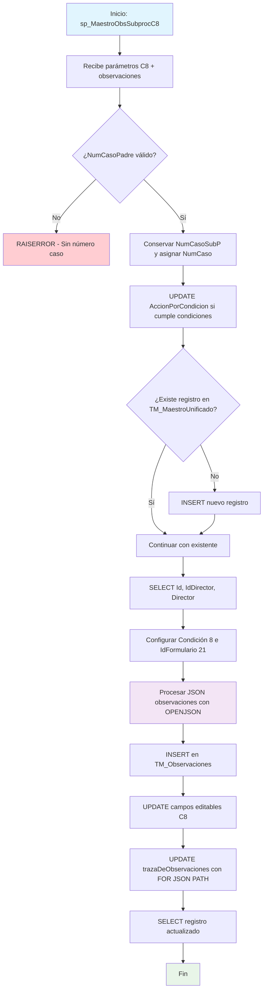

### sp_MaestroObsSubprocC8

Procedimiento especializado para procesar observaciones y actualizaciones de la Condición 8 (Medios educativos) en el sistema BPM. Maneja observaciones JSON y actualiza campos editables específicos relacionados con equipos tecnológicos, conectividad y virtualización educativa.

#### Diagrama de flujo


#### Procedimiento almacenado
```sql
/*
|sp_MaestroObsSubprocC8|/\*--=================================================================================================================================================================
Author: María Cristina Díaz Torres
Create Date: 15/08/2024
Description: Procedimiento almacenado para el llamado de observaciones de los subprocesos (c/u de las condiciones) y realizar almacenamiento en TM_Observaciones
Se realiza además el proceso de actualización de los campos que requiera actualizar en cada condición en TM_MaestroUnificado
Este sp hace un llamado a CUN.sp_ConsultaObservaciones de la db BPM4UsCun
Version: 01
Modificado por: María Cristina Díaz Torres
Fecha Modificacion: 20240904
Observacion: Se elimina los llamados de procedimientos a través del link server.
Version: 02

EXEC [CUN].[sp_MaestroObsSubprocC8] '000000002088'
EXEC [CUN].[sp_MaestroObsSubprocC8] '000000002098'

--=================================================================================================================================================================\*/

CREATE Procedure [CUN].[sp_MaestroObsSubprocC8] @pNumCaso VARCHAR(250), @pNumCasoPadre varchar(250), @pAccionPorCondicion varchar(max),
@pC8Edit_tablaProyeccionDeEquipos VARCHAR(MAX),
@pC8Edit_proyeccionDeConectividad VARCHAR(MAX),
@pC8Edit_listadoDeEquiposPorSede VARCHAR(MAX),
@pC8Edit_instruccionesParaElIngreso VARCHAR(MAX),
@pC8Edit_cursosVirtualizados VARCHAR(MAX),
@pC8Edit_planDeVirtualizacion VARCHAR(MAX),
@pObservaciones varchar(max)
AS
Set Nocount ON

---

-- DECLARACION DE TABLAS

---

CREATE TABLE #ListaObservaciones (IdFormulario INT
,NumCaso VARCHAR(250)
,Condicion VARCHAR(250)
,API VARCHAR(200)
,Nombre VARCHAR(500)
,FchObservacion DATETIME
,Observaciones VARCHAR(MAX)
,Usuario VARCHAR(200));

---

-- DECLARACION DE VARIABLES

---

DECLARE @NumCasoSubP VARCHAR(250)
DECLARE @Id_TM_MaestroUnificado INT
DECLARE @Condicion VARCHAR(MAX)
DECLARE @IdFormulario int
declare @Id_Director nvarchar(450)
Declare @DirectorNombre varchar(300)
--------------------------------------------------------------
BEGIN -- PROCEDIMIENTO

---

IF ISNULL (@pNumCasoPadre, '') = ''
BEGIN
RAISERROR ('No existe número de caso', 18, 18);
RETURN;
END
--Conservar el número de caso del subproceso para las actualizaciones de campos editables
SET @NumCasoSubP = @pNumCaso
set @pNumCaso = @pNumCasoPadre
--Actualización en MaestroUnificado del campo AccionPorCondicion
UPDATE [CUN].[TM_MaestroUnificado]
SET AccionPorCondicion = @pAccionPorCondicion
WHERE NumeroCaso = @pNumCaso
and @pAccionPorCondicion < 4
AND @pAccionPorCondicion > isnull(AccionPorCondicion,0);

---

-- Inserta solo si no existe un registro con el mismo NumeroCaso
IF NOT EXISTS ( SELECT 1
FROM [CUN].[TM_MaestroUnificado]
WHERE NumeroCaso = @pNumCaso)
BEGIN
INSERT INTO [CUN].[TM_MaestroUnificado] (NumeroCaso)
VALUES (@pNumCaso);
END
-- director con nombre de la tabla Maestro unificado
-- Captura el Id de maestro unificado a partir del número de caso
SELECT @Id_TM_MaestroUnificado = Id
,@Id_Director = IdDirector
,@DirectorNombre = Director
FROM [CUN].[TM_MaestroUnificado]
WHERE NumeroCaso = @pNumCaso

---

Set @Condicion = 'Condición 8 - Medios educativos' --C8_RevPDF
Set @IdFormulario = 21
--Almacena en la tabla Observaciones los datos enviados por parámetro
INSERT INTO [CUN].[TM_Observaciones] (Fecha,Usuario,Condicion,Observacion,Estado,Auditoria,IdFormulario,Id_TM_MaestroUnificado)
SELECT CONVERT(datetime, SWITCHOFFSET(CONVERT(datetimeoffset, fechaDeLaObservacion), DATENAME(TzOffset, SYSDATETIMEOFFSET())))
,@DirectorNombre
,@Condicion
,observacionesH
,1 estado
,'CUN.sp_MaestroObsSubprocC8: '+@pNumCaso+convert(varchar(200), getdate(), 121) Auditoria
,@IdFormulario
,@Id_TM_MaestroUnificado
FROM OPENJSON(CASE WHEN ISJSON(@pObservaciones) = 1 THEN @pObservaciones ELSE '[]' END) --valida que el campo C.Valor sea un JSON
WITH (personalORolQueHizoLaObservacion NVARCHAR(MAX) '$.personalORolQueHizoLaObservacion',
  		  fechaDeLaObservacion             NVARCHAR(MAX) '$.fechaDeLaObservacion',
observacionesH NVARCHAR(MAX) '$.observacionesH',
  		  personaObservacion               NVARCHAR(MAX) '$.personaObservacion')
--Proceso de actualización campos editables condicion 1
--print 'update'
UPDATE TMU
SET TMU.tablaProyeccionDeEquipos = isnull(@pC8Edit_tablaProyeccionDeEquipos ,TMU.tablaProyeccionDeEquipos )
,TMU.proyeccionDeConectividad = isnull(@pC8Edit_proyeccionDeConectividad ,TMU.proyeccionDeConectividad )
,TMU.listadoDeEquiposPorSede = isnull(@pC8Edit_listadoDeEquiposPorSede ,TMU.listadoDeEquiposPorSede )
,TMU.instruccionesParaElIngreso = isnull(@pC8Edit_instruccionesParaElIngreso ,TMU.instruccionesParaElIngreso )
,TMU.cursosVirtualizados = isnull(@pC8Edit_cursosVirtualizados ,TMU.cursosVirtualizados )
,TMU.planDeVirtualizacion = isnull(@pC8Edit_planDeVirtualizacion ,TMU.planDeVirtualizacion )
,ObservaMediosEducaC8 = case when @pAccionPorCondicion = 2 then 1 else 0 end
,TMU.trazaDeObservaciones = (SELECT TOB.Fecha AS fechaDeLaObservacion
,TOB.Condicion AS condicionOFormularioDeOrigen
,TOB.Observacion AS observacionesH
FROM [CUN].[TM_Observaciones] TOB
WHERE TOB.Id_TM_MaestroUnificado = TMU.Id
FOR JSON PATH )
FROM [CUN].[TM_MaestroUnificado] TMU
WHERE NumeroCaso = @pNumCaso

---

SELECT TMU.\*
FROM [CUN].[TM_MaestroUnificado] TMU
WHERE TMU.NumeroCaso = @pNumCaso;

---

END;-- FIN PROCEDIMIENTO
```
#### Operaciones Principales

- Validación y configuración: Verifica número caso padre y conserva subproceso
- Actualización acción: Modifica AccionPorCondicion según condiciones específicas
- Gestión registro: Inserta en TM_MaestroUnificado si no existe
- Procesamiento observaciones: Parsea JSON y almacena en TM_Observaciones
- Actualización campos C8: Modifica 6 campos específicos de medios educativos
- Consolidación traza: Actualiza trazaDeObservaciones con histórico JSON

#### Tablas afectadas

##### Actualizadas:

- CUN.TM_MaestroUnificado: Campos AccionPorCondicion, tablaProyeccionDeEquipos, proyeccionDeConectividad, listadoDeEquiposPorSede, instruccionesParaElIngreso, cursosVirtualizados, planDeVirtualizacion, ObservaMediosEducaC8, trazaDeObservaciones
- CUN.TM_Observaciones: Inserción de observaciones procesadas

#### Procedimientos Almacenados Anidados