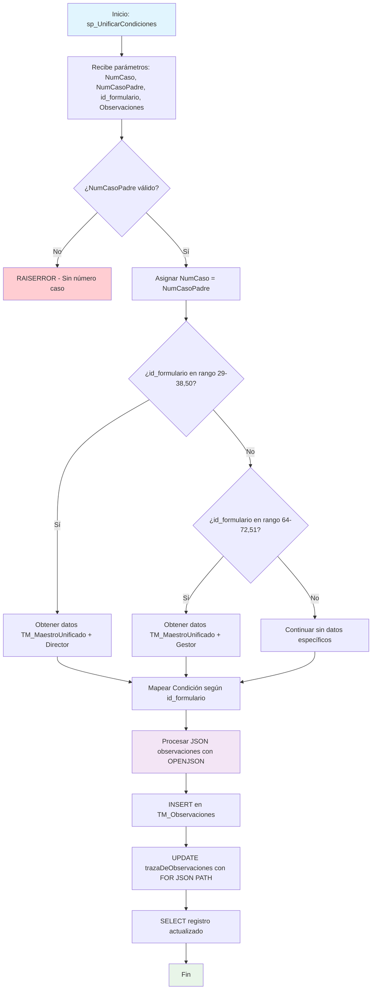

### sp_UnificarCondiciones

Procedimiento para consolidar observaciones de formularios de revisión académica en el sistema BPM. Procesa observaciones JSON de diferentes condiciones académicas (1-9 + Introducción) tanto para revisión de calidad como para gestión de datos, almacenándolas en el maestro unificado.

#### Diagrama de flujo


#### Procedimiento almacenado
```sql
/*
|sp_UnificarCondiciones|/\*
[CUN].[sp_ConsultaObservacionesXformulario]
Procedimiento Consulta las observaciones del formulario dado en Id_Formulario.
actualiza la información en la tabla [CUN].[TM_Observaciones]
Creador por: María Cristina Díaz Torres  
 Fecha: 2024/08/16  
 Version: 0
Ejecución:

*/

CREATE Procedure [CUN].[sp_UnificarCondiciones] @pNumCaso VARCHAR(250), @pNumCasoPadre varchar(250),  
 @id_formulario int, @pObservaciones varchar(max)
AS

---

-- DECLARACION DE TABLAS

---

    DECLARE @ListaObservaciones  TABLE  ( IdFormulario INT
    								                     ,NumCaso VARCHAR(250)
    								                     ,Condicion VARCHAR(250)
    								                     ,API VARCHAR(200)
    								                     ,Nombre VARCHAR(500)
    								                     ,FchObservacion DATETIME
    								                     ,Observaciones VARCHAR(MAX)
    								                     ,Usuario VARCHAR(200));

---

-- DECLARACION DE VARIABLES

---

DECLARE @NumCasoSubP VARCHAR(250)  
 DECLARE @Id_TM_MaestroUnificado INT
DECLARE @Condicion VARCHAR(MAX)
DECLARE @IdFormulario int
declare @Id_Director nvarchar(450)
Declare @DirectorNombre varchar(300)

---

BEGIN -- INICIO

---

IF ISNULL (@pNumCasoPadre, '') = ''
BEGIN
RAISERROR ('No existe número de caso', 18, 18);
RETURN;
END
--Conservar el número de caso del subproceso para las actualizaciones de campos editables
SET @NumCasoSubP = @pNumCaso
set @pNumCaso = @pNumCasoPadre

---

if @Id_Formulario in (29, 31, 32, 33, 34, 35, 36, 37, 38, 50)
begin  
 SELECT @Id_TM_MaestroUnificado = Id
,@Id_Director = IdDirector
,@DirectorNombre = Director
FROM [CUN].[TM_MaestroUnificado]
WHERE NumeroCaso = @pNumCaso
end
else if @Id_Formulario in (64, 65, 66, 67, 68, 69, 70, 71, 72, 51)
begin  
 SELECT @Id_TM_MaestroUnificado = tmu.Id
,@Id_Director = ges.Id_gestor
,@DirectorNombre = ges.NombreGestor
FROM [CUN].[TM_MaestroUnificado] tmu
inner join cun.TP_Gestor ges on tmu.IdEscuela = ges.Id_Escuela
WHERE NumeroCaso = @pNumCaso
end

---

    SET @Condicion = CASE @id_formulario
                       WHEN 29 THEN 'Condición 1 - Denominación Falta información del acuerdo'  --RevisionCalidC1
    								     WHEN 31 THEN 'Condición 2 - Justificación'                               --RevisionCalidC2
    								     WHEN 32 THEN 'Condición 3 - Aspectos curriculares'                       --RevisionCalidC3
    								     WHEN 33 THEN 'Condición 4 - Organización académica'                      --RevisionCalidC4
    								     WHEN 34 THEN 'Condición 5 - Investigación '                              --RevisionCalidC5
    								     WHEN 35 THEN 'Condición 6 - Relación con el sector exterior'             --RevisionCalidC6
    								     WHEN 36 THEN 'Condición 7 - profesores '                                 --RevisionCalidC7
    								     WHEN 37 THEN 'Condición 8 - Medios educativos'                           --RevisionCalidC8
    								     WHEN 38 THEN 'Condición 9 - Infraestructura'                             --RevisionCalidC9
    								     WHEN 50 THEN 'Introducción'                                              --RevisionCalidC10
    									   WHEN 64 THEN 'Condición 1 - Denominación Falta información del acuerdo'  --GestorDatosC1
    								     WHEN 65 THEN 'Condición 2 - Justificación'                               --GestorDatosC2
    								     WHEN 66 THEN 'Condición 3 - Aspectos curriculares'                       --GestorDatosC3
    								     WHEN 67 THEN 'Condición 4 - Organización académica'                      --GestorDatosC4
    								     WHEN 68 THEN 'Condición 5 - Investigación '                              --GestorDatosC5
    								     WHEN 69 THEN 'Condición 6 - Relación con el sector exterior'             --GestorDatosC6
    								     WHEN 70 THEN 'Condición 7 - profesores '                                 --GestorDatosC7
    								     WHEN 71 THEN 'Condición 8 - Medios educativos'                           --GestorDatosC8
    								     WHEN 72 THEN 'Condición 9 - Infraestructura'                             --GestorDatosC9
    								     WHEN 51 THEN 'Introducción'                                              --GestorDatosC10
    									 else ''
    					END

---

--Almacena en la tabla Observaciones los datos enviados por parámetro
INSERT INTO [CUN].[TM_Observaciones] (Fecha,Usuario,Condicion,Observacion,Estado,Auditoria,IdFormulario,Id_TM_MaestroUnificado)
SELECT CONVERT(datetime, SWITCHOFFSET(CONVERT(datetimeoffset, fechaDeLaObservacion), DATENAME(TzOffset, SYSDATETIMEOFFSET())))
,@DirectorNombre
,@Condicion
,observacionesH
,1 estado
,'CUN.sp_UnificarCondiciones: '+@pNumCaso+convert(varchar(200), getdate(), 103) Auditoria
,@IdFormulario
,@Id_TM_MaestroUnificado
FROM OPENJSON(CASE WHEN ISJSON(@pObservaciones) = 1 THEN @pObservaciones ELSE '[]' END) --valida que el campo C.Valor sea un JSON
WITH (personalORolQueHizoLaObservacion NVARCHAR(MAX) '$.personalORolQueHizoLaObservacion',
  		  fechaDeLaObservacion             NVARCHAR(MAX) '$.fechaDeLaObservacion',
observacionesH NVARCHAR(MAX) '$.observacionesH',
  		  personaObservacion               NVARCHAR(MAX) '$.personaObservacion')
--Proceso de actualización campos editables condicion 1
UPDATE A
SET A.trazaDeObservaciones = (SELECT B.Fecha AS fechaDeLaObservacion
,B.Usuario AS personaObservacion
,B.Condicion AS condicionOFormularioDeOrigen
,B.Observacion AS observacionesH
FROM CUN.TM_Observaciones B
WHERE B.Id_TM_MaestroUnificado = A.Id
FOR JSON PATH )
FROM CUN.TM_MaestroUnificado A
WHERE A.NumeroCaso = @pNumCaso

---

SELECT \*
FROM CUN.TM_MaestroUnificado A
WHERE A.NumeroCaso = @pNumCaso;

---

END; --- FINAL PROCEDIMIENTO
```
#### Operaciones Principales

Validación parámetros: Verifica existencia del número de caso padre
Identificación responsable: Determina Director (formularios 29-38,50) o Gestor (formularios 64-72,51)
Mapeo condiciones: Convierte id_formulario en descripción de condición académica
Procesamiento JSON: Parsea observaciones usando OPENJSON con estructura específica
Actualización traza: Consolida observaciones históricas usando FOR JSON PATH

#### Tablas afectadas

##### Actualizadas:

- CUN.TM_Observaciones: Almacena observaciones individuales con metadatos
- CUN.TM_MaestroUnificado: Campo trazaDeObservaciones actualizado con JSON consolidado

##### Consultadas:

- CUN.TM_MaestroUnificado: Obtiene Id, IdDirector, Director
- CUN.TP_Gestor: Obtiene Id_gestor, NombreGestor para formularios gestión

#### Procedimientos Almacenados Anidados