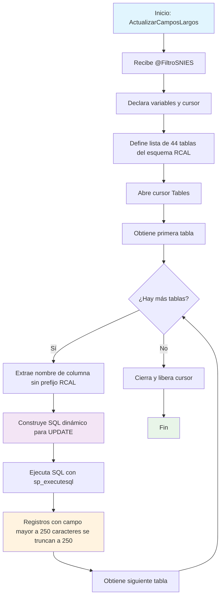

### ActualizarCamposLargos

Este procedimiento almacenado se encarga de truncar campos de texto largos en múltiples tablas del esquema RCAL. Específicamente, recorta cualquier campo que exceda los 250 caracteres, dejando solo los primeros 250 caracteres. La operación se aplica únicamente a registros que coincidan con un código SNIES específico proporcionado como parámetro.

El procedimiento itera a través de 44 tablas predefinidas (todas relacionadas con formularios F1-F8), y en cada tabla actualiza la columna que tiene el mismo nombre que la tabla, aplicando el filtro por TR_SNIES.

#### Diagrama de flujo



#### Procedimiento almacenado.

```sql
CREATE PROCEDURE ActualizarCamposLargos
@FiltroSNIES NVARCHAR(255) -- Parámetro para el filtro de TR_SNIES

AS
BEGIN
DECLARE @TableName NVARCHAR(255)
DECLARE @ColumnName NVARCHAR(255)
DECLARE @SQL NVARCHAR(MAX)

    -- Lista de las tablas en las que se realizará la operación
    DECLARE Tables CURSOR FOR
    SELECT 'RCAL.' + name
    FROM sys.tables
    WHERE name IN (
        'F3_ResumenConceptTyE', 'F2_AportePlanes', 'F2_AnalisisPeriodoRegional',
        'F1_CampoAED', 'F3_PerfilIngreso', 'F2_EnfoqueInd', 'F4_DescripcionPlanTransicion',
        'F2_EnfoqueMat', 'F6_AnalisisProyecSoci', 'F2_EnfoqueRS', 'F3_ImplementacionRA',
        'F2_EnfoqueSos', 'F3_PerfilProfesional', 'F2_ExplicacionModalidades', 'F4_AjusteAsignaturas',
        'F2_JustificacionModalidad', 'F5_AnalasisTabla17', 'F2_JustificacionPlanNRL', 'F5_ResumenInvsProgram',
        'F2_NumeroPorcentual', 'F6_IntroducConven', 'F2_AnalisisDesercion', 'F2_AtributosProgramas',
        'F2_RedaccionPlanDesarrolloNRL', 'F3_PerfilEgreso', 'F2_AnalisisEmpleabilidadH', 'F3_PerfilOcupacional',
        'F2_ResumenModificacion', 'F2_AnalisisEstudiantes', 'F2_Salarios', 'F4_ActividadAcademica',
        'F2_SectorEmpleabilidad', 'F4_CompetenciaHabilidades', 'F7_AnalisisDocente', 'F4_EnfoqueCompnComp',
        'F7_ConteoProfEstud', 'F2_AnalisisExpectativasEstd', 'F2_AnalisisEstadistico', 'F2_AnalisisReferentes',
        'F3_CreditosPropedeutico', 'F6_AnalaisisTablaEscPract', 'F3_DescripccionImpactCuant',
        'F1_AnalisisCorrespondenciaTitulo', 'F6_ConvenioRegional', 'F3_DescripccionModPedag',
        'F2_AnalisisTendCompInt', 'F3_DescripccionModVirt', 'F2_AporteSociedad', 'F3_ElementosTyE',
        'F1_AjusteSemantico', 'F8_IngresoAulaVirtual', 'F3_AlianzasCUN', 'F3_AnexoEstructuraCurricular'
    )

    OPEN Tables
    FETCH NEXT FROM Tables INTO @TableName

    -- Loop a través de las tablas
    WHILE @@FETCH_STATUS = 0
    BEGIN
        -- La columna a evaluar es la misma que el nombre de la tabla (sin el esquema 'RCAL.')
        SET @ColumnName = REPLACE(@TableName, 'RCAL.', '')

        -- Generar el SQL dinámico para actualizar los registros
        SET @SQL = '
            UPDATE ' + @TableName + '
            SET ' + @ColumnName + ' = LEFT(' + @ColumnName + ', 250)
            WHERE LEN(' + @ColumnName + ') > 250
              AND TR_SNIES = @FiltroSNIES'

        -- Ejecutar el SQL generado
        EXEC sp_executesql @SQL, N'@FiltroSNIES NVARCHAR(255)', @FiltroSNIES
        FETCH NEXT FROM Tables INTO @TableName
    END
    CLOSE Tables
    DEALLOCATE Tables
END
```

#### Tablas Afectadas

- 44 tablas del esquema RCAL (F1*, F2*, F3*, F4*, F5*, F6*, F7*, F8*)
- Columnas afectadas: Campo con el mismo nombre que la tabla
- Condición: Solo registros donde TR_SNIES coincida con el parámetro y el campo tenga más de 250 caracteres
- Acción: Trunca el contenido a los primeros 250 caracteres


#### Procedimientos Almacenados Anidados

- sp_executesql (procedimiento del sistema)