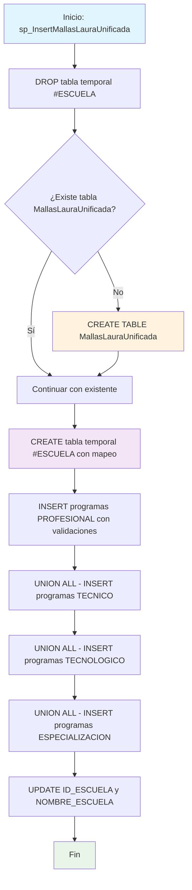

### sp_InsertMallasLauraUnificada

Procedimiento de consolidación que unifica datos de mallas curriculares desde múltiples niveles académicos (Profesional, Técnico, Tecnológico, Especialización) en una tabla centralizada. Incluye validaciones para evitar duplicados y mapeo de escuelas con sus identificadores correspondientes.

#### Diagrama de flujo


#### Procedimiento almacenado
```sql
CREATE PROCEDURE [dbo].[sp_InsertMallasLauraUnificada]
-- delete REGISTRO_CALIFICADO.Dev.MallasLauraUnificada
-- EXEC [dbo].[sp_InsertMallasLauraUnificada]
AS
BEGIN

    DROP TABLE IF EXISTS #ESCUELA

    -- Crear la tabla si no existe
    IF NOT EXISTS (SELECT * FROM INFORMATION_SCHEMA.TABLES
                   WHERE TABLE_SCHEMA = 'Dev'
                   AND TABLE_NAME = 'MallasLauraUnificada'
                   AND TABLE_CATALOG = 'REGISTRO_CALIFICADO')
    BEGIN
       CREATE TABLE REGISTRO_CALIFICADO.Dev.MallasLauraUnificada (
            CODIGO_SNIES VARCHAR(255),
    		PENSUM VARCHAR(255),
    		COD_UNIDAD VARCHAR(255),
            NIVELES VARCHAR(255),
            TOTAL_CREDITOS VARCHAR(MAX),
    		MODALIDAD VARCHAR(255),
            NOMBRE_DEL_PROGRAMA VARCHAR(255),
            TITULO_OTORGADO VARCHAR(255),
            ESTADO VARCHAR(255),
            TIPO_PROGRAMA VARCHAR(255),
    		ID_ESCUELA VARCHAR( 255),
    		NOMBRE_ESCUELA VARCHAR (255)
        );
    END;

    SELECT DISTINCT SNIES, SEDE, ESCUELAS,
    CASE
        WHEN ESCUELAS = 'ESCUELA DE DISEÑO Y COMUNICACION' THEN 1
        WHEN ESCUELAS = 'ESCUELA DE INGENIERIAS' THEN 2
        WHEN ESCUELAS = 'ESCUELA DE TRANSFORMACION EMPRESARIAL' THEN 3
        WHEN ESCUELAS = 'ESCUELA DE CIENCIAS JURIDICAS Y GOBIERNO' THEN 4
        ELSE 5
    END AS ID,
    CASE
        WHEN ESCUELAS = 'ESCUELA DE DISEÑO Y COMUNICACION' THEN 'Escuela de Diseño y Comunicación'
        WHEN ESCUELAS = 'ESCUELA DE INGENIERIAS' THEN 'Escuela de Ingeniería'
        WHEN ESCUELAS = 'ESCUELA DE TRANSFORMACION EMPRESARIAL' THEN 'Escuela de Transformación Empresarial'
        WHEN ESCUELAS = 'ESCUELA DE CIENCIAS JURIDICAS Y GOBIERNO' THEN 'Escuela de ciencias Jurídicas y Gobierno'
        ELSE 'Sistema Nacional de Biblioteca'
    END AS Nom_Escuela

INTO #ESCUELA
FROM CUN_REPOSITORIO.cun.MALLASCun;

    -- Insertar datos en la tabla, evitando duplicados
    INSERT INTO REGISTRO_CALIFICADO.Dev.MallasLauraUnificada (
        CODIGO_SNIES,
    	PENSUM,
    	COD_UNIDAD,
        NIVELES,
        TOTAL_CREDITOS,
        NOMBRE_DEL_PROGRAMA,
        TITULO_OTORGADO,
        ESTADO,
        TIPO_PROGRAMA ,
    	MODALIDAD
    )
    SELECT DISTINCT
        CODIGO_SNIES_PROF AS CODIGO_SNIES,
    	PENSUM AS PENSUM,
    	COD_PROG_PROFESIONAL AS COD_UNIDAD,
        PROFESIONAL_NIVELES AS NIVELES,
        TOTAL_CREDITOS_PROFESIONAL AS TOTAL_CREDITOS,
        NOMBRE_DEL_PROGRAMA_PRO AS NOMBRE_DEL_PROGRAMA,
        TITULO_OTORGADO_PRO AS TITULO_OTORGADO,
        ESTADO AS ESTADO,
        'PROFESIONAL' AS TIPO_PROGRAMA,
    	MODALIDAD AS MODALIDAD
    FROM
        CUN_REPOSITORIO.CUN.MallasLaura ml
    WHERE
        CODIGO_SNIES_PROF IS NOT NULL AND CODIGO_SNIES_PROF <> ''
        AND PROFESIONAL_NIVELES IS NOT NULL AND PROFESIONAL_NIVELES <> 'N/A' AND PROFESIONAL_NIVELES <> ''
        AND TOTAL_CREDITOS_PROFESIONAL IS NOT NULL
        AND NOMBRE_DEL_PROGRAMA_PRO IS NOT NULL AND NOMBRE_DEL_PROGRAMA_PRO <> 'N/A' AND NOMBRE_DEL_PROGRAMA_PRO <> ''
    	--AND ESTADO ='VIGENTE'
        AND NOT EXISTS (
            SELECT 1
            FROM REGISTRO_CALIFICADO.Dev.MallasLauraUnificada mu
            WHERE mu.CODIGO_SNIES = ml.CODIGO_SNIES_PROF
            AND mu.NIVELES = ml.PROFESIONAL_NIVELES
            AND mu.NOMBRE_DEL_PROGRAMA = ml.NOMBRE_DEL_PROGRAMA_PRO
        )

    UNION ALL

    SELECT DISTINCT
        CODIGO_SNIES_TECNICO AS CODIGO_SNIES,
    	PENSUM AS PENSUM,
    	COD_PROG_TECNICO AS COD_UNIDAD,
        TECNICO_NIVELES AS NIVELES,
        TOTAL_CREDITOS_TECNICO AS TOTAL_CREDITOS,
        NOMBRE_DEL_PROGRAMA_TEC AS NOMBRE_DEL_PROGRAMA,
        TITULO_OTORGADO_TEC AS TITULO_OTORGADO,
        ESTADO AS ESTADO,
        'TECNICO' AS TIPO_PROGRAMA,
    	MODALIDAD AS MODALIDAD
    FROM
        CUN_REPOSITORIO.CUN.MallasLaura ml
    WHERE
        CODIGO_SNIES_TECNICO IS NOT NULL AND CODIGO_SNIES_TECNICO <> ''
        AND TECNICO_NIVELES IS NOT NULL AND TECNICO_NIVELES <> 'N/A' AND TECNICO_NIVELES <> ''
        AND TOTAL_CREDITOS_TECNICO IS NOT NULL
        AND NOMBRE_DEL_PROGRAMA_TEC IS NOT NULL AND NOMBRE_DEL_PROGRAMA_TEC <> 'N/A' AND NOMBRE_DEL_PROGRAMA_TEC <> ''
    	--AND ESTADO ='VIGENTE'
        AND NOT EXISTS (
            SELECT 1
            FROM REGISTRO_CALIFICADO.Dev.MallasLauraUnificada mu
            WHERE mu.CODIGO_SNIES = ml.CODIGO_SNIES_TECNICO
            AND mu.NIVELES = ml.TECNICO_NIVELES
            AND mu.NOMBRE_DEL_PROGRAMA = ml.NOMBRE_DEL_PROGRAMA_TEC
        )

    UNION ALL

    SELECT DISTINCT
        CODIGO_SNIES_TECNOLOGICO AS CODIGO_SNIES,
    	PENSUM AS PENSUM,
    	COD_PROG_TECNOLOGO AS COD_UNIDAD,
        TECNOLOGO_NIVELES AS NIVELES,
        TOTAL_CREDITOS_TECNOLOGO AS TOTAL_CREDITOS,
        NOMBRE_DEL_PROGRAMA_TNG AS NOMBRE_DEL_PROGRAMA,
        TITULO_OTORGADO_TNG AS TITULO_OTORGADO,
        ESTADO AS ESTADO,
        'TECNOLOGICO' AS TIPO_PROGRAMA,
    	MODALIDAD AS MODALIDAD
    FROM
        CUN_REPOSITORIO.CUN.MallasLaura ml
    WHERE
        CODIGO_SNIES_TECNOLOGICO IS NOT NULL AND CODIGO_SNIES_TECNOLOGICO <> ''
        AND TECNOLOGO_NIVELES IS NOT NULL AND TECNOLOGO_NIVELES <> 'N/A' AND TECNOLOGO_NIVELES <> ''
        AND TOTAL_CREDITOS_TECNOLOGO IS NOT NULL
        AND NOMBRE_DEL_PROGRAMA_TNG IS NOT NULL AND NOMBRE_DEL_PROGRAMA_TNG <> 'N/A' AND NOMBRE_DEL_PROGRAMA_TNG <> ''
    	--AND ESTADO ='VIGENTE'
        AND NOT EXISTS (
            SELECT 1
            FROM REGISTRO_CALIFICADO.Dev.MallasLauraUnificada mu
            WHERE mu.CODIGO_SNIES = ml.CODIGO_SNIES_TECNOLOGICO
            AND mu.NIVELES = ml.TECNOLOGO_NIVELES
            AND mu.NOMBRE_DEL_PROGRAMA = ml.NOMBRE_DEL_PROGRAMA_TNG
        )

    UNION ALL

    SELECT DISTINCT
        CODIGO_SNIES_PROF AS CODIGO_SNIES,
    	PENSUM AS PENSUM,
    	COD_PROG_PROFESIONAL AS COD_UNIDAD,
        PROFESIONAL_NIVELES AS NIVELES,
        TOTAL_CREDITOS_PROFESIONAL AS TOTAL_CREDITOS,
        NOMBRE_DEL_PROGRAMA_PRO AS NOMBRE_DEL_PROGRAMA,
        TITULO_OTORGADO_PRO AS TITULO_OTORGADO,
        ESTADO AS ESTADO,
        'ESPECIALIZACION' AS TIPO_PROGRAMA,
    	MODALIDAD AS MODALIDAD
    FROM
        CUN_REPOSITORIO.CUN.MallasLaura ml
    WHERE
        CODIGO_SNIES_PROF IN ('105784', '109601', '108460', '106040', '110990', '111621')
    	AND ESTADO ='VIGENTE'
        AND NOT EXISTS (
            SELECT 1
            FROM REGISTRO_CALIFICADO.Dev.MallasLauraUnificada mu
            WHERE mu.CODIGO_SNIES = ml.CODIGO_SNIES_PROF
            AND mu.NIVELES = ml.PROFESIONAL_NIVELES
            AND mu.NOMBRE_DEL_PROGRAMA = ml.NOMBRE_DEL_PROGRAMA_PRO
        );


    		UPDATE a
    		SET
    			a.ID_ESCUELA = b.ID,
    			a.NOMBRE_ESCUELA = b.Nom_Escuela
    		FROM REGISTRO_CALIFICADO.Dev.MallasLauraUnificada a
    		JOIN #ESCUELA b
    			ON a.codigo_snies = b.SNIES;

END;
```
#### Operaciones Principales

- Creación estructura: Crea tabla MallasLauraUnificada si no existe
- Mapeo escuelas: Genera tabla temporal con códigos y nombres normalizados de escuelas
- Consolidación por niveles: Inserta datos de 4 tipos de programas con UNION ALL
- Validación duplicados: Usa NOT EXISTS para evitar registros repetidos
- Filtrado calidad: Excluye registros nulos, vacíos o con valores 'N/A'
- Actualización escuelas: Asigna ID_ESCUELA y NOMBRE_ESCUELA desde tabla temporal

#### Tablas afectadas

##### Creadas/Actualizadas:

- REGISTRO_CALIFICADO.Dev.MallasLauraUnificada: Tabla principal consolidada con datos unificados

##### Consultadas:

- CUN_REPOSITORIO.CUN.MallasLaura: Fuente principal de datos de mallas curriculares
- CUN_REPOSITORIO.cun.MALLASCun: Fuente para mapeo de escuelas

##### Temporales:

- #ESCUELA: Tabla temporal para mapeo de escuelas con IDs normalizados

#### Procedimientos Almacenados Anidados