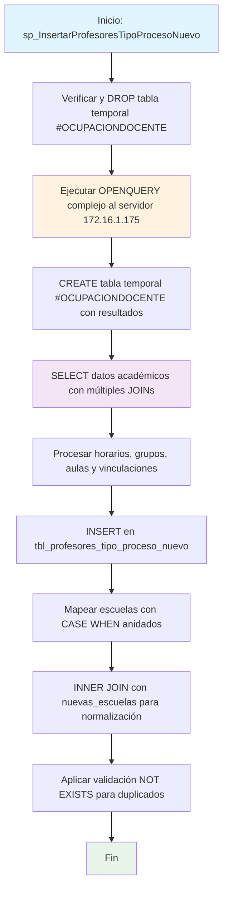

### sp_InsertarProfesoresTipoProcesoNuevo

Procedimiento que extrae y consolida información docente desde un servidor remoto (172.16.1.175) mediante OPENQUERY, procesando datos académicos complejos con horarios, grupos y asignaciones. Mapea profesores con sus respectivas escuelas y unidades académicas, evitando duplicados en la inserción final.

#### Diagrama de flujo


#### Procedimiento almacenado
```sql
CREATE PROCEDURE sp_InsertarProfesoresTipoProcesoNuevo
AS
BEGIN
-- Eliminar la tabla temporal si existe
IF OBJECT_ID('tempdb..#OCUPACIONDOCENTE') IS NOT NULL
BEGIN
DROP TABLE #OCUPACIONDOCENTE;
END

    -- Crear la tabla temporal con los datos obtenidos de la consulta
    SELECT *
    INTO #OCUPACIONDOCENTE
    FROM openquery([172.16.1.175], '
        SELECT grp.COD_PERIODO, PEN.NUM_NIVEL, GRP.COD_UNIDAD, uni.nom_unidad, GRP.COD_PENSUM, PEN.COD_MATERIA, PEN.NOM_MATERIA, PEN.UNI_TEORICA "CREDITOS",
               (SELECT G.ID_GRUPO FROM SRC_GRUPO G WHERE g.cod_periodo IN(''2023A'',''23V01'') AND G.ID_GRUPO NOT IN (SELECT Y.ID_GRUPO FROM SRC_AUL_GRUPO Y)
                AND GRP.ID_GRUPO = G.ID_GRUPO AND GRP.COD_UNIDAD = G.COD_UNIDAD AND GRP.COD_PENSUM = G.COD_PENSUM AND GRP.COD_MATERIA = G.COD_MATERIA
                AND GRP.COD_PERIODO = G.COD_PERIODO AND G.id_aula IS NOT NULL) AS "marca",
               GRP.ID_GRUPO, GRP.NUM_GRUPO, ROUND((GRP.NUM_INSCRITOS * 100 / NULLIF(GRP.NUM_CUPO, 0)), 1) AS "PORCENTAJE OCUPACION AULA", GRP.NUM_CUPO AS capacidad,
               GRP.NUM_INSCRITOS, GRP.Ind_Moodle AS check_moodle,
               (SELECT UNIQUE (''SI'') FROM SRC_DOC_GRUPO D WHERE D.IND_MOODLE = 1 AND D.ID_GRUPO IN (SELECT HG.ID_GRUPO FROM SRC_GRUPO HG WHERE GRP.ID_GRUPO = HG.ID_GRUPO AND HG.COD_PERIODO = grp.COD_PERIODO)) AS check_docente,
               TER.NUM_IDENTIFICACION, TER.NOM_LARGO, ter.dir_email AS "CORREO INSTITUCIONAL", TO_CHAR(GRP.FEC_INI_PROGRAMACION, ''DD/MM/YYYY'') FEC_INICIO_GRUPO,
               TO_CHAR(GRP.FEC_FIN_PROGRAMACION, ''DD/MM/YYYY'') FEC_FINN_GRUPO, SED.ID_SEDE, SED.NOM_SEDE, REG.ID_SECCIONAL ID_REGIONAL, REG.NOM_SECCIONAL NOM_REGIONAL,
               horario.dia, horario.hora_inicial, horario.hora_final, horario.id_aula,
               (SELECT UNIQUE (s.nom_aula) FROM src_aula s WHERE s.id_aula = horario.id_aula) AS NOM_AULA, AUL.NUM_CAPACIDAD, BLO.NOM_BLOQUE,
               DECODE((SELECT TM.ID_MODULO FROM sinu.SRC_MODULO_MODPER TM INNER JOIN SINU.SRC_MODULO M ON M.ID_MODULO = TM.ID_MODULO WHERE TM.ID_MODULO_MODPER = GRP.id_modulo_modper),
                      ''3'', ''PRIMER BLOQUE'', ''1'', ''SEGUNDO BLOQUE'', ''2'', ''TERCER BLOQUE'', ''BLOQUE UNICO'') MODULO,
               (SELECT N.FEC_ENT_NOTAS FROM SRC_NOT_GRUPO N WHERE N.NOM_NOT_GRUPO = ''PRIMER CORTE'' AND N.NUM_NOTA = 1 AND N.ID_GRUPO = GRP.ID_GRUPO) AS "PRIMER CORTE",
               (SELECT N.FEC_ENT_NOTAS FROM SRC_NOT_GRUPO N WHERE N.NOM_NOT_GRUPO = ''SEGUNDO CORTE'' AND N.NUM_NOTA = 2 AND N.ID_GRUPO = GRP.ID_GRUPO) AS "SEGUNDO CORTE",
               (SELECT N.FEC_ENT_NOTAS FROM SRC_NOT_GRUPO N WHERE N.NOM_NOT_GRUPO = ''TERCER CORTE'' AND N.NUM_NOTA = 3 AND N.ID_GRUPO = GRP.ID_GRUPO) AS "TERCER CORTE",
               (SELECT N.FEC_ENT_NOTAS FROM SRC_NOT_GRUPO N WHERE N.NOM_NOT_GRUPO = ''NOTA UNICA'' AND N.NUM_NOTA = 1 AND N.ID_GRUPO = GRP.ID_GRUPO) AS "NOTA UNICA",
               BLO1.NOM_SEDE AS Sede, JON.NOM_JORNADA "JORNADA", dep.nom_dependencia "DEPENDENCIA",
               (SELECT UNIQUE (''SI'') FROM SRC_HOR_GRUPO H WHERE H.ID_AULA IS NOT NULL AND H.ID_GRUPO IN
                   (SELECT RR.ID_GRUPO FROM SRC_GRUPO RR WHERE RR.COD_PERIODO = GRP.COD_PERIODO AND RR.COD_UNIDAD = GRP.COD_UNIDAD AND RR.COD_PENSUM = GRP.COD_PENSUM AND RR.COD_MATERIA IN (GRP.COD_MATERIA) AND RR.NUM_GRUPO = GRP.NUM_GRUPO)) AS "AFIRMADA AULA"
        FROM src_grupo grp
        LEFT JOIN SRC_UNI_ACADEMICA UNI ON GRP.COD_UNIDAD = UNI.COD_UNIDAD
        LEFT JOIN bas_dependencia dep ON dep.id_dependencia = UNI.id_dependencia
        LEFT JOIN SRC_SEDE SED ON UNI.ID_SEDE = SED.ID_SEDE
        LEFT JOIN SRC_SECCIONAL REG ON REG.Id_Seccional = SED.Id_Seccional
        LEFT JOIN SRC_PENSUM PENI ON PENI.COD_UNIDAD = UNI.COD_UNIDAD AND PENI.COD_PENSUM = GRP.COD_PENSUM
        LEFT JOIN SRC_JORNADA JON ON JON.ID_JORNADA = PENI.ID_JORNADA
        LEFT JOIN SRC_DOC_HOR_GRUPO HGP ON GRP.ID_GRUPO = HGP.ID_GRUPO
        LEFT JOIN SRC_VINCULACION VIN ON GRP.ID_VINCULACION = VIN.ID_VINCULACION
        LEFT JOIN SRC_MAT_PENSUM PEN ON PEN.COD_UNIDAD = GRP.COD_UNIDAD AND PEN.COD_PENSUM = GRP.COD_PENSUM AND GRP.COD_MATERIA = PEN.COD_MATERIA
        LEFT JOIN BAS_TERCERO TER ON VIN.ID_TERCERO = TER.ID_TERCERO
        LEFT JOIN SRC_MATERIA MATE ON GRP.COD_MATERIA = MATE.COD_MATERIA
        LEFT JOIN SRC_AULA AUL ON GRP.ID_AULA = AUL.ID_AULA
        LEFT JOIN SRC_BLOQUE BLO ON AUL.ID_BLOQUE = BLO.ID_BLOQUE
        LEFT JOIN SRC_SEDE BLO1 ON BLO.ID_SEDE = BLO1.ID_SEDE
        LEFT JOIN (SELECT hg.id_grupo, hg.id_aula, hg.num_dia,
                          DECODE(hg.num_dia, 1, ''Domingo'', 2, ''Lunes'', 3, ''Martes'', 4, ''Miércoles'', 5, ''Jueves'', 6, ''Viernes'', 7, ''Sábado'', ''Desconocido'') AS dia,
                          MIN(hg.fec_inicio) AS inicio, MAX(hg.fec_fin) AS final, funb_numero_a_hora(hg.hor_inicio) AS hora_inicial, funb_numero_a_hora(hg.hor_fin) AS hora_final
                   FROM src_hor_grupo hg
                   GROUP BY hg.id_grupo, hg.num_dia, hg.hor_inicio, hg.hor_fin, hg.id_aula) horario
               ON grp.id_grupo = horario.id_grupo
        WHERE grp.COD_PERIODO LIKE (''%24%'')');

    -- Insertar los registros en la tabla final sin duplicados
    INSERT INTO dev.tbl_profesores_tipo_proceso_nuevo (num_identificacion, nom_largo, NOM_UNIDAD, Nombre, ID)
    SELECT DISTINCT
        a.num_identificacion,
        a.nom_largo,
        a.NOM_UNIDAD,
        CASE
            WHEN b.NOM_DEPENDENCIA_NUEVA = 'ESCUELA DE INGENIERIAS' THEN 'Escuela de Ingeniería'
            WHEN b.NOM_DEPENDENCIA_NUEVA = 'ESCUELA DE DISENO Y COMUNICACION' THEN 'Escuela de Diseño y Comunicación'
            WHEN b.NOM_DEPENDENCIA_NUEVA = 'ESCUELA DE TRANSFORMACION EMPRESARIAL' THEN 'Escuela de Transformación Empresarial'
            WHEN b.NOM_DEPENDENCIA_NUEVA = 'ESCUELA DE CIENCIAS JURIDICAS Y GOBIERNO' THEN 'Escuela de Ciencias Jurídicas y Gobierno'
            ELSE 'Sistema Nacional de Biblioteca'
        END AS Nombre,
        CASE
            WHEN b.NOM_DEPENDENCIA_NUEVA = 'ESCUELA DE INGENIERIAS' THEN 2
            WHEN b.NOM_DEPENDENCIA_NUEVA = 'ESCUELA DE DISENO Y COMUNICACION' THEN 1
            WHEN b.NOM_DEPENDENCIA_NUEVA = 'ESCUELA DE TRANSFORMACION EMPRESARIAL' THEN 3
            WHEN b.NOM_DEPENDENCIA_NUEVA = 'ESCUELA DE CIENCIAS JURIDICAS Y GOBIERNO' THEN 4
            ELSE 5
        END AS ID
    FROM #OCUPACIONDOCENTE a
    INNER JOIN [CUN_REPOSITORIO].[CUN].[nuevas_escuelas] b
        ON a.NOM_UNIDAD = b.NOM_UNIDAD
    WHERE a.num_identificacion IS NOT NULL
    AND NOT EXISTS (
        SELECT 1
        FROM dev.tbl_profesores_tipo_proceso_nuevo c
        WHERE c.num_identificacion = a.num_identificacion
          AND c.NOM_UNIDAD = a.NOM_UNIDAD
          AND c.Nombre = CASE
                            WHEN b.NOM_DEPENDENCIA_NUEVA = 'ESCUELA DE INGENIERIAS' THEN 'Escuela de Ingeniería'
                            WHEN b.NOM_DEPENDENCIA_NUEVA = 'ESCUELA DE DISENO Y COMUNICACION' THEN 'Escuela de Diseño y Comunicación'
                            WHEN b.NOM_DEPENDENCIA_NUEVA = 'ESCUELA DE TRANSFORMACION EMPRESARIAL' THEN 'Escuela de Transformación Empresarial'
                            WHEN b.NOM_DEPENDENCIA_NUEVA = 'ESCUELA DE CIENCIAS JURIDICAS Y GOBIERNO' THEN 'Escuela de Ciencias Jurídicas y Gobierno'
                            ELSE 'Sistema Nacional de Biblioteca'
                         END
          AND c.ID = CASE
                        WHEN b.NOM_DEPENDENCIA_NUEVA = 'ESCUELA DE INGENIERIAS' THEN 2
                        WHEN b.NOM_DEPENDENCIA_NUEVA = 'ESCUELA DE DISENO Y COMUNICACION' THEN 1
                        WHEN b.NOM_DEPENDENCIA_NUEVA = 'ESCUELA DE TRANSFORMACION EMPRESARIAL' THEN 3
                        WHEN b.NOM_DEPENDENCIA_NUEVA = 'ESCUELA DE CIENCIAS JURIDICAS Y GOBIERNO' THEN 4
                        ELSE 5
                     END
    );

END;
```
#### Operaciones Principales

- Preparación temporal: Elimina y recrea tabla temporal #OCUPACIONDOCENTE
- Consulta remota compleja: OPENQUERY con 15+ JOINs para obtener datos académicos completos
- Procesamiento avanzado: Calcula ocupación de aulas, horarios, fechas de cortes y módulos
- Normalización escuelas: Mapea dependencias a nombres normalizados de escuelas
- Inserción inteligente: Usa NOT EXISTS para evitar duplicados en tabla destino
- Filtrado de calidad: Excluye registros con num_identificacion nulo

#### Tablas afectadas

##### Actualizadas:

- dev.tbl_profesores_tipo_proceso_nuevo: Tabla destino con profesores consolidados

##### Consultadas remotas (via OPENQUERY):

- src_grupo, SRC_UNI_ACADEMICA, bas_dependencia, SRC_SEDE: Datos académicos principales
- SRC_DOC_GRUPO, BAS_TERCERO, SRC_AULA, SRC_BLOQUE: Información docente y espacios
- src_hor_grupo, SRC_NOT_GRUPO: Horarios y sistema de notas

##### Consultadas locales:

- [CUN_REPOSITORIO].[CUN].[nuevas_escuelas]: Mapeo de escuelas normalizadas

#### Procedimientos Almacenados Anidados