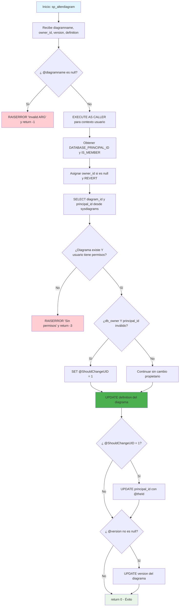

### sp_alterdiagram

Procedimiento estándar de SQL Server para modificar diagramas existentes en la base de datos. Actualiza la definición binaria del diagrama, opcionalmente cambia la versión y corrige propietarios inválidos, todo con validaciones de permisos y manejo de errores.

#### Diagrama de flujo


#### Procedimiento almacenado
```sql
CREATE PROCEDURE dbo.sp_alterdiagram
(
@diagramname sysname,
@owner_id int = null,
@version int,
@definition varbinary(max)
)
WITH EXECUTE AS 'dbo'
AS
BEGIN
set nocount on
declare @theId int
declare @retval int
declare @IsDbo int
declare @UIDFound int
declare @DiagId int
declare @ShouldChangeUID int
if(@diagramname is null)
begin
RAISERROR ('Invalid ARG', 16, 1)
return -1
end
execute as caller;
select @theId = DATABASE_PRINCIPAL_ID();
select @IsDbo = IS_MEMBER(N'db_owner');
if(@owner_id is null)
select @owner_id = @theId;
revert;
select @ShouldChangeUID = 0
select @DiagId = diagram_id, @UIDFound = principal_id from dbo.sysdiagrams where principal_id = @owner_id and name = @diagramname
if(@DiagId IS NULL or (@IsDbo = 0 and @theId <> @UIDFound))
begin
RAISERROR ('Diagram does not exist or you do not have permission.', 16, 1);
return -3
end
if(@IsDbo <> 0)
begin
if(@UIDFound is null or USER_NAME(@UIDFound) is null) -- invalid principal_id
begin
select @ShouldChangeUID = 1 ;
end
end

    	-- update dds data
    	update dbo.sysdiagrams set definition = @definition where diagram_id = @DiagId ;

    	-- change owner
    	if(@ShouldChangeUID = 1)
    		update dbo.sysdiagrams set principal_id = @theId where diagram_id = @DiagId ;

    	-- update dds version
    	if(@version is not null)
    		update dbo.sysdiagrams set version = @version where diagram_id = @DiagId ;

    	return 0
    END
```
#### Operaciones Principales

- Validación parámetros: Verifica que diagramname no sea null
- Control de seguridad: EXECUTE AS CALLER/REVERT para verificar permisos
- Verificación existencia: Busca diagrama y valida permisos del usuario
- Detección propietario inválido: Identifica principal_id huérfanos (solo db_owner)
- Actualización definition: UPDATE obligatorio con nueva definición binaria
- Corrección propietario: UPDATE principal_id si es necesario
- Actualización versión: UPDATE version si se proporciona

#### Tablas afectadas

##### Actualizadas:

- dbo.sysdiagrams: Campos definition (obligatorio), principal_id (condicional), version (condicional)

#### Procedimientos Almacenados Anidados