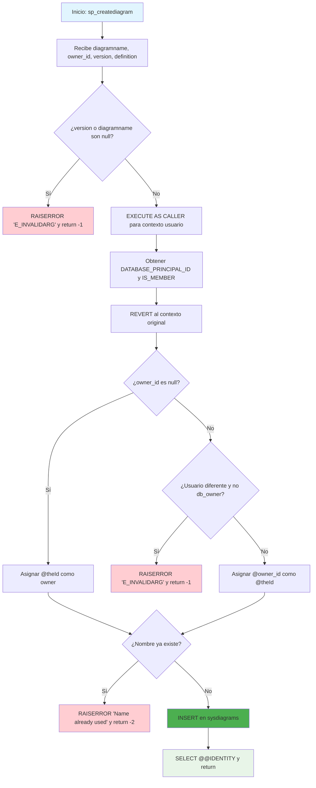

### sp_creatediagram

Procedimiento estándar de SQL Server para crear nuevos diagramas de base de datos. Implementa validaciones de parámetros, control de permisos, verificación de nombres únicos y realiza la inserción en la tabla sysdiagrams con contenido binario del diagrama.

#### Diagrama de flujo


#### Procedimiento almacenado
```sql
CREATE PROCEDURE dbo.sp_creatediagram
(
@diagramname sysname,
@owner_id int = null,
@version int,
@definition varbinary(max)
)
WITH EXECUTE AS 'dbo'
AS
BEGIN
set nocount on
declare @theId int
declare @retval int
declare @IsDbo int
declare @userName sysname
if(@version is null or @diagramname is null)
begin
RAISERROR (N'E_INVALIDARG', 16, 1);
return -1
end
execute as caller;
select @theId = DATABASE_PRINCIPAL_ID();
select @IsDbo = IS_MEMBER(N'db_owner');
revert;
if @owner_id is null
begin
select @owner_id = @theId;
end
else
begin
if @theId <> @owner_id
begin
if @IsDbo = 0
begin
RAISERROR (N'E_INVALIDARG', 16, 1);
return -1
end
select @theId = @owner_id
end
end
-- next 2 line only for test, will be removed after define name unique
if EXISTS(select diagram_id from dbo.sysdiagrams where principal_id = @theId and name = @diagramname)
begin
RAISERROR ('The name is already used.', 16, 1);
return -2
end
insert into dbo.sysdiagrams(name, principal_id , version, definition)
VALUES(@diagramname, @theId, @version, @definition) ;
select @retval = @@IDENTITY
return @retval
END
```
#### Operaciones Principales

- Validación parámetros: Verifica que version y diagramname no sean null
- Control de seguridad: EXECUTE AS CALLER/REVERT para verificar permisos
- Validación propietario: Verifica permisos para asignar owner_id específico
- Verificación unicidad: EXISTS para prevenir nombres duplicados
- Inserción diagrama: INSERT con name, principal_id, version y definition binaria
- Retorno ID: @@IDENTITY del diagrama creado

#### Tablas afectadas

##### Actualizadas:

- dbo.sysdiagrams: Inserción de nuevo diagrama con contenido binario

#### Procedimientos Almacenados Anidados