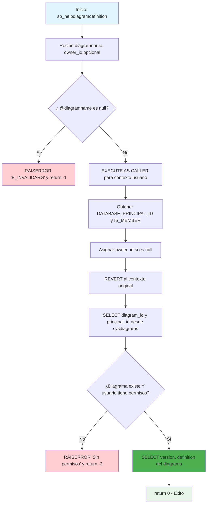

### sp_helpdiagramdefinition

Procedimiento estándar de SQL Server que retorna la definición completa (version y definition) de un diagrama específico. Implementa validaciones de seguridad robustas para verificar existencia del diagrama y permisos del usuario antes de mostrar el contenido binario del diagrama.

#### Diagrama de flujo


#### Procedimiento almacenado
```sql
CREATE PROCEDURE dbo.sp_helpdiagramdefinition
(
@diagramname sysname,
@owner_id int = null
)
WITH EXECUTE AS N'dbo'
AS
BEGIN
set nocount on

    	declare @theId 		int
    	declare @IsDbo 		int
    	declare @DiagId		int
    	declare @UIDFound	int

    	if(@diagramname is null)
    	begin
    		RAISERROR (N'E_INVALIDARG', 16, 1);
    		return -1
    	end

    	execute as caller;
    	select @theId = DATABASE_PRINCIPAL_ID();
    	select @IsDbo = IS_MEMBER(N'db_owner');
    	if(@owner_id is null)
    		select @owner_id = @theId;
    	revert;

    	select @DiagId = diagram_id, @UIDFound = principal_id from dbo.sysdiagrams where principal_id = @owner_id and name = @diagramname;
    	if(@DiagId IS NULL or (@IsDbo = 0 and @UIDFound <> @theId ))
    	begin
    		RAISERROR ('Diagram does not exist or you do not have permission.', 16, 1);
    		return -3
    	end

    	select version, definition FROM dbo.sysdiagrams where diagram_id = @DiagId ;
    	return 0
    END

```
#### Operaciones Principales

- Validación parámetros: Verifica que diagramname no sea null
- Control de seguridad: EXECUTE AS CALLER/REVERT para verificar permisos reales
- Resolución propietario: Asigna owner_id del usuario actual si no se especifica
- Verificación existencia: Busca diagrama por principal_id y nombre
- Validación permisos: Confirma que usuario tenga acceso (db_owner o propietario)
- Retorno definición: SELECT de campos version y definition con contenido binario

#### Tablas afectadas

##### Consultadas:

dbo.sysdiagrams: Tabla sistema que almacena diagramas con sus definiciones binarias

#### Procedimientos Almacenados Anidados