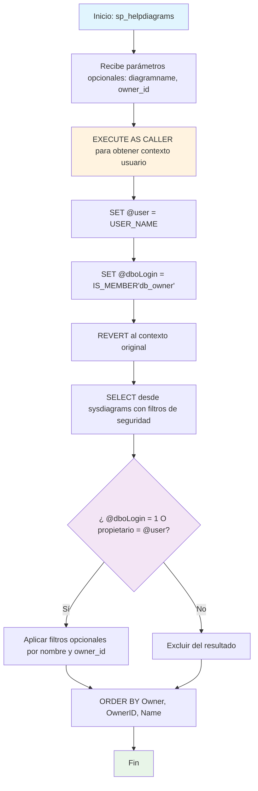

### sp_helpdiagrams

Procedimiento estándar de SQL Server para consultar diagramas de base de datos almacenados en la tabla sysdiagrams. Implementa control de seguridad para mostrar solo diagramas accesibles según permisos del usuario actual, con filtros opcionales por nombre y propietario.

#### Diagrama de flujo


#### Procedimiento almacenado
```sql
CREATE PROCEDURE dbo.sp_helpdiagrams
(
@diagramname sysname = NULL,
@owner_id int = NULL
)
WITH EXECUTE AS N'dbo'
AS
BEGIN
DECLARE @user sysname
DECLARE @dboLogin bit
EXECUTE AS CALLER;
SET @user = USER_NAME();
SET @dboLogin = CONVERT(bit,IS_MEMBER('db_owner'));
REVERT;
SELECT
[Database] = DB_NAME(),
[Name] = name,
[ID] = diagram_id,
[Owner] = USER_NAME(principal_id),
[OwnerID] = principal_id
FROM
sysdiagrams
WHERE
(@dboLogin = 1 OR USER_NAME(principal_id) = @user) AND
(@diagramname IS NULL OR name = @diagramname) AND
(@owner_id IS NULL OR principal_id = @owner_id)
ORDER BY
4, 5, 1
END
```
#### Operaciones Principales

- Control de seguridad: EXECUTE AS CALLER/REVERT para verificar permisos del usuario
- Validación permisos: IS_MEMBER('db_owner') para determinar acceso administrativo
- Filtrado dinámico: WHERE condicional basado en permisos y parámetros opcionales
- Consulta información: SELECT desde sysdiagrams con metadatos del diagrama
- Ordenamiento: ORDER BY propietario, ID propietario y nombre del diagrama
- Resultado enriquecido: Incluye base de datos, nombre, ID, propietario y ID propietario

#### Tablas afectadas

##### Consultadas:

- sysdiagrams: Tabla sistema que almacena diagramas de base de datos

#### Procedimientos Almacenados Anidados