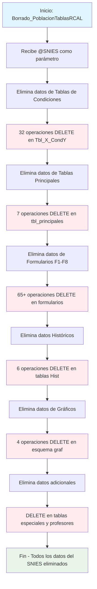

### Borrado_PoblacionTablasRCAL

Este procedimiento almacenado realiza una limpieza masiva de datos relacionados con un programa específico identificado por su código SNIES. Ejecuta múltiples operaciones DELETE en cascada a través de aproximadamente 120 tablas del sistema de Registro Calificado (RCAL), eliminando todos los registros asociados al código SNIES proporcionado.

El procedimiento borra datos de diferentes categorías: tablas de condiciones (Tbl_X_CondY), formularios (F1-F8), tablas principales del sistema, datos históricos, y gráficos. Es esencialmente una operación de "reseteo" o "limpieza" para un programa académico específico.


#### Diagrama de flujo



#### Procedimiento Almacenado

```sql
CREATE PROCEDURE [Dev].[Borrado_PoblacionTablasRCAL]
@SNIES INT

AS
BEGIN

--
DELETE FROM RCAL.Tbl_32_Cond8 WHERE TR_SNIES = @SNIES
DELETE FROM RCAL.Tbl_1_Cond1 WHERE TR_SNIES = @SNIES
DELETE FROM RCAL.Tbl_10_Cond3 WHERE TR_SNIES = @SNIES
DELETE FROM RCAL.Tbl_34_Cond8 WHERE TR_SNIES = @SNIES
DELETE FROM RCAL.Tbl_12_Cond3 WHERE TR_SNIES = @SNIES
DELETE FROM RCAL.Tbl_14_Cond3 WHERE TR_SNIES = @SNIES
DELETE FROM RCAL.Tbl_15_Cond3 WHERE TR_SNIES = @SNIES
DELETE FROM RCAL.Tbl_17_Cond5 WHERE TR_SNIES = @SNIES
DELETE FROM RCAL.Tbl_18_Cond5 WHERE TR_SNIES = @SNIES
DELETE FROM RCAL.Tbl_18_Cond7 WHERE TR_SNIES = @SNIES
DELETE FROM RCAL.Tbl_19_Cond5 WHERE TR_SNIES = @SNIES
DELETE FROM RCAL.Tbl_19_Cond7 WHERE TR_SNIES = @SNIES
DELETE FROM RCAL.Tbl_2_Cond7 WHERE TR_SNIES = @SNIES
DELETE FROM RCAL.Tbl_20_Cond5 WHERE TR_SNIES = @SNIES
DELETE FROM RCAL.Tbl_20_Cond7 WHERE TR_SNIES = @SNIES
DELETE FROM RCAL.Tbl_21_Cond6 WHERE TR_SNIES = @SNIES
DELETE FROM RCAL.Tbl_21_Cond7 WHERE TR_SNIES = @SNIES
DELETE FROM RCAL.Tbl_22_Cond6 WHERE TR_SNIES = @SNIES
DELETE FROM RCAL.Tbl_23_Cond6 WHERE TR_SNIES = @SNIES
DELETE FROM RCAL.Tbl_23_Cond7 WHERE TR_SNIES = @SNIES
DELETE FROM RCAL.Tbl_24_Cond7 WHERE TR_SNIES = @SNIES
DELETE FROM RCAL.Tbl_25_Cond7 WHERE TR_SNIES = @SNIES
DELETE FROM RCAL.Tbl_27_Cond7 WHERE TR_SNIES = @SNIES
DELETE FROM RCAL.Tbl_28_Cond8 WHERE TR_SNIES = @SNIES
DELETE FROM RCAL.Tbl_29_Cond8 WHERE TR_SNIES = @SNIES
DELETE FROM RCAL.Tbl_30_Cond8 WHERE TR_SNIES = @SNIES
DELETE FROM RCAL.Tbl_31_Cond8 WHERE TR_SNIES = @SNIES
DELETE FROM RCAL.Tbl_33_Cond7 WHERE TR_SNIES = @SNIES
DELETE FROM RCAL.Tbl_35_Cond8 WHERE TR_SNIES = @SNIES
DELETE FROM RCAL.Tbl_37_Cond8 WHERE TR_SNIES = @SNIES
DELETE FROM RCAL.Tbl_41_Cond9 WHERE TR_SNIES = @SNIES
DELETE FROM RCAL.Tbl_42_Cond8 WHERE TR_SNIES = @SNIES
DELETE FROM RCAL.Tbl_5_Cond2 WHERE TR_SNIES = @SNIES
DELETE FROM RCAL.Tbl_5_Cond2_ESP WHERE TR_SNIES = @SNIES
DELETE FROM RCAL.Tbl_6_Cond2 WHERE TR_SNIES = @SNIES
DELETE FROM RCAL.Tbl_8_Cond3 WHERE TR_SNIES = @SNIES
DELETE FROM RCAL.Tbl_9_Cond3 WHERE TR_SNIES = @SNIES
DELETE FROM RCAL.Tbl_9_Cond3_ESP WHERE TR_SNIES = @SNIES
DELETE FROM RCAL.Tbl_9_Cond4 WHERE TR_SNIES = @SNIES
DELETE FROM RCAL.Tbl11_Cond3_ESP WHERE TR_SNIES = @SNIES
DELETE FROM RCAL.Tbl20_Cond6_ESP WHERE TR_SNIES = @SNIES
DELETE FROM RCAL.Tbl23_Cond7_ESP WHERE TR_SNIES = @SNIES
DELETE FROM RCAL.Tbl41_Cond9_ESP WHERE TR_SNIES = @SNIES
DELETE FROM RCAL.Tbl_24_Cond6 WHERE TR_SNIES = @SNIES
DELETE FROM RCAL.Tbl_29_Cond6 WHERE TR_SNIES = @SNIES
delete RCAL.Tbl_21_Cond5 WHERE TR_SNIES = @SNIES
delete RCAL.Tbl_33_Cond8 WHERE TR_SNIES = @SNIES
delete RCAL.Tbl_42_Cond9 WHERE TR_SNIES = @SNIES
delete RCAL.Tbl_43_Cond9 WHERE TR_SNIES = @SNIES
delete RCAL.Tbl_22_Cond5 WHERE TR_SNIES = @SNIES
delete RCAL.Tbl_13_Cond3 WHERE TR_SNIES =@SNIES
DELETE FROM RCAL.Tbl6_Cond2_ESP WHERE TR_SNIES = @SNIES

--DELETE FROM RCAL.tbl_Anexos WHERE TR_SNIES = @SNIES
DELETE FROM RCAL.tbl_EstructuraCurricular WHERE TR_SNIES = @SNIES
DELETE FROM RCAL.tbl_InfraestructuraFisica WHERE TR_SNIES = @SNIES
DELETE FROM RCAL.tbl_Investigacion WHERE TR_SNIES = @SNIES
--DELETE FROM RCAL.tbl_Malla WHERE TR_SNIES = @SNIES
DELETE FROM RCAL.tbl_MedioEducativoRecursos WHERE TR_SNIES = @SNIES
--DELETE FROM RCAL.tbl_Profesor WHERE TR_SNIES = @SNIES
DELETE FROM RCAL.tbl_Programa WHERE TR_SNIES = @SNIES
DELETE FROM RCAL.tbl_SectorExterno WHERE TR_SNIES = @SNIES

DELETE FROM RCAL.F1_AjusteSemantico WHERE TR_SNIES = @SNIES
DELETE FROM RCAL.F1_AnalisisCorrespondenciaTitulo WHERE TR_SNIES = @SNIES
DELETE FROM RCAL.F1_CampoAED WHERE TR_SNIES = @SNIES
DELETE FROM RCAL.F2_AnalisisDesercion WHERE TR_SNIES = @SNIES
DELETE FROM RCAL.F2_AnalisisEmpleabilidadH WHERE TR_SNIES = @SNIES
DELETE FROM RCAL.F2_AnalisisEstadistico WHERE TR_SNIES = @SNIES
DELETE FROM RCAL.F2_AnalisisEstaMatri WHERE TR_SNIES = @SNIES
DELETE FROM RCAL.F2_AnalisisEstudiantes WHERE TR_SNIES = @SNIES
DELETE FROM RCAL.F2_AnalisisExpectativasEstd WHERE TR_SNIES = @SNIES
DELETE FROM RCAL.F2_AnalisisReferentes WHERE TR_SNIES = @SNIES
DELETE FROM RCAL.F2_AnalisisTendCompInt WHERE TR_SNIES = @SNIES
DELETE FROM RCAL.F2_AportePlanes WHERE TR_SNIES = @SNIES
DELETE FROM RCAL.F2_AporteSociedad WHERE TR_SNIES = @SNIES
DELETE FROM RCAL.F2_AtributosProgramas WHERE TR_SNIES = @SNIES
DELETE FROM RCAL.F2_ComProgramasInt WHERE TR_SNIES = @SNIES
DELETE FROM RCAL.F2_EmpleabilidadEgresado WHERE TR_SNIES = @SNIES
DELETE FROM RCAL.F2_EnfoqueInd WHERE TR_SNIES = @SNIES
DELETE FROM RCAL.F2_EnfoqueMat WHERE TR_SNIES = @SNIES
DELETE FROM RCAL.F2_EnfoqueRS WHERE TR_SNIES = @SNIES
DELETE FROM RCAL.F2_EnfoqueSos WHERE TR_SNIES = @SNIES
DELETE FROM RCAL.F2_ExplicacionModalidades WHERE TR_SNIES = @SNIES
DELETE FROM RCAL.F2_JustificacionModalidad WHERE TR_SNIES = @SNIES
DELETE FROM RCAL.F2_JustificacionPlanNRL WHERE TR_SNIES = @SNIES
DELETE FROM RCAL.F2_NumeroPorcentual WHERE TR_SNIES = @SNIES
DELETE FROM RCAL.F2_RedaccionPlanDesarrolloNRL WHERE TR_SNIES = @SNIES
DELETE FROM RCAL.F2_Referentes WHERE TR_SNIES = @SNIES
DELETE FROM RCAL.F2_ResumenModificacion WHERE TR_SNIES = @SNIES
DELETE FROM RCAL.F2_Salarios WHERE TR_SNIES = @SNIES
DELETE FROM RCAL.F2_SectorEmpleabilidad WHERE TR_SNIES = @SNIES
DELETE FROM RCAL.F3_AlianzasCUN WHERE TR_SNIES = @SNIES
DELETE FROM RCAL.F3_AnexoEstructuraCurricular WHERE TR_SNIES = @SNIES
DELETE FROM RCAL.F3_CreditosPropedeutico WHERE TR_SNIES = @SNIES
DELETE FROM RCAL.F3_DescripccionImpactCuant WHERE TR_SNIES = @SNIES
DELETE FROM RCAL.F3_DescripccionModPedag WHERE TR_SNIES = @SNIES
DELETE FROM RCAL.F3_DescripccionModVirt WHERE TR_SNIES = @SNIES
DELETE FROM RCAL.F3_ElementosTyE WHERE TR_SNIES = @SNIES
DELETE FROM RCAL.F3_ImpactProyeccSoci WHERE TR_SNIES = @SNIES
DELETE FROM RCAL.F3_ImplementacionRA WHERE TR_SNIES = @SNIES
DELETE FROM RCAL.F3_PerfilEgreso WHERE TR_SNIES = @SNIES
DELETE FROM RCAL.F3_PerfilIngreso WHERE TR_SNIES = @SNIES
DELETE FROM RCAL.F3_PerfilOcupacional WHERE TR_SNIES = @SNIES
DELETE FROM RCAL.F3_PerfilProfesional WHERE TR_SNIES = @SNIES
DELETE FROM RCAL.F3_ResumenConceptTyE WHERE TR_SNIES = @SNIES
DELETE FROM RCAL.F4_ActividadAcademica WHERE TR_SNIES = @SNIES
DELETE FROM RCAL.F4_AjusteAsignaturas WHERE TR_SNIES = @SNIES
DELETE FROM RCAL.F4_CompetenciaHabilidades WHERE TR_SNIES = @SNIES
DELETE FROM RCAL.F4_DescripcionPlanTransicion WHERE TR_SNIES = @SNIES
DELETE FROM RCAL.F4_EnfoqueCompnComp WHERE TR_SNIES = @SNIES
DELETE FROM RCAL.F5_AnalasisTabla17 WHERE TR_SNIES = @SNIES
--DELETE FROM RCAL.F5_DocnProgramInvst WHERE TR_SNIES = @SNIES
--DELETE FROM RCAL.F5_GrupoInvestigacion WHERE TR_SNIES = @SNIES
DELETE FROM RCAL.F5_InversionesEstimadas WHERE TR_SNIES = @SNIES
DELETE FROM RCAL.F5_PlanInvestigacion WHERE TR_SNIES = @SNIES
DELETE FROM RCAL.F5_ProduccInvsProgram WHERE TR_SNIES = @SNIES
DELETE FROM RCAL.F5_ResumenInvsProgram WHERE TR_SNIES = @SNIES
DELETE FROM RCAL.F6_AnalaisisTablaEscPract WHERE TR_SNIES = @SNIES
DELETE FROM RCAL.F6_AnalisisProyecSoci WHERE TR_SNIES = @SNIES
--DELETE FROM RCAL.F6_CabtidadAños WHERE TR_SNIES = @SNIES
DELETE FROM RCAL.F6_ConvenioRegional WHERE TR_SNIES = @SNIES
--DELETE FROM RCAL.F6_DocentesProgramSectExtr WHERE TR_SNIES = @SNIES
DELETE FROM RCAL.F6_InstPractNumEstud WHERE TR_SNIES = @SNIES
DELETE FROM RCAL.F6_IntroducConven WHERE TR_SNIES = @SNIES
DELETE FROM RCAL.F6_PlanInteraccionSectExtr WHERE TR_SNIES = @SNIES
DELETE FROM RCAL.F6_PlanRelacSectExter WHERE TR_SNIES = @SNIES
DELETE FROM RCAL.F7_AnalisisDocente WHERE TR_SNIES = @SNIES
DELETE FROM RCAL.F7_ConteoProfEstud WHERE TR_SNIES = @SNIES
--DELETE FROM RCAL.F8_CantidadAños WHERE TR_SNIES = @SNIES
--DELETE FROM RCAL.F8_CursosVirtualizadoProyecc WHERE TR_SNIES = @SNIES
--DELETE FROM RCAL.F8_EquiposSala WHERE TR_SNIES = @SNIES
delete RCAL.F8_IngresoAulaVirtual WHERE TR_SNIES =@SNIES
--DELETE FROM RCAL.F8_ProyeccionEquipos WHERE TR_SNIES = @SNIES
--DELETE FROM RCAL.F9_CantidadSedesCUN WHERE TR_SNIES = @SNIES
--DELETE FROM RCAL.F9_ProyeccAsigRecurTecng WHERE TR_SNIES = @SNIES
DELETE FROM RCAL.BibliotecaHist WHERE TR_SNIES = @SNIES
DELETE FROM RCAL.InternacionalizacionEjeHist WHERE TR_SNIES = @SNIES
DELETE FROM RCAL.InternacionalizacionHist WHERE TR_SNIES = @SNIES
DELETE FROM RCAL.NivelInglesHist WHERE TR_SNIES = @SNIES
DELETE FROM RCAL.PracticasHist WHERE TR_SNIES = @SNIES
DELETE FROM RCAL.ProyecSocHist WHERE TR_SNIES = @SNIES

--DELETE FROM RCAL.F2_AñosObtencionTitulo WHERE TR_SNIES = @SNIES
--DELETE FROM RCAL.F2_ImpactoSalarial WHERE TR_SNIES = @SNIES
--DELETE FROM RCAL.F4_NumeroSemanas WHERE TR_SNIES = @SNIES

--declare @SNIES VARCHAR(255) ='202400120'

DELETE RCAL.F2_RangoSalarial WHERE TR_SNIES = @SNIES
DELETE RCAL.F2_VinculaciónLaboral WHERE TR_SNIES = @SNIES
--DELETE RCAL.F7_CantidadAños WHERE TR_SNIES = @SNIES
DELETE [REGISTRO_CALIFICADO].[RCAL].[F3_RAE] WHERE TR_SNIES = @SNIES
DELETE FROM RCAL.Acuerdo WHERE TR_SNIES = @SNIES
delete from [REGISTRO_CALIFICADO].[RCAL].[tbl_Profesor] WHERE TR_SNIES =@SNIES

DELETE graf.Cond4_Figura_4 WHERE TR_SNIES = @SNIES
DELETE graf.Cond2_Figura_5 WHERE TR_SNIES = @SNIES
DELETE graf.Cond2_Figura_4 WHERE TR_SNIES = @SNIES
DELETE graf.Cond2_Figura_3 WHERE TR_SNIES = @SNIES
--DELETE RCAL.Acta WHERE TR_SNIES = @SNIES
    END
```
#### Tablas afectadas

##### Tablas de Condiciones (~32 tablas):

- Tbl_X_CondY (donde X es número de tabla, Y es número de condición)
- Incluye versiones especializadas (_ESP)

##### Tablas Principales (7 tablas):

- tbl_EstructuraCurricular, tbl_InfraestructuraFisica, tbl_Investigacion
- tbl_MedioEducativoRecursos, tbl_Programa, tbl_SectorExterno, tbl_Profesor

##### Formularios F1-F8 (65+ tablas):

- F1: Ajustes semánticos y correspondencias
- F2: Análisis estadísticos, empleabilidad, referentes
- F3: Perfiles, impactos, elementos curriculares
- F4: Competencias y actividades académicas
- F5: Investigación y análisis
- F6: Proyección social y convenios
- F7: Análisis docente
- F8: Aulas virtuales

##### Tablas Históricas (6 tablas):

- BibliotecaHist, InternacionalizacionHist, NivelInglesHist
- PracticasHist, ProyecSocHist, InternacionalizacionEjeHist

##### Gráficos (4 tablas):

- graf.Cond4_Figura_4, graf.Cond2_Figura_5
- graf.Cond2_Figura_4, graf.Cond2_Figura_3

##### Condición de Eliminación: 
- Todas las operaciones filtran por TR_SNIES = @SNIES

