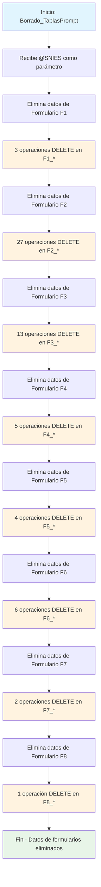

### Borrado_TablasPrompt

Este procedimiento almacenado realiza una limpieza específica de tablas de formularios relacionadas con un programa académico identificado por su código SNIES. A diferencia del procedimiento anterior, este se enfoca únicamente en eliminar datos de las tablas de formularios F1 a F8, que contienen información generada por prompts o formularios del sistema de Registro Calificado.

Es una versión más selectiva del borrado masivo, concentrándose solo en los datos de formularios sin afectar tablas de condiciones, datos históricos, gráficos o tablas principales del sistema.
#### Diagrama de flujo



#### Procedimiento almacenado

```sql
CREATE PROCEDURE [Dev].[Borrado_TablasPrompt]

@SNIES INT

AS
BEGIN

DELETE FROM RCAL.F1_AjusteSemantico WHERE TR_SNIES = @SNIES
DELETE FROM RCAL.F1_AnalisisCorrespondenciaTitulo WHERE TR_SNIES = @SNIES
DELETE FROM RCAL.F1_CampoAED WHERE TR_SNIES = @SNIES
DELETE FROM RCAL.F2_AnalisisDesercion WHERE TR_SNIES = @SNIES
DELETE FROM RCAL.F2_AnalisisEmpleabilidadH WHERE TR_SNIES = @SNIES
DELETE FROM RCAL.F2_AnalisisEstadistico WHERE TR_SNIES = @SNIES
DELETE FROM RCAL.F2_AnalisisEstaMatri WHERE TR_SNIES = @SNIES
DELETE FROM RCAL.F2_AnalisisEstudiantes WHERE TR_SNIES = @SNIES
DELETE FROM RCAL.F2_AnalisisExpectativasEstd WHERE TR_SNIES = @SNIES
DELETE FROM RCAL.F2_AnalisisReferentes WHERE TR_SNIES = @SNIES
DELETE FROM RCAL.F2_AnalisisTendCompInt WHERE TR_SNIES = @SNIES
DELETE FROM RCAL.F2_AportePlanes WHERE TR_SNIES = @SNIES
DELETE FROM RCAL.F2_AporteSociedad WHERE TR_SNIES = @SNIES
DELETE FROM RCAL.F2_AtributosProgramas WHERE TR_SNIES = @SNIES
DELETE FROM RCAL.F2_ComProgramasInt WHERE TR_SNIES = @SNIES
DELETE FROM RCAL.F2_EmpleabilidadEgresado WHERE TR_SNIES = @SNIES
DELETE FROM RCAL.F2_EnfoqueInd WHERE TR_SNIES = @SNIES
DELETE FROM RCAL.F2_EnfoqueMat WHERE TR_SNIES = @SNIES
DELETE FROM RCAL.F2_EnfoqueRS WHERE TR_SNIES = @SNIES
DELETE FROM RCAL.F2_EnfoqueSos WHERE TR_SNIES = @SNIES
DELETE FROM RCAL.F2_ExplicacionModalidades WHERE TR_SNIES = @SNIES
DELETE FROM RCAL.F2_JustificacionModalidad WHERE TR_SNIES = @SNIES
DELETE FROM RCAL.F2_JustificacionPlanNRL WHERE TR_SNIES = @SNIES
DELETE FROM RCAL.F2_NumeroPorcentual WHERE TR_SNIES = @SNIES
DELETE FROM RCAL.F2_RedaccionPlanDesarrolloNRL WHERE TR_SNIES = @SNIES
DELETE FROM RCAL.F2_Referentes WHERE TR_SNIES = @SNIES
DELETE FROM RCAL.F2_ResumenModificacion WHERE TR_SNIES = @SNIES
DELETE FROM RCAL.F2_Salarios WHERE TR_SNIES = @SNIES
DELETE FROM RCAL.F2_SectorEmpleabilidad WHERE TR_SNIES = @SNIES
DELETE FROM RCAL.F3_AlianzasCUN WHERE TR_SNIES = @SNIES
DELETE FROM RCAL.F3_AnexoEstructuraCurricular WHERE TR_SNIES = @SNIES
DELETE FROM RCAL.F3_CreditosPropedeutico WHERE TR_SNIES = @SNIES
DELETE FROM RCAL.F3_DescripccionImpactCuant WHERE TR_SNIES = @SNIES
DELETE FROM RCAL.F3_DescripccionModPedag WHERE TR_SNIES = @SNIES
DELETE FROM RCAL.F3_DescripccionModVirt WHERE TR_SNIES = @SNIES
DELETE FROM RCAL.F3_ElementosTyE WHERE TR_SNIES = @SNIES
DELETE FROM RCAL.F3_ImpactProyeccSoci WHERE TR_SNIES = @SNIES
DELETE FROM RCAL.F3_ImplementacionRA WHERE TR_SNIES = @SNIES
DELETE FROM RCAL.F3_PerfilEgreso WHERE TR_SNIES = @SNIES
DELETE FROM RCAL.F3_PerfilIngreso WHERE TR_SNIES = @SNIES
DELETE FROM RCAL.F3_PerfilOcupacional WHERE TR_SNIES = @SNIES
DELETE FROM RCAL.F3_PerfilProfesional WHERE TR_SNIES = @SNIES
DELETE FROM RCAL.F3_ResumenConceptTyE WHERE TR_SNIES = @SNIES
DELETE FROM RCAL.F4_ActividadAcademica WHERE TR_SNIES = @SNIES
DELETE FROM RCAL.F4_AjusteAsignaturas WHERE TR_SNIES = @SNIES
DELETE FROM RCAL.F4_CompetenciaHabilidades WHERE TR_SNIES = @SNIES
DELETE FROM RCAL.F4_DescripcionPlanTransicion WHERE TR_SNIES = @SNIES
DELETE FROM RCAL.F4_EnfoqueCompnComp WHERE TR_SNIES = @SNIES
DELETE FROM RCAL.F5_AnalasisTabla17 WHERE TR_SNIES = @SNIES
--DELETE FROM RCAL.F5_DocnProgramInvst WHERE TR_SNIES = @SNIES
--DELETE FROM RCAL.F5_GrupoInvestigacion WHERE TR_SNIES = @SNIES
DELETE FROM RCAL.F5_InversionesEstimadas WHERE TR_SNIES = @SNIES
DELETE FROM RCAL.F5_PlanInvestigacion WHERE TR_SNIES = @SNIES
DELETE FROM RCAL.F5_ProduccInvsProgram WHERE TR_SNIES = @SNIES
DELETE FROM RCAL.F5_ResumenInvsProgram WHERE TR_SNIES = @SNIES
DELETE FROM RCAL.F6_AnalaisisTablaEscPract WHERE TR_SNIES = @SNIES
DELETE FROM RCAL.F6_AnalisisProyecSoci WHERE TR_SNIES = @SNIES
--DELETE FROM RCAL.F6_CabtidadAños WHERE TR_SNIES = @SNIES
DELETE FROM RCAL.F6_ConvenioRegional WHERE TR_SNIES = @SNIES
--DELETE FROM RCAL.F6_DocentesProgramSectExtr WHERE TR_SNIES = @SNIES
DELETE FROM RCAL.F6_InstPractNumEstud WHERE TR_SNIES = @SNIES
DELETE FROM RCAL.F6_IntroducConven WHERE TR_SNIES = @SNIES
DELETE FROM RCAL.F6_PlanInteraccionSectExtr WHERE TR_SNIES = @SNIES
DELETE FROM RCAL.F6_PlanRelacSectExter WHERE TR_SNIES = @SNIES
DELETE FROM RCAL.F7_AnalisisDocente WHERE TR_SNIES = @SNIES
DELETE FROM RCAL.F7_ConteoProfEstud WHERE TR_SNIES = @SNIES
--DELETE FROM RCAL.F8_CantidadAños WHERE TR_SNIES = @SNIES
--DELETE FROM RCAL.F8_CursosVirtualizadoProyecc WHERE TR_SNIES = @SNIES
--DELETE FROM RCAL.F8_EquiposSala WHERE TR_SNIES = @SNIES
delete RCAL.F8_IngresoAulaVirtual WHERE TR_SNIES =@SNIES
--DELETE FROM RCAL.F8_ProyeccionEquipos WHERE TR_SNIES = @SNIES
--DELETE FROM RCAL.F9_CantidadSedesCUN WHERE TR_SNIES = @SNIES
--DELETE FROM RCAL.F9_ProyeccAsigRecurTecng WHERE TR_SNIES = @SNIES

END|
```

#### Tablas afectadas

##### Formulario F1 (3 tablas):

- F1_AjusteSemantico, F1_AnalisisCorrespondenciaTitulo, F1_CampoAED

##### Formulario F2 (27 tablas):

- Análisis: F2_AnalisisDesercion, F2_AnalisisEmpleabilidadH, F2_AnalisisEstadistico
- Enfoques: F2_EnfoqueInd, F2_EnfoqueMat, F2_EnfoqueRS, F2_EnfoqueSos
- Justificaciones: F2_JustificacionModalidad, F2_JustificacionPlanNRL
- Otros análisis y aportes

##### Formulario F3 (13 tablas):

- Perfiles: F3_PerfilEgreso, F3_PerfilIngreso, F3_PerfilOcupacional, F3_PerfilProfesional
- Descripciones: F3_DescripccionImpactCuant, F3_DescripccionModPedag, F3_DescripccionModVirt
- Elementos curriculares y alianzas

##### Formulario F4 (5 tablas):

- F4_ActividadAcademica, F4_AjusteAsignaturas, F4_CompetenciaHabilidades
- F4_DescripcionPlanTransicion, F4_EnfoqueCompnComp

##### Formulario F5 (4 tablas):

- F5_AnalasisTabla17, F5_InversionesEstimadas, F5_PlanInvestigacion, F5_ResumenInvsProgram

##### Formulario F6 (6 tablas):

- F6_AnalisisProyecSoci, F6_ConvenioRegional, F6_IntroducConven
- Planes de interacción y relación con sector externo

##### Formulario F7 (2 tablas):

- F7_AnalisisDocente, F7_ConteoProfEstud

##### Formulario F8 (1 tabla):

- F8_IngresoAulaVirtual

##### Condición de Eliminación: 
- Todas las operaciones filtran por TR_SNIES = @SNIES
##### Total de tablas afectadas: 
- 61 tablas de formularios
