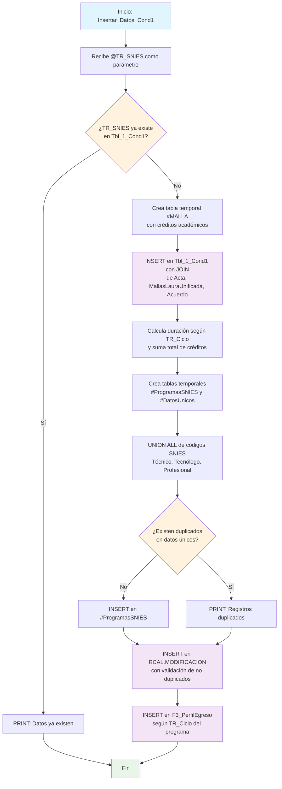

### Insertar_Datos_Cond1

Este procedimiento almacenado realiza una inserción compleja y multi-etapa de datos para la Condición 1 del sistema de Registro Calificado. Ejecuta cuatro operaciones principales: inserta datos básicos del programa en Tbl_1_Cond1, procesa datos de mallas unificadas para evitar duplicados, registra información histórica en RCAL.MODIFICACION, e inserta perfiles de egreso según el ciclo académico.

El procedimiento incluye validaciones de existencia, manejo de tablas temporales, y lógica condicional para diferentes niveles de formación (Técnico, Tecnólogo, Profesional, Especialización).

#### Diagrama de flujo



#### Procedimiento almacenado

```sql
CREATE PROCEDURE [Dev].[Insertar_Datos_Cond1]
@TR_SNIES VARCHAR(255)
AS
BEGIN
PRINT 'Inicio de la inserción de datos en [REGISTRO_CALIFICADO].[RCAL].[Tbl_1_Cond1]';

    -- Verificar si el TR_SNIES ya existe en la tabla destino
    IF NOT EXISTS (
        SELECT 1
        FROM [REGISTRO_CALIFICADO].[RCAL].[Tbl_1_Cond1]
        WHERE [TR_SNIES] = @TR_SNIES
    )
    BEGIN

    	drop table if exists #MALLA

    	SELECT DISTINCT TR_Asignatura, TR_CreditosAcademicos
    	INTO #MALLA
    	FROM RCAL.tbl_Malla
    	WHERE TR_SNIES = @TR_SNIES;

        -- Realizar la inserción de datos si el TR_SNIES no existe
        INSERT INTO [REGISTRO_CALIFICADO].[RCAL].[Tbl_1_Cond1]
            ([TR_NombrePrograma],
            [TR_Titulo],
            [TR_totalCreditos],
            [TR_Modalidad],
            [TR_NivelFormacion],
            [TR_Regionales],
            [TR_Duracion],
            [Cal_UnidadPeriodicidad],
            [TR_PeriodicidadAdminision],
            [TR_EstudiantesPrimerSemestre],
            [F_NumeroAcuerdo],
            [TR_FechaAcuerdo_dia],
            [TR_FechaAcuerdo_mes],
            [TR_FechaAcuerdo_año],
            [TR_SNIES])
        SELECT DISTINCT
            B.NOMBRE_DEL_PROGRAMA AS TR_NombrePrograma,
            CONCAT(B.TITULO_OTORGADO, 'a') AS TR_Titulo,
            (SELECT SUM(CAST(TR_CreditosAcademicos AS INT)) FROM #MALLA) AS TR_totalCreditos,
            A.TR_Modalidad AS TR_Modalidad,
            A.TR_Ciclo AS TR_NivelFormacion,
            A.TR_Regionales AS TR_Regionales,
            CASE
                WHEN A.TR_Ciclo = 'Profesional' THEN A.TR_DuracionPro
                WHEN A.TR_Ciclo = 'Tecnologo' THEN A.TR_DuracionTG
                WHEN A.TR_Ciclo = 'ESPECIALIZACIÓN' THEN A.TR_DuracionEsp
                ELSE A.TR_DuracionTP
            END AS TR_Duracion,
            'SEMESTRES' AS Cal_UnidadPeriodicidad,
            A.TR_PeriocidadAdmision AS TR_PeriodicidadAdminision,
            A.TR_EstudiantesPrimerSemestre AS TR_EstudiantesPrimerSemestre,
            C.F_NumeroAcuerdo AS F_NumeroAcuerdo,
            DAY(C.F_FechaAcuerdo) AS TR_FechaAcuerdo_dia,
            MONTH(C.F_FechaAcuerdo) AS TR_FechaAcuerdo_mes,
            YEAR(C.F_FechaAcuerdo) AS TR_FechaAcuerdo_año,
            A.TR_SNIES AS TR_SNIES
        FROM
            [REGISTRO_CALIFICADO].[RCAL].[Acta] A
        LEFT JOIN
            DEV.MallasLauraUnificada B ON A.TR_SNIES = B.CODIGO_SNIES
        LEFT JOIN
            RCAL.Acuerdo C ON A.TR_SNIES = C.TR_SNIES
        WHERE
            A.TR_SNIES = @TR_SNIES;

        PRINT 'Datos insertados correctamente en [Tbl_1_Cond1].';
    END
    ELSE
    BEGIN
        -- Mensaje si los datos ya existen
        PRINT 'Los datos con el TR_SNIES proporcionado ya existen en la tabla destino.';
    END

    PRINT 'Fin de la inserción de datos en [Tbl_1_Cond1].';

IF OBJECT_ID('tempdb..#ProgramasSNIES') IS NOT NULL DROP TABLE #ProgramasSNIES;
CREATE TABLE #ProgramasSNIES (
TR_SNIES VARCHAR(50), NOMBRE_DEL_PROGRAMA_PRO VARCHAR(255), NOMBRE_DEL_PROGRAMA_TEC VARCHAR(255),
NOMBRE_DEL_PROGRAMA_TNG VARCHAR(255), TITULO_OTORGADO_TEC VARCHAR(255), TITULO_OTORGADO_TNG VARCHAR(255),
TITULO_OTORGADO_PRO VARCHAR(255), TOTAL_CREDITOS_TECNICO VARCHAR(255), TOTAL_CREDITOS_TECNOLOGO VARCHAR(255),
TOTAL_CREDITOS_PROFESIONAL VARCHAR(255), MODALIDAD VARCHAR(255)
);

IF OBJECT_ID('tempdb..#DatosUnicos') IS NOT NULL DROP TABLE #DatosUnicos;

SELECT DISTINCT CODIGO_SNIES, NOMBRE_DEL_PROGRAMA_PRO, NOMBRE_DEL_PROGRAMA_TEC, NOMBRE_DEL_PROGRAMA_TNG,
TITULO_OTORGADO_TEC, TITULO_OTORGADO_TNG, TITULO_OTORGADO_PRO, TOTAL_CREDITOS_TECNICO,
TOTAL_CREDITOS_TECNOLOGO, TOTAL_CREDITOS_PROFESIONAL, MODALIDAD
INTO #DatosUnicos
FROM (
SELECT CODIGO_SNIES_TECNICO AS CODIGO_SNIES, NOMBRE_DEL_PROGRAMA_PRO, NOMBRE_DEL_PROGRAMA_TEC,
NOMBRE_DEL_PROGRAMA_TNG, TITULO_OTORGADO_TEC, TITULO_OTORGADO_TNG, TITULO_OTORGADO_PRO,
TOTAL_CREDITOS_TECNICO, TOTAL_CREDITOS_TECNOLOGO, TOTAL_CREDITOS_PROFESIONAL, MODALIDAD
FROM CUN_REPOSITORIO.CUN.MallasLaura
WHERE CODIGO_SNIES_TECNICO <> '' AND ESTADO = 'VIGENTE'
AND NOMBRE_DEL_PROGRAMA_PRO <> '' AND NOMBRE_DEL_PROGRAMA_TEC <> '' AND NOMBRE_DEL_PROGRAMA_TNG <> ''
AND TITULO_OTORGADO_TNG <> '' AND TITULO_OTORGADO_PRO <> ''
AND TOTAL_CREDITOS_TECNICO <> '' AND TOTAL_CREDITOS_TECNOLOGO <> '' AND TOTAL_CREDITOS_PROFESIONAL <> ''
AND MODALIDAD <> ''

    UNION ALL

    SELECT CODIGO_SNIES_TECNOLOGICO, NOMBRE_DEL_PROGRAMA_PRO, NOMBRE_DEL_PROGRAMA_TEC, NOMBRE_DEL_PROGRAMA_TNG,
        TITULO_OTORGADO_TEC, TITULO_OTORGADO_TNG, TITULO_OTORGADO_PRO,
        TOTAL_CREDITOS_TECNICO, TOTAL_CREDITOS_TECNOLOGO, TOTAL_CREDITOS_PROFESIONAL, MODALIDAD
    FROM CUN_REPOSITORIO.CUN.MallasLaura
    WHERE CODIGO_SNIES_TECNOLOGICO <> '' AND ESTADO = 'VIGENTE'
      AND NOMBRE_DEL_PROGRAMA_PRO <> '' AND NOMBRE_DEL_PROGRAMA_TEC <> '' AND NOMBRE_DEL_PROGRAMA_TNG <> ''
      AND TITULO_OTORGADO_TNG <> '' AND TITULO_OTORGADO_PRO <> ''
      AND TOTAL_CREDITOS_TECNICO <> '' AND TOTAL_CREDITOS_TECNOLOGO <> '' AND TOTAL_CREDITOS_PROFESIONAL <> ''
      AND MODALIDAD <> ''

    UNION ALL

    SELECT CODIGO_SNIES_PROF, NOMBRE_DEL_PROGRAMA_PRO, NOMBRE_DEL_PROGRAMA_TEC, NOMBRE_DEL_PROGRAMA_TNG,
        TITULO_OTORGADO_TEC, TITULO_OTORGADO_TNG, TITULO_OTORGADO_PRO,
        TOTAL_CREDITOS_TECNICO, TOTAL_CREDITOS_TECNOLOGO, TOTAL_CREDITOS_PROFESIONAL, MODALIDAD
    FROM CUN_REPOSITORIO.CUN.MallasLaura
    WHERE CODIGO_SNIES_PROF <> '' AND ESTADO = 'VIGENTE'
      AND NOMBRE_DEL_PROGRAMA_PRO <> '' AND NOMBRE_DEL_PROGRAMA_TEC <> '' AND NOMBRE_DEL_PROGRAMA_TNG <> ''
      AND TITULO_OTORGADO_TNG <> '' AND TITULO_OTORGADO_PRO <> ''
      AND TOTAL_CREDITOS_TECNICO <> '' AND TOTAL_CREDITOS_TECNOLOGO <> '' AND TOTAL_CREDITOS_PROFESIONAL <> ''
      AND MODALIDAD <> ''

) AS Datos;

IF NOT EXISTS (
SELECT 1 FROM #DatosUnicos
GROUP BY CODIGO_SNIES, NOMBRE_DEL_PROGRAMA_PRO, NOMBRE_DEL_PROGRAMA_TEC, NOMBRE_DEL_PROGRAMA_TNG,
TITULO_OTORGADO_TEC, TITULO_OTORGADO_TNG, TITULO_OTORGADO_PRO, TOTAL_CREDITOS_TECNICO,
TOTAL_CREDITOS_TECNOLOGO, TOTAL_CREDITOS_PROFESIONAL, MODALIDAD
HAVING COUNT(\*) > 1
)
BEGIN
INSERT INTO #ProgramasSNIES
SELECT CODIGO_SNIES, NOMBRE_DEL_PROGRAMA_PRO, NOMBRE_DEL_PROGRAMA_TEC, NOMBRE_DEL_PROGRAMA_TNG,
TITULO_OTORGADO_TEC, TITULO_OTORGADO_TNG, TITULO_OTORGADO_PRO, TOTAL_CREDITOS_TECNICO,
TOTAL_CREDITOS_TECNOLOGO, TOTAL_CREDITOS_PROFESIONAL, MODALIDAD
FROM #DatosUnicos;
END
ELSE
BEGIN
PRINT 'Se encontraron registros duplicados. No se realizó la inserción.';
END;

-- INSERT SIN DUPLICADOS EN RCAL.MODIFICACION
INSERT INTO RCAL.MODIFICACION (
TR_SNIES, TR_NombreProgramaPro_Ant, TR_NombreProgramaTP_Ant, TR_NombreProgramaTG_Ant,
TR_TituloPro_Ant, TR_TituloTP_Ant, TR_TituloTG_Ant, CreditosPro_Ant, CreditosTP_Ant, CreditosTG_Ant,
TR_Duracion_Ant, TR_PeriodicidadAdminision_Ant, TR_EstudiantesPrimerSemestre_Ant,
TR_Creditos_Tecno_Prof_V2**Ant, TR_Creditos_Tec_Tecno_V2**Ant, TR_Modalidad_Ant
)
SELECT DISTINCT
p.TR_SNIES, p.NOMBRE_DEL_PROGRAMA_PRO, p.NOMBRE_DEL_PROGRAMA_TEC, p.NOMBRE_DEL_PROGRAMA_TNG,
p.TITULO_OTORGADO_PRO, p.TITULO_OTORGADO_TEC, p.TITULO_OTORGADO_TNG,
ISNULL(p.TOTAL_CREDITOS_PROFESIONAL, '0'), ISNULL(p.TOTAL_CREDITOS_TECNICO, '0'), ISNULL(p.TOTAL_CREDITOS_TECNOLOGO, '0'),
'0', '0', '0', '0', '0', ISNULL(p.MODALIDAD, '0')
FROM #ProgramasSNIES p
WHERE NOT EXISTS (
SELECT 1 FROM RCAL.MODIFICACION m
WHERE m.TR_SNIES = p.TR_SNIES
AND m.TR_NombreProgramaPro_Ant = p.NOMBRE_DEL_PROGRAMA_PRO
AND m.TR_NombreProgramaTP_Ant = p.NOMBRE_DEL_PROGRAMA_TEC
AND m.TR_NombreProgramaTG_Ant = p.NOMBRE_DEL_PROGRAMA_TNG
AND m.TR_TituloPro_Ant = p.TITULO_OTORGADO_PRO
AND m.TR_TituloTP_Ant = p.TITULO_OTORGADO_TEC
AND m.TR_TituloTG_Ant = p.TITULO_OTORGADO_TNG
AND m.CreditosPro_Ant = ISNULL(p.TOTAL_CREDITOS_PROFESIONAL, '0')
AND m.CreditosTP_Ant = ISNULL(p.TOTAL_CREDITOS_TECNICO, '0')
AND m.CreditosTG_Ant = ISNULL(p.TOTAL_CREDITOS_TECNOLOGO, '0')
AND m.TR_Modalidad_Ant = ISNULL(p.MODALIDAD, '0')
);

INSERT INTO RCAL.F3_PerfilEgreso (TR_SNIES, F3_PerfilEgreso)
SELECT
TR_SNIES,
CASE
WHEN TR_Ciclo = 'PROFESIONAL' THEN Te_PerfilEgresoPro
WHEN TR_Ciclo = 'TECNÓLOGO' THEN Te_PerfilEgresoTG
WHEN TR_Ciclo = 'TÉCNICO PROFESIONAL' THEN Te_PerfilEgresoTP
WHEN TR_Ciclo = 'ESPECIALIZACIÓN' THEN Te_PerfilEgresoEsp
ELSE NULL
END AS TE_PerfilEgreso
FROM rcal.acta
WHERE TR_SNIES = @TR_SNIES; -- o cualquier otro criterio de filtrado

    -- Ejemplo para ejecutar el procedimiento:
    -- EXEC [Dev].[Insertar_Datos_Cond1] @TR_SNIES = '52606';

END;
```
### Operaciones Principales
1. Inserción en Tbl_1_Cond1:

-Valida existencia previa del TR_SNIES
-Calcula total de créditos desde malla curricular
-Determina duración según ciclo académico
-Combina datos de Acta, MallasLauraUnificada, y Acuerdo

2. Procesamiento de Mallas Unificadas:

-Extrae datos de CUN_REPOSITORIO.CUN.MallasLaura
-UNION de códigos SNIES por nivel (Técnico, Tecnólogo, Profesional)
-Filtros: ESTADO = 'VIGENTE' y campos no vacíos
-Validación de duplicados antes de inserción

3. Registro Histórico en MODIFICACION:

-Inserta datos anteriores del programa
-Evita duplicados con validación EXISTS
-Mapea campos de modalidad, créditos y títulos

4. Perfil de Egreso:

- Inserta según TR_Ciclo específico:

  - PROFESIONAL → Te_PerfilEgresoPro
  - TECNÓLOGO → Te_PerfilEgresoTG
  - TÉCNICO PROFESIONAL → Te_PerfilEgresoTP
  - ESPECIALIZACIÓN → Te_PerfilEgresoEsp

#### Tablas afectadas

##### Tablas destino:

- RCAL.Tbl_1_Cond1: Datos principales del programa
- RCAL.MODIFICACION: Histórico de modificaciones
- RCAL.F3_PerfilEgreso: Perfiles de egreso por ciclo

##### Tablas fuente:

- RCAL.Acta: Información básica del programa
- DEV.MallasLauraUnificada: Mallas curriculares
- RCAL.Acuerdo: Acuerdos institucionales
- CUN_REPOSITORIO.CUN.MallasLaura: Repositorio de mallas

##### Tablas temporales:

- #MALLA: Créditos académicos únicos
- #ProgramasSNIES: Programas sin duplicados
- #DatosUnicos: Datos consolidados por SNIES

##### Validaciones Implementadas

- Verificación de existencia previa en tabla destino
- Control de duplicados en datos fuente
- Validación de campos no vacíos y estado VIGENTE
- Prevención de duplicados en inserción histórica