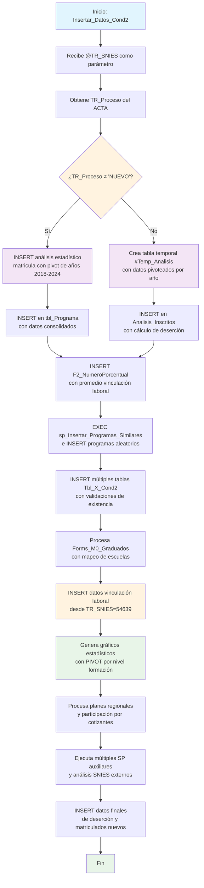

### Insertar_Datos_Cond2

Este procedimiento almacenado realiza una inserción masiva y compleja de datos para la Condición 2 del sistema de Registro Calificado. Ejecuta múltiples operaciones dependiendo del tipo de proceso (NUEVO vs otros), incluyendo análisis estadísticos de matrícula, inserción de datos de programas, cálculo de indicadores académicos, procesamiento de encuestas de graduados, generación de gráficos estadísticos, y análisis de vinculación laboral.

El procedimiento es altamente condicional y procesa datos de múltiples fuentes para generar un conjunto completo de información académica y estadística del programa.

#### Diagrama de flujo



#### Procedimiento almacenado

```sql
CREATE PROCEDURE [Dev].[Insertar_Datos_Cond2]
@TR_SNIES VARCHAR(255)
AS
BEGIN

-- Crear una tabla temporal para pivotar los datos

DECLARE @TR_PROCESO_ACTA VARCHAR(50);

-- Obtener el valor del TR_Proceso
SELECT TOP 1 @TR_PROCESO_ACTA = TR_Proceso
FROM RCAL.ACTA
WHERE TR_SNIES = @TR_SNIES;

-- Verificar si el proceso es distinto de 'NUEVO'
IF @TR_PROCESO_ACTA <> 'NUEVO'
BEGIN
INSERT INTO [RCAL].[F2_AnalisisEstaMatri] (
TR_SNIES,
INSTITUCION,
Denominacion,
JSON_Response,
Inscritos_2018, Inscritos_2019, Inscritos_2020, Inscritos_2021, Inscritos_2022, Inscritos_2023, Inscritos_2024,
Admitidos_2018, Admitidos_2019, Admitidos_2020, Admitidos_2021, Admitidos_2022, Admitidos_2023, Admitidos_2024,
Matriculados_2018, Matriculados_2019, Matriculados_2020, Matriculados_2021, Matriculados_2022, Matriculados_2023, Matriculados_2024,
Graduados_2018, Graduados_2019, Graduados_2020, Graduados_2021, Graduados_2022, Graduados_2023, Graduados_2024
)
SELECT \*
FROM (
SELECT DISTINCT
a.SNIES AS TR_SNIES,
'Corporacion Unificada Nacional de Educacion Superior CUN' AS INSTITUCION,
COALESCE(b.NOMBRE_DEL_PROGRAMA, '-') AS Denominacion,
'-' AS JSON_Response,

    -- INSCRITOS
    SUM(CASE WHEN ANIO = 2018 THEN INSCRITOS ELSE 0 END) AS Inscritos_2018,
    SUM(CASE WHEN ANIO = 2019 THEN INSCRITOS ELSE 0 END) AS Inscritos_2019,
    SUM(CASE WHEN ANIO = 2020 THEN INSCRITOS ELSE 0 END) AS Inscritos_2020,
    SUM(CASE WHEN ANIO = 2021 THEN INSCRITOS ELSE 0 END) AS Inscritos_2021,
    SUM(CASE WHEN ANIO = 2022 THEN INSCRITOS ELSE 0 END) AS Inscritos_2022,
    SUM(CASE WHEN ANIO = 2023 THEN INSCRITOS ELSE 0 END) AS Inscritos_2023,
    SUM(CASE WHEN ANIO = 2024 THEN INSCRITOS ELSE 0 END) AS Inscritos_2024,

    -- ADMITIDOS
    SUM(CASE WHEN ANIO = 2018 THEN ADMITIDOS ELSE 0 END) AS Admitidos_2018,
    SUM(CASE WHEN ANIO = 2019 THEN ADMITIDOS ELSE 0 END) AS Admitidos_2019,
    SUM(CASE WHEN ANIO = 2020 THEN ADMITIDOS ELSE 0 END) AS Admitidos_2020,
    SUM(CASE WHEN ANIO = 2021 THEN ADMITIDOS ELSE 0 END) AS Admitidos_2021,
    SUM(CASE WHEN ANIO = 2022 THEN ADMITIDOS ELSE 0 END) AS Admitidos_2022,
    SUM(CASE WHEN ANIO = 2023 THEN ADMITIDOS ELSE 0 END) AS Admitidos_2023,
    SUM(CASE WHEN ANIO = 2024 THEN ADMITIDOS ELSE 0 END) AS Admitidos_2024,

    -- MATRICULADOS
    SUM(CASE WHEN ANIO = 2018 THEN MATRICULADOS ELSE 0 END) AS Matriculados_2018,
    SUM(CASE WHEN ANIO = 2019 THEN MATRICULADOS ELSE 0 END) AS Matriculados_2019,
    SUM(CASE WHEN ANIO = 2020 THEN MATRICULADOS ELSE 0 END) AS Matriculados_2020,
    SUM(CASE WHEN ANIO = 2021 THEN MATRICULADOS ELSE 0 END) AS Matriculados_2021,
    SUM(CASE WHEN ANIO = 2022 THEN MATRICULADOS ELSE 0 END) AS Matriculados_2022,
    SUM(CASE WHEN ANIO = 2023 THEN MATRICULADOS ELSE 0 END) AS Matriculados_2023,
    SUM(CASE WHEN ANIO = 2024 THEN MATRICULADOS ELSE 0 END) AS Matriculados_2024,

    -- GRADUADOS
    SUM(CASE WHEN ANIO = 2018 THEN GRADUADOS ELSE 0 END) AS Graduados_2018,
    SUM(CASE WHEN ANIO = 2019 THEN GRADUADOS ELSE 0 END) AS Graduados_2019,
    SUM(CASE WHEN ANIO = 2020 THEN GRADUADOS ELSE 0 END) AS Graduados_2020,
    SUM(CASE WHEN ANIO = 2021 THEN GRADUADOS ELSE 0 END) AS Graduados_2021,
    SUM(CASE WHEN ANIO = 2022 THEN GRADUADOS ELSE 0 END) AS Graduados_2022,
    SUM(CASE WHEN ANIO = 2023 THEN GRADUADOS ELSE 0 END) AS Graduados_2023,
    SUM(CASE WHEN ANIO = 2024 THEN GRADUADOS ELSE 0 END) AS Graduados_2024

FROM AUTOEVALUACION.stg.P1_Admision_matricula a
LEFT JOIN Dev.MallasLauraUnificada b ON a.SNIES = b.CODIGO_SNIES
GROUP BY a.SNIES, b.NOMBRE_DEL_PROGRAMA
) AS source
WHERE NOT EXISTS (
SELECT 1 FROM [RCAL].[F2_AnalisisEstaMatri] target
WHERE
source.TR_SNIES = target.TR_SNIES AND
source.INSTITUCION = target.INSTITUCION AND
source.Denominacion = target.Denominacion AND
source.JSON_Response = target.JSON_Response AND

    -- INSCRITOS
    source.Inscritos_2018 = target.Inscritos_2018 AND
    source.Inscritos_2019 = target.Inscritos_2019 AND
    source.Inscritos_2020 = target.Inscritos_2020 AND
    source.Inscritos_2021 = target.Inscritos_2021 AND
    source.Inscritos_2022 = target.Inscritos_2022 AND
    source.Inscritos_2023 = target.Inscritos_2023 AND
    source.Inscritos_2024 = target.Inscritos_2024 AND

    -- ADMITIDOS
    source.Admitidos_2018 = target.Admitidos_2018 AND
    source.Admitidos_2019 = target.Admitidos_2019 AND
    source.Admitidos_2020 = target.Admitidos_2020 AND
    source.Admitidos_2021 = target.Admitidos_2021 AND
    source.Admitidos_2022 = target.Admitidos_2022 AND
    source.Admitidos_2023 = target.Admitidos_2023 AND
    source.Admitidos_2024 = target.Admitidos_2024 AND

    -- MATRICULADOS
    source.Matriculados_2018 = target.Matriculados_2018 AND
    source.Matriculados_2019 = target.Matriculados_2019 AND
    source.Matriculados_2020 = target.Matriculados_2020 AND
    source.Matriculados_2021 = target.Matriculados_2021 AND
    source.Matriculados_2022 = target.Matriculados_2022 AND
    source.Matriculados_2023 = target.Matriculados_2023 AND
    source.Matriculados_2024 = target.Matriculados_2024 AND

    -- GRADUADOS
    source.Graduados_2018 = target.Graduados_2018 AND
    source.Graduados_2019 = target.Graduados_2019 AND
    source.Graduados_2020 = target.Graduados_2020 AND
    source.Graduados_2021 = target.Graduados_2021 AND
    source.Graduados_2022 = target.Graduados_2022 AND
    source.Graduados_2023 = target.Graduados_2023 AND
    source.Graduados_2024 = target.Graduados_2024

);
END
ELSE
BEGIN
-- Crear la tabla temporal
SELECT
TR_SNIES,
'2018' AS AÑO,
Inscritos_2018 AS INSCRITOS,
Admitidos_2018 AS ADMITIDOS,
Matriculados_2018 AS MATRICULADOS,
Graduados_2018 AS GRADUADOS
INTO #Temp_Analisis
FROM RCAL.F2_AnalisisEstaMatri
WHERE TR_SNIES = @TR_SNIES;

    -- Insertar datos para los demás años
    INSERT INTO #Temp_Analisis
    SELECT TR_SNIES, '2019', Inscritos_2019, Admitidos_2019, Matriculados_2019, Graduados_2019
    FROM RCAL.F2_AnalisisEstaMatri
    WHERE TR_SNIES = @TR_SNIES;

    INSERT INTO #Temp_Analisis
    SELECT TR_SNIES, '2020', Inscritos_2020, Admitidos_2020, Matriculados_2020, Graduados_2020
    FROM RCAL.F2_AnalisisEstaMatri
    WHERE TR_SNIES = @TR_SNIES;

    INSERT INTO #Temp_Analisis
    SELECT TR_SNIES, '2021', Inscritos_2021, Admitidos_2021, Matriculados_2021, Graduados_2021
    FROM RCAL.F2_AnalisisEstaMatri
    WHERE TR_SNIES = @TR_SNIES;

    INSERT INTO #Temp_Analisis
    SELECT TR_SNIES, '2022', Inscritos_2022, Admitidos_2022, Matriculados_2022, Graduados_2022
    FROM RCAL.F2_AnalisisEstaMatri
    WHERE TR_SNIES = @TR_SNIES;

    INSERT INTO #Temp_Analisis
    SELECT TR_SNIES, '2023', Inscritos_2023, Admitidos_2023, Matriculados_2023, Graduados_2023
    FROM RCAL.F2_AnalisisEstaMatri
    WHERE TR_SNIES = @TR_SNIES;

    INSERT INTO #Temp_Analisis
    SELECT TR_SNIES, '2024', Inscritos_2024, Admitidos_2024, Matriculados_2024, Graduados_2024
    FROM RCAL.F2_AnalisisEstaMatri
    WHERE TR_SNIES = @TR_SNIES;

    -- Insertar datos en tabla destino, evitando duplicados
    INSERT INTO [Dev].[Analisis_Inscritos]
    SELECT
        TR_SNIES,
        AÑO,
        INSCRITOS,
        ADMITIDOS,
        MATRICULADOS,
        MATRICULADOS AS NUEVO_INGRESO,
        GRADUADOS,
        (INSCRITOS - MATRICULADOS) AS DESERTORES,
        CASE
            WHEN INSCRITOS > 0 THEN ROUND(((INSCRITOS - MATRICULADOS) * 100.0) / INSCRITOS, 2)
            ELSE NULL
        END AS PORCENTAJE_DESERCION
    FROM #Temp_Analisis T
    WHERE NOT EXISTS (
        SELECT 1
        FROM [Dev].[Analisis_Inscritos] A
        WHERE A.TR_SNIES = T.TR_SNIES
          AND A.AÑO = T.AÑO
    );

    DROP TABLE #Temp_Analisis;

END

PRINT 'Inicio de la inserción de datos en [RCAL].[tbl_Programa]';

INSERT INTO [REGISTRO_CALIFICADO].[RCAL].[tbl_Programa] (
[TR_SNIES]
, [TR_NombreProgramaPro]
, [TR_NombreProgramaTP]
, [TR_NombreProgramaTG]
, [TR_TituloPro]
, [TR_TipoRegistro]
, [TR_NombreProgramaProAnt]
, [TR_ModalidadAnt]
, [TR_NombreProgramaEsp]
, [TR_Ciudad]
, [TR_Regionales]
, [TR_CodUnidad]
, [TR_CodRegional]
, [TR_Modalidades]
, [TR_Modalidad]
, [TR_FechaAcuerdo_Mes]
, [TR_FechaAcuerdo_Dia]
, [TR_FechaAcuerdo_Año]
, [TR_NivelFormacion]
, [TR_Duracion]
, [TR_PeriodicidadAdminision]
, [TR_NumeroEstudiantes]
, [TR_AñoActual]
, [F_NumeroAcuerdo]
, [TR_NumeroAcuerdoAnterior]
, [F_SemestreIngreso]
, [F_AñoIngreso]
, [TR_NumeroProgramas]
, [TR_SectorEconomico]
, [TE_AreaFormacion]
)
SELECT DISTINCT
a.TR_SNIES AS TR_SNIES
, a.TR_NombreProgramaPro AS TR_NombreProgramaPro
, a.TR_NombreProgramaTP AS TR_NombreProgramaTP
, a.TR_NombreProgramaTG AS TR_NombreProgramaTG
, a.TR_TituloPro AS TR_TituloPro
, a.TR_TipoRegistro AS TR_TipoRegistro
, a.TR_NombreProgramaPro AS TR_NombreProgramaProAnt
, a.TR_Modalidad AS TR_ModalidadAnt
, a.TR_NombreProgramaEsp AS TR_NombreProgramaEsp
, a.TR_Regionales AS TR_Ciudad
, a.TR_Regionales AS TR_Regionales
, b.COD_UNIDAD AS TR_CodUnidad
, 1 AS TR_CodRegional
, a.TR_Modalidad AS TR_Modalidades
, a.TR_Modalidad AS TR_Modalidad
, MONTH(c.F_FechaAcuerdo) AS TR_FechaAcuerdo_Mes
, DAY(c.F_FechaAcuerdo) AS TR_FechaAcuerdo_Dia
, YEAR(c.F_FechaAcuerdo) AS TR_FechaAcuerdo_Año
, a.TR_Nivel AS TR_NivelFormacion
, a.TR_DuracionPro AS TR_Duracion
, a.TR_PeriocidadAdmision AS TR_PeriodicidadAdminision
, a.TR_EstudiantesPrimerSemestre AS TR_NumeroEstudiantes
, 2024 AS TR_AñoActual
, c.F_NumeroAcuerdo AS F_NumeroAcuerdo
, c.TR_NumAcuerdo_Anterior AS TR_NumeroAcuerdoAnterior
, 1 AS F_SemestreIngreso
, 2024 AS F_AñoIngreso
, 1 AS TR_NumeroProgramas
, 'productivo' AS TR_SectorEconomico
, a.TR_Escuela AS TE_AreaFormacion
FROM RCAL.Acta a
LEFT JOIN Dev.MallasLauraUnificada b ON a.TR_SNIES = b.CODIGO_SNIES
LEFT JOIN rcal.Acuerdo c ON a.TR_SNIES = c.TR_SNIES
WHERE a.TR_SNIES = @TR_SNIES
AND NOT EXISTS (
SELECT 1
FROM [REGISTRO_CALIFICADO].[RCAL].[tbl_Programa] p
WHERE p.TR_SNIES = a.TR_SNIES
AND p.F_NumeroAcuerdo = c.F_NumeroAcuerdo
AND p.TR_NombreProgramaPro = a.TR_NombreProgramaPro
);

PRINT 'Inicio de la inserción de datos en [RCAL].[tbl_Programa]';

PRINT 'Inicio de la inserción de datos en [RCAL].[F2_NumeroPorcentual]';

INSERT INTO RCAL.F2_NumeroPorcentual
SELECT
ISNULL(AVG(CAST(TOTAL AS INT)), 0) AS F2_NumeroPorcentual,
TR_SNIES
FROM
rcal.F2_VinculaciónLaboral
WHERE
TR_SNIES = @TR_SNIES
GROUP BY
TR_SNIES
HAVING NOT EXISTS (
SELECT 1
FROM RCAL.F2_NumeroPorcentual p
WHERE p.TR_SNIES = rcal.F2_VinculaciónLaboral.TR_SNIES
AND p.F2_NumeroPorcentual = ISNULL(AVG(CAST(TOTAL AS INT)), 0)
);

PRINT 'Inicio de la inserción de datos en [RCAL].[F2_NumeroPorcentual]';

PRINT 'Inicio de la inserción de datos en [RCAL].[F2_NumeroPorcentual]';

EXEC [RCAL].[sp_Insertar_Programas_Similares] @TR_SNIES;

WITH ProgramasConFila AS (
SELECT _,
ROW_NUMBER() OVER (PARTITION BY Institucion ORDER BY NEWID()) AS rn
FROM RCAL.Resultados_Programas_Filtrados
),
ProgramasAleatoriosPorInstitucion AS (
SELECT Institucion, Programa, Modalidad, Creditos, Periodos, Periodicidad, Municipio
FROM ProgramasConFila
WHERE rn = 1
)
-- Solo 10 instituciones diferentes
INSERT INTO RCAL.ProgramasAleatoriosPorInstitucion (Institucion, Programa, Modalidad, Creditos, Periodos, Periodicidad, Municipio)
SELECT TOP 10 _
FROM ProgramasAleatoriosPorInstitucion
ORDER BY NEWID();

PRINT 'Inicio de la inserción de datos en [RCAL].[F2_NumeroPorcentual]';

    -- Inicio de la inserción de datos en Tbl_5_Cond2
    PRINT 'Inicio de la inserción de datos en [RCAL].[Tbl_5_Cond2]';

    -- Verificar si ya existen datos en la tabla destino
    IF NOT EXISTS (
        SELECT 1
        FROM [REGISTRO_CALIFICADO].[RCAL].[Tbl_5_Cond2]
        WHERE TR_SNIES = @TR_SNIES
    )
    BEGIN

    INSERT INTO [REGISTRO_CALIFICADO].[RCAL].[Tbl_5_Cond2]
    ([TR_AñoActual], [Periodo], [Matriculados_total], [TR_SNIES])

SELECT
AÑO AS TR_AñoActual,
SUBSTRING(AÑO, CHARINDEX('-', AÑO) + 1, LEN(AÑO)) AS Periodo,
MATRICULADOS AS Matriculados_total,
tr_snies AS TR_SNIES
FROM
[Dev].[Analisis_Inscritos]
where tr_snies = @TR_SNIES;

    END
    ELSE
    BEGIN
        PRINT 'Los datos con el TR_SNIES proporcionado ya existen en la tabla destino.';
    END

    PRINT 'Fin de la inserción de datos en [RCAL].[Tbl_5_Cond2]';


    -- Inicio de la inserción de datos en Tbl_5_Cond2_ESP
    PRINT 'Inicio de la inserción de datos en [RCAL].[Tbl_5_Cond2_ESP]';


    -- Verificar si ya existen datos en la tabla destino
    IF NOT EXISTS (
        SELECT 1
        FROM [REGISTRO_CALIFICADO].[RCAL].[Tbl_5_Cond2_ESP]
        WHERE TR_SNIES = @TR_SNIES
    )
    BEGIN


    INSERT INTO [RCAL].[Tbl_5_Cond2_ESP] (
        [Vinculación_Laboral_de_Recien_Graduados], [Total], [TR_SNIES]
    )

SELECT Pregunta15Bloque5_R11 as Vinculación_Laboral_de_Recien_Graduados,
COUNT (Pregunta15Bloque5_R11) AS Total,
@TR_SNIES AS TR_SNIES
FROM [CUN_REPOSITORIO].[dbo].[Forms_M0_Graduados]
GROUP BY Pregunta15Bloque5_R11;

    END
    ELSE
    BEGIN
        PRINT 'Los datos con el TR_SNIES proporcionado ya existen en la tabla destino.';
    END

    PRINT 'Fin de la inserción de datos en [RCAL].[Tbl_5_Cond2_ESP]';


    -- Inicio de la inserción de datos en Tbl_6_Cond2

PRINT 'Inicio de la inserción de datos en [RCAL].[Tbl_6_Cond2]';

    -- Verificar si ya existen datos en la tabla destino
    IF NOT EXISTS (
        SELECT 1
        FROM [REGISTRO_CALIFICADO].[RCAL].[Tbl_6_Cond2]
        WHERE TR_SNIES = @TR_SNIES
    )
    BEGIN

INSERT INTO [REGISTRO_CALIFICADO].[RCAL].[Tbl_6_Cond2]
([TR_AñoActual]
,[Periodo]
,[Inscritos]
,[Admitidos]
,[Matriculados_Total]
,[TR_EstudiantesPrimerSemestre]
,[Graduados]
,[Retirados]
,[Tasa_de_desercion]
,[TR_SNIES])
SELECT YEAR(GETDATE()) AS TR_AñoActual
, AÑO AS Periodo
,[INSCRITOS] AS Inscritos
,[ADMITIDOS] AS Admitidos
,[MATRICULADOS] AS Matriculados_Total
,[NUEVO_INGRESO] AS TR_EstudiantesPrimerSemestre
,[GRADUADOS] AS Graduados
,[DESERTORES] AS Retirados
,[PORCENTAJE_DESERCION] AS Tasa_de_desercion
,[TR_SNIES]
FROM [REGISTRO_CALIFICADO].[Dev].[Analisis_Inscritos]
where TR_SNIES = @TR_SNIES;

    END
    ELSE
    BEGIN
        PRINT 'Los datos con el TR_SNIES proporcionado ya existen en la tabla destino.';
    END

    PRINT 'Fin de la inserción de datos en [RCAL].[Tbl_6_Cond2]';


    -- Inicio de la inserción de datos en Tbl6_Cond2_ESP

    drop table if exists #Forms_M0_Graduados;

SELECT a.\*,
CASE
WHEN ProgramaAcademicoAGraduar_DD2 = 'ADMINISTRACIÓN DE EMPRESAS AGROINDUSTRIALES' THEN 'Escuela de Transformación Empresarial'
WHEN ProgramaAcademicoAGraduar_DD2 = 'TRANSFORMACIÓN DIGITAL' THEN 'Escuela de Ingeniería'
WHEN ProgramaAcademicoAGraduar_DD2 = 'ESPECIALIZACION EN GERENCIA DE LA MARCA' THEN 'Escuela de Transformación Empresarial'
WHEN ProgramaAcademicoAGraduar_DD2 = 'ADMINISTRACIÓN DE SERVICIOS DE SALUD' THEN 'Escuela de Transformación Empresarial'
WHEN ProgramaAcademicoAGraduar_DD2 = 'DERECHO' THEN 'Escuela de ciencias Jurídicas y Gobierno'
WHEN ProgramaAcademicoAGraduar_DD2 = 'ESPECIALIZACION EN PAZ Y DESARROLLO TERRITORIAL' THEN 'Sistema Nacional de Biblioteca'
WHEN ProgramaAcademicoAGraduar_DD2 = 'ADMINISTRACIÓN DE LA SEGURIDAD SOCIAL' THEN 'Escuela de Transformación Empresarial'
WHEN ProgramaAcademicoAGraduar_DD2 = 'PAZ Y DESARROLLO TERITORIAL' THEN 'Escuela de ciencias Jurídicas y Gobierno'
WHEN ProgramaAcademicoAGraduar_DD2 = 'GESTIÓN DE TECNOLOGÍAS DE LA INFORMACIÓN' THEN 'Escuela de Ingeniería'
WHEN ProgramaAcademicoAGraduar_DD2 = 'DISEÑO DE MODAS' THEN 'Escuela de Diseño y Comunicación'
WHEN ProgramaAcademicoAGraduar_DD2 = 'ANALITICA DE DATOS' THEN 'Escuela de Ingeniería'
WHEN ProgramaAcademicoAGraduar_DD2 = 'INGENIERÍA INDUSTRIAL' THEN 'Escuela de Ingeniería'
WHEN ProgramaAcademicoAGraduar_DD2 = 'ADMINISTRACIÓN PÚBLICA' THEN 'Sistema Nacional de Biblioteca'
WHEN ProgramaAcademicoAGraduar_DD2 = 'ESPECIALIZACIÓN EN TRANSFORMACIÓN DIGITAL' THEN 'Escuela de Ingeniería'
WHEN ProgramaAcademicoAGraduar_DD2 = 'NEGOCIOS INTERNACIONALES' THEN 'Escuela de Transformación Empresarial'
WHEN ProgramaAcademicoAGraduar_DD2 = 'DISEÑO GRÁFICO' THEN 'Escuela de Diseño y Comunicación'
WHEN ProgramaAcademicoAGraduar_DD2 = 'PUBLICIDAD Y MERCADEO' THEN 'Escuela de Transformación Empresarial'
WHEN ProgramaAcademicoAGraduar_DD2 = 'CONTADURÍA PÚBLICA' THEN 'Escuela de Transformación Empresarial'
WHEN ProgramaAcademicoAGraduar_DD2 = 'COMUNICACIÓN SOCIAL' THEN 'Escuela de Diseño y Comunicación'
WHEN ProgramaAcademicoAGraduar_DD2 = 'INGENIERÍA ELECTRÓNICA' THEN 'Escuela de Ingeniería'
WHEN ProgramaAcademicoAGraduar_DD2 = 'ADMINISTRACIÓN DEPORTIVA' THEN 'Escuela de Transformación Empresarial'
WHEN ProgramaAcademicoAGraduar_DD2 = 'INGENIERÍA DE SISTEMAS' THEN 'Escuela de Ingeniería'
WHEN ProgramaAcademicoAGraduar_DD2 = 'ESPECIALIZACION EN ANALITICA DE DATOS' THEN 'Escuela de Ingeniería'
WHEN ProgramaAcademicoAGraduar_DD2 = 'ADMINISTRACIÓN DE EMPRESAS' THEN 'Escuela de Transformación Empresarial'
WHEN ProgramaAcademicoAGraduar_DD2 = 'ADMINISTRACIÓN TURÍSTICA Y HOTELERA' THEN 'Escuela de Transformación Empresarial'
WHEN ProgramaAcademicoAGraduar_DD2 = 'GERENCIA DE LA MARCA' THEN 'Escuela de Transformación Empresarial'
WHEN ProgramaAcademicoAGraduar_DD2 = 'DIRECCIÓN Y PRODUCCIÓN DE MEDIOS AUDIOVISUALES' THEN 'Escuela de Diseño y Comunicación'
ELSE 'Desconocido'
END AS ProgramaAcademicoAGraduar_DD2_h
INTO #Forms_M0_Graduados
FROM
[CUN_REPOSITORIO].[dbo].[Forms_M0_Graduados] a;

    insert INTO [REGISTRO_CALIFICADO].[RCAL].[VINCULACION_LABORAL]
    SELECT @TR_SNIES [TR_SNIES]
      ,[NIVEL]
      ,[AÑO]
      ,[CANTIDAD]

FROM [REGISTRO_CALIFICADO].[RCAL].[VINCULACION_LABORAL]
WHERE TR_SNIES='54639'

    insert INTO [REGISTRO_CALIFICADO].[RCAL].[VINCULACION_LABORAL_CUN]
    SELECT @TR_SNIES [TR_SNIES]
      ,[AÑO]
      ,[CANTIDAD]

FROM [REGISTRO_CALIFICADO].[RCAL].[VINCULACION_LABORAL_CUN]
WHERE TR_SNIES='54639'

    PRINT 'Inicio de la inserción de datos en [RCAL].[Tbl6_Cond2_ESP]';

    -- Verificar si ya existen datos en la tabla destino
    IF NOT EXISTS (
        SELECT 1
        FROM [REGISTRO_CALIFICADO].[RCAL].[Tbl6_Cond2_ESP]
        WHERE TR_SNIES = @TR_SNIES
    )
    BEGIN


    SELECT DISTINCT
    Pregunta18Bloque5_R14,
    NumIdentificacion_SL,
    ProgramaAcademicoAGraduar_DD2,
    CASE
        WHEN ProgramaAcademicoAGraduar_DD2 = 'GERENCIA DE LA MARCA' THEN 108460
        WHEN ProgramaAcademicoAGraduar_DD2 = 'ANALITICA DE DATOS' THEN 109601
        WHEN ProgramaAcademicoAGraduar_DD2 = 'PAZ Y DESARROLLO TERITORIAL' THEN 106040
        WHEN ProgramaAcademicoAGraduar_DD2 = 'CONTADURÍA PÚBLICA' THEN 0
        WHEN ProgramaAcademicoAGraduar_DD2 = 'TRANSFORMACIÓN DIGITAL' THEN 110990
        WHEN ProgramaAcademicoAGraduar_DD2 = 'ADMINISTRACIÓN DE EMPRESAS' THEN 0
        WHEN ProgramaAcademicoAGraduar_DD2 = 'PUBLICIDAD Y MERCADEO' THEN 0
        WHEN ProgramaAcademicoAGraduar_DD2 = 'INGENIERÍA DE SISTEMAS' THEN 0
        WHEN ProgramaAcademicoAGraduar_DD2 = 'ADMINISTRACIÓN PÚBLICA' THEN 0
        ELSE NULL
    END AS CODIGO_SNIES
    INTO #Forms_M0_Graduados_a

FROM #Forms_M0_Graduados
--WHERE NivelFormacion_R1 = 'Especialización'
-- AND Pregunta18Bloque5_R14 IS NOT NULL;

    INSERT INTO [REGISTRO_CALIFICADO].[RCAL].[Tbl6_Cond2_ESP]
    ([Rango_salarial], [2024], [2024%], [2023], [2023%], [2022], [2022%], [2021], [2021%], [2020], [2020%], [TR_SNIES])

SELECT
Pregunta18Bloque5_R14 AS 'Rango_salarial',
COUNT(DISTINCT NumIdentificacion_SL) AS '2024',
CONCAT(FORMAT((COUNT(DISTINCT NumIdentificacion_SL) \* 100.0) /
SUM(COUNT(DISTINCT NumIdentificacion_SL)) OVER (PARTITION BY ProgramaAcademicoAGraduar_DD2), 'N2'), '%') AS '2024%',
NULL AS '2023',  
 NULL AS '2023%',  
 NULL AS '2022',  
 NULL AS '2022%',  
 NULL AS '2021',  
 NULL AS '2021%',  
 NULL AS '2020',  
 NULL AS '2020%',  
 CODIGO_SNIES AS 'TR_SNIES' -- Reemplaza <TR_SNIES_value> con el valor correspondiente
FROM #Forms_M0_Graduados_a
where CODIGO_SNIES =@TR_SNIES
GROUP BY ProgramaAcademicoAGraduar_DD2, Pregunta18Bloque5_R14 , CODIGO_SNIES
ORDER BY ProgramaAcademicoAGraduar_DD2 DESC;

END
ELSE
BEGIN
PRINT 'Los datos con el TR_SNIES proporcionado ya existen en la tabla destino.';
END

    PRINT 'Fin de la inserción de datos en [RCAL].[Tbl6_Cond2_ESP]';


    PRINT 'Inicio de la inserción de datos en Crecimiento Docente TEC - PROF';

-- Eliminar la tabla temporal si existe
DROP TABLE IF EXISTS #temp

-- Crear la tabla temporal con los datos filtrados
SELECT
COALESCE(Pregunta18Bloque5_R14, 'Sin_Respuesta') AS Pregunta18Bloque5_R14,
NumIdentificacion_SL,
ProgramaAcademicoAGraduar_DD2,
NivelFormacion_R1
INTO #temp
FROM #Forms_M0_Graduados
WHERE ProgramaAcademicoAGraduar_DD2_h in (SELECT DISTINCT
CASE
WHEN TR_Escuela = 'Ingeniería' THEN 'Escuela de Ingeniería'
WHEN TR_Escuela = 'Diseño y Comunicación' THEN 'Escuela de Diseño y Comunicación'
WHEN TR_Escuela = 'Ciencias sociales, Jurídicas y Gobierno' THEN 'Escuela de Ciencias Jurídicas y Gobierno'
WHEN TR_Escuela = 'Transformación Empresarial' THEN 'Escuela de Transformación Empresarial'
ELSE TR_Escuela
END AS TR_Escuela
FROM
rcal.Acta
WHERE
TR_SNIES = @TR_SNIES)
AND NivelFormacion_R1 IN ('Técnico', 'Profesional');

-- CTE para el total de encuestas por categoría
WITH TotalEncuestas AS (
SELECT
Pregunta18Bloque5_R14,
SUM(#encuestas) AS Total
FROM (
SELECT
NivelFormacion_R1,
Pregunta18Bloque5_R14,
COUNT(DISTINCT NumIdentificacion_SL) AS #encuestas
FROM #temp
GROUP BY NivelFormacion_R1, Pregunta18Bloque5_R14
) AS Subconsulta
GROUP BY Pregunta18Bloque5_R14
)

-- Consulta principal con PIVOT para generar las columnas Profesional y Técnico
INSERT INTO [REGISTRO_CALIFICADO].[graf].[Cond2_Figura_4] (
Pregunta18Bloque5_R14,
Profesional,
Técnico,
TR_SNIES
)
SELECT
Pregunta18Bloque5_R14,
ISNULL([Profesional], 0) AS Profesional,
ISNULL([Técnico], 0) AS Técnico,
@TR_SNIES AS TR_SNIES -- Asegúrate de colocar el valor correcto si no es estático
FROM (
SELECT
E.Pregunta18Bloque5_R14,
E.NivelFormacion_R1,
CAST(ROUND((E.#encuestas \* 100.0) / T.Total, 2) AS DECIMAL(10, 2)) AS Participacion -- Asegurando 2 decimales
FROM (
SELECT
NivelFormacion_R1,
Pregunta18Bloque5_R14,
COUNT(DISTINCT NumIdentificacion_SL) AS #encuestas
FROM #temp
GROUP BY NivelFormacion_R1, Pregunta18Bloque5_R14
) AS E
INNER JOIN TotalEncuestas T
ON E.Pregunta18Bloque5_R14 = T.Pregunta18Bloque5_R14
) AS SourceTable
PIVOT (
MAX(Participacion)
FOR NivelFormacion_R1 IN ([Profesional], [Técnico])
) AS PivotTable
WHERE NOT EXISTS (
SELECT 1
FROM [REGISTRO_CALIFICADO].[graf].[Cond2_Figura_4] AS Existing
WHERE Existing.Pregunta18Bloque5_R14 = PivotTable.Pregunta18Bloque5_R14
AND Existing.TR_SNIES = @TR_SNIES
);

    PRINT 'Fin de la inserción de datos en Crecimiento Salarial Docente TEC - PROF';


    PRINT 'Inicio de la inserción de datos en Crecimiento Salarial Docente TG - PROF';

    DROP TABLE IF EXISTS #temp_a

-- Crear la tabla temporal con los datos filtrados
SELECT
COALESCE(Pregunta18Bloque5_R14, 'Sin_Respuesta') AS Pregunta18Bloque5_R14,
NumIdentificacion_SL,
ProgramaAcademicoAGraduar_DD2,
NivelFormacion_R1
INTO #temp_a
FROM #Forms_M0_Graduados
WHERE ProgramaAcademicoAGraduar_DD2_h in (SELECT DISTINCT
CASE
WHEN TR_Escuela = 'Ingeniería' THEN 'Escuela de Ingeniería'
WHEN TR_Escuela = 'Diseño y Comunicación' THEN 'Escuela de Diseño y Comunicación'
WHEN TR_Escuela = 'Ciencias sociales, Jurídicas y Gobierno' THEN 'Escuela de Ciencias Jurídicas y Gobierno'
WHEN TR_Escuela = 'Transformación Empresarial' THEN 'Escuela de Transformación Empresarial'
ELSE TR_Escuela
END AS TR_Escuela
FROM
rcal.Acta
WHERE
TR_SNIES = @TR_SNIES)
AND NivelFormacion_R1 IN ('Tecnólogo', 'Profesional');

-- CTE para el total de encuestas por categoría
WITH TotalEncuestas AS (
SELECT
Pregunta18Bloque5_R14,
SUM(#encuestas) AS Total
FROM (
SELECT
NivelFormacion_R1,
Pregunta18Bloque5_R14,
COUNT(DISTINCT NumIdentificacion_SL) AS #encuestas
FROM #temp_a
GROUP BY NivelFormacion_R1, Pregunta18Bloque5_R14
) AS Subconsulta
GROUP BY Pregunta18Bloque5_R14
)

-- Consulta principal con PIVOT para generar las columnas Profesional y Técnico

INSERT INTO [REGISTRO_CALIFICADO].[graf].[Cond2_Figura_5] (
Pregunta18Bloque5_R14,
Profesional,
Tecnólogo,
TR_SNIES
)
SELECT
Pregunta18Bloque5_R14,
CAST(ISNULL([Profesional], 0) AS DECIMAL(10, 2)) AS Profesional, -- Asegurando 2 decimales
CAST(ISNULL([Tecnólogo], 0) AS DECIMAL(10, 2)) AS Tecnólogo, -- Asegurando 2 decimales
@TR_SNIES AS TR_SNIES -- Asegúrate de colocar el valor correcto si no es estático
FROM (
SELECT
E.Pregunta18Bloque5_R14,
E.NivelFormacion_R1,
CAST(ROUND((E.#encuestas \* 100.0) / T.Total, 2) AS DECIMAL(10, 2)) AS Participacion -- Asegurando 2 decimales en Participacion
FROM (
SELECT
NivelFormacion_R1,
Pregunta18Bloque5_R14,
COUNT(DISTINCT NumIdentificacion_SL) AS #encuestas
FROM #temp_a
GROUP BY NivelFormacion_R1, Pregunta18Bloque5_R14
) AS E
INNER JOIN TotalEncuestas T
ON E.Pregunta18Bloque5_R14 = T.Pregunta18Bloque5_R14
) AS SourceTable
PIVOT (
MAX(Participacion)
FOR NivelFormacion_R1 IN ([Profesional], [Tecnólogo])
) AS PivotTable
WHERE NOT EXISTS (
SELECT 1
FROM [REGISTRO_CALIFICADO].[graf].[Cond2_Figura_5] AS Existing
WHERE Existing.Pregunta18Bloque5_R14 = PivotTable.Pregunta18Bloque5_R14
AND Existing.TR_SNIES = @TR_SNIES
);

    PRINT 'Fin de la inserción de datos en Crecimiento Salarial Docente TG - PROF';

    PRINT 'Inicio de la Contratacion de Profesores';


    -- Actualizacion Planes Regionales

    -- Elimina las tablas temporales si existen

DROP TABLE IF EXISTS #TemporalRegionales;
DROP TABLE IF EXISTS #TempRegionalesFinal;
DROP TABLE IF EXISTS #base_final;

-- Crea e inserta en tabla temporal con orden consecutivo basado en TR_Regional (orden alfabético)
;WITH RegionalesSeparados AS (
SELECT
TR_SNIES,
LTRIM(RTRIM(value)) AS TR_Regional
FROM RCAL.ACTA
CROSS APPLY STRING_SPLIT(TR_Regionales, ',')
WHERE TR_SNIES = @TR_SNIES
),
RegionalesLimpios AS (
SELECT
TR_SNIES,
ROW_NUMBER() OVER (ORDER BY TR_Regional) AS Numero,
TR_Regional
FROM RegionalesSeparados
WHERE TR_Regional <> ''
),
BaseFinal AS (
SELECT
r.TR_SNIES,
r.Numero,
r.TR_Regional,
p.PLAN_DEPARTAMENTAL
FROM RegionalesLimpios r
INNER JOIN RCAL.PLAN_DEPARTAMENTAL p
ON r.TR_Regional = p.TR_SNIES
)

-- Crear tabla temporal con orden
SELECT
ROW_NUMBER() OVER (ORDER BY TR_Regional) AS orden,
TR_SNIES,
Numero,
TR_Regional,
PLAN_DEPARTAMENTAL
INTO #base_final
FROM BaseFinal;

-- Ver el contenido de la tabla temporal con orden
INSERT INTO RCAL.REGIONALES_PLANES
SELECT orden, TR_SNIES, Numero, TR_Regional, PLAN_DEPARTAMENTAL
FROM #base_final
ORDER BY orden;

-- Define las escuelas en una CTE para evitar repetir lógica
WITH Escuelas AS (
SELECT DISTINCT
CASE
WHEN TR_Escuela = 'Ingeniería' THEN 'Escuela de Ingeniería'
WHEN TR_Escuela = 'Diseño y Comunicación' THEN 'Escuela de Diseño y Comunicación'
WHEN TR_Escuela = 'Ciencias sociales, Jurídicas y Gobierno' THEN 'Escuela de Ciencias Jurídicas y Gobierno'
WHEN TR_Escuela = 'Transformación Empresarial' THEN 'Escuela de Transformación Empresarial'
ELSE TR_Escuela
END AS TR_Escuela
FROM rcal.Acta
WHERE TR_SNIES = @TR_SNIES
),
GraduadosFiltrados AS (
SELECT DISTINCT NumIdentificacion_SL
FROM #Forms_M0_Graduados
WHERE ProgramaAcademicoAGraduar_DD2_h IN (SELECT TR_Escuela FROM Escuelas)
),
ParticipacionPorCotizante AS (
SELECT
CAST((COUNT(DISTINCT NumIdentificacion_SL) _ 1.0 /
(SELECT COUNT(DISTINCT NumIdentificacion_SL) FROM GraduadosFiltrados) _ 100)
AS DECIMAL(10, 2)) AS Participacion,
CASE
WHEN Pregunta16Bloque5_R12 = 'Trabaja' THEN 'Cotizante'
ELSE 'No_Cotizante'
END AS Cotizante
FROM #Forms_M0_Graduados
WHERE ProgramaAcademicoAGraduar_DD2_h IN (SELECT TR_Escuela FROM Escuelas)
GROUP BY
CASE
WHEN Pregunta16Bloque5_R12 = 'Trabaja' THEN 'Cotizante'
ELSE 'No_Cotizante'
END
)
-- Inserción final con validación de existencia
INSERT INTO [REGISTRO_CALIFICADO].[graf].[Cond2_Figura_3] (Participacion, Cotizante, TR_SNIES)
SELECT
pc.Participacion,
pc.Cotizante,
@TR_SNIES AS TR_SNIES
FROM ParticipacionPorCotizante pc
WHERE NOT EXISTS (
SELECT 1
FROM [REGISTRO_CALIFICADO].[graf].[Cond2_Figura_3] AS Existing
WHERE Existing.Cotizante = pc.Cotizante
AND Existing.TR_SNIES = @TR_SNIES
AND Existing.Participacion = pc.Participacion
);

    PRINT 'Fin de la Contratacion de Profesores';

     PRINT 'Inicio Rango Salaria ESP';

    INSERT INTO RCAL.Tbl6_Cond2_ESP

SELECT [Rango_salarial]

      ,[2024]
      ,[2024%]
      ,[2023]
      ,[2023%]
      ,[2022]
      ,[2022%]
      ,[2021]
      ,[2021%]
      ,[2020]
      ,[2020%]
      ,@TR_SNIES as [TR_SNIES]

FROM [REGISTRO_CALIFICADO].[RCAL].[F2_RangoSalarial]
WHERE TR_SNIES = '54639' AND Rango_salarial IS NOT NULL

---

DECLARE @sql NVARCHAR(MAX);
DECLARE @cols NVARCHAR(MAX);
DECLARE @programa_academico VARCHAR (500) = ( SELECT CASE TR_Ciclo
WHEN 'ESPECIALIZACIÓN' THEN TR_NombreProgramaEsp
WHEN 'POSGRADO' THEN TR_NombreProgramaEsp
WHEN 'PROFESIONAL' THEN TR_NombreProgramaPro
WHEN 'TÉCNICO PROFESIONAL' THEN TR_NombreProgramaTP
WHEN 'TECNÓLOGO' THEN TR_NombreProgramaTG
ELSE NULL
END AS NombrePrograma
FROM RCAL.ACTA
WHERE TR_SNIES = @TR_SNIES)

-- Limpieza por si existen previamente
IF OBJECT_ID('tempdb..#Inscritos') IS NOT NULL DROP TABLE #Inscritos;
IF OBJECT_ID('tempdb..#Admitidos') IS NOT NULL DROP TABLE #Admitidos;
IF OBJECT_ID('tempdb..#Matriculados') IS NOT NULL DROP TABLE #Matriculados;
IF OBJECT_ID('tempdb..#Graduados') IS NOT NULL DROP TABLE #Graduados;
IF OBJECT_ID('tempdb..#Resumen_SNIES') IS NOT NULL DROP TABLE #Resumen_SNIES;

-- 1. Inscritos
SELECT
[institucion_educacion_superior],
[programa_academico],
[anio],
SUM([inscritos]) AS inscritos
INTO #Inscritos
FROM [REGISTRO_CALIFICADO].[RCAL].[Datos_SNIES_2023]
WHERE [inscritos] IS NOT NULL
AND [institucion_educacion_superior] IS NOT NULL
AND programa_academico <> '0'
GROUP BY [institucion_educacion_superior], [programa_academico], [anio];

-- 2. Admitidos
SELECT
[institucion_educacion_superior],
[programa_academico],
[anio],
SUM([admitidos]) AS admitidos
INTO #Admitidos
FROM [REGISTRO_CALIFICADO].[RCAL].[Datos_SNIES_2023]
WHERE [admitidos] IS NOT NULL
AND [institucion_educacion_superior] IS NOT NULL
AND programa_academico <> '0'
GROUP BY [institucion_educacion_superior], [programa_academico], [anio];

-- 3. Matriculados
SELECT
[institucion_educacion_superior],
[programa_academico],
[anio],
SUM([matriculados]) AS matriculados
INTO #Matriculados
FROM [REGISTRO_CALIFICADO].[RCAL].[Datos_SNIES_2023]
WHERE [matriculados] IS NOT NULL
AND [institucion_educacion_superior] IS NOT NULL
AND programa_academico <> '0'
GROUP BY [institucion_educacion_superior], [programa_academico], [anio];

-- 4. Graduados
SELECT
[institucion_educacion_superior],
[programa_academico],
[anio],
SUM([graduados]) AS graduados
INTO #Graduados
FROM [REGISTRO_CALIFICADO].[RCAL].[Datos_SNIES_2023]
WHERE [graduados] IS NOT NULL
AND [institucion_educacion_superior] IS NOT NULL
AND programa_academico <> '0'
GROUP BY [institucion_educacion_superior], [programa_academico], [anio];

-- 5. Consolidado final
SELECT
COALESCE(i.institucion_educacion_superior, a.institucion_educacion_superior, m.institucion_educacion_superior, g.institucion_educacion_superior) AS institucion_educacion_superior,
COALESCE(i.programa_academico, a.programa_academico, m.programa_academico, g.programa_academico) AS programa_academico,
COALESCE(i.anio, a.anio, m.anio, g.anio) AS anio,
i.inscritos,
a.admitidos,
m.matriculados,
g.graduados
INTO #Resumen_SNIES
FROM #Inscritos i
FULL OUTER JOIN #Admitidos a
ON i.institucion_educacion_superior = a.institucion_educacion_superior
AND i.programa_academico = a.programa_academico
AND i.anio = a.anio
FULL OUTER JOIN #Matriculados m
ON COALESCE(i.institucion_educacion_superior, a.institucion_educacion_superior) = m.institucion_educacion_superior
AND COALESCE(i.programa_academico, a.programa_academico) = m.programa_academico
AND COALESCE(i.anio, a.anio) = m.anio
FULL OUTER JOIN #Graduados g
ON COALESCE(i.institucion_educacion_superior, a.institucion_educacion_superior, m.institucion_educacion_superior) = g.institucion_educacion_superior
AND COALESCE(i.programa_academico, a.programa_academico, m.programa_academico) = g.programa_academico
AND COALESCE(i.anio, a.anio, m.anio) = g.anio;

-- Resultado final temporal
--SELECT \* FROM #Resumen_SNIES WHERE programa_academico = @programa_academico;

-- Construye columnas dinámicas como: inscritos*2019, admitidos_2019, etc.
-- 1. Armar las columnas dinámicas
SELECT @cols = STRING_AGG(QUOTENAME(kpi_anio), ', ')
FROM (
SELECT DISTINCT
kpi_anio = kpi + '*' + CAST(anio AS NVARCHAR)
FROM (
SELECT 'inscritos' AS kpi, anio FROM #Resumen*SNIES WHERE programa_academico = @programa_academico AND inscritos IS NOT NULL
UNION
SELECT 'admitidos', anio FROM #Resumen_SNIES WHERE programa_academico = @programa_academico AND admitidos IS NOT NULL
UNION
SELECT 'matriculados', anio FROM #Resumen_SNIES WHERE programa_academico = @programa_academico AND matriculados IS NOT NULL
UNION
SELECT 'graduados', anio FROM #Resumen_SNIES WHERE programa_academico = @programa_academico AND graduados IS NOT NULL
) AS datos
) AS campos;
-- 2. Construir y ejecutar el SQL dinámico
SET @sql = '
SELECT
institucion_educacion_superior,
programa_academico,
' + @cols + '
FROM (
SELECT
institucion_educacion_superior,
programa_academico,
kpi + ''*'' + CAST(anio AS NVARCHAR) AS columna,
valor
FROM (
SELECT institucion_educacion_superior, programa_academico, anio, ''inscritos'' AS kpi, inscritos AS valor FROM #Resumen_SNIES
UNION ALL
SELECT institucion_educacion_superior, programa_academico, anio, ''admitidos'', admitidos FROM #Resumen_SNIES
UNION ALL
SELECT institucion_educacion_superior, programa_academico, anio, ''matriculados'', matriculados FROM #Resumen_SNIES
UNION ALL
SELECT institucion_educacion_superior, programa_academico, anio, ''graduados'', graduados FROM #Resumen_SNIES
) AS datos
WHERE programa_academico = @programa_academico
) AS fuente
PIVOT (
MAX(valor)
FOR columna IN (' + @cols + ')
) AS p;';

-- Ejecutar
EXEC sp_executesql @sql, N'@programa_academico NVARCHAR(200)', @programa_academico;

---

PRINT 'Fin Rango Salaria ESP';

PRINT 'Inicio Salarios Rango Salaria ESP';
insert into [REGISTRO_CALIFICADO].[RCAL].[F2_Salarios]
SELECT [F2_Salarios]
,@tr_snies
FROM [REGISTRO_CALIFICADO].[RCAL].[F2_Salarios]
where tr_snies = '54639'
PRINT 'Fin Salarios Rango Salaria ESP';

insert into [REGISTRO_CALIFICADO].[RCAL].[F2_AnalisisReferentes]
SELECT @tr_snies as [TR_SNIES]
,[F2_AnalisisReferentes]
FROM [REGISTRO_CALIFICADO].[RCAL].[F2_AnalisisReferentes]
where TR_SNIES='54639'

insert into [REGISTRO_CALIFICADO].[RCAL].[F2_AnalisisTendCompInt]
SELECT @tr_snies as [TR_SNIES]
,[F2_AnalisisTendCompInt]
FROM [REGISTRO_CALIFICADO].[RCAL].[F2_AnalisisTendCompInt]
where TR_SNIES='54639'

INSERT INTO [REGISTRO_CALIFICADO].[RCAL].[ANALISIS_MATRICULADOS]
SELECT @TR_SNIES AS [TR_SNIES]
,[ANALISIS_MATRICULADOS]
FROM [REGISTRO_CALIFICADO].[RCAL].[ANALISIS_MATRICULADOS]
where TR_SNIES='54639'

    exec  RCAL.sp_Generar_Resumen_Programas @tr_snies

    --INSERT INTO [REGISTRO_CALIFICADO].[RCAL].[ANALISIS_GRADUADOS]
    --SELECT TOP (1000) [TR_SNIES]

-- ,[ANALISIS_GRADUADOS]
-- FROM [REGISTRO_CALIFICADO].[RCAL].[ANALISIS_GRADUADOS]
-- where TR_SNIES ='54639'

EXEC RCAL.sp_Generar_Informe_SPADIES_TDA

------------------------------INSERCION ESTADISTICAS M------------------------------------
EXEC [RCAL].[sp_Insertar_EstadisticasCondicion2Ma_Ins_ad_gra] @tr_snies

insert into RCAL.DESERCION
SELECT
@TR_SNIES AS TR_SNIES,
[IES],
FORMAT([2017] _ 100, 'N2') + '%' AS [2017%],
FORMAT([2018] _ 100, 'N2') + '%' AS [2018%],
FORMAT([2019] _ 100, 'N2') + '%' AS [2019%],
FORMAT([2020] _ 100, 'N2') + '%' AS [2020%],
FORMAT([2021] _ 100, 'N2') + '%' AS [2021%],
FORMAT([2022] _ 100, 'N2') + '%' AS [2022%]
FROM [REGISTRO_CALIFICADO].[RCAL].[Resultados_SPADIES_TDA]

-- INGRESO NUEVOS

INSERT INTO rcal.MATRICULADOS_NUEVOS (
TR_SNIES,
PERIODO,
MATRICULADOS_NUEVOS,
TOTAL_ESTUDIANTES
)
SELECT
a.SNIES AS TR_SNIES,
a.AÑO AS PERIODO,
a.[NUEVO INGRESO] AS MATRICULADOS_NUEVOS,
a.MATRICULADOS AS TOTAL_ESTUDIANTES
FROM AUTOEVALUACION.stg.P1_Admision_matricula a
WHERE NOT EXISTS (
SELECT 1
FROM rcal.MATRICULADOS_NUEVOS r
WHERE
r.TR_SNIES = a.SNIES AND
r.PERIODO = a.AÑO AND
r.MATRICULADOS_NUEVOS = a.[NUEVO INGRESO] AND
r.TOTAL_ESTUDIANTES = a.MATRICULADOS
);

IF EXISTS (
SELECT 1
FROM rcal.acta
WHERE TR_SNIES = @TR_SNIES AND TR_Proceso <> 'nuevo'
)
BEGIN
INSERT INTO rcal.Tbl_6_Cond2 (
TR_AñoActual, Periodo, Inscritos, Admitidos, Matriculados_Total,
TR_EstudiantesPrimerSemestre, Graduados, Retirados, Tasa_de_desercion, TR_SNIES
)
SELECT DISTINCT  
 a.ANIO, a.AÑO, a.INSCRITOS, a.ADMITIDOS, a.MATRICULADOS,
a.[NUEVO INGRESO], a.GRADUADOS, a.DESERTORES, a.Porcentaje_desercion_CUN, a.SNIES
FROM AUTOEVALUACION.stg.P1_Admision_matricula a
WHERE a.SNIES = @TR_SNIES
AND NOT EXISTS (
SELECT 1
FROM rcal.Tbl_6_Cond2 b
WHERE b.TR_AñoActual = a.ANIO
AND b.Periodo = a.AÑO
AND b.Inscritos = a.INSCRITOS
AND b.Admitidos = a.ADMITIDOS
AND b.Matriculados_Total = a.MATRICULADOS
AND b.TR_EstudiantesPrimerSemestre = a.[NUEVO INGRESO]
AND b.Graduados = a.GRADUADOS
AND b.Retirados = a.DESERTORES
AND b.Tasa_de_desercion = a.Porcentaje_desercion_CUN
AND b.TR_SNIES = a.SNIES
);
END
ELSE
BEGIN
PRINT 'El TR_SNIES tiene un proceso igual a "nuevo", por lo tanto no se insertarán datos.';
END

END;

```
#### Operaciones Principales por Sección
1. Análisis Estadístico de Matrícula:

- Proceso ≠ NUEVO: Pivot de datos 2018-2024 (Inscritos, Admitidos, Matriculados, Graduados)
- Proceso = NUEVO: Transformación a formato vertical con cálculo de deserción

2. Datos Básicos del Programa:

- INSERT en tbl_Programa con JOIN de Acta, MallasLauraUnificada, Acuerdo
- Cálculo de indicadores académicos y administrativos

3. Procesamiento de Graduados:

- Mapeo de programas académicos a escuelas
- Análisis de vinculación laboral por rangos salariales
- Generación de estadísticas por nivel de formación

4. Gráficos Estadísticos:

- Cond2_Figura_4: Participación Técnico-Profesional
- Cond2_Figura_5: Participación Tecnólogo-Profesional
- Cond2_Figura_3: Participación por cotizantes

5. Análisis SNIES Externo:

- Consolidación de datos nacionales por programa académico
- Construcción dinámica de columnas por KPI y año
- Comparación con indicadores nacionales

#### Tablas afectadas

##### Principales:

-F2_AnalisisEstaMatri: Estadísticas de matrícula
-tbl_Programa: Datos básicos del programa
-Analisis_Inscritos: Análisis de inscripciones
-Tbl_5_Cond2, Tbl_6_Cond2: Condiciones específicas
-F2_NumeroPorcentual: Indicadores porcentuales

##### Gráficos:

-graf.Cond2_Figura_3/4/5: Visualizaciones estadísticas

##### Auxiliares:

-VINCULACION_LABORAL, DESERCION, MATRICULADOS_NUEVOS
-F2_Salarios, F2_AnalisisReferentes, ANALISIS_MATRICULADOS


#### Procedimientos Almacenados Anidados

- [RCAL].[sp_Insertar_Programas_Similares]
- RCAL.sp_Generar_Resumen_Programas
- RCAL.sp_Generar_Informe_SPADIES_TDA
- [RCAL].[sp_Insertar_EstadisticasCondicion2Ma_Ins_ad_gra]