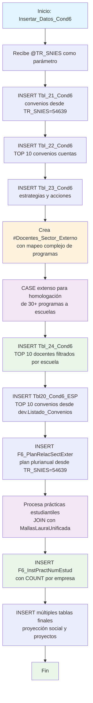

### Insertar_Datos_Cond6

Este procedimiento almacenado gestiona la inserción de datos de relación con el sector externo para la Condición 6 del sistema de Registro Calificado. Se enfoca en convenios institucionales, docentes del sector externo, planes de relación sectorial, escenarios de práctica estudiantil y proyectos de proyección social. Incluye mapeo complejo de programas académicos a escuelas y procesamiento de datos de convenios con validaciones de existencia.

El procedimiento utiliza múltiples fuentes de datos externos y realiza transformaciones específicas para homologar información de diferentes sistemas institucionales.

#### Diagrama de flujo



#### Procedimiento almacenado

```sql
|Insertar_Datos_Cond6|-- ========================================================================
-- Nombre del Procedimiento: [Dev].[Insertar_Datos_Cond6]
-- Descripción:
-- Este procedimiento almacenado inserta datos en una tabla de destino
-- específica, utilizando un identificador único proporcionado como parámetro.
-- Primero verifica si el identificador ya existe en la tabla; si no,
-- inserta los datos provenientes de las tablas relacionadas. Si el
-- identificador ya existe, evita la duplicación e informa sobre ello.
--
--
-- Ejemplo de ejecución:
-- -- Insertar datos para un programa con TR_SNIES = '52606'
-- EXEC [Dev].[Insertar_Datos_Cond6] @TR_SNIES = '52606';
-- ========================================================================

CREATE PROCEDURE [Dev].[Insertar_Datos_Cond6]
@TR_SNIES VARCHAR(255)
AS
BEGIN

    -- DECLARE @TR_SNIES VARCHAR(255) = '52606';

    -- Inicio de la inserción de datos en Tbl_21_Cond6
    PRINT 'Inicio de la inserción de datos en [RCAL].[Tbl_21_Cond6]';

    -- Verificar si ya existen datos en la tabla destino
    IF NOT EXISTS (
        SELECT 1
        FROM [REGISTRO_CALIFICADO].[RCAL].[Tbl_21_Cond6]
        WHERE TR_SNIES = @TR_SNIES
    )
    BEGIN

-- INSERT INTO [REGISTRO_CALIFICADO].[RCAL].[Tbl_21_Cond6]
-- ([Codigo_Convenio],
-- [Nombre_Entidad_se_tiene_convenio],
-- [Regional],
-- [Fecha_Inicio_Convenio],
-- [Fecha_fin_Convenio],
-- [Prorroga_Automática_Regional],
-- [TR_SNIES])
--SELECT
-- Código AS Codigo_Convenio,
-- Razón_Social_Aliado AS Nombre_Entidad_se_tiene_convenio,
-- Ciudad_de_Notificación AS REGIONAL,
-- Inicio_de_Vigencia AS Fecha_Inicio_Convenio,
-- Fin_de_Vigencia AS Fecha_fin_Convenio,
-- 'SI' AS Prorroga_Automática_Regional,
-- @TR_SNIES AS TR_SNIES
--FROM
-- CUN_REPOSITORIO.EMORENO.convenios

INSERT INTO [REGISTRO_CALIFICADO].[RCAL].[Tbl_21_Cond6]
SELECT DISTINCT [Codigo_Convenio]
,[Nombre_Entidad_se_tiene_convenio]
,[Regional]
,[Fecha_Inicio_Convenio]
,[Fecha_fin_Convenio]
,'SI' as [Prorroga_Automática_Regional]
,@TR_SNIES AS TR_SNIES
FROM [REGISTRO_CALIFICADO].[RCAL].[Tbl_21_Cond6]
WHERE TR_SNIES = '54639'

    END
    ELSE
    BEGIN
        PRINT 'Los datos con el TR_SNIES proporcionado ya existen en la tabla destino.';
    END

    PRINT 'Fin de la inserción de datos en [RCAL].[Tbl_21_Cond6]';

    -- Inicio de la inserción de datos en Tbl_22_Cond6

    PRINT 'Inicio de la inserción de datos en [RCAL].[Tbl_22_Cond6]';

    -- Verificar si ya existen datos en la tabla destino
    IF NOT EXISTS (
        SELECT 1
        FROM [REGISTRO_CALIFICADO].[RCAL].[Tbl_22_Cond6]
        WHERE TR_SNIES = @TR_SNIES
    )
    BEGIN

-- INSERT INTO [REGISTRO_CALIFICADO].[RCAL].[Tbl_22_Cond6]
-- ([Codigo],
-- [Nombre_o_Razon_Social_Aliado],
-- [Inicio_Vigencia_Regional],
-- [Fin_Vigencia_Regional],
-- [Prorroga_Automatica_Regional],
-- [TR_SNIES])
--SELECT
-- Código AS Codigo,
-- Razón_Social_Aliado AS Nombre_o_Razon_Social_Aliado,
-- Inicio_de_Vigencia AS Inicio_Vigencia_Regional,
-- Fin_de_Vigencia AS Fin_Vigencia_Regional,
-- 'SI' AS Prorroga_Automatica_Regional,
-- @TR_SNIES AS TR_SNIES
--FROM
-- CUN_REPOSITORIO.EMORENO.convenios_cuentas;

    INSERT INTO [REGISTRO_CALIFICADO].[RCAL].[Tbl_22_Cond6]
    SELECT DISTINCT TOP 10  [Codigo]
    	  ,[Nombre_o_Razon_Social_Aliado]
    	  ,[Inicio_Vigencia_Regional]
    	  ,[Fin_Vigencia_Regional]
    	  ,[Prorroga_Automatica_Regional]
    	  ,@TR_SNIES AS TR_SNIES
      FROM [REGISTRO_CALIFICADO].[RCAL].[Tbl_22_Cond6]
      where TR_SNIES = '54639'


    END
    ELSE
    BEGIN
        PRINT 'Los datos con el TR_SNIES proporcionado ya existen en la tabla destino.';
    END

    PRINT 'Fin de la inserción de datos en [RCAL].[Tbl_22_Cond6]';

    -- Inicio de la inserción de datos en Tbl_23_Cond6
    PRINT 'Inicio de la inserción de datos en [REGISTRO_CALIFICADO].[RCAL].[Tbl_23_Cond6]';

    	INSERT INTO [REGISTRO_CALIFICADO].[RCAL].[Tbl_23_Cond6]
    SELECT  [Estrategias]
    	  ,[Acciones]
    	  ,@TR_SNIES AS [TR_SNIES]
      FROM [REGISTRO_CALIFICADO].[RCAL].[Tbl_23_Cond6]
      WHERE TR_SNIES ='54639'

    PRINT 'Fin de la inserción de datos en [REGISTRO_CALIFICADO].[RCAL].[Tbl_23_Cond6]';

    -- Inicio de la inserción de datos en Tbl_24_Cond6
    PRINT 'Inicio de la inserción de datos en [REGISTRO_CALIFICADO].[RCAL].[Tbl_24_Cond6]';

    	DROP TABLE IF EXISTS #Docentes_Sector_Externo

SELECT a.\*,
CASE
WHEN PROGRAMA = 'ADMINISTRACIÓN DE EMPRESAS' THEN 'Escuela de Transformación Empresarial'
WHEN PROGRAMA = 'ADMINISTRACION DE EMPRESAS' THEN 'Escuela de Transformación Empresarial'
WHEN PROGRAMA = 'ADMINISTRACION DE EMPRESAS AGROINDUSTRIALES' THEN 'Escuela de Transformación Empresarial'
WHEN PROGRAMA = 'ADMINISTRACION DE LA SEGURIDAD SOCIAL' THEN 'Escuela de Transformación Empresarial'
WHEN PROGRAMA = 'ADMINISTRACION DE SERVICIOS DE SALUD' THEN 'Escuela de Transformación Empresarial'
WHEN PROGRAMA = 'ADMINISTRACION DEPORTIVA' THEN 'Escuela de Transformación Empresarial'
WHEN PROGRAMA = 'ADMINISTRACION EN SERVICIOS DE SALUD' THEN 'Escuela de Transformación Empresarial'
WHEN PROGRAMA = 'ADMINISTRACION PUBLICA' THEN 'Sistema Nacional de Biblioteca'
WHEN PROGRAMA = 'ADMÓN TURÍSTICA Y HOTELERA' THEN 'Escuela de Transformación Empresarial'
WHEN PROGRAMA = 'ADMÓN TURÍSTICA Y HOTELERA' THEN 'Escuela de Transformación Empresarial'
WHEN PROGRAMA = 'CIENCIAS BASICAS' THEN 'Escuela de Transformación Empresarial'
WHEN PROGRAMA = 'COMUNICACIÓN SOCIAL' THEN 'Escuela de Diseño y Comunicación'
WHEN PROGRAMA = 'CONTADURIA PUBLICA' THEN 'Escuela de Transformación Empresarial'
WHEN PROGRAMA = 'CONTADURIA PÚBLICA' THEN 'Escuela de Transformación Empresarial'
WHEN PROGRAMA = 'CONTADURÍA PÚBLICA' THEN 'Escuela de Transformación Empresarial'
WHEN PROGRAMA = 'DERECHO' THEN 'Escuela de ciencias Jurídicas y Gobierno'
WHEN PROGRAMA = 'DIRECCIÓN Y PRODUCCIÓN DE MEDIOS AUDIOVISUALES' THEN 'Escuela de Diseño y Comunicación'
WHEN PROGRAMA = 'DISEÑO DE MODAS' THEN 'Escuela de Diseño y Comunicación'
WHEN PROGRAMA = 'DISEÑO GRAFICO' THEN 'Escuela de Diseño y Comunicación'
WHEN PROGRAMA = 'EMPRENDIMIENTO' THEN 'Escuela de Transformación Empresarial'
WHEN PROGRAMA = 'ESPECIALIZACIÓN EN PAZ Y DESARROLLO TERRITORIAL' THEN 'Sistema Nacional de Biblioteca'
WHEN PROGRAMA = 'FORMACION INVESTIGATIVA' THEN 'Escuela de Transformación Empresarial'
WHEN PROGRAMA = 'IDIOMAS' THEN 'Escuela de Transformación Empresarial'
WHEN PROGRAMA = 'INGENIERIA DE SISTEMAS' THEN 'Escuela de Ingeniería'
WHEN PROGRAMA = 'INGENIERÍA DE SISTEMAS' THEN 'Escuela de Ingeniería'
WHEN PROGRAMA = 'INGENIERIA ELECTRONICA' THEN 'Escuela de Ingeniería'
WHEN PROGRAMA = 'NEGOCIOS INTERNACIONALES' THEN 'Escuela de Transformación Empresarial'
WHEN PROGRAMA = 'NEGOCIOS INTERNACIONALES' THEN 'Escuela de Transformación Empresarial'
WHEN PROGRAMA = 'NEGOCIOS INTERNACIONALES' THEN 'Escuela de Transformación Empresarial'
WHEN PROGRAMA = 'PUBLICIDAD Y MERCADEO' THEN 'Escuela de Transformación Empresarial'
WHEN PROGRAMA = 'NEGOCIOS INTERNACIONALES' THEN 'Escuela de Transformación Empresarial'
ELSE 'No especificado'
END AS Homologacion
INTO #Docentes_Sector_Externo
FROM [CUN_REPOSITORIO].dbo.Docentes_Sector_Externo a;

INSERT INTO RCAL.Tbl_24_Cond6
SELECT distinct top 10 NOMBRE AS Nombre, [NIVEL DE FORMACION] AS Formación , 'TIEMPO_COMPLETO' AS Vinculación ,
8 AS Asignación_Horaria ,
@TR_SNIES AS TR_SNIES
FROM #Docentes_Sector_Externo
WHERE Homologacion = (SELECT DISTINCT
CASE
WHEN TR_Escuela = 'Ingeniería' THEN 'Escuela de Ingeniería'
WHEN TR_Escuela = 'Diseño y Comunicación' THEN 'Escuela de Diseño y Comunicación'
WHEN TR_Escuela = 'Ciencias sociales, Jurídicas y Gobierno' THEN 'Escuela de Ciencias Jurídicas y Gobierno'
WHEN TR_Escuela = 'Transformación Empresarial' THEN 'Escuela de Transformación Empresarial'
ELSE TR_Escuela
END AS TR_Escuela
FROM
rcal.Acta
WHERE
TR_SNIES = @TR_SNIES
)

    PRINT 'Fin de la inserción de datos en [REGISTRO_CALIFICADO].[RCAL].[Tbl_24_Cond6]';

    -- Inicio de la inserción de datos en Tbl20_Cond6_ESP
    PRINT 'Inicio de la inserción de datos en [RCAL].[Tbl20_Cond6_ESP]';

    -- Verificar si ya existen datos en la tabla destino

    IF NOT EXISTS (
        SELECT 1
        FROM [REGISTRO_CALIFICADO].[RCAL].[Tbl20_Cond6_ESP]
        WHERE TR_SNIES = @TR_SNIES
    )
    BEGIN

INSERT INTO [REGISTRO_CALIFICADO].[RCAL].[Tbl20_Cond6_ESP]
select DISTINCT TOP 10 Vigencia_del_convenio_Fecha_de_inicio_Fecha_Finalizacion as vigencia_convenio ,
Número_del_convenio as Numero_Convenio,
Objeto_del_convenio as Objeto_del_convenio ,
@TR_SNIES AS TR_SNIES
from dev.Listado_Convenios

    END
    ELSE
    BEGIN
        PRINT 'Los datos con el TR_SNIES proporcionado ya existen en la tabla destino.';
    END

    PRINT 'Fin de la inserción de datos en [RCAL].[Tbl20_Cond6_ESP]';


    PRINT 'Fin de la inserción de datos en [RCAL].[F6_PlanRelacSectExter]';


    INSERT INTO [REGISTRO_CALIFICADO].[RCAL].[F6_PlanRelacSectExter]
    SELECT DISTINCT  top 10  [Eje],
    [Objetivo],
    [Actividad],
    [Resultados_esperados],
    [Año_1],
    [Año_2],
    [Año_3],
    [Año_4],
    [Año_5],
    [Año_6],
    [Año_7],
    [Responsable_de_la_actividad],
    [Recursos_requeridos],
    [Presupuesto],
    @TR_SNIES   as [TR_SNIES]
    FROM [REGISTRO_CALIFICADO].[RCAL].[F6_PlanRelacSectExter]
    where TR_SNIES = '54639'

    PRINT 'Fin de la inserción de datos en [RCAL].[F6_PlanRelacSectExter]';

    PRINT 'Inicio de la inserción de datos en [RCAL].[F6_InstPractNumEstud]';

    		INSERT INTO [REGISTRO_CALIFICADO].[RCAL].[F6_InstPractNumEstud]
    		([TR_SNIES], [NOMBRE_DE_LA_INSTITUCIÓN_DE_ESCENARIO_DE_PRÁCTICA], [NÚMERO_DE_ESTUDIANTES_EN_PRÁCTICA])
    	SELECT @TR_SNIES AS TR_SNIES,
    		   a.Nombre_Empresa AS NOMBRE_DE_LA_INSTITUCIÓN_DE_ESCENARIO_DE_PRÁCTICA,
    		   COUNT(DISTINCT a.documento) AS NÚMERO_DE_ESTUDIANTES_EN_PRÁCTICA
    	FROM [REGISTRO_CALIFICADO].[Dev].[NumEstuPracticas] a
    	JOIN [Dev].[MallasLauraUnificada] b
    		ON a.Pensum = b.PENSUM
    	WHERE a.Nombre_Empresa IS NOT NULL
    		AND b.CODIGO_SNIES = @TR_SNIES
    	GROUP BY a.Nombre_Empresa, b.CODIGO_SNIES, a.Programa;


    PRINT 'Fin de la inserción de datos en [RCAL].[F6_InstPractNumEstud]';


    PRINT 'Inicio de la inserción de datos en [RCAL].[Tbl_29_Cond6]';

    INSERT INTO [REGISTRO_CALIFICADO].[RCAL].[Tbl_29_Cond6]

SELECT [Eje]
,[Objetivo]
,[Actividad]
,[Resultados_esperados]
,[Año_1]
,[Año_2]
,[Año_3]
,[Año_4]
,[Año_5]
,[Año_6]
,[Año_7]
,[Responsable_de_la_actividad]
,[Recursos_requeridos]
,[Presupuesto]
,@TR_SNIES AS [TR_SNIES]
FROM [REGISTRO_CALIFICADO].[RCAL].[Tbl_29_Cond6]
WHERE TR_SNIES ='54639'

PRINT 'Inicio de la inserción de datos en [RCAL].[Tbl_29_Cond6]';

PRINT 'Inicio de la inserción de datos en [RCAL].[F6_ConvenioRegional]';

INSERT INTO [REGISTRO_CALIFICADO].[RCAL].[F6_ConvenioRegional]
SELECT @TR_SNIES
,[F6_ConvenioRegional]
FROM [REGISTRO_CALIFICADO].[RCAL].[F6_ConvenioRegional]
WHERE TR_SNIES ='54639'

PRINT 'Inicio de la inserción de datos en [RCAL].[F6_ConvenioRegional]';

INSERT INTO [REGISTRO_CALIFICADO].[RCAL].[RESULTADOS_PROYECCION_SOCIAL]
SELECT @TR_SNIES AS [TR_SNIES]
,[ITEM]
,[AÑO_1]
,[AÑO_2]
,[AÑO_3]
,[AÑO_4]
,[AÑO_5]
,[AÑO_6]
FROM [REGISTRO_CALIFICADO].[RCAL].[RESULTADOS_PROYECCION_SOCIAL]
WHERE TR_SNIES = '54639'

insert into [REGISTRO_CALIFICADO].[RCAL].[PROYECTOS_ACTIVIDADES]
SELECT

@TR_SNIES as [TR_SNIES]
,[ITEM]
,[AÑO]
,[NOMBRE_PROYECTO]
,[PROYECTO_ACTIVIDAD]
,[OBJETO]
,[AREA_TEMATICA]
,[POBLACION_BENEFICIADA]
FROM [REGISTRO_CALIFICADO].[RCAL].[PROYECTOS_ACTIVIDADES]
where TR_SNIES='54639'

END;

```
#### Operaciones Principales por Sección
1. Convenios Institucionales:

- Tbl_21_Cond6: Convenios con fechas de vigencia y prórroga automática
- Tbl_22_Cond6: TOP 10 convenios de cuentas con códigos y razones sociales
- Tbl_23_Cond6: Estrategias y acciones institucionales

2. Docentes del Sector Externo (Proceso Complejo):
```sql 
-- Mapeo extenso de 30+ programas académicos a 4 escuelas principales:
CASE 
  WHEN PROGRAMA = 'ADMINISTRACIÓN DE EMPRESAS' THEN 'Escuela de Transformación Empresarial'
  WHEN PROGRAMA = 'COMUNICACIÓN SOCIAL' THEN 'Escuela de Diseño y Comunicación'
  WHEN PROGRAMA = 'DERECHO' THEN 'Escuela de ciencias Jurídicas y Gobierno'
  WHEN PROGRAMA = 'INGENIERÍA DE SISTEMAS' THEN 'Escuela de Ingeniería'
  ...
END AS Homologacion
```
3. Escenarios de Práctica Estudiantil:

- F6_InstPractNumEstud: Instituciones de práctica con COUNT de estudiantes
- JOIN entre NumEstuPracticas y MallasLauraUnificada por PENSUM
- Agrupación por empresa y programa académico

4. Planes y Proyección Social:

- F6_PlanRelacSectExter: Plan plurianual (7 años) con ejes, objetivos y presupuestos
- Tbl_29_Cond6: Estructura idéntica al plan de relación sectorial
- RESULTADOS_PROYECCION_SOCIAL: Resultados por 6 años
- PROYECTOS_ACTIVIDADES: Proyectos con población beneficiada

#### Tablas afectadas

##### Convenios y Relaciones:

- Tbl_21_Cond6: Convenios institucionales básicos
- Tbl_22_Cond6: Convenios de cuentas especializados
- Tbl20_Cond6_ESP: Convenios especiales desde listado externo
-F6_ConvenioRegional: Convenios regionales

##### Docentes y Personal:

- Tbl_24_Cond6: Docentes del sector externo filtrados por escuela

##### Planificación:

- F6_PlanRelacSectExter: Plan de relación sectorial plurianual
- Tbl_29_Cond6: Planificación duplicada (misma estructura)
- Tbl_23_Cond6: Estrategias y acciones institucionales

##### Prácticas y Proyección:

- F6_InstPractNumEstud: Instituciones de práctica con conteos
- RESULTADOS_PROYECCION_SOCIAL: Resultados anuales de proyección
- PROYECTOS_ACTIVIDADES: Proyectos específicos con beneficiarios

##### Temporal:

- #Docentes_Sector_Externo: Procesamiento con homologación