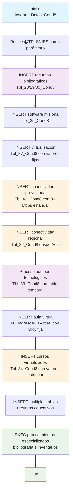

### Insertar_Datos_Cond8

Este procedimiento almacenado gestiona la inserción de datos de recursos educativos y tecnológicos para la Condición 8 del sistema de Registro Calificado. Se enfoca en recursos bibliográficos (libros físicos y digitales), bases de datos, software misional, conectividad de red, equipos tecnológicos, virtualización de cursos y capacitaciones de usuarios. Incluye valores fijos para proyecciones tecnológicas y ejecuta procedimientos especializados para inventarios bibliográficos.

El procedimiento combina datos de plantillas existentes con información específica del programa, aplicando estándares institucionales para conectividad y recursos tecnológicos.

#### Diagrama de flujo



#### Procedimiento almacenado

```sql

-- EXEC [Dev].[Insertar_Datos_Cond8] @TR_SNIES = '202400120';
CREATE PROCEDURE [Dev].[Insertar_Datos_Cond8]
@TR_SNIES VARCHAR(255)
AS
BEGIN

    -- DECLARE @SNIES VARCHAR(255) = '52606';

        -- Inicio de la inserción de datos en Tbl_28_Cond8
    PRINT 'Inicio de la inserción de datos en [REGISTRO_CALIFICADO].[RCAL].[Tbl_28_Cond8]';

    	   INSERT INTO [REGISTRO_CALIFICADO].[RCAL].[Tbl_28_Cond8]
    	SELECT [Libro]
    		  ,[Base_de_datos]
    		  ,@TR_SNIES AS [TR_SNIES]
    	  FROM [REGISTRO_CALIFICADO].[RCAL].[Tbl_28_Cond8]
    	  WHERE TR_SNIES ='54639'


    PRINT 'Fin de la inserción de datos en [REGISTRO_CALIFICADO].[RCAL].[Tbl_28_Cond8]';

        -- Inicio de la inserción de datos en Tbl_29_Cond8
    PRINT 'Inicio de la inserción de datos en [REGISTRO_CALIFICADO].[RCAL].[Tbl_29_Cond8]';

    	INSERT INTO [REGISTRO_CALIFICADO].[RCAL].[Tbl_29_Cond8]
    	SELECT [Libro]
    		  ,Libros_electronicos
    		  ,@TR_SNIES AS [TR_SNIES]
    	  FROM [REGISTRO_CALIFICADO].[RCAL].[Tbl_29_Cond8]
    	  WHERE TR_SNIES ='54639'

    PRINT 'Fin de la inserción de datos en [REGISTRO_CALIFICADO].[RCAL].[Tbl_29_Cond8]';

       -- Inicio de la inserción de datos en Tbl_30_Cond8
    PRINT 'Inicio de la inserción de datos en [REGISTRO_CALIFICADO].[RCAL].[Tbl_30_Cond8]';

    INSERT INTO [REGISTRO_CALIFICADO].[RCAL].[Tbl_30_Cond8]
    	SELECT [Libro]
    		  ,Herramientas_bibliograficas
    		  ,@TR_SNIES AS [TR_SNIES]
    	  FROM [REGISTRO_CALIFICADO].[RCAL].[Tbl_30_Cond8]
    	  WHERE TR_SNIES ='54639'

    PRINT 'Fin de la inserción de datos en [REGISTRO_CALIFICADO].[RCAL].[Tbl_30_Cond8]';

    -- Inicio de la inserción de datos en Tbl_31_Cond8
    PRINT 'Inicio de la inserción de datos en [RCAL].[Tbl_31_Cond8]';

     --Verificar si ya existen datos en la tabla destino

-- IF NOT EXISTS (
-- SELECT 1
-- FROM [REGISTRO_CALIFICADO].[RCAL].[Tbl_31_Cond8]
-- WHERE TR_SNIES = @TR_SNIES
-- )
-- BEGIN

    	--INSERT INTO [REGISTRO_CALIFICADO].[RCAL].[Tbl_31_Cond8]
    	--SELECT distinct  [Item]
    	--	  ,[Titulo]
    	--	  ,[Autor]
    	--	  ,[Año]
    	--	  ,--[SigTopografica]
    	--	  [Formato]
    	--	  ,@TR_SNIES AS [TR_SNIES]
    	--  FROM [REGISTRO_CALIFICADO].[RCAL].[Tbl_31_Cond8]
    	--  WHERE TR_SNIES = '54639'

    --   INSERT INTO [RCAL].[Tbl_31_Cond8] (

-- [Item], [Titulo], [Autor], [Año], [SigTopografica], [Formato], [TR_SNIES]
-- )
-- SELECT DISTINCT
-- a.ITEM AS [Item],
-- a.TITULO AS [Titulo],
-- a.AUTOR AS [Autor],
-- a.AÑO AS [Año],
-- [SIGNATURA TOPOGRÁFICA] AS [SigTopografica],
-- a.FORMATO AS [Formato],
-- @TR_SNIES AS [TR_SNIES]
-- FROM [CUN_REPOSITORIO].SRUBIO.libros_fisicos a
--JOIN [CUN_REPOSITORIO].[dbo].[Programas_Vigentes] b
-- ON b.NOMBRE_PROGRAMA = a.PROGRAMA AND b.SEDE = a.SEDE
--JOIN [REGISTRO_CALIFICADO].[Dev].[MallasLauraUnificada] c
-- ON CAST(b.SNIES AS VARCHAR(50)) = c.CODIGO_SNIES
-- WHERE c.ESTADO = 'VIGENTE'
--and c.CODIGO_SNIES = @TR_SNIES
--UNION ALL
--SELECT DISTINCT
-- '' AS [Item],
-- a.TITULO AS [Titulo],
-- a.AUTOR AS [Autor],
-- [AÑO PUBLICACION] AS [Año],
-- 'Virtuales' AS [SigTopografica],
-- a.FORMATO AS [Formato],
-- @TR_SNIES AS [TR_SNIES]
-- FROM [CUN_REPOSITORIO].SRUBIO.libros_virtuales a
-- JOIN [CUN_REPOSITORIO].SRUBIO.libros_fisicos b
-- ON a.TITULO = b.TITULO
-- JOIN [CUN_REPOSITORIO].[dbo].[Programas_Vigentes] c
-- ON c.NOMBRE_PROGRAMA = b.PROGRAMA AND c.SEDE = b.SEDE
-- JOIN [REGISTRO_CALIFICADO].[Dev].[MallasLauraUnificada] d
-- ON CAST(c.SNIES AS VARCHAR(50)) = d.CODIGO_SNIES
-- LEFT JOIN [REGISTRO_CALIFICADO].[RCAL].[Acta] e
-- ON d.CODIGO_SNIES = e.TR_SNIES
-- WHERE d.ESTADO = 'VIGENTE'
--and d.CODIGO_SNIES = @TR_SNIES;

    ----END

---- ELSE
---- BEGIN
-- PRINT 'Los datos con el TR_SNIES proporcionado ya existen en la tabla destino.';
-- END

-- PRINT 'Fin de la inserción de datos en [RCAL].[Tbl_31_Cond8]'
-- Inicio de la inserción de datos en Tbl_35_Cond8
PRINT 'Inicio de la inserción de datos en [REGISTRO_CALIFICADO].[RCAL].[Tbl_35_Cond8]';

    INSERT INTO [REGISTRO_CALIFICADO].[RCAL].[Tbl_35_Cond8]

SELECT [SOFTWARE_MISIONAL]
,[AÑO]
,[VERSION_O_ACTUALIZACION]
,@TR_SNIES AS [TR_SNIES]
FROM [REGISTRO_CALIFICADO].[RCAL].[Tbl_35_Cond8]
where TR_SNIES ='54639'

    PRINT 'Fin de la inserción de datos en [REGISTRO_CALIFICADO].[RCAL].[Tbl_35_Cond8]';

    -- Inicio de la inserción de datos en Tbl_37_Cond8
    PRINT 'Inicio de la inserción de datos en [REGISTRO_CALIFICADO].[RCAL].[Tbl_37_Cond8]';

    -- Verificar si ya existen datos en la tabla destino
    IF NOT EXISTS (
        SELECT 1
        FROM [REGISTRO_CALIFICADO].[RCAL].[Tbl_37_Cond8]
        WHERE TR_SNIES = @TR_SNIES
    )
    BEGIN


    INSERT INTO [RCAL].[Tbl_37_Cond8] (
        [Asignatura], [Virtualizado], [Mes 1], [Mes 2], [Mes 3], [Mes 4], [Mes 5], [Mes 6], [Semestre], [TR_SNIES]
    )
    SELECT DISTINCT
        1 AS [Asignatura],
        1 AS [Virtualizado],
        1 AS [Mes 1],
    	1 AS [Mes 2],
    	1 AS [Mes 3],
    	1 AS [Mes 4],
    	1 AS [Mes 5],
    	1 AS [Mes 6],
    	1 AS [Semestre],
        @TR_SNIES AS [TR_SNIES]
    FROM [Dev].[MallasLauraUnificada] b
    WHERE b.ESTADO = 'VIGENTE'

    END
    ELSE
    BEGIN
        PRINT 'Los datos con el TR_SNIES proporcionado ya existen en la tabla destino.';
    END

    PRINT 'Fin de la inserción de datos en [REGISTRO_CALIFICADO].[RCAL].[Tbl_37_Cond8]';

    	-- Inicio de la inserción de datos en Tbl_42_Cond8
    PRINT 'Inicio de la inserción de datos en [REGISTRO_CALIFICADO].[RCAL].[Tbl_42_Cond8]';

-- DECLARE @tr_snies VARCHAR(50) = '20241120'; -- Asegúrate de especificar el tamaño adecuado de la variable

INSERT INTO [REGISTRO_CALIFICADO].[RCAL].[Tbl_42_Cond8]
(
[Periodo], [2024A], [2024B], [2025A], [2025B], [2026A], [2026B],
[2027A], [2027B], [2028A], [2028B], [2029A], [2029B], [2030A],
[2030B], [TR_SNIES] -- Aquí debes usar el nombre de la columna como en la tabla
)
VALUES
(
'Ancho de Banda', '30 Mbps', '30 Mbps', '30 Mbps', '30 Mbps',
'30 Mbps', '30 Mbps', '30 Mbps', '30 Mbps', '30 Mbps', '30 Mbps',
'30 Mbps', '30 Mbps', '30 Mbps', '30 Mbps', @tr_snies -- Aquí pasas la variable directamente
);

    PRINT 'Fin de la inserción de datos en [REGISTRO_CALIFICADO].[RCAL].[Tbl_42_Cond8]';

     PRINT 'Inicio de la inserción de datos en [REGISTRO_CALIFICADO].[RCAL].[Tbl_32_Cond8]';

    IF NOT EXISTS (
        SELECT 1
        FROM [REGISTRO_CALIFICADO].[RCAL].[Tbl_32_Cond8]
        WHERE TR_SNIES = @TR_SNIES
    )
    BEGIN


    	 insert into [REGISTRO_CALIFICADO].[RCAL].[Tbl_32_Cond8]

SELECT
[TR_Regionales] as tr_nombre_regional,
[TR_Regionales] as TR_NomSede
,'30 Mbps' as [2023]
,'30 Mbps' as [2024]
,'30 Mbps' as[2025]
,'30 Mbps' as[2026]
,'30 Mbps' as[2027]
,'30 Mbps' as[2028]
,'30 Mbps' as[2029]
,[TR_SNIES]
FROM [REGISTRO_CALIFICADO].rcal.Acta
where TR_SNIES =@TR_SNIES

    END
    ELSE
    BEGIN
        PRINT 'Los datos con el TR_SNIES proporcionado ya existen en la tabla destino.';
    END

PRINT 'Fin de la inserción de datos en [REGISTRO_CALIFICADO].[RCAL].[Tbl_32_Cond8]';

PRINT 'Fin de la inserción de datos en [REGISTRO_CALIFICADO].[RCAL].[Tbl_33_Cond8]';

    		drop table if exists #Tbl_33_Cond8

    		select
    		@tr_snies as TR_SNIES ,
    		Cantidad ,
    		Tipo_De_Equipo
    		into #Tbl_33_Cond8
    		from rcal.Tbl_33_Cond8
    		where TR_SNIES = '54639'

    		insert into  rcal.Tbl_33_Cond8
    		select distinct  b.TR_Regionales as TR_NomSede ,
    		a.TR_SNIES,
    		B.TR_Regionales AS TR_NombreRegional
    		,a.Cantidad
    		,a.Tipo_De_Equipo  from #Tbl_33_Cond8 a
    		left join rcal.Acta b
    		on a.TR_SNIES = b.TR_SNIES

PRINT 'Fin de la inserción de datos en [REGISTRO_CALIFICADO].[RCAL].[Tbl_33_Cond8]';

    PRINT 'Fin de la inserción de datos en [REGISTRO_CALIFICADO].[RCAL].[F8_IngresoAulaVirtual]';

INSERT INTO [REGISTRO_CALIFICADO].[RCAL].[F8_IngresoAulaVirtual]
SELECT
@TR_SNIES AS TR_SNIES,
'https://www.youtube.com/watch?v=njwYjlilD2s'
FROM
[REGISTRO_CALIFICADO].[RCAL].[F8_IngresoAulaVirtual]
where TR_SNIES ='54639';

PRINT 'Fin de la inserción de datos en [REGISTRO_CALIFICADO].[RCAL].[F8_IngresoAulaVirtual]';

PRINT 'Inicio de la inserción de datos en [REGISTRO_CALIFICADO].[RCAL].[Tbl_34_Cond8]';

--DROP TABLE IF EXISTS #CURSOS ;
--drop table if exists #Virtualizados ;
--DROP TABLE IF EXISTS #shortname;

----DECLARE @TR_SNIES VARCHAR(255) = '108486'

--SELECT \*
-- into #cursos
-- FROM openquery (MOODLE, '
-- SELECT
--mc.id,
--mc.fullname,
--mc.shortname,
--to_timestamp(mc.startdate) AS fecha_inicio_curso,
--to_timestamp(mc.enddate) AS fecha_fin_curso
--FROM
--mdlgio_course mc; ');

--WITH CTE AS
-- (
-- SELECT
-- t.id,
-- s1.value AS cod1,
-- s2.value AS cod2,
-- s3.value AS periodo,
-- s4.value AS bloque,
-- s5.value AS unidad,
-- s6.value AS materia
-- FROM
-- #Cursos t
-- CROSS APPLY
-- (SELECT value, ROW_NUMBER() OVER (ORDER BY (SELECT NULL)) AS rn FROM STRING_SPLIT(t.shortname, '/')) s1
-- CROSS APPLY
-- (SELECT value, ROW_NUMBER() OVER (ORDER BY (SELECT NULL)) AS rn FROM STRING_SPLIT(t.shortname, '/')) s2
-- CROSS APPLY
-- (SELECT value, ROW_NUMBER() OVER (ORDER BY (SELECT NULL)) AS rn FROM STRING_SPLIT(t.shortname, '/')) s3
-- CROSS APPLY
-- (SELECT value, ROW_NUMBER() OVER (ORDER BY (SELECT NULL)) AS rn FROM STRING_SPLIT(t.shortname, '/')) s4
-- CROSS APPLY
-- (SELECT value, ROW_NUMBER() OVER (ORDER BY (SELECT NULL)) AS rn FROM STRING_SPLIT(t.shortname, '/')) s5
-- CROSS APPLY
-- (SELECT value, ROW_NUMBER() OVER (ORDER BY (SELECT NULL)) AS rn FROM STRING_SPLIT(t.shortname, '/')) s6
-- WHERE
-- s1.rn = 1 AND s2.rn = 2 AND s3.rn = 3 AND s4.rn = 4 AND s5.rn = 5 AND s6.rn = 6
-- )
-- SELECT \*
-- into #shortname
-- FROM CTE --WHERE periodo LIKE '%[0-9][0-9]V[0-9][0-9]%'

--SELECT DISTINCT  
-- a.bloque,
-- a.cod1,
-- a.cod2,
-- a.materia,
-- a.periodo,
-- a.unidad,
-- b.NOMBRE_PROGRAMA,
-- @TR_SNIES as SNIES,
-- CASE
-- WHEN a.cod2 LIKE '5%' THEN 'Virtualizados'
-- ELSE 'Total_Cursos'
-- END AS Tipo_Curso
--INTO #Virtualizados
--FROM
-- #shortname a
--LEFT JOIN
-- [CUN_REPOSITORIO].[CUN].[MALLASCun] b
-- ON a.unidad = b.COD_PROGRAMA
--WHERE
-- b.estado = 'VIGENTE' and b.SNIES = @TR_SNIES

-- -- Insertar el resultado de la consulta en la tabla Tbl_34_Cond8
--INSERT INTO [REGISTRO_CALIFICADO].[RCAL].[Tbl_34_Cond8]
-- ([Programa], [Total_cursos], [Virtualizados], [Proyección II semestre], [TR_SNIES])
--SELECT
-- NOMBRE_PROGRAMA AS Programa,  
-- ISNULL([Total_Cursos], 0) AS Total_Cursos,
-- ISNULL([Virtualizados], 0) AS Virtualizados,
-- NULL AS [Proyección II semestre],
-- SNIES AS TR_SNIES
--FROM (
-- SELECT
-- COUNT(\*) AS CURSOS,
-- Tipo_Curso,
-- SNIES,
-- NOMBRE_PROGRAMA
-- FROM
-- #Virtualizados
-- GROUP BY
-- SNIES,
-- Tipo_Curso,
-- NOMBRE_PROGRAMA
--) AS SourceTable
--PIVOT (
-- SUM(CURSOS)
-- FOR Tipo_Curso IN ([Total_Cursos], [Virtualizados])
--) AS PivotTable
--ORDER BY
-- SNIES,
-- NOMBRE_PROGRAMA;

insert into [REGISTRO_CALIFICADO].[RCAL].[Tbl_34_Cond8]
select TR_Escuela as [Programa] ,
70 as [Total_cursos] ,
20 as [Virtualizados] ,
90 as [Proyección II semestre],
@TR_SNIES as [TR_SNIES]  
 from rcal.Acta
where TR_SNIES =@TR_SNIES

PRINT 'Fin de la inserción de datos en [REGISTRO_CALIFICADO].[RCAL].[Tbl_34_Cond8]';

PRINT 'Inicio de la inserción de datos en [REGISTRO_CALIFICADO].[RCAL].[tbl_MedioEducativoRecursos]';

insert into [REGISTRO_CALIFICADO].[RCAL].[tbl_MedioEducativoRecursos]
SELECT @TR_SNIES
,[TR_Titulo]
,[TR_Autor]
,[TR_Año]
,[TR_SigTopografica]
,[TR_Formato]
,[TR_Mbps]
,[TR_TipoModificacion]
,[TR_Tipo_Libro]
FROM [REGISTRO_CALIFICADO].[RCAL].[tbl_MedioEducativoRecursos]
where TR_SNIES ='54639'

PRINT 'Fin de la inserción de datos en [REGISTRO_CALIFICADO].[RCAL].[tbl_MedioEducativoRecursos]';

INSERT INTO [REGISTRO_CALIFICADO].[RCAL].[Inventario_Recurso_Bibliografico]
SELECT @TR_SNIES
,[Descripcion_Formato]
,[Periodo_1]
,[Periodo_2]
,[Periodo_3]
,[Periodo_4]
,[Periodo_5]
,[Periodo_6]
,[Periodo_7]
FROM [REGISTRO_CALIFICADO].[RCAL].[Inventario_Recurso_Bibliografico]
WHERE TR_SNIES ='202500195'

INSERT INTO [REGISTRO_CALIFICADO].[RCAL].[TBL_USUARIOS_CAPACITACIONES]
SELECT @TR_SNIES [TR_SNIES]
,[DOCENTES]
,[ESTUDIANTES]
,[ANO]
FROM [REGISTRO_CALIFICADO].[RCAL].[TBL_USUARIOS_CAPACITACIONES]
where TR_SNIES ='54639'

INSERT INTO [REGISTRO_CALIFICADO].[RCAL].[TBL_RECURSOSLOGISTICOS]
SELECT @TR_SNIES AS [TR_SNIES]
,[TIPO_RECURSO_LOGISTICO]
,[CANTIDAD]
,(SELECT TR_Regionales FROM RCAL.ACTA WHERE TR_SNIES = @TR_SNIES) AS [UBICACION]
,[UNIDAD_ACADEMICA]
,[DESCRIPCION]
FROM [REGISTRO_CALIFICADO].[RCAL].[TBL_RECURSOSLOGISTICOS]
WHERE TR_SNIES = '54639'

--EXEC [RCAL].[sp_Insertar_Bibliografia_TBL_31] @TR_SNIES = @TR_SNIES;

EXEC [RCAL].[sp_Insertar_Inventario_Recurso_Bibliografico_V2_BPM] @TR_SNIES = @TR_SNIES;

END;

```
#### Operaciones Principales por Categoría
1. Recursos Bibliográficos (Tbl_28/29/30_Cond8):

- Tbl_28_Cond8: Libros y bases de datos físicas
- Tbl_29_Cond8: Libros electrónicos digitales
- Tbl_30_Cond8: Herramientas bibliográficas especializadas
- Fuente: TR_SNIES='54639' como plantilla estándar

2. Software y Tecnología:

- Tbl_35_Cond8: Software misional con versiones y actualizaciones
- F8_IngresoAulaVirtual: URL fija de acceso al aula virtual
- Fuente: Datos estándar desde TR_SNIES='54639'

3. Conectividad y Proyecciones (Valores Fijos):
```sql
-- Tbl_42_Cond8: Proyección plurianual de ancho de banda
VALUES ('Ancho de Banda', '30 Mbps', '30 Mbps', ..., '30 Mbps')
-- Cobertura: 2024A hasta 2030B (14 períodos)
```
4. Conectividad Regional:
```sql
-- Tbl_32_Cond8: Conectividad por región
SELECT 
  TR_Regionales as tr_nombre_regional,
  '30 Mbps' as [2023/2024/2025/2026/2027/2028/2029]
FROM rcal.Acta WHERE TR_SNIES = @TR_SNIES
```
5. Equipos Tecnológicos (Proceso con Tabla Temporal):
```sql
-- Tbl_33_Cond8: Equipos por tipo y cantidad
#Tbl_33_Cond8 ← SELECT desde TR_SNIES='54639'
INSERT con JOIN a rcal.Acta para obtener información regional
```
6. Virtualización de Cursos:
```sql
-- Tbl_34_Cond8: Estadísticas de virtualización
SELECT 
  TR_Escuela as Programa,
  70 as Total_cursos,
  20 as Virtualizados, 
  90 as Proyección_II_semestre
  ```
7. Recursos Educativos Diversos:

- tbl_MedioEducativoRecursos: Medios educativos y recursos
- Inventario_Recurso_Bibliografico: Inventarios por período
- TBL_USUARIOS_CAPACITACIONES: Capacitaciones por tipo de usuario
- TBL_RECURSOSLOGISTICOS: Recursos logísticos con ubicación

#### Tablas afectadas

##### Recursos Bibliográficos:

- Tbl_28_Cond8: Libros y bases de datos
- Tbl_29_Cond8: Libros electrónicos
- Tbl_30_Cond8: Herramientas bibliográficas
- tbl_MedioEducativoRecursos: Medios educativos

##### Tecnología y Conectividad:

- Tbl_35_Cond8: Software misional
- Tbl_42_Cond8: Proyección de ancho de banda
- Tbl_32_Cond8: Conectividad regional
- Tbl_33_Cond8: Equipos tecnológicos
- F8_IngresoAulaVirtual: Acceso aula virtual

##### Virtualización y Cursos:

- Tbl_37_Cond8: Asignaturas virtualizadas
- Tbl_34_Cond8: Estadísticas de virtualización

##### Inventarios y Capacitaciones:

- Inventario_Recurso_Bibliografico: Inventarios por período
- TBL_USUARIOS_CAPACITACIONES: Capacitaciones docentes/estudiantes
- TBL_RECURSOSLOGISTICOS: Recursos logísticos

##### Temporal:

- #Tbl_33_Cond8: Procesamiento de equipos

#### Procedimientos Especializados Ejecutados
```sql
-- Procedimientos al final del proceso:
EXEC [RCAL].[sp_Insertar_Bibliografia_TBL_31] @TR_SNIES
EXEC [RCAL].[sp_Insertar_Inventario_Recurso_Bibliografico_V2_BPM] @TR_SNIES
```