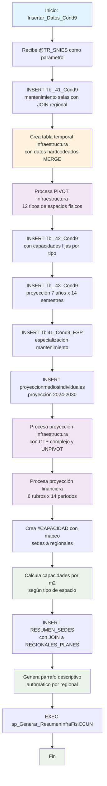

### Insertar_Datos_Cond9

Este procedimiento almacenado gestiona la inserción compleja de datos de infraestructura física para la Condición 9 del sistema de Registro Calificado. Se especializa en mantenimiento de salas de sistemas, infraestructura física detallada, proyecciones plurianuales de infraestructura y tecnología, capacidades por tipo de espacio, y generación automática de párrafos descriptivos consolidados. Incluye procesamiento avanzado con tablas temporales, operaciones PIVOT, y cálculos de capacidades por metro cuadrado.

El procedimiento combina datos duros de infraestructura con proyecciones financieras y genera resúmenes narrativos automáticos para cada sede regional.

#### Diagrama de flujo



#### Procedimiento almacenado

```sql
CREATE PROCEDURE [Dev].[Insertar_Datos_Cond9]
@TR_SNIES VARCHAR(50)
AS
BEGIN

    PRINT 'Inicio de la inserción de datos en [REGISTRO_CALIFICADO].[RCAL].[Tbl_41_Cond9]';

    -- Verificar si ya existen datos en la tabla destino
    IF NOT EXISTS (
        SELECT 1
        FROM [REGISTRO_CALIFICADO].[RCAL].[Tbl_41_Cond9]
        WHERE TR_SNIES = @TR_SNIES
    )
    BEGIN


DROP TABLE IF EXISTS #Tbl_41_Cond9

SELECT DISTINCT Sala_de_sistemas
, Responsable
, Periodo
, Fecha_Mantenimiento
, Mes_Mantenimiento
, Preventivo, Correctivo  
, @TR_SNIES AS TR_SNIES
INTO #Tbl_41_Cond9
FROM [RCAL].[Tbl_41_Cond9]
WHERE TR_SNIES ='54639'

insert into [RCAL].[Tbl_41_Cond9]
SELECT a.Sala_de_sistemas , a.Responsable , a.Periodo , b.TR_Regionales as Regional ,a.Fecha_Mantenimiento, a.Mes_Mantenimiento , a.TR_SNIES , a.Preventivo , a.Preventivo FROM #Tbl_41_Cond9 a
LEFT JOIN RCAL.Acta b
on a.TR_SNIES = b.TR_SNIES

    END
    ELSE
    BEGIN
        PRINT 'Los datos con el TR_SNIES proporcionado ya existen en la tabla destino.';
    END

    PRINT 'Fin de la inserción de datos en [REGISTRO_CALIFICADO].[RCAL].[Tbl_41_Cond9]';


    PRINT 'Inicio de la inserción de datos en [REGISTRO_CALIFICADO].[RCAL].[Tbl_42_Cond9]';

    -- Verificar si ya existen datos en la tabla destino

    -- Crear tabla temporal con una estructura definida

IF OBJECT_ID('tempdb..#Invent_Fisico_Infraestructura_2024') IS NOT NULL
DROP TABLE #Invent_Fisico_Infraestructura_2024;

CREATE TABLE #Invent_Fisico_Infraestructura_2024 (
ID_SEDE INT,
NOM_SEDE NVARCHAR(255),
Bloque NVARCHAR(255),
Salon NVARCHAR(255),
Cantidad INT,
Metros2 INT,
Tenencia NVARCHAR(255)
);

-- Insertar datos en la tabla temporal
MERGE #Invent_Fisico_Infraestructura_2024 AS target
USING (VALUES
(22, 'NIVEL NACIONAL', 'Edificio D', 'Aula de clase', 45, 1508, 'Arriendo'),
(22, 'NIVEL NACIONAL', 'Edificio D', 'Laboratorios', 0, 0, 'Arriendo'),
(22, 'NIVEL NACIONAL', 'Edificio D', 'Salas de tutores', 8, 64, 'Arriendo'),
(22, 'NIVEL NACIONAL', 'Edificio D', 'Auditorios', 0, 0, 'Arriendo'),
(22, 'NIVEL NACIONAL', 'Edificio D', 'Bibliotecas', 0, 0, 'Arriendo'),
(22, 'NIVEL NACIONAL', 'Edificio D', 'Cómputo', 0, 0, 'Arriendo'),
(22, 'NIVEL NACIONAL', 'Edificio D', 'Oficinas', 2, 200, 'Arriendo'),
(22, 'NIVEL NACIONAL', 'Edificio D', 'Espacios deportivos', 0, 0, 'Arriendo'),
(22, 'NIVEL NACIONAL', 'Edificio D', 'Cafeterías', 0, 0, 'Arriendo'),
(22, 'NIVEL NACIONAL', 'Edificio D', 'Zonas recreación', 1, 60, 'Arriendo'),
(22, 'NIVEL NACIONAL', 'Edificio D', 'Servicios Sanitarios', 31, 125, 'Arriendo'),
(22, 'NIVEL NACIONAL', 'Edificio D', 'Otros', 0, 0, 'Arriendo')
) AS source (ID_SEDE, NOM_SEDE, Bloque, Salon, Cantidad, Metros2, Tenencia)
ON target.ID_SEDE = source.ID_SEDE
AND target.NOM_SEDE = source.NOM_SEDE
AND target.Bloque = source.Bloque
AND target.Salon = source.Salon
WHEN NOT MATCHED THEN
INSERT (ID_SEDE, NOM_SEDE, Bloque, Salon, Cantidad, Metros2, Tenencia)
VALUES (source.ID_SEDE, source.NOM_SEDE, source.Bloque, source.Salon, source.Cantidad, source.Metros2, source.Tenencia);
IF NOT EXISTS (
SELECT 1
FROM [REGISTRO_CALIFICADO].[RCAL].[Tbl_42_Cond9]
WHERE TR_SNIES = @TR_SNIES
)
BEGIN
INSERT INTO [REGISTRO_CALIFICADO].[RCAL].[Tbl_42_Cond9] (
[Cantidad_de_salones],
[Cantidad_salas_de_sistemas],
[Cantidad_de_laboratorios],
[Zonas_bienestar],
[Salas_profesores],
[Auditorios],
[Bibliotecas],
[Oficinas],
[Baños],
[Total_capacidad_salones_clase],
[Uso_suelo],
[Tenencia],
[TR_CodSede],
[TR_SNIES],
[Cap_de_salones],
[Cap_salas_de_sistemas],
[Cap_de_laboratorios],
[Cap_Zonas_bienestar],
[Cap_Salas_profesores],
[Cap_Auditorios],
[Cap_Bibliotecas],
[Cap_Oficinas],
[Cap_Baños]
)
SELECT DISTINCT
COALESCE([Aula de clase], 0) AS Cantidad_de_salones,
COALESCE([Cómputo], 0) AS Cantidad_salas_de_sistemas,
COALESCE([Laboratorios], 0) AS Cantidad_de_laboratorios,
COALESCE([Zonas recreación], 0) AS Zonas_bienestar,
COALESCE([Salas de tutores], 0) AS Salas_profesores,
COALESCE([Auditorios], 0) AS Auditorios,
COALESCE([Bibliotecas], 0) AS Bibliotecas,
COALESCE([Oficinas], 0) AS Oficinas,
COALESCE([Servicios Sanitarios], 0) AS Baños,
650 AS Total_capacidad_salones_clase,
'INSTITUCIONAL' AS Uso_suelo,
COALESCE(Tenencia, 'N/A') AS Tenencia,
NULL AS TR_CodSede,
@TR_SNIES,
460 AS Cap_de_salones,
6 AS Cap_salas_de_sistemas,
1 AS Cap_de_laboratorios,
1 AS Cap_Zonas_bienestar,
2 AS Cap_Salas_profesores,
60 AS Cap_Auditorios,
60 AS Cap_Bibliotecas,
21 AS Cap_Oficinas,
7 AS Cap_Baños
FROM (
SELECT
a.TR_SNIES,
i.NOM_SEDE,
i.Bloque,
i.Salon,
i.Cantidad,
(SELECT DISTINCT Tenencia
FROM #Invent_Fisico_Infraestructura_2024 i2
WHERE i2.NOM_SEDE = i.NOM_SEDE) AS Tenencia
FROM #Invent_Fisico_Infraestructura_2024 i
JOIN REGISTRO_CALIFICADO.RCAL.Acta a
ON i.NOM_SEDE = a.TR_Regionales
--WHERE a.TR_SNIES = @TR_SNIES
) AS SourceTable
PIVOT (
SUM(Cantidad)
FOR Salon IN (
[Aula de clase],
[Laboratorios],
[Salas de tutores],
[Auditorios],
[Bibliotecas],
[Cómputo],
[Oficinas],
[Espacios deportivos],
[Cafeterías],
[Zonas recreación],
[Servicios Sanitarios],
[Otros]
)
) AS PivotTable;
END
ELSE
BEGIN
PRINT 'Los datos con el TR_SNIES proporcionado ya existen en la tabla destino.';
END

    PRINT 'Fin de la inserción de datos en [REGISTRO_CALIFICADO].[RCAL].[Tbl_42_Cond9]';


    PRINT 'Inicio de la inserción de datos en [REGISTRO_CALIFICADO].[RCAL].INFRAESTRUCTURA_FISICA';

--INSERT INTO rcal.tbl_InfraestructuraFisica
--SELECT
-- @tr_snies AS TR_SNIES,
-- b.TR_Regionales AS TR_SedeCUN,
-- a.Total_capacidad_salones_clase AS TR_NumeroEstudiantes,
-- a.Salas_profesores AS TR_SalaProfesores,
-- (
-- COALESCE(CAST(a.Cantidad_de_salones AS INT), 0) +
-- COALESCE(CAST(a.Cantidad_salas_de_sistemas AS INT), 0) +
-- COALESCE(CAST(a.Cantidad_de_laboratorios AS INT), 0) +
-- COALESCE(CAST(a.Zonas_bienestar AS INT), 0) +
-- COALESCE(CAST(a.Salas_profesores AS INT), 0) +
-- COALESCE(CAST(a.Auditorios AS INT), 0) +
-- COALESCE(CAST(a.Bibliotecas AS INT), 0) +
-- COALESCE(CAST(a.Oficinas AS INT), 0) +
-- COALESCE(CAST(a.Baños AS INT), 0)
-- ) AS TE_NumeroEspacios,
-- a.Cantidad_de_salones AS TR_Salones,
-- 2663 AS TR_M2,
-- YEAR(GETDATE()) AS TR_AñoActual,
-- 1 AS TR_CodSede,
-- b.TR_Regionales AS TR_Ciudad,
-- 7 AS TR_CantidadAños
--FROM [REGISTRO_CALIFICADO].[RCAL].[Tbl_42_Cond9] a
--LEFT JOIN RCAL.Acta b
-- ON a.TR_SNIES = b.TR_SNIES
--WHERE a.TR_SNIES = @tr_snies;

    PRINT 'FIN de la inserción de datos en [REGISTRO_CALIFICADO].[RCAL].INFRAESTRUCTURA_FISICA';

    PRINT 'Inicio de la inserción de datos en [REGISTRO_CALIFICADO].[RCAL].[Tbl_43_Cond9]';

--SELECT \*
--FROM (
-- SELECT
-- Nombre,
-- CONCAT(Año, '\_', Semestre) AS Año_Semestre,
-- Valor
-- FROM [CUN_REPOSITORIO].[dbo].[Proyeccion_plan_infraestructura]
--) src
--PIVOT (
-- MAX(Valor)
-- FOR Año_Semestre IN ([Año 1_Sem 1], [Año 1_Sem 2], [Año 2_Sem 3], [Año 2_Sem 4], [Año 3_Sem 5], [Año 3_Sem 6],
-- [Año 4_Sem 7], [Año 4_Sem 8], [Año 5_Sem 9], [Año 5_Sem 10], [Año 6_Sem 11], [Año 6_Sem 12],
-- [Año 7_Sem 13], [Año 7_Sem 14])
--) AS pvt
--ORDER BY Nombre;

DROP TABLE IF EXISTS #Tbl_43_Cond9

SELECT [Nombre]
,[Año 1_Sem 1]
,[Año 1_Sem 2]
,[Año 2_Sem 3]
,[Año 2_Sem 4]
,[Año 3_Sem 5]
,[Año 3_Sem 6]
,[Año 4_Sem 7]
,[Año 4_Sem 8]
,[Año 5_Sem 9]
,[Año 5_Sem 10]
,[Año 6_Sem 11]
,[Año 6_Sem 12]
,[Año 7_Sem 13]
,[Año 7_Sem 14]
,@TR_SNIES as [TR_SNIES]
into #Tbl_43_Cond9
FROM [REGISTRO_CALIFICADO].[RCAL].[Tbl_43_Cond9]
WHERE TR_SNIES = '54639'

INSERT INTO [REGISTRO_CALIFICADO].[RCAL].[Tbl_43_Cond9]
select [Nombre]
,[Año 1_Sem 1]
,[Año 1_Sem 2]
,[Año 2_Sem 3]
,[Año 2_Sem 4]
,[Año 3_Sem 5]
,[Año 3_Sem 6]
,[Año 4_Sem 7]
,[Año 4_Sem 8]
,[Año 5_Sem 9]
,[Año 5_Sem 10]
,[Año 6_Sem 11]
,[Año 6_Sem 12]
,[Año 7_Sem 13]
,[Año 7_Sem 14]
,A.TR_SNIES
,B.TR_Regionales
from #Tbl_43_Cond9 a
left join REGISTRO_CALIFICADO.rcal.Acta b
on a.TR_SNIES = b.TR_SNIES
WHERE A.TR_SNIES =@TR_SNIES

    PRINT 'Fin de la inserción de datos en [REGISTRO_CALIFICADO].[RCAL].[Tbl_43_Cond9]';


    PRINT 'Inicio de la inserción de datos en [REGISTRO_CALIFICADO].[RCAL].[Tbl41_Cond9_ESP]';

DROP TABLE IF EXISTS #Tbl41_Cond9_ESP

SELECT DISTINCT Sala_de_sistemas
, Responsable
, Periodo
, Fecha_Mantenimiento
, Mes_Mantenimiento
, Preventivo, Correctivo  
, @TR_SNIES AS TR_SNIES
INTO #Tbl41_Cond9_ESP
FROM [RCAL].[Tbl_41_Cond9]
WHERE TR_SNIES ='54639'

insert into [RCAL].[Tbl41_Cond9_ESP]
SELECT a.Sala_de_sistemas , a.Responsable , a.Periodo , b.TR_Regionales as Regional ,a.Fecha_Mantenimiento, a.Mes_Mantenimiento , a.TR_SNIES , a.Preventivo , a.Preventivo FROM #Tbl41_Cond9_ESP a
LEFT JOIN RCAL.Acta b
on a.TR_SNIES = b.TR_SNIES

-- PRINT 'Inicio de la inserción de datos en [REGISTRO_CALIFICADO].[RCAL].[Tbl41_Cond9_ESP]';

-- insert into [REGISTRO_CALIFICADO].[RCAL].[Proyeccion_Infraestructura_Física_Tecnologica_v2]
--SELECT @tr_snies
-- ,[INVENTARIO_ACTUAL_2024]
-- ,[CANTIDAD_2025]
-- ,[CANTIDAD_2026]
-- ,[CANTIDAD_2027]
-- ,[CANTIDAD_2028]
-- ,[CANTIDAD_2029]
-- ,[CANTIDAD_2030]
-- ,[ITEM]
-- FROM [REGISTRO_CALIFICADO].[RCAL].[Proyeccion_Infraestructura_Física_Tecnologica_v2]
-- where TR_SNIES ='54639'

-- insert into [REGISTRO_CALIFICADO].[RCAL].[Proyeccion_Financiera]
--SELECT @TR_SNIES
-- ,[Descripcion_Formato]
-- ,[P_Periodo_1]
-- ,[P_Periodo_2]
-- ,[P_Periodo_3]
-- ,[P_Periodo_4]
-- ,[P_Periodo_5]
-- ,[P_Periodo_6]
-- ,[P_Periodo_7]
-- FROM [REGISTRO_CALIFICADO].[RCAL].[Proyeccion_Financiera]
-- where TR_SNIES ='202400180'

--INSERT INTO [REGISTRO_CALIFICADO].[RCAL].[Inventario_software]
--SELECT @TR_SNIES
-- ,[Asignatura_segun_el_plan_de_estudios_Actividad_Academica]
-- ,[Nombre_del_medio_educativo]
-- ,[Descripcion_del_medio_educativo]
-- FROM [REGISTRO_CALIFICADO].[RCAL].[Inventario_software]
-- WHERE TR_SNIES ='202500195'

INSERT INTO [REGISTRO_CALIFICADO].[RCAL].[proyeccionmediosindividuales]
SELECT @TR_SNIES
,[ITEM]
,[2024]
,[2025]
,[2026]
,[2027]
,[2028]
,[2029]
,[2030]
FROM [REGISTRO_CALIFICADO].[RCAL].[proyeccionmediosindividuales]
WHERE TR_SNIES= '54639'

---- Proyeccion Infraestructura

-- Paso 0: Eliminar la tabla temporal si existe
DROP TABLE IF EXISTS #Proyeccion_Infraestructura;

-- Paso 1: Definir el orden deseado para los rubros
WITH OrdenRubro AS (
SELECT \* FROM (VALUES
(1, 'Proyeccion_Alumnos'),
(2, 'Proyeccion_Num_Alumnos'),
(3, 'Capacidad_General_por_Jornada'),
(4, 'Salones'),
(5, 'Capacidad_Salones'),
(6, 'Salas_De_Sistemas'),
(7, 'Capacidad_Salas_De_Sistemas'),
(8, 'Talleres_O_Laboratorios'),
(9, 'Capacidad_Talleres_O_Laboratorios'),
(10, 'Zonas_De_Bienestar'),
(11, 'Capacidad_Zonas_De_Bienestar'),
(12, 'Sala_De_Profesores'),
(13, 'Capacidad_Sala_De_Profesores'),
(14, 'Biblioteca'),
(15, 'Capacidad_Biblioteca'),
(16, 'Auditorio'),
(17, 'Capacidad_Auditorio'),
(18, 'Oficinas'),
(19, 'Capacidad_Oficinas'),
(20, 'Baños'),
(21, 'Capacidad_Baños')
) AS t(Orden, Rubro)
),

-- Paso 2: Unpivot de los campos por rubro
Unpivoted AS (
SELECT
t.SNIES,
v.Rubro,
value AS Cadena
FROM rcal.Proyeccion_Infraestructura_Física_Tecnologica_v2 t
CROSS APPLY (VALUES
('Proyeccion_Alumnos', t.Proyeccion_Alumnos),
('Proyeccion_Num_Alumnos', t.Proyeccion_Num_Alumnos),
('Capacidad_General_por_Jornada', t.Capacidad_General_por_Jornada),
('Salones', t.Salones),
('Capacidad_Salones', t.Capacidad_Salones),
('Salas_De_Sistemas', t.Salas_De_Sistemas),
('Capacidad_Salas_De_Sistemas', t.Capacidad_Salas_De_Sistemas),
('Talleres_O_Laboratorios', t.Talleres_O_Laboratorios),
('Capacidad_Talleres_O_Laboratorios', t.Capacidad_Talleres_O_Laboratorios),
('Zonas_De_Bienestar', t.Zonas_De_Bienestar),
('Capacidad_Zonas_De_Bienestar', t.Capacidad_Zonas_De_Bienestar),
('Sala_De_Profesores', t.Sala_De_Profesores),
('Capacidad_Sala_De_Profesores', t.Capacidad_Sala_De_Profesores),
('Biblioteca', t.Biblioteca),
('Capacidad_Biblioteca', t.Capacidad_Biblioteca),
('Auditorio', t.Auditorio),
('Capacidad_Auditorio', t.Capacidad_Auditorio),
('Oficinas', t.Oficinas),
('Capacidad_Oficinas', t.Capacidad_Oficinas),
('Baños', t.Baños),
('Capacidad_Baños', t.Capacidad_Baños)
) AS v(Rubro, CadenaTexto)
CROSS APPLY STRING_SPLIT(v.CadenaTexto, ',')
WHERE t.SNIES = @TR_SNIES
),

-- Paso 3: Separar el periodo y el valor
Separado AS (
SELECT
u.SNIES,
u.Rubro,
LTRIM(RTRIM(LEFT(Cadena, CHARINDEX(':', Cadena) - 1))) AS Periodo,
LTRIM(RTRIM(RIGHT(Cadena, LEN(Cadena) - CHARINDEX(':', Cadena)))) AS Valor
FROM Unpivoted u
),

-- Paso 4: Relacionar con el orden deseado
ConOrden AS (
SELECT
s.SNIES,
s.Rubro,
o.Orden,
s.Periodo,
s.Valor
FROM Separado s
INNER JOIN OrdenRubro o ON s.Rubro = o.Rubro
)

-- Paso 5: Crear tabla temporal pivotada
SELECT \*
INTO #Proyeccion_Infraestructura
FROM ConOrden
PIVOT (
MAX(Valor) FOR Periodo IN (
[año 1 matrix], [año 2], [año 3], [año 4], [año 5], [año 6], [año 7]
)
) AS pvt;

-- Paso 6: Insertar en tabla final, en orden
INSERT INTO RCAL.PROYECCION_INFRAESTRUCTURA -- (asegúrate que el nombre esté bien escrito)
SELECT \*
FROM #Proyeccion_Infraestructura
ORDER BY Orden;

--- Proyeccion Financiera

-- Eliminar tabla temporal si existe
DROP TABLE IF EXISTS #proyeccion_financiera;

-- Transformación y pivoteo
WITH Unpivoted AS (
SELECT
t.SNIES,
v.Rubro,
value AS Cadena
FROM rcal.Proyeccion_Financiera t
CROSS APPLY (VALUES
('Bienestar', t.Bienestar),
('Infraestructura', t.Infraestructura),
('Investigacion', t.Investigacion),
('Medios_Educativos', t.Medios_Educativos),
('Proyeccion_Social', t.Proyeccion_Social),
('Proyeccion_Estudiantes', t.Proyeccion_Estudiantes)
) AS v(Rubro, CadenaTexto)
CROSS APPLY STRING_SPLIT(v.CadenaTexto, ',')
WHERE t.SNIES = @TR_SNIES
),
Separado AS (
SELECT
SNIES,
Rubro,
LTRIM(RTRIM(LEFT(Cadena, CHARINDEX(':', Cadena) - 1))) AS Periodo,
LTRIM(RTRIM(RIGHT(Cadena, LEN(Cadena) - CHARINDEX(':', Cadena)))) AS Valor
FROM Unpivoted
),
Pivoted AS (
SELECT
SNIES,
Rubro,
Periodo,
Valor
FROM Separado
)

-- Crear tabla temporal pivotada
SELECT \*
INTO #proyeccion_financiera
FROM Pivoted
PIVOT (
MAX(Valor) FOR Periodo IN (
[año 1 A], [año 1 B], [año 2 A], [año 2 B], [año 3 A], [año 3 B],
[año 4 A], [año 4 B], [año 5 A], [año 5 B], [año 6 A], [año 6 B], [año 7 A], [año 7 B]
)
) AS pvt;

-- Insertar en tabla final
INSERT INTO RCAL.PROYECCION_FINANCIERA_PV
SELECT \*
FROM #proyeccion_financiera
ORDER BY Rubro;

DROP TABLE IF EXISTS #CAPACIDAD;

-- Crear la tabla temporal #CAPACIDAD
SELECT  
 CASE
WHEN NOM_SEDE IN ('BOGOTA CENTRO', 'BOGOTA CHAPINERO', 'BOGOTA FONTIBON', 'BOGOTA RESTREPO', 'BOGOTA SUBA', 'BOGOTA SUR', 'BOGOTA_INNOVACION') THEN 'BOGOTÁ'
WHEN NOM_SEDE = 'CHIA' THEN 'CUNDINAMARCA'
WHEN NOM_SEDE = 'CUNAD BARRANQUILLA' THEN 'ATLÁNTICO'
WHEN NOM_SEDE = 'FLORENCIA' THEN 'CAQUETÁ'
WHEN NOM_SEDE = 'IBAGUÉ' THEN 'TOLIMA'
WHEN NOM_SEDE = 'IPIALES' THEN 'NARIÑO'
WHEN NOM_SEDE = 'MEDELLIN' THEN 'ANTIOQUIA'
WHEN NOM_SEDE = 'MONTERIA' THEN 'CÓRDOBA'
WHEN NOM_SEDE = 'NEIVA' THEN 'HUILA'
WHEN NOM_SEDE = 'SANTA MARTA' THEN 'MAGDALENA'
WHEN NOM_SEDE = 'SINCELEJO' THEN 'SUCRE'
WHEN NOM_SEDE = 'YOPAL' THEN 'CASANARE'
ELSE 'NO DEFINIDO'
END AS REGIONAL,

    RTRIM(LTRIM(Salon)) AS Salon,
    SUM(cantidad) AS Total_Espacios,
    SUM(cantidad) *
    CASE RTRIM(LTRIM(Salon))
        WHEN 'Auditorios' THEN 110
        WHEN 'Aula de clase' THEN 31.3
        WHEN 'Bibliotecas' THEN 30.4
        WHEN 'Cafeterías' THEN 62.9
        WHEN 'Cómputo' THEN 23.7
        WHEN 'Espacios deportivos' THEN 63
        WHEN 'Laboratorios' THEN 19
        WHEN 'Oficinas' THEN 6.4
        WHEN 'Salas de tutores' THEN 12.8
        WHEN 'Servicios Sanitarios' THEN 4
        WHEN 'Zonas recreación' THEN 62.9
        WHEN 'Otros' THEN 0
        ELSE 0
    END AS Capacidad_Total

INTO #CAPACIDAD
FROM rcal.Invent_Fisico_Infraestructura_2024
GROUP BY
CASE
WHEN NOM_SEDE IN ('BOGOTA CENTRO', 'BOGOTA CHAPINERO', 'BOGOTA FONTIBON', 'BOGOTA RESTREPO', 'BOGOTA SUBA', 'BOGOTA SUR', 'BOGOTA_INNOVACION') THEN 'BOGOTÁ'
WHEN NOM_SEDE = 'CHIA' THEN 'CUNDINAMARCA'
WHEN NOM_SEDE = 'CUNAD BARRANQUILLA' THEN 'ATLÁNTICO'
WHEN NOM_SEDE = 'FLORENCIA' THEN 'CAQUETÁ'
WHEN NOM_SEDE = 'IBAGUÉ' THEN 'TOLIMA'
WHEN NOM_SEDE = 'IPIALES' THEN 'NARIÑO'
WHEN NOM_SEDE = 'MEDELLIN' THEN 'ANTIOQUIA'
WHEN NOM_SEDE = 'MONTERIA' THEN 'CÓRDOBA'
WHEN NOM_SEDE = 'NEIVA' THEN 'HUILA'
WHEN NOM_SEDE = 'SANTA MARTA' THEN 'MAGDALENA'
WHEN NOM_SEDE = 'SINCELEJO' THEN 'SUCRE'
WHEN NOM_SEDE = 'YOPAL' THEN 'CASANARE'
ELSE 'NO DEFINIDO'
END,
RTRIM(LTRIM(Salon));

-- Insertar en RCAL.RESUMEN_SEDE incluyendo TR_SNIES
insert INTO rcal.RESUMEN_SEDES
SELECT
RP.TR_SNIES,
C.REGIONAL,
C.Salon,
C.Total_Espacios,
C.Capacidad_Total
FROM #CAPACIDAD C
INNER JOIN RCAL.REGIONALES_PLANES RP
ON C.REGIONAL = RP.TR_Regional
WHERE RP.TR_SNIES = @TR_SNIES
AND RP.ORDEN = 1
ORDER BY
CASE C.Salon
WHEN 'Salon' THEN 1
WHEN 'Cómputo' THEN 2
WHEN 'Laboratorios' THEN 3
WHEN 'Zonas recreación' THEN 4
WHEN 'Salas de tutores' THEN 5
WHEN 'Bibliotecas' THEN 6
WHEN 'Oficinas' THEN 7
WHEN 'Servicios Sanitarios' THEN 8
WHEN 'Otros' THEN 9
WHEN 'Auditorios' THEN 10
WHEN 'Cafeterías' THEN 11
WHEN 'Espacios deportivos' THEN 12
WHEN 'Aula de clase' THEN 13
ELSE 999
END;

DECLARE @REGIONAL VARCHAR(100);
DECLARE @Total_m2 DECIMAL(18,1);
DECLARE @Espacios_Academicos INT;
DECLARE @Capacidad_Estudiantes DECIMAL(18,1);
DECLARE @Salas_Tutores INT;
DECLARE @Oficinas INT;
DECLARE @Parrafo NVARCHAR(MAX);

-- Crear tabla si no existe
IF OBJECT_ID('rcal.parrafo_resumen_sedes', 'U') IS NULL
BEGIN
CREATE TABLE rcal.parrafo_resumen_sedes (
TR_SNIES VARCHAR(20),
PARRAFO NVARCHAR(MAX)
);
END

-- Obtener datos
SELECT TOP 1 @REGIONAL = REGIONAL
FROM rcal.RESUMEN_SEDES
WHERE TR_SNIES = @TR_SNIES;

SELECT
@Total_m2 = SUM(Capacidad_Total),
@Espacios_Academicos = SUM(CASE WHEN Salon IN ('Aula de clase', 'Cómputo', 'Laboratorios', 'Bibliotecas', 'Auditorios') THEN Total_Espacios ELSE 0 END),
@Capacidad_Estudiantes = SUM(CASE WHEN Salon IN ('Aula de clase', 'Cómputo', 'Laboratorios', 'Bibliotecas', 'Auditorios') THEN Capacidad_Total ELSE 0 END),
@Salas_Tutores = SUM(CASE WHEN Salon = 'Salas de tutores' THEN Total_Espacios ELSE 0 END),
@Oficinas = SUM(CASE WHEN Salon = 'Oficinas' THEN Total_Espacios ELSE 0 END)
FROM rcal.RESUMEN_SEDES
WHERE TR_SNIES = @TR_SNIES;

-- Construir párrafo
SET @Parrafo =
'En ' + @REGIONAL + ' la CUN cuenta con más de ' +
FORMAT(@Total_m2, '#,##0.0') + ' m2 de construcción, donde ' +
CAST(@Espacios_Academicos AS VARCHAR) + ' espacios son académicos como salones de clase magistral, salas de sistemas, laboratorios, bibliotecas, auditorios, etc. para ' +
FORMAT(@Capacidad_Estudiantes, '#,##0') + ' estudiantes por jornada, ' +
CAST(@Salas_Tutores AS VARCHAR) + ' espacios en salas de profesores para nuestros docentes y ' +
CAST(@Oficinas AS VARCHAR) + ' espacios en oficinas para administrativos. También contamos con espacios de bienestar como cafetería, zonas de recreación, servicios sanitarios y otros espacios lúdicos para el bienestar de nuestros estudiantes.';

-- Insertar en tabla
INSERT INTO rcal.parrafo_resumen_sedes (TR_SNIES, PARRAFO)
VALUES (@TR_SNIES, @Parrafo);
-- Insertar Data Infraestructura a ResumenIngraFisiCCUN

EXEC [RCAL].[sp_Generar_ResumenInfraFisiCCUN] @TR_SNIES;

END;
```
#### Operaciones Principales por Sección
1. Mantenimiento de Salas (Tbl_41_Cond9):
```sql
-- Proceso con tabla temporal y JOIN regional:
#Tbl_41_Cond9 ← SELECT desde TR_SNIES='54639'
INSERT con JOIN a rcal.Acta para obtener TR_Regionales
```
2. Infraestructura Física Hardcodeada:
```sql
-- Tabla temporal con datos fijos usando MERGE:
CREATE TABLE #Invent_Fisico_Infraestructura_2024
MERGE con 12 tipos de espacios predefinidos:
- Aula de clase: 45 espacios, 1508 m2
- Salas de tutores: 8 espacios, 64 m2  
- Oficinas: 2 espacios, 200 m2
- Servicios Sanitarios: 31 espacios, 125 m2
- Zonas recreación: 1 espacio, 60 m2
```
3. PIVOT de Infraestructura (Tbl_42_Cond9):
```sql
-- Transformación PIVOT de 12 tipos de espacios:
PIVOT (SUM(Cantidad) FOR Salon IN (
  [Aula de clase], [Laboratorios], [Salas de tutores], 
  [Auditorios], [Bibliotecas], [Cómputo], [Oficinas],
  [Espacios deportivos], [Cafeterías], [Zonas recreación], 
  [Servicios Sanitarios], [Otros]
))
```
4. Capacidades Fijas Asignadas:
```sql
-- Capacidades estándar predefinidas:
650 AS Total_capacidad_salones_clase
460 AS Cap_de_salones
6 AS Cap_salas_de_sistemas  
60 AS Cap_Auditorios
21 AS Cap_Oficinas
```
5. Proyecciones Plurianuales (Tbl_43_Cond9):

-Cobertura temporal: 7 años × 2 semestres = 14 períodos
-Estructura: Año 1_Sem 1 hasta Año 7_Sem 14
-Fuente: TR_SNIES='54639' como plantilla

6. Procesamiento Avanzado con CTEs:
A. Proyección de Infraestructura:
```sql
-- CTE para UNPIVOT de 21 rubros diferentes:
OrdenRubro → Unpivoted → Separado → ConOrden → PIVOT final
Rubros: Proyección_Alumnos, Capacidad_General, Salones, etc.
```
B. Proyección Financiera:
```sql
-- CTE para 6 rubros financieros × 14 períodos:
Rubros: Bienestar, Infraestructura, Investigación, 
        Medios_Educativos, Proyección_Social, Proyección_Estudiantes
Períodos: año 1 A/B hasta año 7 A/B
```
7. Mapeo de Sedes a Regionales:
```sql
-- Mapeo complejo de 12+ sedes a regionales:
CASE 
  WHEN NOM_SEDE IN ('BOGOTA CENTRO', 'BOGOTA CHAPINERO', ...) THEN 'BOGOTÁ'
  WHEN NOM_SEDE = 'MEDELLIN' THEN 'ANTIOQUIA'
  WHEN NOM_SEDE = 'CUNAD BARRANQUILLA' THEN 'ATLÁNTICO'
  ...
END
```
8. Cálculos de Capacidad por Tipo:
```sql
-- Capacidades específicas por m2 según tipo de espacio:
CASE Salon
  WHEN 'Auditorios' THEN 110
  WHEN 'Aula de clase' THEN 31.3  
  WHEN 'Bibliotecas' THEN 30.4
  WHEN 'Cómputo' THEN 23.7
  WHEN 'Laboratorios' THEN 19
  ...
END
```
9. Generación Automática de Párrafos:
```sql
-- Construcción de párrafo descriptivo dinámico:
SET @Parrafo = 
'En ' + @REGIONAL + ' la CUN cuenta con más de ' +
FORMAT(@Total_m2, '#,##0.0') + ' m2 de construcción, donde ' +
CAST(@Espacios_Academicos AS VARCHAR) + ' espacios son académicos...'
```

#### Tablas afectadas

##### Mantenimiento y Especialización:

- Tbl_41_Cond9: Mantenimiento de salas de sistemas
- Tbl41_Cond9_ESP: Especialización en mantenimiento

##### Infraestructura Principal:

- Tbl_42_Cond9: Infraestructura física consolidada
- Tbl_43_Cond9: Proyección plurianual de infraestructura

##### Proyecciones Especializadas:

- proyeccionmediosindividuales: Medios individuales 2024-2030
- PROYECCION_INFRAESTRUCTURA: Proyección con 21 rubros
- PROYECCION_FINANCIERA_PV: Proyección financiera pivotada

##### Resúmenes y Capacidades:

- RESUMEN_SEDES: Resumen por sede regional
- parrafo_resumen_sedes: Párrafos descriptivos automáticos

##### Temporales:

- #Invent_Fisico_Infraestructura_2024: Datos hardcodeados
- #Tbl_43_Cond9, #Tbl41_Cond9_ESP: Procesamiento intermedio
- #Proyeccion_Infraestructura, #proyeccion_financiera: CTEs complejos
- #CAPACIDAD: Cálculos de capacidades

#### Procedimientos Almacenados Anidados

- [RCAL].[sp_Generar_ResumenInfraFisiCCUN]