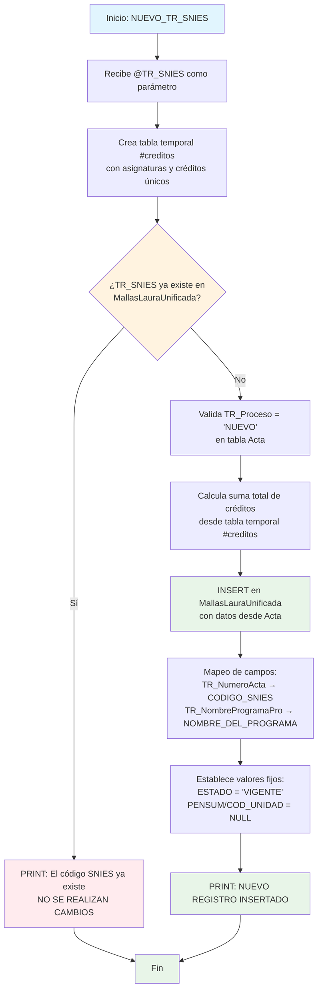

### NUEVO_TR_SNIES

Análisis del Procedimiento NUEVO_TR_SNIES
Explicación Breve
Este procedimiento almacenado realiza la inserción controlada de un nuevo programa académico en el catálogo unificado de mallas curriculares. Su función principal es validar si un código SNIES ya existe en el sistema y, solo si es completamente nuevo, crear un registro en la tabla MallasLauraUnificada con información básica del programa extraída desde la tabla Acta. Incluye cálculo automático de créditos totales desde la malla curricular.

El procedimiento implementa una validación estricta para evitar duplicados y solo procesa programas marcados como 'NUEVO' en el sistema.

#### Diagrama de flujo



#### Procedimiento almacenado

```sql
CREATE PROCEDURE [Dev].[NUEVO_TR_SNIES]
@TR_SNIES VARCHAR(50)
AS
BEGIN
-- Validar si el TR_SNIES ya existe en la tabla MallasLauraUnificada

    	select distinct TR_Asignatura , TR_CreditosAcademicos
    	into #creditos from  RCAL.tbl_Malla  where TR_SNIES =@TR_SNIES

    IF EXISTS (
        SELECT 1
        FROM [REGISTRO_CALIFICADO].[Dev].[MallasLauraUnificada]
        WHERE CODIGO_SNIES = @TR_SNIES
    )
    BEGIN
        -- Si existe, el proceso termina
        PRINT 'El código SNIES ya existe. NO SE REALIZAN CAMBIOS.'
    END
    ELSE
    BEGIN
        -- Si no existe, se inserta un nuevo registro en la tabla MallasLauraUnificada
        INSERT INTO [REGISTRO_CALIFICADO].[Dev].[MallasLauraUnificada] (
            [CODIGO_SNIES],
            [MODALIDAD],
            [PENSUM],
            [COD_UNIDAD],
            [NIVELES],
            [TOTAL_CREDITOS],
            [NOMBRE_DEL_PROGRAMA],
            [TITULO_OTORGADO],
            [ESTADO],
            [TIPO_PROGRAMA],
            [NOMBRE_ESCUELA]
        )
        SELECT
            [TR_NumeroActa] AS [CODIGO_SNIES],
            [TR_Modalidad] AS [MODALIDAD],
            NULL AS [PENSUM],
            NULL AS [COD_UNIDAD],
            NULL AS [NIVELES],
            (
                select sum(cast(TR_CreditosAcademicos as int)) from #creditos
            ) as [TOTAL_CREDITOS] ,
            [TR_NombreProgramaPro] AS [NOMBRE_DEL_PROGRAMA],
            [TR_TituloPro] AS [TITULO_OTORGADO],
            'VIGENTE' AS [ESTADO],
            [TR_Ciclo] AS [TIPO_PROGRAMA],
            [TR_Escuela] AS [NOMBRE_ESCUELA]
        FROM [REGISTRO_CALIFICADO].[RCAL].[Acta]
        WHERE [TR_SNIES] = @TR_SNIES
        AND [TR_Proceso] = 'NUEVO'

        PRINT 'NUEVO REGISTRO INSERTADO.'
    END

END

```
#### Operaciones Principales
1. Validación de Existencia:
```sql
-- Control estricto de duplicados:
IF EXISTS (SELECT 1 FROM MallasLauraUnificada WHERE CODIGO_SNIES = @TR_SNIES)
```
2. Cálculo de Créditos Totales:
```sql
-- Tabla temporal para cálculo de créditos:
SELECT DISTINCT TR_Asignatura, TR_CreditosAcademicos 
INTO #creditos 
FROM RCAL.tbl_Malla WHERE TR_SNIES = @TR_SNIES

-- Suma total automática:
(SELECT SUM(CAST(TR_CreditosAcademicos AS INT)) FROM #creditos) AS [TOTAL_CREDITOS]
```

#### Tablas afectadas

##### Pincipal:

- Se realiza un registro en la tabla Dev.MallasLauraUnificada