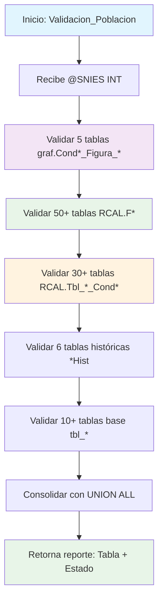

### Validacion_Poblacion

Procedimiento de validación que verifica la existencia de datos para un código SNIES específico en aproximadamente 90 tablas del sistema RCAL y graf. Genera un reporte completo del estado de la información disponible para procesos académicos.

#### Diagrama de flujo


#### Procedimiento almacenado
```sql
CREATE PROCEDURE [Dev].[Validacion_Poblacion]

@SNIES INT

AS
BEGIN

--DECLARE @SNIES VARCHAR(255) ='202400120'

SELECT 'graf.Cond7_Figura_6' AS Tabla,
CASE WHEN COUNT(\*) > 0 THEN 'Existe' ELSE 'No está el SNIES' END AS Estado
FROM graf.Cond7_Figura_6
WHERE TR_SNIES = @SNIES
UNION ALL

SELECT 'graf.Cond4_Figura_4' AS Tabla,
CASE WHEN COUNT(\*) > 0 THEN 'Existe' ELSE 'No está el SNIES' END AS Estado
FROM graf.Cond4_Figura_4
WHERE TR_SNIES = @SNIES
UNION ALL

SELECT 'graf.Cond2_Figura_5' AS Tabla,
CASE WHEN COUNT(\*) > 0 THEN 'Existe' ELSE 'No está el SNIES' END AS Estado
FROM graf.Cond2_Figura_5
WHERE TR_SNIES = @SNIES
UNION ALL

SELECT 'graf.Cond2_Figura_4' AS Tabla,
CASE WHEN COUNT(\*) > 0 THEN 'Existe' ELSE 'No está el SNIES' END AS Estado
FROM graf.Cond2_Figura_4
WHERE TR_SNIES = @SNIES
UNION ALL

SELECT 'graf.Cond2_Figura_3' AS Tabla,
CASE WHEN COUNT(\*) > 0 THEN 'Existe' ELSE 'No está el SNIES' END AS Estado
FROM graf.Cond2_Figura_3
WHERE TR_SNIES = @SNIES
UNION ALL

SELECT 'RCAL.F3_RAE' AS Tabla,
CASE WHEN COUNT(\*) > 0 THEN 'Existe' ELSE 'No está el SNIES' END AS Estado
FROM RCAL.F3_RAE
WHERE TR_SNIES = @SNIES
UNION ALL

SELECT 'RCAL.Acta' AS Tabla,
CASE WHEN COUNT(_) > 0 THEN 'Existe' ELSE 'No está el SNIES' END AS Estado
FROM RCAL.Acta
WHERE TR_SNIES = @SNIES
UNION ALL
SELECT 'RCAL.Acuerdo' AS Tabla,
CASE WHEN COUNT(_) > 0 THEN 'Existe' ELSE 'No está el SNIES' END AS Estado
FROM RCAL.Acuerdo
WHERE TR_SNIES = @SNIES

UNION ALL

SELECT 'RCAL.Tbl_1_Cond1' AS Tabla,
CASE WHEN COUNT(\*) > 0 THEN 'Existe' ELSE 'No está el SNIES' END AS Estado
FROM RCAL.Tbl_1_Cond1
WHERE TR_SNIES = @SNIES

UNION ALL

SELECT 'RCAL.Tbl_10_Cond3' AS Tabla,
CASE WHEN COUNT(\*) > 0 THEN 'Existe' ELSE 'No está el SNIES' END AS Estado
FROM RCAL.Tbl_10_Cond3
WHERE TR_SNIES = @SNIES

UNION ALL

/_SELECT 'RCAL.Tbl_11_Cond3' AS Tabla,
CASE WHEN COUNT(_) > 0 THEN 'Existe' ELSE 'No está el SNIES' END AS Estado
FROM RCAL.Tbl_11_Cond3
WHERE TR_SNIES = @SNIES\*/

--UNION ALL

SELECT 'RCAL.Tbl_12_Cond3' AS Tabla,
CASE WHEN COUNT(\*) > 0 THEN 'Existe' ELSE 'No está el SNIES' END AS Estado
FROM RCAL.Tbl_12_Cond3
WHERE TR_SNIES = @SNIES

UNION ALL

SELECT 'RCAL.Tbl_14_Cond3' AS Tabla,
CASE WHEN COUNT(\*) > 0 THEN 'Existe' ELSE 'No está el SNIES' END AS Estado
FROM RCAL.Tbl_14_Cond3
WHERE TR_SNIES = @SNIES

UNION ALL

SELECT 'RCAL.Tbl_15_Cond3' AS Tabla,
CASE WHEN COUNT(\*) > 0 THEN 'Existe' ELSE 'No está el SNIES' END AS Estado
FROM RCAL.Tbl_15_Cond3
WHERE TR_SNIES = @SNIES

UNION ALL

SELECT 'RCAL.Tbl_17_Cond5' AS Tabla,
CASE WHEN COUNT(\*) > 0 THEN 'Existe' ELSE 'No está el SNIES' END AS Estado
FROM RCAL.Tbl_17_Cond5
WHERE TR_SNIES = @SNIES

UNION ALL

SELECT 'RCAL.Tbl_18_Cond5' AS Tabla,
CASE WHEN COUNT(\*) > 0 THEN 'Existe' ELSE 'No está el SNIES' END AS Estado
FROM RCAL.Tbl_18_Cond5
WHERE TR_SNIES = @SNIES

UNION ALL

SELECT 'RCAL.Tbl_18_Cond7' AS Tabla,
CASE WHEN COUNT(\*) > 0 THEN 'Existe' ELSE 'No está el SNIES' END AS Estado
FROM RCAL.Tbl_18_Cond7
WHERE TR_SNIES = @SNIES

UNION ALL

SELECT 'RCAL.Tbl_19_Cond5' AS Tabla,
CASE WHEN COUNT(\*) > 0 THEN 'Existe' ELSE 'No está el SNIES' END AS Estado
FROM RCAL.Tbl_19_Cond5
WHERE TR_SNIES = @SNIES

UNION ALL

SELECT 'RCAL.Tbl_19_Cond7' AS Tabla,
CASE WHEN COUNT(\*) > 0 THEN 'Existe' ELSE 'No está el SNIES' END AS Estado
FROM RCAL.Tbl_19_Cond7
WHERE TR_SNIES = @SNIES

UNION ALL

SELECT 'RCAL.Tbl_2_Cond7' AS Tabla,
CASE WHEN COUNT(\*) > 0 THEN 'Existe' ELSE 'No está el SNIES' END AS Estado
FROM RCAL.Tbl_2_Cond7
WHERE TR_SNIES = @SNIES

UNION ALL

SELECT 'RCAL.Tbl_20_Cond5' AS Tabla,
CASE WHEN COUNT(\*) > 0 THEN 'Existe' ELSE 'No está el SNIES' END AS Estado
FROM RCAL.Tbl_20_Cond5
WHERE TR_SNIES = @SNIES

UNION ALL

SELECT 'RCAL.Tbl_20_Cond7' AS Tabla,
CASE WHEN COUNT(\*) > 0 THEN 'Existe' ELSE 'No está el SNIES' END AS Estado
FROM RCAL.Tbl_20_Cond7
WHERE TR_SNIES = @SNIES

UNION ALL

SELECT 'RCAL.Tbl_21_Cond6' AS Tabla,
CASE WHEN COUNT(\*) > 0 THEN 'Existe' ELSE 'No está el SNIES' END AS Estado
FROM RCAL.Tbl_21_Cond6
WHERE TR_SNIES = @SNIES

UNION ALL

SELECT 'RCAL.Tbl_21_Cond7' AS Tabla,
CASE WHEN COUNT(\*) > 0 THEN 'Existe' ELSE 'No está el SNIES' END AS Estado
FROM RCAL.Tbl_21_Cond7
WHERE TR_SNIES = @SNIES

UNION ALL

SELECT 'RCAL.Tbl_22_Cond6' AS Tabla,
CASE WHEN COUNT(\*) > 0 THEN 'Existe' ELSE 'No está el SNIES' END AS Estado
FROM RCAL.Tbl_22_Cond6
WHERE TR_SNIES = @SNIES

UNION ALL

SELECT 'RCAL.Tbl_23_Cond6' AS Tabla,
CASE WHEN COUNT(\*) > 0 THEN 'Existe' ELSE 'No está el SNIES' END AS Estado
FROM RCAL.Tbl_23_Cond6
WHERE TR_SNIES = @SNIES

UNION ALL

SELECT 'RCAL.Tbl_23_Cond7' AS Tabla,
CASE WHEN COUNT(\*) > 0 THEN 'Existe' ELSE 'No está el SNIES' END AS Estado
FROM RCAL.Tbl_23_Cond7
WHERE TR_SNIES = @SNIES

UNION ALL

SELECT 'RCAL.Tbl_24_Cond7' AS Tabla,
CASE WHEN COUNT(\*) > 0 THEN 'Existe' ELSE 'No está el SNIES' END AS Estado
FROM RCAL.Tbl_24_Cond7
WHERE TR_SNIES = @SNIES

UNION ALL

SELECT 'RCAL.Tbl_25_Cond7' AS Tabla,
CASE WHEN COUNT(\*) > 0 THEN 'Existe' ELSE 'No está el SNIES' END AS Estado
FROM RCAL.Tbl_25_Cond7
WHERE TR_SNIES = @SNIES

UNION ALL

SELECT 'RCAL.Tbl_27_Cond7' AS Tabla,
CASE WHEN COUNT(\*) > 0 THEN 'Existe' ELSE 'No está el SNIES' END AS Estado
FROM RCAL.Tbl_27_Cond7
WHERE TR_SNIES = @SNIES

UNION ALL

SELECT 'RCAL.Tbl_28_Cond8' AS Tabla,
CASE WHEN COUNT(\*) > 0 THEN 'Existe' ELSE 'No está el SNIES' END AS Estado
FROM RCAL.Tbl_28_Cond8
WHERE TR_SNIES = @SNIES

UNION ALL

SELECT 'RCAL.Tbl_29_Cond8' AS Tabla,
CASE WHEN COUNT(\*) > 0 THEN 'Existe' ELSE 'No está el SNIES' END AS Estado
FROM RCAL.Tbl_29_Cond8
WHERE TR_SNIES = @SNIES

UNION ALL

SELECT 'RCAL.Tbl_30_Cond8' AS Tabla,
CASE WHEN COUNT(\*) > 0 THEN 'Existe' ELSE 'No está el SNIES' END AS Estado
FROM RCAL.Tbl_30_Cond8
WHERE TR_SNIES = @SNIES

UNION ALL

SELECT 'RCAL.Tbl_31_Cond8' AS Tabla,
CASE WHEN COUNT(\*) > 0 THEN 'Existe' ELSE 'No está el SNIES' END AS Estado
FROM RCAL.Tbl_31_Cond8
WHERE TR_SNIES = @SNIES

UNION ALL

SELECT 'RCAL.Tbl_33_Cond7' AS Tabla,
CASE WHEN COUNT(\*) > 0 THEN 'Existe' ELSE 'No está el SNIES' END AS Estado
FROM RCAL.Tbl_33_Cond7
WHERE TR_SNIES = @SNIES

UNION ALL

SELECT 'RCAL.Tbl_35_Cond8' AS Tabla,
CASE WHEN COUNT(\*) > 0 THEN 'Existe' ELSE 'No está el SNIES' END AS Estado
FROM RCAL.Tbl_35_Cond8
WHERE TR_SNIES = @SNIES

UNION ALL

SELECT 'RCAL.Tbl_37_Cond8' AS Tabla,
CASE WHEN COUNT(\*) > 0 THEN 'Existe' ELSE 'No está el SNIES' END AS Estado
FROM RCAL.Tbl_37_Cond8
WHERE TR_SNIES = @SNIES

UNION ALL

SELECT 'RCAL.Tbl_41_Cond9' AS Tabla,
CASE WHEN COUNT(\*) > 0 THEN 'Existe' ELSE 'No está el SNIES' END AS Estado
FROM RCAL.Tbl_41_Cond9
WHERE TR_SNIES = @SNIES

UNION ALL

SELECT 'RCAL.Tbl_42_Cond8' AS Tabla,
CASE WHEN COUNT(\*) > 0 THEN 'Existe' ELSE 'No está el SNIES' END AS Estado
FROM RCAL.Tbl_42_Cond8
WHERE TR_SNIES = @SNIES

UNION ALL

SELECT 'RCAL.Tbl_5_Cond2' AS Tabla,
CASE WHEN COUNT(\*) > 0 THEN 'Existe' ELSE 'No está el SNIES' END AS Estado
FROM RCAL.Tbl_5_Cond2
WHERE TR_SNIES = @SNIES

UNION ALL

SELECT 'RCAL.Tbl_5_Cond2_ESP' AS Tabla,
CASE WHEN COUNT(\*) > 0 THEN 'Existe' ELSE 'No está el SNIES' END AS Estado
FROM RCAL.Tbl_5_Cond2_ESP
WHERE TR_SNIES = @SNIES

UNION ALL

SELECT 'RCAL.Tbl_6_Cond2' AS Tabla,
CASE WHEN COUNT(\*) > 0 THEN 'Existe' ELSE 'No está el SNIES' END AS Estado
FROM RCAL.Tbl_6_Cond2
WHERE TR_SNIES = @SNIES

UNION ALL

SELECT 'RCAL.Tbl_8_Cond3' AS Tabla,
CASE WHEN COUNT(\*) > 0 THEN 'Existe' ELSE 'No está el SNIES' END AS Estado
FROM RCAL.Tbl_8_Cond3
WHERE TR_SNIES = @SNIES

UNION ALL

SELECT 'RCAL.Tbl_9_Cond3' AS Tabla,
CASE WHEN COUNT(\*) > 0 THEN 'Existe' ELSE 'No está el SNIES' END AS Estado
FROM RCAL.Tbl_9_Cond3
WHERE TR_SNIES = @SNIES

UNION ALL

SELECT 'RCAL.Tbl_9_Cond3_ESP' AS Tabla,
CASE WHEN COUNT(\*) > 0 THEN 'Existe' ELSE 'No está el SNIES' END AS Estado
FROM RCAL.Tbl_9_Cond3_ESP
WHERE TR_SNIES = @SNIES

UNION ALL

SELECT 'RCAL.Tbl_9_Cond4' AS Tabla,
CASE WHEN COUNT(\*) > 0 THEN 'Existe' ELSE 'No está el SNIES' END AS Estado
FROM RCAL.Tbl_9_Cond4
WHERE TR_SNIES = @SNIES

UNION ALL

SELECT 'RCAL.tbl_Anexos' AS Tabla,
CASE WHEN COUNT(\*) > 0 THEN 'Existe' ELSE 'No está el SNIES' END AS Estado
FROM RCAL.tbl_Anexos
WHERE TR_SNIES = @SNIES

UNION ALL

SELECT 'RCAL.tbl_EstructuraCurricular' AS Tabla,
CASE WHEN COUNT(\*) > 0 THEN 'Existe' ELSE 'No está el SNIES' END AS Estado
FROM RCAL.tbl_EstructuraCurricular
WHERE TR_SNIES = @SNIES

UNION ALL

SELECT 'RCAL.tbl_InfraestructuraFisica' AS Tabla,
CASE WHEN COUNT(\*) > 0 THEN 'Existe' ELSE 'No está el SNIES' END AS Estado
FROM RCAL.tbl_InfraestructuraFisica
WHERE TR_SNIES = @SNIES

UNION ALL

SELECT 'RCAL.tbl_Investigacion' AS Tabla,
CASE WHEN COUNT(\*) > 0 THEN 'Existe' ELSE 'No está el SNIES' END AS Estado
FROM RCAL.tbl_Investigacion
WHERE TR_SNIES = @SNIES

UNION ALL

SELECT 'RCAL.tbl_Malla' AS Tabla,
CASE WHEN COUNT(\*) > 0 THEN 'Existe' ELSE 'No está el SNIES' END AS Estado
FROM RCAL.tbl_Malla
WHERE TR_SNIES = @SNIES

UNION ALL

SELECT 'RCAL.tbl_MedioEducativoRecursos' AS Tabla,
CASE WHEN COUNT(\*) > 0 THEN 'Existe' ELSE 'No está el SNIES' END AS Estado
FROM RCAL.tbl_MedioEducativoRecursos
WHERE TR_SNIES = @SNIES

UNION ALL

SELECT 'RCAL.tbl_Profesor' AS Tabla,
CASE WHEN COUNT(\*) > 0 THEN 'Existe' ELSE 'No está el SNIES' END AS Estado
FROM RCAL.tbl_Profesor
WHERE TR_SNIES = @SNIES

UNION ALL

SELECT 'RCAL.tbl_Programa' AS Tabla,
CASE WHEN COUNT(\*) > 0 THEN 'Existe' ELSE 'No está el SNIES' END AS Estado
FROM RCAL.tbl_Programa
WHERE TR_SNIES = @SNIES

UNION ALL

SELECT 'RCAL.tbl_SectorExterno' AS Tabla,
CASE WHEN COUNT(\*) > 0 THEN 'Existe' ELSE 'No está el SNIES' END AS Estado
FROM RCAL.tbl_SectorExterno
WHERE TR_SNIES = @SNIES

UNION ALL

SELECT 'RCAL.Tbl11_Cond3_ESP' AS Tabla,
CASE WHEN COUNT(\*) > 0 THEN 'Existe' ELSE 'No está el SNIES' END AS Estado
FROM RCAL.Tbl11_Cond3_ESP
WHERE TR_SNIES = @SNIES

UNION ALL

SELECT 'RCAL.Tbl20_Cond6_ESP' AS Tabla,
CASE WHEN COUNT(\*) > 0 THEN 'Existe' ELSE 'No está el SNIES' END AS Estado
FROM RCAL.Tbl20_Cond6_ESP
WHERE TR_SNIES = @SNIES

UNION ALL

SELECT 'RCAL.Tbl23_Cond7_ESP' AS Tabla,
CASE WHEN COUNT(\*) > 0 THEN 'Existe' ELSE 'No está el SNIES' END AS Estado
FROM RCAL.Tbl23_Cond7_ESP
WHERE TR_SNIES = @SNIES

UNION ALL

SELECT 'RCAL.Tbl41_Cond9_ESP' AS Tabla,
CASE WHEN COUNT(\*) > 0 THEN 'Existe' ELSE 'No está el SNIES' END AS Estado
FROM RCAL.Tbl41_Cond9_ESP
WHERE TR_SNIES = @SNIES

UNION ALL

SELECT 'RCAL.F1_AjusteSemantico' AS Tabla,
CASE WHEN COUNT(\*) > 0 THEN 'Existe' ELSE 'No está el SNIES' END AS Estado
FROM RCAL.F1_AjusteSemantico
WHERE TR_SNIES = @SNIES

UNION ALL

SELECT 'RCAL.F1_AnalisisCorrespondenciaTitulo' AS Tabla,
CASE WHEN COUNT(\*) > 0 THEN 'Existe' ELSE 'No está el SNIES' END AS Estado
FROM RCAL.F1_AnalisisCorrespondenciaTitulo
WHERE TR_SNIES = @SNIES

UNION ALL

SELECT 'RCAL.F1_CampoAED' AS Tabla,
CASE WHEN COUNT(\*) > 0 THEN 'Existe' ELSE 'No está el SNIES' END AS Estado
FROM RCAL.F1_CampoAED
WHERE TR_SNIES = @SNIES

UNION ALL

SELECT 'RCAL.F2_AnalisisDesercion' AS Tabla,
CASE WHEN COUNT(\*) > 0 THEN 'Existe' ELSE 'No está el SNIES' END AS Estado
FROM RCAL.F2_AnalisisDesercion
WHERE TR_SNIES = @SNIES

UNION ALL

SELECT 'RCAL.F2_AnalisisEmpleabilidadH' AS Tabla,
CASE WHEN COUNT(\*) > 0 THEN 'Existe' ELSE 'No está el SNIES' END AS Estado
FROM RCAL.F2_AnalisisEmpleabilidadH
WHERE TR_SNIES = @SNIES

UNION ALL

SELECT 'RCAL.F2_AnalisisEstadistico' AS Tabla,
CASE WHEN COUNT(\*) > 0 THEN 'Existe' ELSE 'No está el SNIES' END AS Estado
FROM RCAL.F2_AnalisisEstadistico
WHERE TR_SNIES = @SNIES

UNION ALL

SELECT 'RCAL.F2_AnalisisEstaMatri' AS Tabla,
CASE WHEN COUNT(\*) > 0 THEN 'Existe' ELSE 'No está el SNIES' END AS Estado
FROM RCAL.F2_AnalisisEstaMatri
WHERE TR_SNIES = @SNIES

UNION ALL

SELECT 'RCAL.F2_AnalisisEstudiantes' AS Tabla,
CASE WHEN COUNT(\*) > 0 THEN 'Existe' ELSE 'No está el SNIES' END AS Estado
FROM RCAL.F2_AnalisisEstudiantes
WHERE TR_SNIES = @SNIES

UNION ALL

SELECT 'RCAL.F2_AnalisisExpectativasEstd' AS Tabla,
CASE WHEN COUNT(\*) > 0 THEN 'Existe' ELSE 'No está el SNIES' END AS Estado
FROM RCAL.F2_AnalisisExpectativasEstd
WHERE TR_SNIES = @SNIES

UNION ALL

SELECT 'RCAL.F2_AnalisisReferentes' AS Tabla,
CASE WHEN COUNT(\*) > 0 THEN 'Existe' ELSE 'No está el SNIES' END AS Estado
FROM RCAL.F2_AnalisisReferentes
WHERE TR_SNIES = @SNIES

UNION ALL

SELECT 'RCAL.F2_AnalisisTendCompInt' AS Tabla,
CASE WHEN COUNT(\*) > 0 THEN 'Existe' ELSE 'No está el SNIES' END AS Estado
FROM RCAL.F2_AnalisisTendCompInt
WHERE TR_SNIES = @SNIES

UNION ALL

SELECT 'RCAL.F2_AportePlanes' AS Tabla,
CASE WHEN COUNT(\*) > 0 THEN 'Existe' ELSE 'No está el SNIES' END AS Estado
FROM RCAL.F2_AportePlanes
WHERE TR_SNIES = @SNIES

UNION ALL

SELECT 'RCAL.F2_AporteSociedad' AS Tabla,
CASE WHEN COUNT(\*) > 0 THEN 'Existe' ELSE 'No está el SNIES' END AS Estado
FROM RCAL.F2_AporteSociedad
WHERE TR_SNIES = @SNIES

UNION ALL

SELECT 'RCAL.F2_AtributosProgramas' AS Tabla,
CASE WHEN COUNT(\*) > 0 THEN 'Existe' ELSE 'No está el SNIES' END AS Estado
FROM RCAL.F2_AtributosProgramas
WHERE TR_SNIES = @SNIES

UNION ALL

SELECT 'RCAL.F2_ComProgramasInt' AS Tabla,
CASE WHEN COUNT(\*) > 0 THEN 'Existe' ELSE 'No está el SNIES' END AS Estado
FROM RCAL.F2_ComProgramasInt
WHERE TR_SNIES = @SNIES

UNION ALL

SELECT 'RCAL.F2_EmpleabilidadEgresado' AS Tabla,
CASE WHEN COUNT(\*) > 0 THEN 'Existe' ELSE 'No está el SNIES' END AS Estado
FROM RCAL.F2_EmpleabilidadEgresado
WHERE TR_SNIES = @SNIES

UNION ALL

SELECT 'RCAL.F2_EnfoqueInd' AS Tabla,
CASE WHEN COUNT(\*) > 0 THEN 'Existe' ELSE 'No está el SNIES' END AS Estado
FROM RCAL.F2_EnfoqueInd
WHERE TR_SNIES = @SNIES

UNION ALL

SELECT 'RCAL.F2_EnfoqueMat' AS Tabla,
CASE WHEN COUNT(\*) > 0 THEN 'Existe' ELSE 'No está el SNIES' END AS Estado
FROM RCAL.F2_EnfoqueMat
WHERE TR_SNIES = @SNIES

UNION ALL

SELECT 'RCAL.F2_EnfoqueRS' AS Tabla,
CASE WHEN COUNT(\*) > 0 THEN 'Existe' ELSE 'No está el SNIES' END AS Estado
FROM RCAL.F2_EnfoqueRS
WHERE TR_SNIES = @SNIES

UNION ALL

SELECT 'RCAL.F2_EnfoqueSos' AS Tabla,
CASE WHEN COUNT(\*) > 0 THEN 'Existe' ELSE 'No está el SNIES' END AS Estado
FROM RCAL.F2_EnfoqueSos
WHERE TR_SNIES = @SNIES

UNION ALL

SELECT 'RCAL.F2_ExplicacionModalidades' AS Tabla,
CASE WHEN COUNT(\*) > 0 THEN 'Existe' ELSE 'No está el SNIES' END AS Estado
FROM RCAL.F2_ExplicacionModalidades
WHERE TR_SNIES = @SNIES

UNION ALL

SELECT 'RCAL.F2_JustificacionModalidad' AS Tabla,
CASE WHEN COUNT(\*) > 0 THEN 'Existe' ELSE 'No está el SNIES' END AS Estado
FROM RCAL.F2_JustificacionModalidad
WHERE TR_SNIES = @SNIES

UNION ALL

SELECT 'RCAL.F2_JustificacionPlanNRL' AS Tabla,
CASE WHEN COUNT(\*) > 0 THEN 'Existe' ELSE 'No está el SNIES' END AS Estado
FROM RCAL.F2_JustificacionPlanNRL
WHERE TR_SNIES = @SNIES

UNION ALL

SELECT 'RCAL.F2_NumeroPorcentual' AS Tabla,
CASE WHEN COUNT(\*) > 0 THEN 'Existe' ELSE 'No está el SNIES' END AS Estado
FROM RCAL.F2_NumeroPorcentual
WHERE TR_SNIES = @SNIES

UNION ALL

SELECT 'RCAL.F2_RedaccionPlanDesarrolloNRL' AS Tabla,
CASE WHEN COUNT(\*) > 0 THEN 'Existe' ELSE 'No está el SNIES' END AS Estado
FROM RCAL.F2_RedaccionPlanDesarrolloNRL
WHERE TR_SNIES = @SNIES

UNION ALL

SELECT 'RCAL.F2_Referentes' AS Tabla,
CASE WHEN COUNT(\*) > 0 THEN 'Existe' ELSE 'No está el SNIES' END AS Estado
FROM RCAL.F2_Referentes
WHERE TR_SNIES = @SNIES

UNION ALL

SELECT 'RCAL.F2_ResumenModificacion' AS Tabla,
CASE WHEN COUNT(\*) > 0 THEN 'Existe' ELSE 'No está el SNIES' END AS Estado
FROM RCAL.F2_ResumenModificacion
WHERE TR_SNIES = @SNIES

UNION ALL

SELECT 'RCAL.F2_Salarios' AS Tabla,
CASE WHEN COUNT(\*) > 0 THEN 'Existe' ELSE 'No está el SNIES' END AS Estado
FROM RCAL.F2_Salarios
WHERE TR_SNIES = @SNIES

UNION ALL

SELECT 'RCAL.F2_SectorEmpleabilidad' AS Tabla,
CASE WHEN COUNT(\*) > 0 THEN 'Existe' ELSE 'No está el SNIES' END AS Estado
FROM RCAL.F2_SectorEmpleabilidad
WHERE TR_SNIES = @SNIES

UNION ALL

SELECT 'RCAL.F3_AlianzasCUN' AS Tabla,
CASE WHEN COUNT(\*) > 0 THEN 'Existe' ELSE 'No está el SNIES' END AS Estado
FROM RCAL.F3_AlianzasCUN
WHERE TR_SNIES = @SNIES

UNION ALL

SELECT 'RCAL.F3_AnexoEstructuraCurricular' AS Tabla,
CASE WHEN COUNT(\*) > 0 THEN 'Existe' ELSE 'No está el SNIES' END AS Estado
FROM RCAL.F3_AnexoEstructuraCurricular
WHERE TR_SNIES = @SNIES

UNION ALL

SELECT 'RCAL.F3_CreditosPropedeutico' AS Tabla,
CASE WHEN COUNT(\*) > 0 THEN 'Existe' ELSE 'No está el SNIES' END AS Estado
FROM RCAL.F3_CreditosPropedeutico
WHERE TR_SNIES = @SNIES

UNION ALL

SELECT 'RCAL.F3_DescripccionImpactCuant' AS Tabla,
CASE WHEN COUNT(\*) > 0 THEN 'Existe' ELSE 'No está el SNIES' END AS Estado
FROM RCAL.F3_DescripccionImpactCuant
WHERE TR_SNIES = @SNIES

UNION ALL

SELECT 'RCAL.F3_DescripccionModPedag' AS Tabla,
CASE WHEN COUNT(\*) > 0 THEN 'Existe' ELSE 'No está el SNIES' END AS Estado
FROM RCAL.F3_DescripccionModPedag
WHERE TR_SNIES = @SNIES

UNION ALL

SELECT 'RCAL.F3_DescripccionModVirt' AS Tabla,
CASE WHEN COUNT(\*) > 0 THEN 'Existe' ELSE 'No está el SNIES' END AS Estado
FROM RCAL.F3_DescripccionModVirt
WHERE TR_SNIES = @SNIES

UNION ALL

SELECT 'RCAL.F3_ElementosTyE' AS Tabla,
CASE WHEN COUNT(\*) > 0 THEN 'Existe' ELSE 'No está el SNIES' END AS Estado
FROM RCAL.F3_ElementosTyE
WHERE TR_SNIES = @SNIES

UNION ALL

SELECT 'RCAL.F3_ImpactProyeccSoci' AS Tabla,
CASE WHEN COUNT(\*) > 0 THEN 'Existe' ELSE 'No está el SNIES' END AS Estado
FROM RCAL.F3_ImpactProyeccSoci
WHERE TR_SNIES = @SNIES

UNION ALL

SELECT 'RCAL.F3_ImplementacionRA' AS Tabla,
CASE WHEN COUNT(\*) > 0 THEN 'Existe' ELSE 'No está el SNIES' END AS Estado
FROM RCAL.F3_ImplementacionRA
WHERE TR_SNIES = @SNIES

UNION ALL

SELECT 'RCAL.F3_PerfilEgreso' AS Tabla,
CASE WHEN COUNT(\*) > 0 THEN 'Existe' ELSE 'No está el SNIES' END AS Estado
FROM RCAL.F3_PerfilEgreso
WHERE TR_SNIES = @SNIES

UNION ALL

SELECT 'RCAL.F3_PerfilIngreso' AS Tabla,
CASE WHEN COUNT(\*) > 0 THEN 'Existe' ELSE 'No está el SNIES' END AS Estado
FROM RCAL.F3_PerfilIngreso
WHERE TR_SNIES = @SNIES

UNION ALL

SELECT 'RCAL.F3_PerfilOcupacional' AS Tabla,
CASE WHEN COUNT(\*) > 0 THEN 'Existe' ELSE 'No está el SNIES' END AS Estado
FROM RCAL.F3_PerfilOcupacional
WHERE TR_SNIES = @SNIES

UNION ALL

SELECT 'RCAL.F3_PerfilProfesional' AS Tabla,
CASE WHEN COUNT(\*) > 0 THEN 'Existe' ELSE 'No está el SNIES' END AS Estado
FROM RCAL.F3_PerfilProfesional
WHERE TR_SNIES = @SNIES

UNION ALL

SELECT 'RCAL.F3_ResumenConceptTyE' AS Tabla,
CASE WHEN COUNT(\*) > 0 THEN 'Existe' ELSE 'No está el SNIES' END AS Estado
FROM RCAL.F3_ResumenConceptTyE
WHERE TR_SNIES = @SNIES

UNION ALL

SELECT 'RCAL.F4_ActividadAcademica' AS Tabla,
CASE WHEN COUNT(\*) > 0 THEN 'Existe' ELSE 'No está el SNIES' END AS Estado
FROM RCAL.F4_ActividadAcademica
WHERE TR_SNIES = @SNIES

UNION ALL

SELECT 'RCAL.F4_AjusteAsignaturas' AS Tabla,
CASE WHEN COUNT(\*) > 0 THEN 'Existe' ELSE 'No está el SNIES' END AS Estado
FROM RCAL.F4_AjusteAsignaturas
WHERE TR_SNIES = @SNIES

UNION ALL

SELECT 'RCAL.F4_CompetenciaHabilidades' AS Tabla,
CASE WHEN COUNT(\*) > 0 THEN 'Existe' ELSE 'No está el SNIES' END AS Estado
FROM RCAL.F4_CompetenciaHabilidades
WHERE TR_SNIES = @SNIES

UNION ALL

SELECT 'RCAL.F4_DescripcionPlanTransicion' AS Tabla,
CASE WHEN COUNT(\*) > 0 THEN 'Existe' ELSE 'No está el SNIES' END AS Estado
FROM RCAL.F4_DescripcionPlanTransicion
WHERE TR_SNIES = @SNIES

UNION ALL

SELECT 'RCAL.F4_EnfoqueCompnComp' AS Tabla,
CASE WHEN COUNT(\*) > 0 THEN 'Existe' ELSE 'No está el SNIES' END AS Estado
FROM RCAL.F4_EnfoqueCompnComp
WHERE TR_SNIES = @SNIES

UNION ALL

SELECT 'RCAL.F5_AnalasisTabla17' AS Tabla,
CASE WHEN COUNT(\*) > 0 THEN 'Existe' ELSE 'No está el SNIES' END AS Estado
FROM RCAL.F5_AnalasisTabla17
WHERE TR_SNIES = @SNIES

--UNION ALL

--SELECT 'RCAL.F5_DocnProgramInvst' AS Tabla,
-- CASE WHEN COUNT(\*) > 0 THEN 'Existe' ELSE 'No está el SNIES' END AS Estado
--FROM RCAL.F5_DocnProgramInvst
--WHERE TR_SNIES = @SNIES

--UNION ALL

--SELECT 'RCAL.F5_GrupoInvestigacion' AS Tabla,
-- CASE WHEN COUNT(\*) > 0 THEN 'Existe' ELSE 'No está el SNIES' END AS Estado
--FROM RCAL.F5_GrupoInvestigacion
--WHERE TR_SNIES = @SNIES

UNION ALL

SELECT 'RCAL.F5_InversionesEstimadas' AS Tabla,
CASE WHEN COUNT(\*) > 0 THEN 'Existe' ELSE 'No está el SNIES' END AS Estado
FROM RCAL.F5_InversionesEstimadas
WHERE TR_SNIES = @SNIES

UNION ALL

SELECT 'RCAL.F5_PlanInvestigacion' AS Tabla,
CASE WHEN COUNT(\*) > 0 THEN 'Existe' ELSE 'No está el SNIES' END AS Estado
FROM RCAL.F5_PlanInvestigacion
WHERE TR_SNIES = @SNIES

UNION ALL

SELECT 'RCAL.F5_ProduccInvsProgram' AS Tabla,
CASE WHEN COUNT(\*) > 0 THEN 'Existe' ELSE 'No está el SNIES' END AS Estado
FROM RCAL.F5_ProduccInvsProgram
WHERE TR_SNIES = @SNIES

UNION ALL

SELECT 'RCAL.F5_ResumenInvsProgram' AS Tabla,
CASE WHEN COUNT(\*) > 0 THEN 'Existe' ELSE 'No está el SNIES' END AS Estado
FROM RCAL.F5_ResumenInvsProgram
WHERE TR_SNIES = @SNIES

UNION ALL

SELECT 'RCAL.F6_AnalaisisTablaEscPract' AS Tabla,
CASE WHEN COUNT(\*) > 0 THEN 'Existe' ELSE 'No está el SNIES' END AS Estado
FROM RCAL.F6_AnalaisisTablaEscPract
WHERE TR_SNIES = @SNIES

UNION ALL

SELECT 'RCAL.F6_AnalisisProyecSoci' AS Tabla,
CASE WHEN COUNT(\*) > 0 THEN 'Existe' ELSE 'No está el SNIES' END AS Estado
FROM RCAL.F6_AnalisisProyecSoci
WHERE TR_SNIES = @SNIES

UNION ALL

SELECT 'RCAL.F6_ConvenioRegional' AS Tabla,
CASE WHEN COUNT(\*) > 0 THEN 'Existe' ELSE 'No está el SNIES' END AS Estado
FROM RCAL.F6_ConvenioRegional
WHERE TR_SNIES = @SNIES

--UNION ALL

--SELECT 'RCAL.F6_DocentesProgramSectExtr' AS Tabla,
-- CASE WHEN COUNT(\*) > 0 THEN 'Existe' ELSE 'No está el SNIES' END AS Estado
--FROM RCAL.F6_DocentesProgramSectExtr
--WHERE TR_SNIES = @SNIES

UNION ALL

SELECT 'RCAL.F6_InstPractNumEstud' AS Tabla,
CASE WHEN COUNT(\*) > 0 THEN 'Existe' ELSE 'No está el SNIES' END AS Estado
FROM RCAL.F6_InstPractNumEstud
WHERE TR_SNIES = @SNIES

UNION ALL

SELECT 'RCAL.F6_IntroducConven' AS Tabla,
CASE WHEN COUNT(\*) > 0 THEN 'Existe' ELSE 'No está el SNIES' END AS Estado
FROM RCAL.F6_IntroducConven
WHERE TR_SNIES = @SNIES

UNION ALL

SELECT 'RCAL.F6_PlanInteraccionSectExtr' AS Tabla,
CASE WHEN COUNT(\*) > 0 THEN 'Existe' ELSE 'No está el SNIES' END AS Estado
FROM RCAL.F6_PlanInteraccionSectExtr
WHERE TR_SNIES = @SNIES

UNION ALL

SELECT 'RCAL.F6_PlanRelacSectExter' AS Tabla,
CASE WHEN COUNT(\*) > 0 THEN 'Existe' ELSE 'No está el SNIES' END AS Estado
FROM RCAL.F6_PlanRelacSectExter
WHERE TR_SNIES = @SNIES

UNION ALL

SELECT 'RCAL.F7_AnalisisDocente' AS Tabla,
CASE WHEN COUNT(\*) > 0 THEN 'Existe' ELSE 'No está el SNIES' END AS Estado
FROM RCAL.F7_AnalisisDocente
WHERE TR_SNIES = @SNIES

UNION ALL

SELECT 'RCAL.F7_ConteoProfEstud' AS Tabla,
CASE WHEN COUNT(\*) > 0 THEN 'Existe' ELSE 'No está el SNIES' END AS Estado
FROM RCAL.F7_ConteoProfEstud
WHERE TR_SNIES = @SNIES

union all

SELECT 'RCAL.tbl_Conteo' AS Tabla,
CASE WHEN COUNT(\*) > 0 THEN 'Existe' ELSE 'No está el SNIES' END AS Estado
FROM [REGISTRO_CALIFICADO].[RCAL].[tbl_Conteo]
WHERE TR_SNIES = @SNIES

--UNION ALL

--SELECT 'RCAL.F8_CantidadAños' AS Tabla,
-- CASE WHEN COUNT(\*) > 0 THEN 'Existe' ELSE 'No está el SNIES' END AS Estado
--FROM RCAL.F8_CantidadAños
--WHERE TR_SNIES = @SNIES

--UNION ALL

--SELECT 'RCAL.F8_CursosVirtualizadoProyecc' AS Tabla,
-- CASE WHEN COUNT(\*) > 0 THEN 'Existe' ELSE 'No está el SNIES' END AS Estado
--FROM RCAL.F8_CursosVirtualizadoProyecc
--WHERE TR_SNIES = @SNIES

--UNION ALL

--SELECT 'RCAL.F8_EquiposSala' AS Tabla,
-- CASE WHEN COUNT(\*) > 0 THEN 'Existe' ELSE 'No está el SNIES' END AS Estado
--FROM RCAL.F8_EquiposSala
--WHERE TR_SNIES = @SNIES

UNION ALL

SELECT 'RCAL.F8_IngresoAulaVirtual' AS Tabla,
CASE WHEN COUNT(\*) > 0 THEN 'Existe' ELSE 'No está el SNIES' END AS Estado
FROM RCAL.F8_IngresoAulaVirtual
WHERE TR_SNIES = @SNIES

--UNION ALL

--SELECT 'RCAL.F8_ProyeccionEquipos' AS Tabla,
-- CASE WHEN COUNT(\*) > 0 THEN 'Existe' ELSE 'No está el SNIES' END AS Estado
--FROM RCAL.F8_ProyeccionEquipos
--WHERE TR_SNIES = @SNIES

--UNION ALL

--SELECT 'RCAL.F9_CantidadSedesCUN' AS Tabla,
-- CASE WHEN COUNT(\*) > 0 THEN 'Existe' ELSE 'No está el SNIES' END AS Estado
--FROM RCAL.F9_CantidadSedesCUN
--WHERE TR_SNIES = @SNIES

--UNION ALL

--SELECT 'RCAL.F9_ProyeccAsigRecurTecng' AS Tabla,
-- CASE WHEN COUNT(\*) > 0 THEN 'Existe' ELSE 'No está el SNIES' END AS Estado
--FROM RCAL.F9_ProyeccAsigRecurTecng
--WHERE TR_SNIES = @SNIES

union all

SELECT 'RCAL.BibliotecaHist' AS Tabla,
CASE WHEN COUNT(\*) > 0 THEN 'Existe' ELSE 'No está el SNIES' END AS Estado
FROM RCAL.BibliotecaHist
WHERE TR_SNIES = @SNIES

UNION ALL

SELECT 'RCAL.InternacionalizacionEjeHist' AS Tabla,
CASE WHEN COUNT(\*) > 0 THEN 'Existe' ELSE 'No está el SNIES' END AS Estado
FROM RCAL.InternacionalizacionEjeHist
WHERE TR_SNIES = @SNIES

UNION ALL

SELECT 'RCAL.InternacionalizacionHist' AS Tabla,
CASE WHEN COUNT(\*) > 0 THEN 'Existe' ELSE 'No está el SNIES' END AS Estado
FROM RCAL.InternacionalizacionHist
WHERE TR_SNIES = @SNIES

UNION ALL

SELECT 'RCAL.NivelInglesHist' AS Tabla,
CASE WHEN COUNT(\*) > 0 THEN 'Existe' ELSE 'No está el SNIES' END AS Estado
FROM RCAL.NivelInglesHist
WHERE TR_SNIES = @SNIES

UNION ALL

SELECT 'RCAL.PracticasHist' AS Tabla,
CASE WHEN COUNT(\*) > 0 THEN 'Existe' ELSE 'No está el SNIES' END AS Estado
FROM RCAL.PracticasHist
WHERE TR_SNIES = @SNIES

UNION ALL

SELECT 'RCAL.ProyecSocHist' AS Tabla,
CASE WHEN COUNT(\*) > 0 THEN 'Existe' ELSE 'No está el SNIES' END AS Estado
FROM RCAL.ProyecSocHist
WHERE TR_SNIES = @SNIES

UNION ALL

SELECT 'RCAL.Tbl_13_Cond3' AS Tabla,
CASE WHEN COUNT(\*) > 0 THEN 'Existe' ELSE 'No está el SNIES' END AS Estado
FROM RCAL.Tbl_13_Cond3
WHERE TR_SNIES = @SNIES

UNION ALL

SELECT 'RCAL.Tbl6_Cond2_ESP' AS Tabla,
CASE WHEN COUNT(\*) > 0 THEN 'Existe' ELSE 'No está el SNIES' END AS Estado
FROM RCAL.Tbl6_Cond2_ESP
WHERE TR_SNIES = @SNIES

--UNION ALL

--SELECT 'RCAL.Acta' AS Tabla,
-- CASE WHEN COUNT(\*) > 0 THEN 'Existe' ELSE 'No está el SNIES' END AS Estado
--FROM RCAL.Acta
--WHERE TR_SNIES = @SNIES

UNION ALL

SELECT 'RCAL.F2_AnalisisPeriodoRegional' AS Tabla,
CASE WHEN COUNT(\*) > 0 THEN 'Existe' ELSE 'No está el SNIES' END AS Estado
FROM RCAL.F2_AnalisisPeriodoRegional
WHERE TR_SNIES = @SNIES

UNION ALL

SELECT 'RCAL.F2_RangoSalarial' AS Tabla,
CASE WHEN COUNT(\*) > 0 THEN 'Existe' ELSE 'No está el SNIES' END AS Estado
FROM RCAL.F2_RangoSalarial
WHERE TR_SNIES = @SNIES

UNION ALL

SELECT 'RCAL.F2_VinculaciónLaboral' AS Tabla,
CASE WHEN COUNT(\*) > 0 THEN 'Existe' ELSE 'No está el SNIES' END AS Estado
FROM RCAL.F2_VinculaciónLaboral
WHERE TR_SNIES = @SNIES

UNION ALL

SELECT 'RCAL.Tbl_21_Cond5' AS Tabla,
CASE WHEN COUNT(\*) > 0 THEN 'Existe' ELSE 'No está el SNIES' END AS Estado
FROM RCAL.Tbl_21_Cond5
WHERE TR_SNIES = @SNIES

UNION ALL

SELECT 'RCAL.Tbl_22_Cond5' AS Tabla,
CASE WHEN COUNT(\*) > 0 THEN 'Existe' ELSE 'No está el SNIES' END AS Estado
FROM RCAL.Tbl_22_Cond5
WHERE TR_SNIES = @SNIES

UNION ALL

SELECT 'RCAL.Tbl_32_Cond8' AS Tabla,
CASE WHEN COUNT(\*) > 0 THEN 'Existe' ELSE 'No está el SNIES' END AS Estado
FROM RCAL.Tbl_32_Cond8
WHERE TR_SNIES = @SNIES

UNION ALL

SELECT 'RCAL.Tbl_33_Cond8' AS Tabla,
CASE WHEN COUNT(\*) > 0 THEN 'Existe' ELSE 'No está el SNIES' END AS Estado
FROM RCAL.Tbl_33_Cond8
WHERE TR_SNIES = @SNIES

UNION ALL

SELECT 'RCAL.Tbl_34_Cond8' AS Tabla,
CASE WHEN COUNT(\*) > 0 THEN 'Existe' ELSE 'No está el SNIES' END AS Estado
FROM RCAL.Tbl_34_Cond8
WHERE TR_SNIES = @SNIES

UNION ALL

SELECT 'RCAL.Tbl_42_Cond9' AS Tabla,
CASE WHEN COUNT(\*) > 0 THEN 'Existe' ELSE 'No está el SNIES' END AS Estado
FROM RCAL.Tbl_42_Cond9
WHERE TR_SNIES = @SNIES

UNION ALL

SELECT 'RCAL.Tbl_43_Cond9' AS Tabla,
CASE WHEN COUNT(\*) > 0 THEN 'Existe' ELSE 'No está el SNIES' END AS Estado
FROM RCAL.Tbl_43_Cond9
WHERE TR_SNIES = @SNIES

UNION ALL

SELECT 'RCAL.Tbl_24_Cond6' AS Tabla,
CASE WHEN COUNT(\*) > 0 THEN 'Existe' ELSE 'No está el SNIES' END AS Estado
FROM RCAL.Tbl_24_Cond6
WHERE TR_SNIES = @SNIES

UNION ALL

SELECT 'RCAL.Tbl_29_Cond6' AS Tabla,
CASE WHEN COUNT(\*) > 0 THEN 'Existe' ELSE 'No está el SNIES' END AS Estado
FROM RCAL.Tbl_29_Cond6
WHERE TR_SNIES = @SNIES

    END

```
#### Operaciones Principales

- Validación gráficos estadísticos: Verifica 5 tablas graf.CondFigura para visualizaciones
- Validación factores académicos: Examina 50+ tablas RCAL.F* con análisis por factores
- Validación condiciones estructuradas: Revisa 30+ tablas RCAL.Tbl__Cond con datos tabulares
- Validación datos históricos: Confirma 6 tablas *Hist con información temporal
- Reporte consolidado: Utiliza UNION ALL para generar estado "Existe" o "No está el SNIES" por tabla

#### Tablas afectadas

- graf.*: 5 tablas de gráficos estadísticos (Cond2_Figura_3, Cond2_Figura_4, etc.)
- RCAL.F*: 50+ tablas de análisis por factores (F1_, F2_, F3_, F4_, F5_, F6_, F7_, F8_)
- RCAL.Tbl_*: 30+ tablas de condiciones estructuradas por condición
- *RCAL.Hist: 6 tablas históricas (BibliotecaHist, InternacionalizacionHist, etc.)
- RCAL.tbl_*: 10+ tablas base de estructura académica

#### Procedimientos Almacenados Anidados