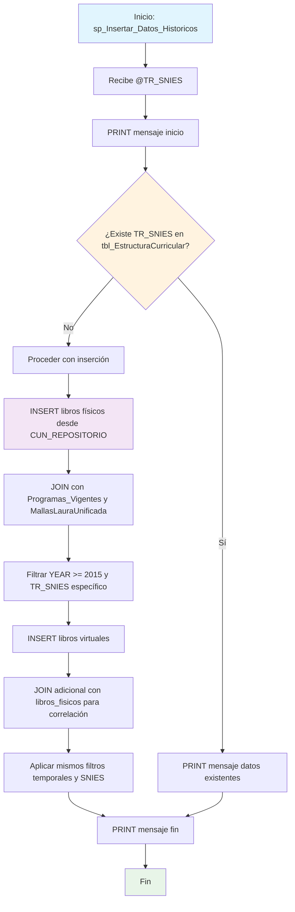

### sp_Insertar_Datos_Historicos

Procedimiento que inserta datos históricos bibliográficos (libros físicos y virtuales) desde 2015 en adelante para un TR_SNIES específico. Valida la existencia previa de estructura curricular antes de proceder y consolida recursos bibliográficos desde múltiples repositorios externos.

#### Diagrama de flujo


#### Procedimiento almacenado
```sql
CREATE PROCEDURE [Dev].[sp_Insertar_Datos_Historicos]
@TR_SNIES VARCHAR(50)
AS
BEGIN

    PRINT 'Inicio de la inserción de datos en [REGISTRO_CALIFICADO].[RCAL].[BibliotecaHist]';

        IF NOT EXISTS (
        SELECT 1
        FROM [REGISTRO_CALIFICADO].[RCAL].[tbl_EstructuraCurricular]
        WHERE TR_SNIES = @TR_SNIES
    )
    BEGIN

    -- Inserción de libros físicos
    INSERT INTO [REGISTRO_CALIFICADO].[RCAL].[BibliotecaHist] (
        [TR_SNIES],
        [TR_Titulo],
        [TR_Autor],
        [TR_Año],
        [TR_SigTopografica],
        [TR_Formato],
        [TR_Tipo_Libro],
        [TR_Fecha_Inicio],
        [TR_AnexoPolitGestBiblioteca],
        [TR_AnexoReglamentoBiblioteca],
        [TR_AnexoInstrucIngBibliVirt],
        [TR_AnexoContBibliVirt],
        [TR_AnexoRecursosbibliograficos],
        [TR_AnexoInforConsRecurBibli],
        [TR_AnexoConvenioInterbibliotecario],
        [TR_AnexoInformeRecursBiblioNac],
        [TR_AnexoProcSelecAdq]
    )
    SELECT DISTINCT
        M.CODIGO_SNIES AS TR_SNIES,
        F.TITULO AS TR_Titulo,
        F.AUTOR AS TR_Autor,
        F.AÑO AS TR_Año,
        F.[SIGNATURA TOPOGRÁFICA] AS TR_SigTopografica,
        F.FORMATO AS TR_Formato,
        'Fisico' AS TR_Tipo_Libro,
        PV.FECHA_INICIO AS TR_Fecha_Inicio,
        'NULL' AS  TR_AnexoPolitGestBiblioteca,
        'NULL' AS TR_AnexoReglamentoBiblioteca,
        'NULL' AS TR_AnexoInstrucIngBibliVirt,
        'NULL' AS TR_AnexoContBibliVirt,
        'NULL' AS TR_AnexoRecursosbibliograficos,
        'NULL' AS TR_AnexoInforConsRecurBibli,
        'NULL' AS TR_AnexoConvenioInterbibliotecario,
        'NULL' AS TR_AnexoInformeRecursBiblioNac,
        'NULL' AS TR_AnexoProcSelecAdq
    FROM
        [CUN_REPOSITORIO].SRUBIO.libros_fisicos F
    JOIN [CUN_REPOSITORIO].[dbo].[Programas_Vigentes] PV
        ON PV.NOMBRE_PROGRAMA = F.PROGRAMA AND PV.SEDE = F.SEDE
    JOIN [REGISTRO_CALIFICADO].[Dev].[MallasLauraUnificada] M
        ON CAST(PV.SNIES AS VARCHAR(50)) = M.CODIGO_SNIES
    LEFT JOIN [REGISTRO_CALIFICADO].[RCAL].[Acta] A
        ON M.CODIGO_SNIES = A.TR_SNIES
    WHERE YEAR(PV.FECHA_INICIO) >= '2015'
    AND M.CODIGO_SNIES = @TR_SNIES;

    -- Inserción de libros virtuales
    INSERT INTO [REGISTRO_CALIFICADO].[RCAL].[BibliotecaHist] (
        [TR_SNIES],
        [TR_Titulo],
        [TR_Autor],
        [TR_Año],
        [TR_SigTopografica],
        [TR_Formato],
        [TR_Tipo_Libro],
        [TR_Fecha_Inicio],
        [TR_AnexoPolitGestBiblioteca],
        [TR_AnexoReglamentoBiblioteca],
        [TR_AnexoInstrucIngBibliVirt],
        [TR_AnexoContBibliVirt],
        [TR_AnexoRecursosbibliograficos],
        [TR_AnexoInforConsRecurBibli],
        [TR_AnexoConvenioInterbibliotecario],
        [TR_AnexoInformeRecursBiblioNac],
        [TR_AnexoProcSelecAdq]
    )
    SELECT DISTINCT
        M.CODIGO_SNIES AS TR_SNIES,
        V.TITULO AS TR_Titulo,
        V.AUTOR AS TR_Autor,
        V.[AÑO PUBLICACION] AS TR_Año,
        'Virtuales' AS [SIGNATURA TOPOGRÁFICA],
        V.FORMATO AS TR_Formato,
        'Virtual' AS TR_Tipo_Libro,
        PV.FECHA_INICIO AS TR_Fecha_Inicio,
        'NULL' AS  TR_AnexoPolitGestBiblioteca,
        'NULL' AS TR_AnexoReglamentoBiblioteca,
        'NULL' AS TR_AnexoInstrucIngBibliVirt,
        'NULL' AS TR_AnexoContBibliVirt,
        'NULL' AS TR_AnexoRecursosbibliograficos,
        'NULL' AS TR_AnexoInforConsRecurBibli,
        'NULL' AS TR_AnexoConvenioInterbibliotecario,
        'NULL' AS TR_AnexoInformeRecursBiblioNac,
        'NULL' AS TR_AnexoProcSelecAdq
    FROM
        [CUN_REPOSITORIO].SRUBIO.libros_virtuales V
    JOIN [CUN_REPOSITORIO].SRUBIO.libros_fisicos F
        ON V.TITULO = F.TITULO
    JOIN [CUN_REPOSITORIO].[dbo].[Programas_Vigentes] PV
        ON PV.NOMBRE_PROGRAMA = F.PROGRAMA AND PV.SEDE = F.SEDE
    JOIN [REGISTRO_CALIFICADO].[Dev].[MallasLauraUnificada] M
        ON CAST(PV.SNIES AS VARCHAR(50)) = M.CODIGO_SNIES
    LEFT JOIN [REGISTRO_CALIFICADO].[RCAL].[Acta] A
        ON M.CODIGO_SNIES = A.TR_SNIES
    WHERE YEAR(PV.FECHA_INICIO) >= '2015'
    AND M.CODIGO_SNIES = @TR_SNIES;

    END
    ELSE
    BEGIN
        PRINT 'Los datos con el TR_SNIES proporcionado ya existen en la tabla destino.';
    END

PRINT 'Fin de la inserción de datos en [REGISTRO_CALIFICADO].[RCAL].[BibliotecaHist]';

END;
```
#### Operaciones Principales

- Validación previa: Verifica existencia en tbl_EstructuraCurricular antes de proceder
- Inserción libros físicos: Primera operación con datos desde CUN_REPOSITORIO.SRUBIO.libros_fisicos
- Correlación programas: JOIN complejo entre libros, programas vigentes y mallas unificadas
- Filtro temporal: Solo registros con FECHA_INICIO >= 2015
- Inserción libros virtuales: Segunda operación correlacionando virtuales con físicos
- Valores predeterminados: Asigna 'NULL' como string a todos los campos de anexos

#### Tablas afectadas

##### Actualizadas:

- REGISTRO_CALIFICADO.RCAL.BibliotecaHist: Tabla destino con datos bibliográficos históricos

##### Consultadas:

- CUN_REPOSITORIO.SRUBIO.libros_fisicos: Fuente de libros físicos
- CUN_REPOSITORIO.SRUBIO.libros_virtuales: Fuente de libros virtuales
- CUN_REPOSITORIO.dbo.Programas_Vigentes: Datos de programas y fechas
- REGISTRO_CALIFICADO.Dev.MallasLauraUnificada: Correlación con códigos SNIES
- REGISTRO_CALIFICADO.RCAL.Acta: Validación adicional (LEFT JOIN)

#### Procedimientos Almacenados Anidados