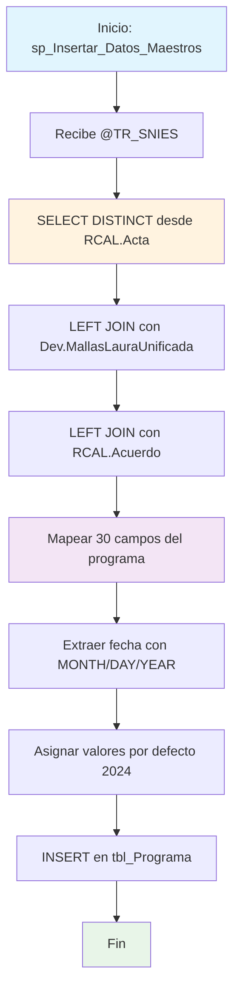

### sp_Insertar_Datos_Maestros

Procedimiento de consolidación que inserta datos maestros de programas académicos en la tabla principal tbl_Programa. Combina información de actas, mallas curriculares y acuerdos institucionales para crear un registro completo del programa con datos académicos y administrativos.

#### Diagrama de flujo


#### Procedimiento almacenado
```sql
CREATE PROCEDURE [Dev].[sp_Insertar_Datos_Maestros]
@TR_SNIES VARCHAR(50)
AS
BEGIN

INSERT INTO [REGISTRO_CALIFICADO].[RCAL].[tbl_Programa] (
[TR_SNIES]
, [TR_NombreProgramaPro]
, [TR_NombreProgramaTP]
, [TR_NombreProgramaTG]
, [TR_TituloPro]
, [TR_TipoRegistro]
, [TR_NombreProgramaProAnt]
, [TR_ModalidadAnt]
, [TR_NombreProgramaEsp]
, [TR_Ciudad]
, [TR_Regionales]
, [TR_CodUnidad]
, [TR_CodRegional]
, [TR_Modalidades]
, [TR_Modalidad]
, [TR_FechaAcuerdo_Mes]
, [TR_FechaAcuerdo_Dia]
, [TR_FechaAcuerdo_Año]
, [TR_NivelFormacion]
, [TR_Duracion]
, [TR_PeriodicidadAdminision]
, [TR_NumeroEstudiantes]
, [TR_AñoActual]
, [F_NumeroAcuerdo]
, [TR_NumeroAcuerdoAnterior]
, [F_SemestreIngreso]
, [F_AñoIngreso]
, [TR_NumeroProgramas]
, [TR_SectorEconomico]
, [TE_AreaFormacion]
)
SELECT distinct
a.TR_SNIES AS TR_SNIES
, a.TR_NombreProgramaPro AS TR_NombreProgramaPro
, a.TR_NombreProgramaTP AS TR_NombreProgramaTP
, a.TR_NombreProgramaTG AS TR_NombreProgramaTG
, a.TR_TituloPro AS TR_TituloPro
, a.TR_TipoRegistro AS TR_TipoRegistro
, a.TR_NombreProgramaPro AS TR_NombreProgramaProAnt
, a.TR_Modalidad AS TR_ModalidadAnt
, a.TR_NombreProgramaEsp AS TR_NombreProgramaEsp
, a.TR_Regionales AS TR_Ciudad
, a.TR_Regionales AS TR_Regionales
, b.COD_UNIDAD AS TR_CodUnidad
, 1 AS TR_CodRegional
, a.TR_Modalidad AS TR_Modalidades
, a.TR_Modalidad AS TR_Modalidad
, MONTH(c.F_FechaAcuerdo) AS TR_FechaAcuerdo_Mes
, DAY(c.F_FechaAcuerdo) AS TR_FechaAcuerdo_Dia
, YEAR(c.F_FechaAcuerdo) AS TR_FechaAcuerdo_Año
, a.TR_Nivel AS TR_NivelFormacion
, a.TR_DuracionPro AS TR_Duracion
, a.TR_PeriocidadAdmision AS TR_PeriodicidadAdminision
, a.TR_EstudiantesPrimerSemestre AS TR_NumeroEstudiantes
, 2024 AS TR_AñoActual
, c.F_NumeroAcuerdo AS F_NumeroAcuerdo
, c.TR_NumAcuerdo_Anterior AS TR_NumeroAcuerdoAnterior
, 1 AS F_SemestreIngreso
, 2024 AS F_AñoIngreso
, b.TOTAL_CREDITOS AS TR_NumeroProgramas
, NULL AS TR_SectorEconomico
, NULL AS TE_AreaFormacion
FROM RCAL.Acta a
LEFT JOIN Dev.MallasLauraUnificada b ON a.TR_SNIES = b.CODIGO_SNIES
LEFT JOIN rcal.Acuerdo c ON a.TR_SNIES = c.TR_SNIES;

END;

```
#### Operaciones Principales

- Consolidación datos: SELECT DISTINCT desde tabla Acta como fuente principal
- Enriquecimiento curricular: LEFT JOIN con MallasLauraUnificada para datos académicos
- Información administrativa: LEFT JOIN con Acuerdo para datos institucionales
- Mapeo completo: Transforma 30 campos con correspondencias específicas
- Procesamiento fechas: Extrae componentes de fecha con funciones MONTH/DAY/YEAR
- Valores predeterminados: Asigna año actual 2024 y códigos por defecto

#### Tablas afectadas

##### Actualizadas:

- REGISTRO_CALIFICADO.RCAL.tbl_Programa: Tabla destino con datos maestros consolidados

##### Consultadas:

- RCAL.Acta: Fuente principal de información del programa
- Dev.MallasLauraUnificada: Datos curriculares y códigos de unidad
- RCAL.Acuerdo: Información de acuerdos y fechas institucionales

#### Procedimientos Almacenados Anidados