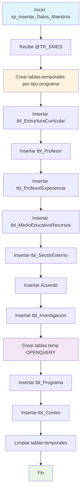

### sp_Insertar_Datos_Maestros_30102024

Procedimiento de inserción masiva de datos maestros que consolida información académica desde múltiples fuentes hacia las tablas principales del esquema RCAL. Procesa datos de estructura curricular, profesores, recursos educativos, convenios, investigación y programas académicos para un código SNIES específico.

#### Diagrama de flujo


#### Procedimiento almacenado
```sql
 -- |sp_Insertar_Datos_Maestros_30102024|-- Procedimiento almacenado con parámetro de entrada @TR_SNIES
CREATE PROCEDURE [Dev].[sp_Insertar_Datos_Maestros_30102024]
@TR_SNIES VARCHAR(50)
AS
BEGIN

PRINT 'Inicio de la inserción de datos en [REGISTRO_CALIFICADO].[RCAL].[tbl_EstructuraCurricular]';

DROP TABLE IF EXISTS #TECNICO;
DROP TABLE IF EXISTS #TECNOLOGO;
DROP TABLE IF EXISTS #PROFESIONAL;
DROP TABLE IF EXISTS #ESPECIALIZACION;
DROP TABLE IF EXISTS #vigente;

-- Crear tabla temporal para Técnico
SELECT \*
INTO #TECNICO
FROM DEV.MallasLauraUnificada
WHERE TIPO_PROGRAMA = 'TECNICO';

-- Crear tabla temporal para Tecnológico
SELECT \*
INTO #TECNOLOGO
FROM DEV.MallasLauraUnificada
WHERE TIPO_PROGRAMA = 'TECNOLOGICO';

-- Crear tabla temporal para Profesional
SELECT \*
INTO #PROFESIONAL
FROM DEV.MallasLauraUnificada
WHERE TIPO_PROGRAMA = 'PROFESIONAL';

-- Crear tabla temporal para Especialización
SELECT \*
INTO #ESPECIALIZACION
FROM DEV.MallasLauraUnificada
WHERE TIPO_PROGRAMA = 'ESPECIALIZACION';

-- Crear tabla temporal para registros vigentes
SELECT \*
INTO #vigente
FROM DEV.MallasLauraUnificada
WHERE ESTADO = 'vigente';

    IF NOT EXISTS (
        SELECT 1
        FROM [REGISTRO_CALIFICADO].[RCAL].[tbl_EstructuraCurricular]
        WHERE TR_SNIES = @TR_SNIES
    )
    BEGIN

-- Inserta los resultados de la consulta en la tabla tbl_EstructuraCurricular

    --INSERT INTO [REGISTRO_CALIFICADO].[RCAL].[tbl_EstructuraCurricular]
    --(
    --    [TR_SNIES],
    --    [TR_CredProgramTotal],
    --    [TR_AsignaturasPropedeuticas],
    --    [TR_CreditosPropedeuticos],
    --    [TR_Modalidades],
    --    [TR_Regionales],
    --    [TR_DuracionTP],
    --    [TR_ModalidadAnt],
    --    [TR_CreditosTP],
    --    [TR_CreditosTG],
    --    [TR_NivelInglesTG],
    --    [TR_NivelInglesTP],
    --    [TR_NivelInglesPro],
    --    [TR_Modalidad],
    --    [TR_Duracion],
    --    [Cal_UnidadPeriodicidad],
    --    [TR_CreditosPro],
    --    [TR_NivelInglesEsp],
    --    [TR_DuracionPro],
    --    [TR_DuracionTG],
    --    [TR_AñoActual],
    --    [TR_ListaMaterias],
    --    [TR_ListaMateria_Creditos],
    --    [TR_ListaMateria_Horas],
    --    [TR_CreditosAcademicos],
    --    [TR_CreditosElectivos],
    --    [TR_CreditosDisciplinar],
    --    [TR_TotalCreditos],
    --    [TE_CursosTransversal],
    --    [TE_CursosElectivo],
    --    [TE_CursoDisciplinar],
    --    [TE_CursosComplementario],
    --    [TE_CursosProfundizacion],
    --    [TR_CursosTransversales],
    --    [TR_CursosDisciplinares],
    --    [TR_CursosElectivas],
    --    [TR_CursosInvestigacion],
    --    [TR_CursoIntegracion],
    --    [TR_CursoProyectoI],
    --    [TR_CursoProyectoII],
    --    [TE_PerfilEgreso],
    --    [TE_PerfilIngreso],
    --    [TE_PerfilOcupacional],
    --    [TE_PerfilProfesional],
    --    [TR_RAE],
    --    [TE_RAE],
    --    [TE_Componente],
    --    [TR_NivelFormacion]
    --)
    SELECT
        @TR_SNIES AS TR_SNIES,
        a.TOTAL_CREDITOS AS TR_CredProgramTotal,
        1 AS TR_AsignaturasPropedeuticas,
        1 AS TR_CreditosPropedeuticos,
        a.MODALIDAD AS TR_Modalidades,
        1 AS TR_Regionales,
        2 AS TR_DuracionTP,
        1 AS TR_ModalidadAnt,
        c.TOTAL_CREDITOS AS TR_CreditosTP,
        d.TOTAL_CREDITOS AS TR_CreditosTG,
        1 AS TR_NivelInglesTG,
        1 AS TR_NivelInglesTP,
        1 AS TR_NivelInglesPro,
        a.MODALIDAD AS TR_Modalidad,
        1 AS TR_Duracion,
        1 AS Cal_UnidadPeriodicidad,
        e.TOTAL_CREDITOS AS TR_CreditosPro,
        1 AS TR_NivelInglesEsp,
        5 AS TR_DuracionPro,
        3 AS TR_DuracionTG,
        YEAR(GETDATE()) AS TR_AñoActual,
        b.NOM_MATERIA AS TR_ListaMaterias,
        b.UNI_TEORICA AS TR_ListaMateria_Creditos,
        b.INT_HORARIA AS TR_ListaMateria_Horas,
        b.UNI_TEORICA AS TR_CreditosAcademicos,
        1 AS TR_CreditosElectivos,
        1 AS TR_CreditosDisciplinar,
        a.TOTAL_CREDITOS AS TR_TotalCreditos,
        1 AS TE_CursosTransversal,
        1 AS TE_CursosElectivo,
        1 AS TE_CursoDisciplinar,
        1 AS TE_CursosComplementario,
        1 AS TE_CursosProfundizacion,
        1 AS TR_CursosTransversales,
        1 AS TR_CursosDisciplinares,
        1 AS TR_CursosElectivas,
        1 AS TR_CursosInvestigacion,
        1 AS TR_CursoIntegracion,
        1 AS TR_CursoProyectoI,
        1 AS TR_CursoProyectoII,
        'PerfilEgreso' AS TE_PerfilEgreso,
        'PerfilIngreso' AS TE_PerfilIngreso,
        'PerfilOcupacional' AS TE_PerfilOcupacional,
        'PerfilProfesional' AS TE_PerfilProfesional,
        1 AS TR_RAE,
        1 AS TE_RAE,
        1 AS TE_Componente,
        a.TIPO_PROGRAMA AS TR_NivelFormacion
    FROM #vigente a
    LEFT JOIN RCAL.Pensum b ON a.PENSUM = b.COD_PENSUM AND a.COD_UNIDAD = b.COD_UNIDAD
    LEFT JOIN #TECNICO c ON a.PENSUM = c.PENSUM AND a.COD_UNIDAD = c.COD_UNIDAD
    LEFT JOIN #TECNOLOGO d ON a.COD_UNIDAD = d.COD_UNIDAD AND a.PENSUM = d.PENSUM
    LEFT JOIN #PROFESIONAL e ON a.PENSUM = e.PENSUM AND a.COD_UNIDAD = e.COD_UNIDAD
    WHERE a.ESTADO = 'VIGENTE' AND a.CODIGO_SNIES = @TR_SNIES;

    END
    ELSE
    BEGIN
        PRINT 'Los datos con el TR_SNIES proporcionado ya existen en la tabla destino.';
    END

PRINT 'Fin de la inserción de datos en [REGISTRO_CALIFICADO].[RCAL].[tbl_EstructuraCurricular]';

PRINT 'Inicio de la inserción de datos en [REGISTRO_CALIFICADO].[RCAL].[tbl_Profesor]';

    IF NOT EXISTS (
        SELECT 1
        FROM [REGISTRO_CALIFICADO].[RCAL].[tbl_Profesor]
        WHERE TR_SNIES = @TR_SNIES
    )
    BEGIN


    --INSERT INTO [REGISTRO_CALIFICADO].[RCAL].[tbl_Profesor] (
    --      [TR_SNIES]
    --    , [TR_Profesor_Id]
    --    , [TR_NombreProfesor]
    --    , [TR_FormacionAcadm]
    --    , [TR_TipoVinculacion]
    --    , [TR_FormacionPedag]
    --    , [TE_FormacionVirtual]
    --    , [TR_Dedicacion]
    --    , [TR_Docencia]
    --    , [TR_investigacion]
    --    , [TR_ProySocial]
    --    , [TR_Otros]
    --    , [TR_NumeroDocentesTiempoComplt]
    --    , [TR_NumeroDocentesMedioTiempo]
    --    , [TR_Escuela]
    --    , [TR_AreaConocimiento]
    --    , [TR_ExpProfesional_años]
    --    , [TR_ExpDocente_años]
    --    , [TR_CyLac]
    --    , [TR_horasAsignadas]
    --    , [TR_NumeroDocentes]
    --    , [TR_Vinculacion]
    --    , [TR_Modificacion]
    --    , [TR_Antiguedadinst]
    --)
    SELECT DISTINCT
          b.CODIGO_SNIES as TR_SNIES
        , a.NUM_IDENTIFICACION as TR_Profesor_Id
        , a.NOM_LARGO as TR_NombreProfesor
        , c.Formacion as TR_FormacionAcadm
        , c.Descripcion_Clase_Nomina AS TR_TipoVinculacion
        , 1 AS [TR_FormacionPedag] -- Valor por defecto
        , 1 AS [TE_FormacionVirtual] -- Valor por defecto
        , c.Descripcion_Clase_Nomina AS TR_Dedicacion
        , 1 AS [TR_Docencia] -- Valor por defecto
        , 1 AS [TR_investigacion] -- Valor por defecto
        , 1 AS [TR_ProySocial] -- Valor por defecto
        , 1 AS [TR_Otros] -- Valor por defecto
        , 1 AS [TR_NumeroDocentesTiempoComplt] -- Valor por defecto
        , 1 AS [TR_NumeroDocentesMedioTiempo] -- Valor por defecto
        , D.TR_NomDependencia AS TR_Escuela
        , c.Nombre_Centro_Costo AS [TR_AreaConocimiento] -- Valor por defecto
        , f.[Experiencia Profesional] AS [TR_ExpProfesional_años] -- Valor por defecto
        , f.Docencia AS [TR_ExpDocente_años] -- Valor por defecto
        , CAST(E.OBS_REST AS nvarchar(max)) AS TR_CyLac
        , CASE
            WHEN c.Descripcion_Clase_Nomina = 'DOCENTES TIEMPO COMPLETO' THEN 8
            ELSE 6
          END AS TR_horasAsignadas
        , 1 AS [TR_NumeroDocentes] -- Valor por defecto
        , c.Descripcion_Clase_Nomina AS TR_Vinculacion
        , 1 AS [TR_Modificacion] -- Valor por defecto
        , CONCAT(
            FLOOR(DATEDIFF(DAY, c.Fecha_Inicio, GETDATE()) / 365), ' años y ',
            DATEDIFF(DAY, c.Fecha_Inicio, GETDATE()) % 365, ' días'
        ) AS TR_Antiguedadinst
    FROM
        REGISTRO_CALIFICADO.[dev].[Profesores_Consolidado] a
    left JOIN
        [REGISTRO_CALIFICADO].[Dev].[MallasLauraUnificada] b
        ON a.COD_UNIDAD = b.COD_UNIDAD
    LEFT JOIN
        [CUN_REPOSITORIO].dbo.[PLANTA_ACTIVA_DOCENTES_ACTIVOS] c
        ON a.NUM_IDENTIFICACION = c.Identificacion
    LEFT JOIN
        REGISTRO_CALIFICADO.rcal.tbl_Escuelas d
        ON A.COD_UNIDAD = D.TR_CodUnidad
    LEFT JOIN
        [Dev].[kactus_BI_EMPLE] e
        ON E.COD_EMPL  = A.NUM_IDENTIFICACION
    LEFT JOIN
       [CUN_REPOSITORIO].[dbo].[Experiencia_docentes]   f
       on a.NUM_IDENTIFICACION = f.Identificacion
    WHERE
        a.COD_UNIDAD IN (SELECT DISTINCT COD_UNIDAD
                         FROM [REGISTRO_CALIFICADO].[Dev].[MallasLauraUnificada]
                         WHERE ESTADO = 'VIGENTE')
    AND
        a.NUM_IDENTIFICACION IS NOT NULL
    AND
        b.CODIGO_SNIES = @TR_SNIES;

    END
    ELSE
    BEGIN
        PRINT 'Los datos con el TR_SNIES proporcionado ya existen en la tabla destino.';
    END

PRINT 'Fin de la inserción de datos en [REGISTRO_CALIFICADO].[RCAL].[tbl_Profesor]';

PRINT 'Inicio de la inserción de datos en [REGISTRO_CALIFICADO].[RCAL].[tbl_ProfesorExperiencia]';

--INSERT INTO [REGISTRO_CALIFICADO].[RCAL].[tbl_ProfesorExperiencia]
-- ([TR_Profesor_id]
-- ,[TR_NombreDocente]
-- ,[TR_NivelFormacion]
-- ,[TR_Escalafon]
-- ,[TR_TipoContrato]
-- ,[TR_Dedicacion]
-- ,[TR_ExpProfesional]
-- ,[TR_ExpDocente]
-- ,[TR_AntiguedadInstAnos])
SELECT DISTINCT
a.NUM_IDENTIFICACION as TR_Profesor_id
, a.NOM_LARGO as TR_NombreDocente
, c.Formacion as TR_NivelFormacion
, c.Escalafon as TR_Escalafon
, c.Descripcion_Clase_Nomina AS TR_TipoContrato
, c.Descripcion_Clase_Nomina AS TR_Dedicacion
, f.[Experiencia Profesional] AS TR_ExpProfesional -- Valor por defecto
, f.Docencia AS TR_ExpDocente -- Valor por defecto
, CONCAT(
FLOOR(DATEDIFF(DAY, c.Fecha_Inicio, GETDATE()) / 365), ' años y ',
DATEDIFF(DAY, c.Fecha_Inicio, GETDATE()) % 365, ' días'
) AS TR_AntiguedadInstAnos
FROM
REGISTRO_CALIFICADO.[dev].[Profesores_Consolidado] a
LEFT JOIN
[REGISTRO_CALIFICADO].[Dev].[MallasLauraUnificada] b
ON a.COD_UNIDAD = b.COD_UNIDAD
LEFT JOIN
[CUN_REPOSITORIO].dbo.[PLANTA_ACTIVA_DOCENTES_ACTIVOS] c
ON a.NUM_IDENTIFICACION = c.Identificacion
LEFT JOIN
REGISTRO_CALIFICADO.rcal.tbl_Escuelas d
ON a.COD_UNIDAD = d.TR_CodUnidad
LEFT JOIN
[Dev].[kactus_BI_EMPLE] e
ON e.COD_EMPL = a.NUM_IDENTIFICACION
LEFT JOIN
[CUN_REPOSITORIO].[dbo].[Experiencia_docentes] f
ON a.NUM_IDENTIFICACION = f.Identificacion
WHERE
a.COD_UNIDAD IN (SELECT DISTINCT COD_UNIDAD
FROM [REGISTRO_CALIFICADO].[Dev].[MallasLauraUnificada]
WHERE ESTADO = 'VIGENTE')
AND
a.NUM_IDENTIFICACION IS NOT NULL
AND
B.CODIGO_SNIES = @TR_SNIES ;

PRINT 'Fin de la inserción de datos en [REGISTRO_CALIFICADO].[RCAL].[tbl_ProfesorExperiencia]';

PRINT 'Inicio de la inserción de datos en [REGISTRO_CALIFICADO].[RCAL].[tbl_MedioEducativoRecursos]';

    IF NOT EXISTS (
        SELECT 1
        FROM [REGISTRO_CALIFICADO].[RCAL].[tbl_MedioEducativoRecursos]
        WHERE TR_SNIES = @TR_SNIES
    )
    BEGIN

    ----INSERT INTO rcal.tbl_MedioEducativoRecursos
    ----    (TR_SNIES, TR_Titulo, TR_Autor, TR_Año, TR_SigTopografica, TR_Formato, TR_Tipo_Libro)
    SELECT DISTINCT
        @TR_SNIES AS TR_SNIES,
        F.TITULO,
        F.AUTOR,
        F.AÑO,
        F.[SIGNATURA TOPOGRÁFICA],
        F.FORMATO,
        'Fisico' AS TIPO_LIBRO
    FROM
        [CUN_REPOSITORIO].SRUBIO.libros_fisicos F
    JOIN [CUN_REPOSITORIO].[dbo].[Programas_Vigentes] PV
        ON PV.NOMBRE_PROGRAMA = F.PROGRAMA AND PV.SEDE = F.SEDE
    JOIN [REGISTRO_CALIFICADO].[Dev].[MallasLauraUnificada] M
        ON CAST(PV.SNIES AS VARCHAR(50)) = M.CODIGO_SNIES
    LEFT JOIN [REGISTRO_CALIFICADO].[RCAL].[Acta] A
        ON M.CODIGO_SNIES = A.TR_SNIES
    WHERE M.CODIGO_SNIES = @TR_SNIES

    UNION ALL

    -- Insertar datos de libros virtuales en la tabla RCAL.tbl_MedioEducativoRecursos

    SELECT DISTINCT
        @TR_SNIES AS TR_SNIES,
        V.TITULO,
        V.AUTOR,
        V.[AÑO PUBLICACION] AS AÑO,
        'Virtuales' AS [SIGNATURA TOPOGRÁFICA],
        V.FORMATO,
        'Virtual' AS TIPO_LIBRO
    FROM
        [CUN_REPOSITORIO].SRUBIO.libros_virtuales V
    JOIN [CUN_REPOSITORIO].SRUBIO.libros_fisicos F
        ON V.TITULO = F.TITULO
    JOIN [CUN_REPOSITORIO].[dbo].[Programas_Vigentes] PV
        ON PV.NOMBRE_PROGRAMA = F.PROGRAMA AND PV.SEDE = F.SEDE
    JOIN [REGISTRO_CALIFICADO].[Dev].[MallasLauraUnificada] M
        ON CAST(PV.SNIES AS VARCHAR(50)) = M.CODIGO_SNIES
    LEFT JOIN [REGISTRO_CALIFICADO].[RCAL].[Acta] A
        ON M.CODIGO_SNIES = A.TR_SNIES
    WHERE M.CODIGO_SNIES = @TR_SNIES

    --   	 SELECT DISTINCT  b.SNIES as TR_SNIES
    --	, a.TITULO as TR_Titulo
    --	, A.AUTOR AS TR_Autor
    --	, A.AÑO AS TR_Año
    --	, a.[SIGNATURA TOPOGRÁFICA] as TR_SigTopografica
    --	, a.FORMATO as TR_Formato
    --	, 1 as TR_Mbps
    --	, 1 as TR_TipoModificacion

    --	FROM [CUN_REPOSITORIO].SRUBIO.libros_fisicos a
    --	left join [CUN_REPOSITORIO].[dbo].[Programas_Vigentes] b

-- ON A.PROGRAMA = B.NOMBRE_PROGRAMA
-- left join [CUN_REPOSITORIO].SRUBIO.libros_virtuales c
-- on a.TITULO = c.TITULO

    --select  DISTINCT  B.TITULO , B.AUTOR , B.EDITORIAL , B.[AÑO PUBLICACION], B.TEMA , B.MATERIA , B.[URL] , B.FORMATO , B.ORIGEN_EXCEL  into #VIRTUALES  from [CUN_REPOSITORIO].SRUBIO.libros_fisicos a
    --left join [CUN_REPOSITORIO].SRUBIO.libros_virtuales b
    --on a.TITULO = b.TITULO

    END
    ELSE
    BEGIN
        PRINT 'Los datos con el TR_SNIES proporcionado ya existen en la tabla destino.';
    END

PRINT 'Fin de la inserción de datos en [REGISTRO_CALIFICADO].[RCAL].[tbl_MedioEducativoRecursos]';

PRINT 'Inicio de la inserción de datos en [REGISTRO_CALIFICADO].[RCAL].[tbl_SectorExterno]';

-- Inserta datos desde Convenios_Regionales_Practicas
-- INSERT INTO RCAL.tbl_SectorExterno (TE_ConvenioRegional, TR_Fecha_Inicio_Vigencia_Regional, TR_Fecha_Fin_Vigencia_Regional, TR_Estado)
-- SELECT Tipo_de_Convenio_Regional, Inicio_de_Vigencia_Regional, Fin_de_Vigencia_Regional, Estado
-- FROM [CUN_REPOSITORIO].[dbo].[Convenios_Regionales_Practicas]
--WHERE Estado = 'Vigente'

-- -- Inserta datos desde Convenios_Externos_Practicas
-- INSERT INTO RCAL.tbl_SectorExterno (TR_ConvenioVigente, TR_Fecha_Inicio_Vigencia, TR_Fecha_Fin_Vigencia, TR_Estado)
-- SELECT Tipo_de_Contrato, Inicio_de_Vigencia, Fin_de_Vigencia, Estado
-- FROM [CUN_REPOSITORIO].[dbo].[Convenios_Externos_Practicas]

PRINT 'Fin de la inserción de datos en [REGISTRO_CALIFICADO].[RCAL].[tbl_SectorExterno]';

PRINT 'Inicio de la inserción de datos en [REGISTRO_CALIFICADO].[RCAL].[Acuerdo]';

    IF NOT EXISTS (
        SELECT 1
        FROM [REGISTRO_CALIFICADO].[RCAL].[Acuerdo]
        WHERE TR_SNIES = @TR_SNIES
    )
    BEGIN

--DECLARE @TR_SNIES VARCHAR(50) ='2024010'
-- Insertar datos en la tabla Acuerdo
--INSERT INTO [REGISTRO_CALIFICADO].[RCAL].[Acuerdo] (
-- TR_NumeroActa,
-- F_NumeroAcuerdo,
-- F_FechaAcuerdo,
-- TR_FechaActa,
-- TR_TipoAcuerdo,
-- TR_NumAcuerdo_Anterior,
-- TR_SNIES
--)

    SELECT DISTINCT
    A.TR_NumeroActa  AS TR_NumeroActa,
    1 AS F_NumeroAcuerdo,
    1 AS F_FechaAcuerdo,
    A.TR_FechaActa AS TR_FechaActa,
    1 AS TR_TipoAcuerdo,
    1 AS TR_NumAcuerdo_Anterior,
    @TR_SNIES AS TR_SNIES
    FROM [RCAL].[Acta] A
    WHERE A.TR_SNIES =@TR_SNIES;


    END
    ELSE
    BEGIN
        PRINT 'Los datos con el TR_SNIES proporcionado ya existen en la tabla destino.';
    END

PRINT 'Fin de la inserción de datos en [REGISTRO_CALIFICADO].[RCAL].[Acuerdo]';

PRINT 'Inicio de la inserción de datos en [REGISTRO_CALIFICADO].[RCAL].[tbl_Investigacion]';

    IF NOT EXISTS (
        SELECT 1
        FROM [REGISTRO_CALIFICADO].[RCAL].[tbl_Investigacion]
        WHERE TR_SNIES = @TR_SNIES
    )
    BEGIN

-- Insertar el resultado de la consulta en la tabla tbl_Investigacion
--INSERT INTO [REGISTRO_CALIFICADO].[RCAL].[tbl_Investigacion]
-- ([TR_SNIES], [TR_Escuela], [TR_CursosInvestg], [TR_DescripLineasEscu], [TR_DescrpLineasPrograma])
SELECT
c.CODIGO_SNIES AS TR_SNIES,
b.TR_NomDependencia AS TR_Escuela,
CASE
WHEN c.TIPO_PROGRAMA LIKE '%PROFESIONAL%' THEN 'Investigacion ciencia y tecnologia'
WHEN c.TIPO_PROGRAMA LIKE '%TECNOLOGICO%' THEN 'Creatividad y pensamiento innovador'
WHEN c.TIPO_PROGRAMA LIKE '%TECNICO%' THEN 'Explorar para investigar'
ELSE 'Seminario 1 y 2'
END AS TR_CursosInvestg,
a.LINEAS_DE_ESCUELA AS TR_DescripLineasEscu,
a.LINEAS_DE_PROGRAMA AS TR_DescrpLineasPrograma
FROM [CUN_REPOSITORIO].[dbo].[Lineas_Escuela_y_Programas] a
LEFT JOIN [RCAL].[tbl_Escuelas] b
ON a.[ESCUELA ] = b.TR_NomDependencia
LEFT JOIN [DEV].[MallasLauraUnificada] c
ON b.TR_Pensum = c.PENSUM
AND b.TR_CodUnidad = c.COD_UNIDAD
WHERE c.ESTADO = 'VIGENTE'
AND c.CODIGO_SNIES = @TR_SNIES;

    END
    ELSE
    BEGIN
        PRINT 'Los datos con el TR_SNIES proporcionado ya existen en la tabla destino.';
    END

PRINT 'Fin de la inserción de datos en [REGISTRO_CALIFICADO].[RCAL].[tbl_Investigacion]';

    PRINT 'Inicio de la inserción de datos en [REGISTRO_CALIFICADO].[RCAL].[tbl_Programa]';

    -- Crear tablas temporales con datos desde el servidor remoto
    SELECT *
    INTO #Tmp_Seccional
    FROM OPENQUERY([172.16.1.175], 'SELECT * FROM sinu.src_seccional');

    SELECT *
    INTO #Tmp_Sedes
    FROM OPENQUERY([172.16.1.175], 'SELECT * FROM sinu.src_sede');

    SELECT *
    INTO #Tmp_Academica
    FROM OPENQUERY([172.16.1.175], 'SELECT * FROM src_uni_academica');

    SELECT *
    INTO #Tmp_NivelFormacion
    FROM OPENQUERY([172.16.1.175],
    'SELECT g.nom_tabla AS Ciclo, u.*
     FROM src_uni_academica u
     INNER JOIN src_generica g ON g.tip_tabla = u.cod_nivel_for AND g.cod_tabla = u.niv_formacion');

    SELECT *
    INTO #Tmp_AreaFormacion
    FROM OPENQUERY([172.16.1.175],
    'SELECT DISTINCT a.id_are_conocimiento, a.COD_UNIDAD, b.nom_area
     FROM src_uni_academica a
     INNER JOIN src_are_conocimiento b ON a.id_are_conocimiento = b.id_are_conocimiento');


        IF NOT EXISTS (
        SELECT 1
        FROM [REGISTRO_CALIFICADO].[RCAL].[tbl_Programa]
        WHERE TR_SNIES = @TR_SNIES
    )
    BEGIN

    -- Insertar datos en la tabla Programa, filtrando por el parámetro de entrada @TR_SNIES
    /*INSERT INTO RCAL.Programa (
        TR_SNIES,
        TR_NombreProgramaPro,
        TR_NombreProgramaTP,
        TR_NombreProgramaTG,
        TR_TituloPro,
        TR_NombreProgramaProAnt,
        TR_ModalidadAnt,
        TR_NombreProgramaEsp,
        TR_Ciudad,
        TR_Regionales,
        TR_CodUnidad,
        TR_CodRegional,
        TR_Modalidades,
        TR_Modalidad,
        TR_FechaAcuerdo_Mes,
        TR_FechaAcuerdo_Dia,
        TR_FechaAcuerdo_Año,
        TR_NivelFormacion,
        TR_Duracion,
        TR_PeriodicidadAdminision,
        TR_EstudiantesPrimerSemestre,
        TR_AñoActual,
        F_NumeroAcuerdo,
        TR_NumeroAcuerdoAnterior,
        F_SemestreIngreso,
        F_AñoIngreso,
        NumeroProgramas,
        SectorEconomico,
        TE_AreaFormacion
    )*/
    SELECT DISTINCT
        @TR_SNIES AS TR_SNIES,
        M.NOMBRE_DEL_PROGRAMA AS TR_NombreProgramaPro,
        AC.TR_NombreProgramaTP AS TR_NombreProgramaTP,
        AC.TR_NombreProgramaTG AS TR_NombreProgramaTG,
        M.TITULO_OTORGADO AS TR_TituloPro,
    AC.TR_TipoRegistro AS TR_TipoRegistro,
        1 AS TR_NombreProgramaProAnt,
        1 AS TR_ModalidadAnt,
        AC.TR_NombreProgramaEsp AS TR_NombreProgramaEsp,
        AC.TR_Regionales AS TR_Ciudad,
        ss.NOM_SECCIONAL AS TR_Regionales,
        M.COD_UNIDAD AS TR_CodUnidad,
        ss.ID_SECCIONAL AS TR_CodRegional,
        AC.TR_Modalidad AS TR_Modalidades,
        M.MODALIDAD AS TR_Modalidad,
        MONTH(AD.F_FechaAcuerdo) AS TR_FechaAcuerdo_Mes,
        DAY(AD.F_FechaAcuerdo) AS TR_FechaAcuerdo_Dia,
        YEAR(AD.F_FechaAcuerdo) AS TR_FechaAcuerdo_Año,
        NF.Ciclo AS TR_NivelFormacion,
        M.NIVELES AS TR_Duracion,
        AC.TR_PeriocidadAdmision AS TR_PeriodicidadAdminision,
        AC.TR_EstudiantesPrimerSemestre AS TR_EstudiantesPrimerSemestre,
        YEAR(GETDATE()) AS TR_AñoActual,
        AD.F_NumeroAcuerdo AS F_NumeroAcuerdo,
        1 AS TR_NumeroAcuerdoAnterior,
        1 AS F_SemestreIngreso,
        YEAR(GETDATE()) AS F_AñoIngreso,
        1 AS NumeroProgramas,
        1  AS SectorEconomico,
        AF.nom_area AS TE_AreaFormacion
    FROM
        [Dev].[MallasLauraUnificada] M
    LEFT JOIN [REGISTRO_CALIFICADO].[RCAL].[Acta] AC ON M.CODIGO_SNIES = AC.TR_SNIES
    LEFT JOIN [RCAL].[Acuerdo] AD ON AD.TR_SNIES = AC.TR_SNIES
    LEFT JOIN #Tmp_Academica A ON A.COD_UNIDAD = M.COD_UNIDAD
    LEFT JOIN #Tmp_Sedes S ON S.ID_SEDE = A.ID_SEDE
    LEFT JOIN #Tmp_Seccional ss ON ss.ID_SECCIONAL = S.ID_SECCIONAL
    LEFT JOIN #Tmp_NivelFormacion NF ON NF.COD_UNIDAD = M.COD_UNIDAD
    LEFT JOIN #Tmp_AreaFormacion AF ON AF.COD_UNIDAD = M.COD_UNIDAD
    WHERE M.CODIGO_SNIES = @TR_SNIES;

    -- Limpiar tablas temporales
    DROP TABLE #Tmp_Seccional, #Tmp_Sedes, #Tmp_Academica, #Tmp_NivelFormacion, #Tmp_AreaFormacion;

    END
    ELSE
    BEGIN
        PRINT 'Los datos con el TR_SNIES proporcionado ya existen en la tabla destino.';
    END

     PRINT 'Fin de la inserción de datos en [REGISTRO_CALIFICADO].[RCAL].[tbl_Programa]';

     PRINT 'Inicio de la inserción de datos en [REGISTRO_CALIFICADO].[RCAL].[tbl_Conteo]';

     INSERT INTO [RCAL].[tbl_Conteo]
     SELECT a.TR_SNIES,
    	    a.TR_Maximo,
    		a.TR_Minimo,
    		a.TR_TotalProfesores,
    		a.TR_NroEncuentros
    FROM [RCAL].[tbl_Conteo] a
    JOIN [RCAL].[Acta] b
    	ON a.TR_SNIES = b.TR_SNIES
    JOIN [Dev].[MallasLauraUnificada] c
    	ON C.CODIGO_SNIES = B.TR_SNIES
    WHERE a.TR_SNIES = '54639'

     PRINT 'Fin de la inserción de datos en [REGISTRO_CALIFICADO].[RCAL].[tbl_Conteo]';

END;

```
#### Operaciones Principales

- Creación tablas temporales: Genera #TECNICO, #TECNOLOGO, #PROFESIONAL, #ESPECIALIZACION, #vigente
- Validación existencia: Verifica si ya existen datos para el SNIES antes de insertar
- Inserción estructura curricular: Mapea datos desde MallasLauraUnificada con JOINs complejos
- Inserción profesores: Consolida datos de múltiples fuentes con experiencia y vinculación
- Inserción recursos: Procesa libros físicos y virtuales con UNION ALL
- Consultas remotas: Utiliza OPENQUERY para obtener datos del servidor 172.16.1.175

#### Tablas afectadas

##### Destino (8 tablas):

- RCAL.tbl_EstructuraCurricular: Estructura curricular académica
- RCAL.tbl_Profesor: Información docente
- RCAL.tbl_ProfesorExperiencia: Experiencia profesional y académica
- RCAL.tbl_MedioEducativoRecursos: Recursos bibliográficos
- RCAL.tbl_SectorExterno: Convenios externos
- RCAL.Acuerdo: Acuerdos institucionales
- RCAL.tbl_Investigacion: Líneas de investigación
- RCAL.tbl_Programa: Información general del programa

##### Fuente (15+ tablas):

- Dev.MallasLauraUnificada: Fuente principal de mallas curriculares
- CUN_REPOSITORIO.dbo.PLANTA_ACTIVA_DOCENTES_ACTIVOS: Datos docentes
- CUN_REPOSITORIO.SRUBIO.libros_fisicos/virtuales: Recursos bibliográficos
- Tablas remotas via OPENQUERY: src_seccional, src_sede, src_uni_academica

#### Procedimientos Almacenados Anidados