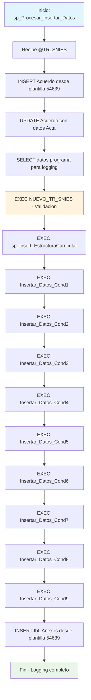

### sp_Procesar_Insertar_Datos

Procedimiento orquestador que ejecuta secuencialmente todos los procesos de inserción de datos académicos para las 9 condiciones de registro calificado. Coordina la ejecución completa del pipeline de datos desde validación inicial hasta inserción de anexos para un código SNIES específico.

#### Diagrama de flujo


#### Procedimiento almacenado
```sql
CREATE PROCEDURE [Dev].[sp_Procesar_Insertar_Datos]
@TR_SNIES VARCHAR(50)
AS
BEGIN
-- Variable para almacenar los datos de la tabla Acta
DECLARE @TR_NombreProgramaPro VARCHAR(MAX),
@TR_Proceso VARCHAR(MAX),
@TR_Ciclo VARCHAR(MAX),
@ExisteActa INT = 0;

    	insert into [REGISTRO_CALIFICADO].[RCAL].[Acuerdo]
    	SELECT  [TR_NumeroActa]
    		  ,[F_NumeroAcuerdo]
    		  ,[F_FechaAcuerdo]
    		  ,[TR_FechaActa]
    		  ,[TR_TipoAcuerdo]
    		  ,[F_NumeroAcuerdo] as [TR_NumAcuerdo_Anterior]
    		  ,@TR_SNIES
    	  FROM [REGISTRO_CALIFICADO].[RCAL].[Acuerdo]
    	  where TR_SNIES = '54639'

    		UPDATE b
    		SET
    			b.TR_NumeroActa = a.TR_NumeroActa,
    			b.TR_FechaActa = TRY_CONVERT(DATE, a.TR_FechaActa)
    		FROM
    			RCAL.Acta a
    		LEFT JOIN
    			RCAL.Acuerdo b
    		ON
    			a.TR_SNIES = b.TR_SNIES
    		WHERE
    			b.TR_SNIES = @TR_SNIES;


           SELECT @TR_NombreProgramaPro = TR_NombreProgramaPro,
               @TR_Proceso = TR_Proceso,
               @TR_Ciclo = TR_Ciclo
        FROM [REGISTRO_CALIFICADO].[RCAL].[Acta]
        WHERE TR_NumeroActa = @TR_SNIES;

    	--INSERT INTO [REGISTRO_CALIFICADO].[RCAL].[tbl_Investigacion]
    	--SELECT @TR_SNIES AS [TR_SNIES],[TR_Escuela],[TR_CursosInvestg],[TR_DescripLineasEscu],[TR_DescrpLineasPrograma]
    	--	FROM [REGISTRO_CALIFICADO].[RCAL].[tbl_Investigacion] WHERE TR_SNIES ='54639'

    -- Mostrar el mensaje de inicio
    PRINT 'Inicio de Ejecución del proceso para la carrera: ' + @TR_NombreProgramaPro +
          ' para el tipo de proceso: ' + @TR_Proceso +
          ' en el ciclo: ' + @TR_Ciclo;

-- Ejecutar los procedimientos almacenados con el parámetro @TR_SNIES
PRINT 'Validacion de Datos NUEVO Inicio'
EXEC [DEV].[NUEVO_TR_SNIES] @TR_SNIES;
PRINT 'Validacion de Datos NUEVO Fin '

    PRINT 'Inicio de Ejecucion Estructura Curricular'
    EXEC sp_Insert_EstructuraCurricular @TR_SNIES
    PRINT 'Fin de Ejecucion Estructura Curricular'

    PRINT 'Inicio Ejecución de Inserción de Datos Condición 1 '
    EXEC [Dev].[Insertar_Datos_Cond1] @TR_SNIES;
    PRINT 'Fin Ejecución de Inserción de Datos Condición 1 '

    PRINT 'Inicio Ejecución de Inserción de Datos Condición 2 '
    EXEC [Dev].[Insertar_Datos_Cond2] @TR_SNIES;
    PRINT 'Fin Ejecución de Inserción de Datos Condición 2 '

    PRINT 'Inicio Ejecución de Inserción de Datos Condición 3 '
    EXEC [Dev].[Insertar_Datos_Cond3] @TR_SNIES;
    PRINT 'Inicio Ejecución de Inserción de Datos Condición 3 '

    PRINT 'Inicio Ejecución de Inserción de Datos Condición 4 '

EXEC [Dev].[Insertar_Datos_Cond4] @TR_SNIES;
PRINT 'Fin Ejecución de Inserción de Datos Condición 4 '

    PRINT 'Inicio Ejecución de Inserción de Datos Condición 5 '
    EXEC [Dev].[Insertar_Datos_Cond5] @TR_SNIES;
    PRINT 'Fin Ejecución de Inserción de Datos Condición 5 '

    PRINT 'Inicio Ejecución de Inserción de Datos Condición 6 '

EXEC [Dev].[Insertar_Datos_Cond6] @TR_SNIES;
PRINT 'Fin Ejecución de Inserción de Datos Condición 6 '

    PRINT 'Inicio Ejecución de Inserción de Datos Condición 7 '

EXEC [Dev].[Insertar_Datos_Cond7] @TR_SNIES;
PRINT 'Fin Ejecución de Inserción de Datos Condición 7 '

PRINT 'Inicio Ejecución de Inserción de Datos Condición 8 '
EXEC [Dev].[Insertar_Datos_Cond8] @TR_SNIES;
PRINT 'Fin Ejecución de Inserción de Datos Condición 8 '

    PRINT 'Inicio Ejecución de Inserción de Datos Condición 9 '

EXEC [Dev].[Insertar_Datos_Cond9] @TR_SNIES;
PRINT 'Fin Ejecución de Inserción de Datos Condición 9 '

    -- Mostrar el mensaje de finalización
    PRINT 'Fin de Ejecución del proceso para la carrera: ' + @TR_NombreProgramaPro +
          ' para el tipo de proceso: ' + @TR_Proceso +
          ' en el ciclo: ' + @TR_Ciclo;

    	--   adiciones al codigo para su ejecucion -

    INSERT INTO [REGISTRO_CALIFICADO].[RCAL].[tbl_Anexos]

SELECT @TR_SNIES
,[TR_AnexoProcSelecAdq]
,[TR_AnexoPoltDesarColec]
,[TR_AnexoPolitUsoBiblioteca]
,[TR_AnexoPolitGestBiblioteca]
,[TR_AnexoPolitARMEquipCompu]
,[TR_AnexoReglamentoBiblioteca]
,[TR_AnexoInstrucIngBibliVirt]
,[TR_AnexoContBibliVirt]
,[TR_AnexoInformeRecursBiblioNac]
,[TR_AnexoRecursosbibliograficos]
,[TR_AnexoInforConsRecurBibli]
,[TR_AnexoConsolCapa]
,[TR_AnexoPlanMantenimiento]
,[TR_AnexoConvenioInterbibliotecario]
,[TR_AnexoEspaciosFisicos]
,[TR_AnexoProyeccionFinanciera]
,[TR_AnexoPolitRecurTecno]
,[TR_AnexoPlantilla_IFYT01]
,[TR_AnexoPlantilla_ME_01]
,[TR_AnexoEstructuraCurricular]
,@TR_SNIES
,[TR_AnexoOpcionGrado]
,[TR_AnexoAcuerdoRenovacion]
,[TR_AnexoPlanCapacitacion]
,[TR_AnexoConveniosActivosNacInct]
,[TR_AnexoConsolidadoCapacitaciones]
,[TR_AnexoCaracterizacionPrograma]
,[TR_AnexoCapacidadD_J]
,[TR_Anexo]
FROM [REGISTRO_CALIFICADO].[RCAL].[tbl_Anexos]
where TR_SNIES ='54639'

END;

```
#### Operaciones Principales

- Inicialización datos base: Copia estructura desde SNIES plantilla (54639)
- Actualización referencias: Sincroniza datos entre tablas Acta y Acuerdo
- Logging detallado: PRINT para seguimiento de cada etapa del proceso
- Ejecución secuencial: Llamada ordenada a 11 procedimientos especializados
- Finalización: Inserción de anexos y logging de conclusión

#### Tablas afectadas

##### Directamente modificadas:

- RCAL.Acuerdo: Inserción y actualización con datos del nuevo SNIES
- RCAL.tbl_Anexos: Inserción final de anexos desde plantilla

##### Indirectamente afectadas (via procedimientos anidados):

- Todas las tablas de condiciones (Cond1-Cond9)
- Tablas de estructura curricular
- Tablas de validación y control

#### Procedimientos Almacenados Anidados

- DEV.NUEVO_TR_SNIES: Validación inicial de datos
- sp_Insert_EstructuraCurricular: Inserción estructura curricular
- Dev.Insertar_Datos_Cond1: Condición 1 - Denominación
- Dev.Insertar_Datos_Cond2: Condición 2 - Justificación
- Dev.Insertar_Datos_Cond3: Condición 3 - Aspectos curriculares
- Dev.Insertar_Datos_Cond4: Condición 4 - Organización académica
- Dev.Insertar_Datos_Cond5: Condición 5 - Investigación
- Dev.Insertar_Datos_Cond6: Condición 6 - Relación sector externo
- Dev.Insertar_Datos_Cond7: Condición 7 - Profesores
- Dev.Insertar_Datos_Cond8: Condición 8 - Medios educativos
- Dev.Insertar_Datos_Cond9: Condición 9 - Infraestructura