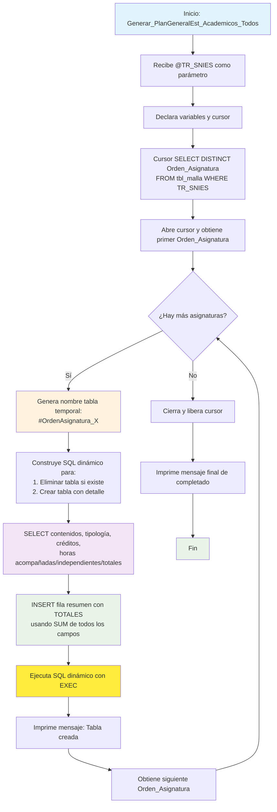

### Generar_PlanGeneralEst_Academicos_Todos

Este procedimiento almacenado genera tablas temporales dinámicas con información académica detallada para cada asignatura de un programa específico (identificado por TR_SNIES). Por cada orden de asignatura único en la malla curricular, crea una tabla temporal que contiene el detalle de contenidos y horas académicas, agregando automáticamente una fila resumen con los totales calculados.

Es útil para generar reportes académicos estructurados por asignatura, facilitando el análisis de cargas académicas, créditos y distribución de horas por contenido.

#### Diagrama de flujo


#### Procedimiento almacenado

```sql
CREATE PROCEDURE [RCAL].[Generar_PlanGeneralEst_Academicos_Todos]
@TR_SNIES VARCHAR(50)

AS
BEGIN
SET NOCOUNT ON;

    DECLARE @orden_asignatura INT;
    DECLARE @nombre_tabla NVARCHAR(128);
    DECLARE @sql NVARCHAR(MAX);

    -- Cursor para recorrer cada Orden_Asignatura único
    DECLARE cur CURSOR FOR
        SELECT DISTINCT Orden_Asignatura
        FROM RCAL.tbl_malla
        WHERE TR_SNIES = @TR_SNIES
        ORDER BY Orden_Asignatura;

    OPEN cur;
    FETCH NEXT FROM cur INTO @orden_asignatura;

    WHILE @@FETCH_STATUS = 0
    BEGIN
        -- Crear nombre de tabla temporal
        SET @nombre_tabla = '#OrdenAsignatura_' + CAST(@orden_asignatura AS VARCHAR);

        -- SQL dinámico para crear tabla y llenar detalle + resumen
        SET @sql = '
            -- Eliminar si existe
            IF OBJECT_ID(''tempdb..' + @nombre_tabla + ''') IS NOT NULL
                DROP TABLE ' + @nombre_tabla + ';

            -- Crear tabla con detalle de contenidos
            SELECT
                Orden_Contenido,
                TR_Contenidos,
                TR_Tipologia,
                CAST(TR_CreditosAcademicos AS INT) AS TR_CreditosAcademicos,
                CAST(TR_HorastrabajoAcom AS INT) AS TR_HorastrabajoAcom,
                CAST(TR_HorastrabajoIndp AS INT) AS TR_HorastrabajoIndp,
                CAST(TR_Horastrabajototales AS INT) AS TR_Horastrabajototales
            INTO ' + @nombre_tabla + '
            FROM RCAL.tbl_malla
            WHERE TR_SNIES = ''' + @TR_SNIES + '''
              AND Orden_Asignatura = ' + CAST(@orden_asignatura AS VARCHAR) + '
            ORDER BY TR_Semestre, Orden_Asignatura, Orden_Contenido;

            -- Insertar fila resumen al final
            INSERT INTO ' + @nombre_tabla + ' (
                Orden_Contenido, TR_Contenidos, TR_Tipologia,
                TR_CreditosAcademicos, TR_HorastrabajoAcom, TR_HorastrabajoIndp, TR_Horastrabajototales
            )
            SELECT
                9999, ''TOTAL'', ''-'',
                SUM(CAST(TR_CreditosAcademicos AS INT)),
                SUM(CAST(TR_HorastrabajoAcom AS INT)),
                SUM(CAST(TR_HorastrabajoIndp AS INT)),
                SUM(CAST(TR_Horastrabajototales AS INT))
            FROM RCAL.tbl_malla
            WHERE TR_SNIES = ''' + @TR_SNIES + '''
              AND Orden_Asignatura = ' + CAST(@orden_asignatura AS VARCHAR) + ';
        ';

        -- Ejecutar el bloque generado
        EXEC(@sql);

        -- Mostrar nombre creado

        PRINT 'Tabla creada: ' + @nombre_tabla;

        FETCH NEXT FROM cur INTO @orden_asignatura;
    END

    CLOSE cur;
    DEALLOCATE cur;

    PRINT 'Tablas temporales generadas por Orden_Asignatura con su resumen incluido.';

END;
```

#### Tablas afectadas

##### Tablas temporales creadas:

- Nomenclatura: #OrdenAsignatura_X (donde X es el número de orden)
- Ubicación: Base de datos temporal (tempdb)

##### Columnas en cada tabla:

- Orden_Contenido: Orden del contenido dentro de la asignatura
- TR_Contenidos: Descripción del contenido
- TR_Tipologia: Tipología del contenido
- TR_CreditosAcademicos: Créditos académicos (INT)
- TR_HorastrabajoAcom: Horas de trabajo acompañado (INT)
- TR_HorastrabajoIndp: Horas de trabajo independiente (INT)
- TR_Horastrabajototales: Horas de trabajo totales (INT)

##### Fila de resumen automática:

- Orden_Contenido: 9999 (para ubicarla al final)
- TR_Contenidos: "TOTAL"
- TR_Tipologia: "-"
- Campos numéricos: SUM de todos los valores de la asignatura

##### Funcionalidad Técnica
- Fuente de datos: RCAL.tbl_malla
- Filtros aplicados: TR_SNIES = @TR_SNIES y Orden_Asignatura = X
- Ordenamiento: TR_Semestre, Orden_Asignatura, Orden_Contenido
- Método: SQL dinámico con cursor para iterar asignaturas
- Resultado: N tablas temporales (una por cada asignatura del programa)

##### Casos de uso:
- Generación de reportes académicos por asignatura
- Análisis de cargas de trabajo por contenido
- Cálculo de totales de créditos y horas por asignatura
- Preparación de datos para exportación a documentos académicos