### Insertar_Datos_Cond3

Este procedimiento almacenado realiza una inserción exhaustiva y compleja de datos para la Condición 3 del sistema de Registro Calificado, enfocándose principalmente en estructura curricular, contenidos académicos, proyección social e internacionalización. Procesa información de mallas curriculares, genera contenidos formateados, inserta datos de proyección social con análisis temporal, y gestiona información de movilidad académica y actividades internacionales.

El procedimiento incluye múltiples transformaciones de datos, formateo de contenidos con numeración automática, análisis de modalidades académicas, y consolidación de información de múltiples fuentes externas.

#### Diagrama de flujo

```mermaid
flowchart TD
    A[Inicio: Insertar_Datos_Cond3] --> B[Recibe @TR_SNIES como parámetro]
    B --> C[Crea #tbl_Malla temporal<br/>con conversión de campos a INT]
    C --> D[INSERT Tbl_8_Cond3<br/>datos básicos de asignaturas]
    D --> E[INSERT Tbl_9_Cond3<br/>contenidos formateados con numeración]
    E --> F[INSERT Tbl_9_Cond3_ESP<br/>contenidos electivos especializados]
    F --> G[INSERT Tbl_10_Cond3<br/>electivas profundización vs complementarias]
    G --> H[INSERT Tbl_12_Cond3<br/>contenidos agrupados por asignatura]
    H --> I[INSERT múltiples tablas Cond3<br/>con datos fijos desde TR_SNIES=54639]
    I --> J[Procesa proyección social<br/>con pivot temporal 2016-2024]
    J --> K[UPDATE descripciones<br/>proyección social estandarizadas]
    K --> L[INSERT F3_ImpactProyeccSoci<br/>totales de impacto social]
    L --> M[INSERT F3_CreditosPropedeutico<br/>conteo de créditos académicos]
    M --> N[Determina modalidad académica<br/>y asigna TR_SNIES_V correspondiente]
    N --> O[INSERT Distribucion_Trabajo_Academico<br/>según modalidad detectada]
    O --> P[INSERT múltiples tablas<br/>internacionalización y movilidad]
    P --> Q[EXEC procedimientos auxiliares<br/>para generación de reportes]
    Q --> R[Fin]
    
    style A fill:#e1f5fe
    style R fill:#e8f5e8
    style E fill:#f3e5f5
    style F fill:#f3e5f5
    style G fill:#f3e5f5
    style H fill:#f3e5f5
    style J fill:#fff3e0
    style N fill:#e8f5e8
```



#### Procedimiento almacenado

```sql
CREATE PROCEDURE [Dev].[Insertar_Datos_Cond3] @TR_SNIES VARCHAR(255)

AS
BEGIN
-- DECLARE @TR_SNIES VARCHAR(255) = '52606';

-- ========================================================================
-- Nombre del Procedimiento: [Dev].[Insertar_Datos_Cond3]
-- Descripción:
-- Este procedimiento almacenado inserta datos en una tabla de destino
-- específica, utilizando un identificador único proporcionado como parámetro.
-- Primero verifica si el identificador ya existe en la tabla; si no,
-- inserta los datos provenientes de las tablas relacionadas. Si el
-- identificador ya existe, evita la duplicación e informa sobre ello.
--
-- Parámetros:
-- @TR_SNIES (VARCHAR(255)): Este parámetro es el identificador único
-- del programa académico que se usará para
-- verificar la existencia de los datos en la
-- tabla de destino. El valor de este parámetro
-- se utiliza para buscar y filtrar los registros
-- en las tablas [Acta], [MallasLauraUnificada]
-- y [Acuerdo], y realizar la inserción si no
-- existe previamente.
--
-- Salida:
-- - 'Datos insertados correctamente en [Nombre de la tabla de destino]'
-- - 'Los datos con el identificador proporcionado ya existen en la tabla.
--
-- Excepciones:
-- Si ocurre algún error durante la inserción o la ejecución de la consulta,
-- el procedimiento no maneja explícitamente las excepciones, pero la ejecución
-- se detendría y el error sería mostrado por el sistema de base de datos.
--
-- Requisitos Previos:
-- El procedimiento asume que las tablas relacionadas
-- [REGISTRO_CALIFICADO].[RCAL].[Acta], [DEV].[MallasLauraUnificada] y
-- [RCAL].[Acuerdo] ya existen en el esquema de base de datos y contienen
-- datos válidos.
--
-- Ejemplo de ejecución:
-- -- Insertar datos para un programa con TR_SNIES = '52606'
-- EXEC [Dev].[Insertar_Datos_Cond3] @TR_SNIES = '52606';
-- ========================================================================

     PRINT 'Inicio de la inserción de datos en Estrcuctura Curricular';
    -- Crear la tabla temporal con los datos necesarios y convertir los campos a INT

DROP TABLE IF EXISTS #tbl_Malla;

SELECT DISTINCT
TE_Componente,
TR_Asignatura,
CAST(TR_CreditosAcademicos AS INT) AS TR_CreditosAcademicos,
CAST(TR_Horastrabajototales AS INT) AS TR_Horastrabajototales,
CAST(TR_HorastrabajoAcom AS INT) AS TR_HorastrabajoAcom,
CAST(TR_HorastrabajoIndp AS INT) AS TR_HorastrabajoIndp,
TR_SNIES
INTO #tbl_Malla
FROM rcal.tbl_Malla
WHERE TR_SNIES = @TR_SNIES;

     PRINT 'Fin de la inserción de datos en Estrcuctura Curricular';

    PRINT 'Inicio de la inserción de datos en [REGISTRO_CALIFICADO].[RCAL].[Tbl_8_Cond3]';

    			insert into  [REGISTRO_CALIFICADO].[RCAL].[Tbl_8_Cond3]
    		select distinct TR_Asignatura as Asignatura
    		, TR_CreditosAcademicos as Creditos_academicos
    		, TR_Horastrabajototales as Horas_de_trabajo_academico_totales
    		,TR_SNIES as TR_SNIES
    		,TR_Semestre as Semestre
    		,TR_Tipologia as Tipologia
    		from rcal.tbl_Malla where TR_SNIES = @TR_SNIES


    PRINT 'Fin de la inserción de datos en [REGISTRO_CALIFICADO].[RCAL].[Tbl_8_Cond3]';

    -- Inicio de la inserción de datos en Tbl_9_Cond3
    PRINT 'Inicio de la inserción de datos en [REGISTRO_CALIFICADO].[RCAL].[Tbl_9_Cond3]';

    		 WITH Enumerados AS (
    SELECT
        LEFT(TR_Semestre, LEN(TR_Semestre) - 8) AS Semestre,
        TR_Asignatura AS Asignatura,
        ROW_NUMBER() OVER (PARTITION BY TR_Asignatura ORDER BY TR_Contenidos) AS NumFila,
        TR_Contenidos AS Contenido,
        TR_SNIES
    FROM rcal.tbl_Malla
    WHERE TR_SNIES = @TR_SNIES

),
Contenidos_Formateados AS (
SELECT
Semestre,
Asignatura,
STRING_AGG(CAST(NumFila AS VARCHAR(10)) + '. ' + Contenido, CHAR(13) + CHAR(10)) AS Contenidos,
TR_SNIES
FROM Enumerados
GROUP BY Semestre, Asignatura, TR_SNIES
)

-- Insertar los resultados formateados en la tabla final
INSERT INTO [REGISTRO_CALIFICADO].[RCAL].[Tbl_9_Cond3]
([Semestre], [Asignatura], [Contenidos], [TR_SNIES])
SELECT
Semestre,
Asignatura,
Contenidos,
TR_SNIES
FROM Contenidos_Formateados
ORDER BY Semestre ASC;

    BEGIN
        PRINT 'Los datos con el TR_SNIES proporcionado ya existen en la tabla destino.';
    END

    PRINT 'Fin de la inserción de datos en [REGISTRO_CALIFICADO].[RCAL].[Tbl_9_Cond3]';

    -- Inicio de la inserción de datos en Tbl_9_Cond3_ESP
    PRINT 'Inicio de la inserción de datos en [REGISTRO_CALIFICADO].[RCAL].[Tbl_9_Cond3_ESP]';

    IF NOT EXISTS (
    SELECT 1
    FROM [REGISTRO_CALIFICADO].[RCAL].[Tbl_9_Cond3_ESP]
    WHERE TR_SNIES = @TR_SNIES

)
BEGIN
-- Crear tabla temporal con asignaturas y contenidos de ELECTIVOS
SELECT DISTINCT
TR_Asignatura AS Asignatura,
TR_Contenidos AS Contenidos,
@TR_SNIES AS TR_SNIES
INTO #tbl_Malla_ESP
FROM rcal.tbl_Malla
WHERE TR_SNIES = @TR_SNIES;

    -- Formatear contenidos con numeración
    WITH Enumerados AS (
        SELECT
            Asignatura,
            ROW_NUMBER() OVER (PARTITION BY Asignatura ORDER BY Contenidos) AS NumFila,
            Contenidos,
            TR_SNIES
        FROM #tbl_Malla_ESP
    ),
    Contenidos_Formateados AS (
        SELECT
            Asignatura,
            STRING_AGG(CAST(NumFila AS VARCHAR(10)) + '. ' + Contenidos, CHAR(13) + CHAR(10)) AS Contenidos,
            TR_SNIES
        FROM Enumerados
        GROUP BY Asignatura, TR_SNIES
    )

-- Insertar los resultados formateados en la tabla final
INSERT INTO [REGISTRO_CALIFICADO].[RCAL].[Tbl_9_Cond3_ESP]
([Asignatura], [Contenidos], [TR_SNIES])
SELECT
Asignatura,
Contenidos,
TR_SNIES
FROM Contenidos_Formateados;
END
ELSE
BEGIN
PRINT 'Los datos con el TR_SNIES proporcionado ya existen en la tabla destino.';
END

    PRINT 'Fin de la inserción de datos en [REGISTRO_CALIFICADO].[RCAL].[Tbl_9_Cond3_ESP]';

    -- Inicio de la inserción de datos en Tbl_10_Cond3
    PRINT 'Inicio de la inserción de datos en [REGISTRO_CALIFICADO].[RCAL].[Tbl_10_Cond3]';


DROP TABLE IF EXISTS #tbl_Malla_1;
DROP TABLE IF EXISTS #tbl_Malla_2;

-- Crear tabla temporal con asignaturas de profundización y sus contenidos
SELECT DISTINCT
TR_SNIES,
TR_Asignatura AS Electivas_de_profundizacion_Asignatura,
TR_Contenidos AS Electivas_de_profundizacion_Contenidos
INTO #tbl_Malla_1
FROM [RCAL].[tbl_Malla]
WHERE TR_Area IN ('Profundización') AND TR_SNIES = @TR_SNIES;

-- Crear tabla temporal con asignaturas complementarias y sus contenidos
SELECT DISTINCT
TR_SNIES,
TR_Asignatura AS Electivas_Complementarias_Asignatura,
TR_Contenidos AS Electivas_Complementarias_Contenidos
INTO #tbl_Malla_2
FROM [RCAL].[tbl_Malla]
WHERE TR_Area IN ('Complementaria') AND TR_SNIES = @TR_SNIES;

-- Formatear contenidos de profundización con numeración
WITH Enumerados_Profundizacion AS (
SELECT
Electivas_de_profundizacion_Asignatura AS Asignatura,
ROW_NUMBER() OVER (PARTITION BY Electivas_de_profundizacion_Asignatura ORDER BY Electivas_de_profundizacion_Contenidos) AS NumFila,
Electivas_de_profundizacion_Contenidos AS Contenido,
TR_SNIES
FROM #tbl_Malla_1
),
Profundizacion_Formateada AS (
SELECT
Asignatura,
STRING_AGG(CAST(NumFila AS VARCHAR(10)) + '. ' + Contenido, CHAR(13) + CHAR(10)) AS Contenidos,
TR_SNIES
FROM Enumerados_Profundizacion
GROUP BY Asignatura, TR_SNIES
)

-- Formatear contenidos complementarios con numeración
, Enumerados_Complementarias AS (
SELECT
Electivas_Complementarias_Asignatura AS Asignatura,
ROW_NUMBER() OVER (PARTITION BY Electivas_Complementarias_Asignatura ORDER BY Electivas_Complementarias_Contenidos) AS NumFila,
Electivas_Complementarias_Contenidos AS Contenido,
TR_SNIES
FROM #tbl_Malla_2
),
Complementarias_Formateada AS (
SELECT
Asignatura,
STRING_AGG(CAST(NumFila AS VARCHAR(10)) + '. ' + Contenido, CHAR(13) + CHAR(10)) AS Contenidos,
TR_SNIES
FROM Enumerados_Complementarias
GROUP BY Asignatura, TR_SNIES
)

-- Insertar los resultados formateados en la tabla final
INSERT INTO [REGISTRO_CALIFICADO].[RCAL].[Tbl_10_Cond3]
([Electivas_de_profundizacion_Asignatura], [Electivas_de_profundizacion_Contenidos],
[Electivas_Complementarias_Asignatura], [Electivas_Complementarias_Contenidos], [TR_SNIES])
SELECT
p.Asignatura AS Electivas_de_profundizacion_Asignatura,
p.Contenidos AS Electivas_de_profundizacion_Contenidos,
c.Asignatura AS Electivas_Complementarias_Asignatura,
c.Contenidos AS Electivas_Complementarias_Contenidos,
p.TR_SNIES
FROM Profundizacion_Formateada p
INNER JOIN Complementarias_Formateada c
ON p.TR_SNIES = c.TR_SNIES;

    PRINT 'Fin de la inserción de datos en [REGISTRO_CALIFICADO].[RCAL].[Tbl_10_Cond3]';

    -- Inicio de la inserción de datos en Tbl_11_Cond3

-- PRINT 'Inicio de la inserción de datos en [REGISTRO_CALIFICADO].[RCAL].[Tbl_11_Cond3]';

    --IF NOT EXISTS (

-- SELECT 1
-- FROM [REGISTRO_CALIFICADO].[RCAL].[Tbl_11_Cond3]
-- WHERE TR_SNIES = @TR_SNIES
-- )
-- BEGIN

    --DROP TABLE IF EXISTS #Valor_Fijo ;

    --SELECT DISTINCT DOMINIO_DE_COMPETENCIA,
    --MACROCOMPETENCIAS_NIVEL_AXONOMICO,
    --MACROCOMPETENCIAS_OBJETO_CONDICION_FINALIDAD,
    --ESPACIOS_ACADEMICOS_ASOCIADO_AL_RESULTADO,
    --RESULTADOS_APRENDIZAJE_DEL_PROGRAMA_NIVEL_TAXONOMICO,
    --RESULTADOS_APRENDIZAJE_DEL_PROGRAMA_OBJETO_CONDICION_FINALIDAD,
    --@TR_SNIES as tr_snies
    --into #Valor_Fijo   FROM [REGISTRO_CALIFICADO].[RCAL].[Tbl_11_Cond3] WHERE TR_SNIES ='54639'

    --		INSERT INTO [REGISTRO_CALIFICADO].[RCAL].[Tbl_11_Cond3]
    --		(
    --		  [DOMINIO_DE_COMPETENCIA],
    --		  [MACROCOMPETENCIAS_NIVEL_AXONOMICO],
    --		  [MACROCOMPETENCIAS_OBJETO_CONDICION_FINALIDAD],
    --		  [ESPACIOS_ACADEMICOS_ASOCIADO_AL_RESULTADO],
    --		  [RESULTADOS_APRENDIZAJE_DEL_PROGRAMA_NIVEL_TAXONOMICO],
    --		  [RESULTADOS_APRENDIZAJE_DEL_PROGRAMA_OBJETO_CONDICION_FINALIDAD],
    --		  [TR_SNIES],
    --		  [NOMBRE_PROGRAMA],
    --		  [TR_NumeroActa],
    --		  [F_NumeroAcuerdo]
    --		)
    --	SELECT DISTINCT
    --		a.[DOMINIO_DE_COMPETENCIA],
    --		a.[MACROCOMPETENCIAS_NIVEL_AXONOMICO],
    --		a.[MACROCOMPETENCIAS_OBJETO_CONDICION_FINALIDAD],
    --		a.[ESPACIOS_ACADEMICOS_ASOCIADO_AL_RESULTADO],
    --		a.[RESULTADOS_APRENDIZAJE_DEL_PROGRAMA_NIVEL_TAXONOMICO],
    --		a.[RESULTADOS_APRENDIZAJE_DEL_PROGRAMA_OBJETO_CONDICION_FINALIDAD],
    --		a.TR_SNIES AS TR_SNIES,
    --		b.NOMBRE_DEL_PROGRAMA AS NOMBRE_PROGRAMA,
    --		c.TR_NumeroActa AS TR_NumeroActa,
    --		d.F_NumeroAcuerdo AS F_NumeroAcuerdo
    --	FROM
    --		#Valor_Fijo a
    --	LEFT JOIN
    --		dev.MallasLauraUnificada b ON a.TR_SNIES = b.CODIGO_SNIES
    --	LEFT JOIN
    --		RCAL.Acta c ON a.TR_SNIES = c.TR_SNIES
    --	LEFT JOIN
    --		[RCAL].[Acuerdo] d ON a.TR_SNIES = d.TR_SNIES;

    --END

-- ELSE
-- BEGIN
-- PRINT 'Los datos con el TR_SNIES proporcionado ya existen en la tabla destino.';
-- END

    PRINT 'Fin de la inserción de datos en [REGISTRO_CALIFICADO].[RCAL].[Tbl_11_Cond3]';

    -- Inicio de la inserción de datos en Tbl_12_Cond3
    PRINT 'Inicio de la inserción de datos en [REGISTRO_CALIFICADO].[RCAL].[Tbl_12_Cond3]';

    		DROP TABLE IF EXISTS #Tbl_12_Cond3

    	-- Primero, crea la tabla temporal con los datos correctos
    	SELECT
    		m.TR_Asignatura AS ASIGNATURA,
    		m.TR_Contenidos AS CONTENIDO,
    		m.TR_SNIES AS TR_SNIES
    	INTO  #Tbl_12_Cond3
    	FROM RCAL.tbl_Malla m
    	WHERE m.TR_SNIES = @TR_SNIES;

    	-- Luego, realiza el procesamiento para formatear los contenidos
    	WITH Enumerados AS (
    		SELECT
    			ASIGNATURA,
    			ROW_NUMBER() OVER (PARTITION BY ASIGNATURA ORDER BY CONTENIDO) AS NumFila,
    			CONTENIDO,
    			TR_SNIES
    		FROM #Tbl_12_Cond3
    		WHERE TR_SNIES = @TR_SNIES
    	)
    	-- Inserta los resultados formateados en la tabla definitiva
    	INSERT INTO rcal.Tbl_12_Cond3 (ASIGNATURA, CONTENIDO, TR_SNIES)
    	SELECT
    		ASIGNATURA,
    		STRING_AGG(CAST(NumFila AS VARCHAR(10)) + '. ' + CONTENIDO, CHAR(13) + CHAR(10)) AS CONTENIDO,
    		TR_SNIES
    	FROM Enumerados
    	GROUP BY ASIGNATURA, TR_SNIES;

    BEGIN
        PRINT 'Los datos con el TR_SNIES proporcionado ya existen en la tabla destino.';
    END

    PRINT 'Fin de la inserción de datos en [REGISTRO_CALIFICADO].[RCAL].[Tbl_12_Cond3]';

    -- Inicio de la inserción de datos en Tbl_14_Cond3
    PRINT 'Inicio de la inserción de datos en [REGISTRO_CALIFICADO].[RCAL].[Tbl_14_Cond3]';

    IF NOT EXISTS (
    SELECT 1
    FROM [REGISTRO_CALIFICADO].[RCAL].[Tbl_14_Cond3]
    WHERE TR_SNIES = @TR_SNIES
    )
    BEGIN

    INSERT INTO [REGISTRO_CALIFICADO].[RCAL].[Tbl_14_Cond3]
    SELECT [CICLO],
           [NIVEL],
           @TR_SNIES AS [TR_SNIES]
      FROM [REGISTRO_CALIFICADO].[RCAL].[Tbl_14_Cond3]
     WHERE TR_SNIES = '54639';

    END
    ELSE
    BEGIN
        PRINT 'Los datos con el TR_SNIES proporcionado ya existen en la tabla destino.';
    END

    PRINT 'Fin de la inserción de datos en [REGISTRO_CALIFICADO].[RCAL].[Tbl_14_Cond3]';

    -- Inicio de la inserción de datos en Tbl_15_Cond3
    PRINT 'Inicio de la inserción de datos en [REGISTRO_CALIFICADO].[RCAL].[Tbl_15_Cond3]';

INSERT INTO [REGISTRO_CALIFICADO].[RCAL].[Tbl_15_Cond3]
SELECT [Estrategia],
[Descripcion],
@TR_SNIES as TR_SNIES
FROM [REGISTRO_CALIFICADO].[RCAL].[Tbl_15_Cond3]
WHERE TR_SNIES = '54639';

    PRINT 'Fin de la inserción de datos en [REGISTRO_CALIFICADO].[RCAL].[Tbl_15_Cond3]';

    ;WITH CTE AS (
    SELECT
        CASE
            WHEN ITEM_ANIO LIKE '%2024%' THEN LEFT(ITEM_ANIO, LEN(ITEM_ANIO) - 6)
            WHEN ITEM_ANIO LIKE '%20%' THEN LEFT(ITEM_ANIO, LEN(ITEM_ANIO) - 4)
            ELSE ITEM_ANIO
        END AS Item_Año,
        VALOR,
        CASE
            WHEN ITEM_ANIO LIKE '%2024%' THEN RIGHT(ITEM_ANIO, 6)
            WHEN ITEM_ANIO LIKE '%20%' AND ITEM_ANIO NOT LIKE '%2024%' THEN RIGHT(ITEM_ANIO, 4)
        END AS ANIO
    FROM
        [CUN_REPOSITORIO].DBO.[proyeccion_social_2]
    WHERE
        ITEM_ANIO NOT LIKE '%TOTAL%'

)

INSERT INTO [REGISTRO_CALIFICADO].[RCAL].[Tbl_13_Cond3]
([Item_Año], [2016], [2017], [2018], [2019], [2020], [2021], [2022], [2023], [TR_SNIES], [2024_A])
SELECT Item_Año, [2016], [2017], [2018], [2019], [2020], [2021], [2022], [2023], @TR_SNIES AS TR_SNIES, [2024 A]
FROM CTE
PIVOT (
SUM(VALOR)
FOR ANIO IN ([2016], [2017], [2018], [2019], [2020], [2021], [2022], [2023], [2024 A])
) AS PVT;

--INSERT INTO [REGISTRO_CALIFICADO].[RCAL].[Tbl_13_Cond3]
--SELECT [Item_Año]
-- ,[2016]
-- ,[2017]
-- ,[2018]
-- ,[2019]
-- ,[2020]
-- ,[2021]
-- ,[2022]
-- ,[2023]
-- ,@TR_SNIES AS [TR_SNIES]
-- ,[2024_A]
-- FROM [REGISTRO_CALIFICADO].[RCAL].[Tbl_13_Cond3]
-- WHERE TR_SNIES ='54639'

    update [REGISTRO_CALIFICADO].[RCAL].[Tbl_13_Cond3] set Item_Año = 'Impacto Social - Nº de actividades' where Item_Año ='Actividades'
    update [REGISTRO_CALIFICADO].[RCAL].[Tbl_13_Cond3] set Item_Año = 'Población beneficiada' where Item_Año ='Poblacion '
    update [REGISTRO_CALIFICADO].[RCAL].[Tbl_13_Cond3] set Item_Año = 'Impacto Social - Nº de proyectos de transformación Social' where Item_Año ='Proyectos '
    update [REGISTRO_CALIFICADO].[RCAL].[Tbl_13_Cond3] set Item_Año = 'Relacionamiento Actores Externos (No. de comunidades,Empresas, Gobierno, Instituciones, OrganizacionesSociales)' where Item_Año ='Relacionamiento con el sector externo '


    PRINT 'Fin de la inserción de datos en [REGISTRO_CALIFICADO].[RCAL].[Tbl_13_Cond3]';

      PRINT 'Inicio de la inserción de datos en [REGISTRO_CALIFICADO].[RCAL].[Tbl11_Cond3_ESP]';


    		drop table if exists  #Tbl11_Cond3_ESP

    		SELECT @TR_SNIES as TR_SNIES , 'No_Aplica' as TR_NivelInglesEsp
    		INTO #Tbl11_Cond3_ESP
    		FROM RCAL.Tbl11_Cond3_ESP where TR_SNIES ='54639'

    		insert into [REGISTRO_CALIFICADO].[RCAL].[Tbl11_Cond3_ESP]
    		SELECT  b.TR_NombreProgramaEsp , a.TR_NivelInglesEsp , a.TR_SNIES FROM #Tbl11_Cond3_ESP a
    		left join rcal.Acta b
    		on a.TR_SNIES = b.TR_SNIES


      PRINT 'Fin de la inserción de datos en [REGISTRO_CALIFICADO].[RCAL].[Tbl11_Cond3_ESP]';

      PRINT 'Inicio de la inserción de datos en [REGISTRO_CALIFICADO].[RCAL].[F3_ImpactProyeccSoci]';

      ;WITH CTE AS (
    SELECT
        ITEM_ANIO,
        VALOR
    FROM
        [CUN_REPOSITORIO].DBO.[proyeccion_social_2]
    WHERE
        ITEM_ANIO LIKE '%total%'

)

INSERT INTO [REGISTRO_CALIFICADO].[RCAL].[F3_ImpactProyeccSoci] (
TR_SNIES,
Poblacion_beneficiada,
Num_proyectos,
Num_actividades,
Relacionamiento_con_actores_externos,
Num_convenios
)
SELECT
@TR_SNIES AS TR_SNIES,
[TOTAL POBLACION] AS [Poblacion_beneficiada],
[TOTAL PROYECTOS] AS [Num_proyectos],
[TOTAL ACTIVIDADES] AS [Num_actividades],
[TOTAL RELACIONAMIENTO] AS [Relacionamiento_con_actores_externos],
[TOTAL CONVENIOS] AS [Num_convenios]
FROM (
SELECT
ITEM_ANIO,
VALOR
FROM
[CUN_REPOSITORIO].DBO.[proyeccion_social_2]
WHERE
ITEM_ANIO LIKE '%total%'
) AS CTE
PIVOT (
SUM(VALOR)
FOR ITEM_ANIO IN ([TOTAL POBLACION], [TOTAL PROYECTOS], [TOTAL ACTIVIDADES], [TOTAL RELACIONAMIENTO], [TOTAL CONVENIOS])
) AS PVT;

      PRINT 'Fin de la inserción de datos en [REGISTRO_CALIFICADO].[RCAL].[F3_ImpactProyeccSoci]';

      PRINT 'Inicio de la inserción de datos en [REGISTRO_CALIFICADO].[RCAL].[F3_CreditosPropedeutico]';

      INSERT INTO [REGISTRO_CALIFICADO].[RCAL].[F3_CreditosPropedeutico]
      SELECT @TR_SNIES AS TR_SNIES,
      COUNT (TR_CreditosAcademicos) AS [F3_CreditosPropedeutico]
      FROM [REGISTRO_CALIFICADO].[RCAL].[tbl_Malla]
      GROUP BY TR_SNIES
      ORDER BY 2 ASC

      PRINT 'Fin de la inserción de datos en [REGISTRO_CALIFICADO].[RCAL].[F3_CreditosPropedeutico]';


      -- Declaración de variables

DECLARE @modalidad VARCHAR(50);
DECLARE @TR_SNIES_V INT;

-- Obtener la modalidad del registro con tr_snies = '20250030'
SELECT TOP 1 @modalidad = TR_MODALIDAD
FROM [REGISTRO_CALIFICADO].[RCAL].[acta]
WHERE tr_snies = @TR_SNIES;

-- Asignar el valor de @TR_SNIES según la modalidad obtenida
IF @modalidad = 'PRESENCIAL'
SET @TR_SNIES_V = 12;
ELSE IF @modalidad = 'VIRTUAL'
SET @TR_SNIES_V = 15;
ELSE IF @modalidad = 'HIBRIDO'
SET @TR_SNIES_V = 16;
ELSE IF @modalidad = 'DISTANCIA'
SET @TR_SNIES_V = 17;
ELSE
BEGIN
PRINT 'Modalidad no reconocida o no aplicable.';
RETURN; -- Termina la ejecución si modalidad no es válida
END

-- Insertar registros en Distribucion_Trabajo_Academico
-- copiando desde la modalidad correspondiente pero con TR_SNIES = '20250030'
INSERT INTO [REGISTRO_CALIFICADO].[RCAL].[Distribucion_Trabajo_Academico]
(TR_SNIES, Proporcionalidad, N_Semanas, Creditos, HAD, HTI, HT)
SELECT
@TR_SNIES,  
 Proporcionalidad,
N_Semanas,
Creditos,
HAD,
HTI,
HT
FROM [REGISTRO_CALIFICADO].[RCAL].[Distribucion_Trabajo_Academico]
WHERE TR_SNIES = @TR_SNIES_V;

PRINT 'Inserción completada exitosamente para modalidad ' + @modalidad;

--INSERT INTO [REGISTRO_CALIFICADO].[RCAL].[Distribucion_Trabajo_Academico]
--SELECT @TR_snies
-- ,[Proporcionalidad]
-- ,[N_Semanas]
-- ,[Creditos]
-- ,[HAD]
-- ,[HTI]
-- ,[HT]
-- FROM [REGISTRO_CALIFICADO].[RCAL].[Distribucion_Trabajo_Academico]
-- WHERE TR_SNIES = '54639'

-- total semestre asignatura contenido

insert into rcal.TR_Semestre_Asignatura_Contenido
select distinct TR_SNIES,TR_Semestre , TR_Asignatura , TR_Contenidos from rcal.tbl_Malla where TR_SNIES = @TR_SNIES
order by TR_Semestre asc

-- total semestre asignatura contenido

INSERT INTO [REGISTRO_CALIFICADO].[RCAL].[Inter_del_Programa]
SELECT @TR_SNIES
,[AREA_DE_TRABAJO]
,[CONCEPTO]
,[ACCIONES]
,[META]
FROM [REGISTRO_CALIFICADO].[RCAL].[Inter_del_Programa]
WHERE TR_SNIES='54639'

INSERT INTO CUN.ACTIVIDADES_INTERNACIONALES
SELECT
@TR_SNIES AS TR_SNIES,
ANO,
Institucion_Aliada,
Pais_Procedencia,
Nombre_Actividad,
Modalidad,
Numero_Total_Participantes
FROM  
 CUN.ACTIVIDADES_INTERNACIONALES
where TR_SNIES='54639'

INSERT INTO CUN.MOVILIDAD_ACADEMICA_SALIENTE(
tr_snies, ano, Nombres_Apellidos, Tipo_Movilidad, Resultado, Modalidad_Movilidad,
IES_Origen, Pais_Origen, IES_Destino, Pais_Destino, Duracion
)
SELECT DISTINCT  
 @TR_SNIES AS tr_snies, -- Aquí es donde asignas el valor constante
YEAR(TRY_CONVERT(DATETIME, [Fecha Inicio], 103)),
Nombre,
IIF([MS Nacional] = 'X', 'NACIONAL', 'INTERNACIONAL'),
Resultados,
Modalidad,
'CUN',
'Colombia',
[Entidad de origen],
País,
CAST(DATEDIFF(DAY, TRY_CONVERT(DATETIME, [Fecha Inicio], 103), TRY_CONVERT(DATETIME, [Fecha Final], 103)) AS VARCHAR) + ' días'
FROM [AUTOEVALUACION].[stg].[P6_P10_Movilidad_internacionalizacion]
WHERE ([MS Nacional] = 'X' OR [MS Internacional] = 'X')
AND TRY_CONVERT(VARCHAR, SNIES) = '111478';

INSERT INTO CUN.MOVILIDAD_ACADEMICA_ENTRANTE(
tr_snies, ano, Nombres_Apellidos, Tipo_Movilidad, Resultado, Modalidad_Movilidad,
IES_Origen, Pais_Origen, IES_Destino, Pais_Destino, Duracion
)
SELECT DISTINCT  
 @TR_SNIES AS tr_snies, -- Aquí es donde asignas el valor constante
YEAR(TRY_CONVERT(DATETIME, [Fecha Inicio], 103)),
Nombre,
IIF([MS Nacional] = 'X', 'NACIONAL', 'INTERNACIONAL'),
Resultados,
Modalidad,
'CUN',
'Colombia',
[Entidad de origen],
País,
CAST(DATEDIFF(DAY, TRY_CONVERT(DATETIME, [Fecha Inicio], 103), TRY_CONVERT(DATETIME, [Fecha Final], 103)) AS VARCHAR) + ' días'
FROM [AUTOEVALUACION].[stg].[P6_P10_Movilidad_internacionalizacion]
WHERE ([ME Nacional] = 'X' OR [ME Internacional] = 'X')
AND TRY_CONVERT(VARCHAR, SNIES) = '111478';

INSERT INTO CUN.MOVILIDAD_ACADEMICA_DISCRIMINADA(
tr_snies, ano, Nombres_Apellidos, Tipo_Movilidad, Resultado, Modalidad_Movilidad,
IES_Origen, Pais_Origen, IES_Destino, Pais_Destino, Duracion
)
SELECT DISTINCT  
 @TR_SNIES AS tr_snies, -- Aquí es donde asignas el valor constante
YEAR(TRY_CONVERT(DATETIME, [Fecha Inicio], 103)),
Nombre,
IIF([MS Nacional] = 'X', 'NACIONAL', 'INTERNACIONAL'),
Resultados,
Modalidad,
'CUN',
'Colombia',
[Entidad de origen],
País,
CAST(DATEDIFF(DAY, TRY_CONVERT(DATETIME, [Fecha Inicio], 103), TRY_CONVERT(DATETIME, [Fecha Final], 103)) AS VARCHAR) + ' días'
FROM [AUTOEVALUACION].[stg].[P6_P10_Movilidad_internacionalizacion]
WHERE ([ME Nacional] = 'X' OR [ME Internacional] = 'X')
AND TRY_CONVERT(VARCHAR, SNIES) = '111478';

insert into [REGISTRO_CALIFICADO].[RCAL].[EVALUACION_MECANISMOS]
SELECT @TR_SNIES AS [TR_SNIES]
,[Factor_Exito]
,[Ponderacion]
,[TR_NombreProgramaTP_Valoracion]
,[TR_NombreProgramaTP_Resultado]
,[TR_NombreProgramaTG_Valoracion]
,[TR_NombreProgramaTG_Resultado]
,[TR_NombreProgramaPro_Valoracion]
,[TR_NombreProgramaPro_Resultado]
FROM [REGISTRO_CALIFICADO].[RCAL].[EVALUACION_MECANISMOS]
WHERE TR_SNIES ='54639'

INSERT INTO [REGISTRO_CALIFICADO].[RCAL].[AJUSTES_PLAN_CURRICULAR]
SELECT
@TR_SNIES AS TR_SNIES,
TR_Semestre AS SEMESTRE ,
TR_Asignatura AS ASIGNATURA,
TR_CreditosAcademicos AS CREDITOS_ACADEMICOS,
TR_Asignatura AS ASIGNATURA_2,
TR_CreditosAcademicos AS CREDITOS_ACADEMICOS_2,
'-' AS JUSTIFICACION
FROM RCAL.TBL_MALLA
WHERE TR_SNIES = @TR_SNIES

drop table if exists [RCAL].[Plan_de_Estudios_Semestre_VF]

exec [RCAL].[sp_GenerarTablasTemporalesPorSemestre] @tr_snies

SELECT
TR_SNIES AS TR_SNIES,
TR_Semestre AS Semestre,
CASE
WHEN TR_Asignatura = 'TOTAL' THEN '-'
ELSE CAST(Orden_Asignatura AS VARCHAR)
END AS [No],
CASE
WHEN TR_Asignatura = 'TOTAL' THEN 'Subtotal ' + LOWER(TR_Semestre)
ELSE TR_Asignatura
END AS Asignaturas,

CASE
WHEN TR_Asignatura = 'TOTAL' THEN '-'
ELSE CAST(TR_Tipologia AS VARCHAR)
END AS TR_Tipologia,
TR_CreditosAcademicos AS [Creditos_Academicos],
TR_Horastrabajototales AS [Horas_de_trabajo_totales]
into [RCAL].[Plan_de_Estudios_Semestre_VF]
FROM [RCAL].[Plan_de_Estudios_Semestre]

EXEC RCAL.sp_Insertar_Contenidos_Plan @TR_SNIES = @TR_SNIES;

-- Crea un bloque por asignatura
;WITH ContenidoAgrupado AS (
SELECT
TR_SNIES,
TR_Semestre,
TR_Asignatura,
STRING_AGG('• ' + LTRIM(RTRIM(TR_Contenidos)), CHAR(13) + CHAR(10))
WITHIN GROUP (ORDER BY Orden_Contenido) AS Contenidos
FROM RCAL.Plan_de_Estudios_Contenidos
GROUP BY TR_SNIES, TR_Semestre, TR_Asignatura
)
-- Une todo por semestre y por programa

INSERT INTO RCAL.ContenidoAgrupado
SELECT
TR_SNIES,
TR_Semestre,
STRING_AGG(
TR_Asignatura + CHAR(13) + CHAR(10) + Contenidos,
CHAR(13) + CHAR(10) + CHAR(13) + CHAR(10)
) WITHIN GROUP (ORDER BY TR_Asignatura) AS ParrafoCompleto
FROM ContenidoAgrupado
GROUP BY TR_SNIES, TR_Semestre
ORDER BY TR_SNIES, TR_Semestre;

END;
|
|Insertar_Datos_Cond4|

```

#### Operaciones Principales por Sección
1. Estructura Curricular Básica:

- Tbl_8_Cond3: Asignaturas con créditos, horas y tipología
- Conversión de campos de texto a enteros para cálculos

2. Contenidos Académicos Formateados:

- Tbl_9_Cond3: Contenidos por semestre con numeración automática
- Tbl_9_Cond3_ESP: Contenidos electivos especializados
- Tbl_10_Cond3: Separación de electivas (profundización vs complementarias)
- Tbl_12_Cond3: Agrupación de contenidos por asignatura

3. Datos Estándar de Referencia:

- Múltiples inserciones desde TR_SNIES='54639' como plantilla
- Tbl_14_Cond3, Tbl_15_Cond3: Datos fijos de ciclos y estrategias

4. Proyección Social con Análisis Temporal:

- Procesamiento de proyeccion_social_2 con pivot 2016-2024
- Tbl_13_Cond3: Indicadores de impacto social por año
- F3_ImpactProyeccSoci: Totales consolidados de impacto

5. Modalidad Académica y Distribución:

- Detección automática de modalidad (PRESENCIAL, VIRTUAL, HÍBRIDO, DISTANCIA)
- Asignación de códigos específicos por modalidad
- Distribucion_Trabajo_Academico: Horas según modalidad

6. Internacionalización y Movilidad:

- ACTIVIDADES_INTERNACIONALES: Actividades con instituciones aliadas
- MOVILIDAD_ACADEMICA_SALIENTE/ENTRANTE/DISCRIMINADA: Movilidad estudiantil
- Procesamiento de fechas y cálculo de duraciones


#### Tablas afectadas

##### Estructura Curricular:

- Tbl_8_Cond3, Tbl_9_Cond3, Tbl_10_Cond3, Tbl_12_Cond3
- TR_Semestre_Asignatura_Contenido, Plan_de_Estudios_Semestre_VF

##### Proyección Social:

- Tbl_13_Cond3, F3_ImpactProyeccSoci, Tbl11_Cond3_ESP

##### Internacionalización:

- ACTIVIDADES_INTERNACIONALES, MOVILIDAD_ACADEMICA_*
- Inter_del_Programa, EVALUACION_MECANISMOS

##### Auxiliares:

- Distribucion_Trabajo_Academico, AJUSTES_PLAN_CURRICULAR
- F3_CreditosPropedeutico, ContenidoAgrupado

#### Procedimientos Almacenados Anidados

- [RCAL].[sp_GenerarTablasTemporalesPorSemestre]
- RCAL.sp_Insertar_Contenidos_Plan