### Insertar_Datos_Cond4

Este procedimiento almacenado realiza inserción y análisis de datos curriculares para la Condición 4 del sistema de Registro Calificado, enfocándose en la distribución de créditos académicos por componentes y áreas de conocimiento. Genera análisis estadísticos de la malla curricular, calcula porcentajes de participación por componente, inserta datos de actividades académicas, y crea visualizaciones gráficas de la distribución curricular.

El procedimiento utiliza CTEs complejos para realizar cálculos de distribución porcentual y generar reportes consolidados de la estructura académica del programa.

#### Diagrama de flujo

```mermaid
flowchart TD
    A[Inicio: Insertar_Datos_Cond4] --> B[Recibe @TR_SNIES como parámetro]
    B --> C[CTE complejo para análisis<br/>de distribución de créditos]
    C --> D[CTE1: Agrupa por componente/área<br/>cuenta asignaturas y suma créditos]
    D --> E[CTE2: Calcula totales por grupo<br/>y asigna ROW_NUMBER]
    E --> F[CTE3: Define TOTAL_CREDITOS<br/>solo para primera fila por grupo]
    F --> G[CTE_TOTAL: Suma general<br/>de todos los créditos]
    G --> H[INSERT Distribucion_Creditos_Areas<br/>con cálculos porcentuales]
    H --> I[INSERT Tbl_9_Cond4<br/>datos básicos de asignaturas]
    I --> J[INSERT F4_ActividadAcademica<br/>desde TR_SNIES=54639]
    J --> K[INSERT F4_EnfoqueCompnComp<br/>desde TR_SNIES=54639]
    K --> L[UPDATE TR_NroEncuentros<br/>según modalidad académica]
    L --> M[Crea #malla temporal<br/>para análisis gráfico]
    M --> N[INSERT graf.Cond4_Figura_4<br/>distribución porcentual general]
    N --> O[Crea #malla_2 temporal<br/>filtrada por DISCIPLINAR]
    O --> P[INSERT distribucion_componente<br/>análisis específico disciplinar]
    P --> Q[Fin]
    
    style A fill:#e1f5fe
    style Q fill:#e8f5e8
    style C fill:#f3e5f5
    style H fill:#fff3e0
    style L fill:#e8f5e8
    style N fill:#e8f5e8
    style P fill:#e8f5e8
```



#### Procedimiento almacenado

```sql

-- ========================================================================
-- Nombre del Procedimiento: [Dev].[Insertar_Datos_Cond4]

--
-- Ejemplo de ejecución:
-- -- Insertar datos para un programa con TR_SNIES = '52606'
-- EXEC [Dev].[Insertar_Datos_Cond4] @TR_SNIES = '52606';
-- ========================================================================

CREATE PROCEDURE [Dev].[Insertar_Datos_Cond4]
@TR_SNIES NVARCHAR(255) -- Ajusta el tamaño del parámetro según sea necesario
AS
BEGIN

SET NOCOUNT ON

/\*PRINT 'Inicio de la inserción de datos en [REGISTRO_CALIFICADO].[RCAL].[Tbl_41_Cond9]';

INSERT INTO [REGISTRO_CALIFICADO].[RCAL].[Tbl_41_Cond9]
SELECT [Sala_de_sistemas]
,[Responsable]
,[Periodo]
,[Regional]
,[Fecha_Mantenimiento]
,[Mes_Mantenimiento]
,@TR_SNIES AS [TR_SNIES]
,[Preventivo]
,[Correctivo]
FROM [REGISTRO_CALIFICADO].[RCAL].[Tbl_41_Cond9]
where Regional ='Bogotá'

PRINT 'Fin de la inserción de datos en [REGISTRO_CALIFICADO].[RCAL].[Tbl_41_Cond9]';\*/

-- Asegúrate de que cualquier instrucción anterior termine con ";"

PRINT 'Inicio de la inserción de datos en [REGISTRO_CALIFICADO].[RCAL].[Distribucion_Creditos_Areas]';
;WITH cte AS (
SELECT
TR_SNIES,
TE_Componente,
TR_Area,
COUNT(_) AS ASIGNATURA,
SUM(CAST(TR_CreditosAcademicos AS INT)) AS CREDITOS
FROM rcal.tbl_malla  
 WHERE TR_SNIES = @tr_snies
GROUP BY TR_SNIES, TE_Componente, TR_Area
),
cte2 AS (
SELECT
TR_SNIES,
TE_Componente,
TR_Area,
ASIGNATURA,
CREDITOS,
SUM(CREDITOS) OVER (PARTITION BY TR_SNIES, TE_Componente) AS TotalCreditosGroup,
ROW_NUMBER() OVER (PARTITION BY TR_SNIES, TE_Componente ORDER BY TR_Area) AS rn
FROM cte
),
cte3 AS (
SELECT
TR_SNIES,
TE_Componente,
TR_Area,
ASIGNATURA,
CREDITOS,
TotalCreditosGroup,
CASE WHEN rn = 1 THEN TotalCreditosGroup ELSE NULL END AS TOTAL_CREDITOS
FROM cte2
),
cte_total AS (
-- Obtiene la suma total de los créditos (solo los valores de TOTAL_CREDITOS sin NULL)
SELECT
TR_SNIES,
SUM(TOTAL_CREDITOS) AS TOTAL_GENERAL_CREDITOS
FROM cte3
WHERE TOTAL_CREDITOS IS NOT NULL
GROUP BY TR_SNIES
)
INSERT INTO rcal.Distribucion_Creditos_Areas (
TR_SNIES,
COMPONENTE,
AREA,
ASIGNATURA,
CREDITOS,
[%_AREA_CONOCIMIENTO],
TOTAL_CREDITOS,
[%_COMPONENTE]
)
SELECT
c3.TR_SNIES,
c3.TE_Componente AS COMPONENTE,
c3.TR_Area AS AREA,
c3.ASIGNATURA,
c3.CREDITOS,
(CAST(CREDITOS AS FLOAT) / MAX(c3.TOTAL_CREDITOS) OVER (PARTITION BY c3.TR_SNIES, c3.TE_Componente)) _ 100 AS [%_AREA_CONOCIMIENTO],
COALESCE(CAST(c3.TOTAL_CREDITOS AS VARCHAR), '-') AS TOTAL_CREDITOS,
COALESCE(
CAST(
CASE
WHEN c3.TOTAL_CREDITOS IS NOT NULL
THEN (CAST(c3.TOTAL_CREDITOS AS FLOAT) / t.TOTAL_GENERAL_CREDITOS) \* 100
END AS VARCHAR
), '-') AS [%_COMPONENTE]
FROM cte3 c3
LEFT JOIN cte_total t ON c3.TR_SNIES = t.TR_SNIES;

PRINT 'Fin de la inserción de datos en [REGISTRO_CALIFICADO].[RCAL].[Distribucion_Creditos_Areas]';

PRINT 'Inicio de la inserción de datos en [REGISTRO_CALIFICADO].[RCAL].[Tbl_9_Cond4]';

insert into [REGISTRO_CALIFICADO].[RCAL].[Tbl_9_Cond4]
select distinct TR_Asignatura as Asignatura
, TR_CreditosAcademicos as Creditos_academicos,
TR_HorastrabajoAcom as [Horas_de_trabajo_acompañado]
, TR_HorastrabajoIndp as [Horas_de trabajo_independiente]
, TR_Horastrabajototales as [Horas_de_trabajo_totales]
,TR_Semestre as [Semestre]
,@TR_SNIES as [TR_SNIES]
,TR_Tipologia as Tipologia
from rcal.tbl_Malla where TR_SNIES = @TR_SNIES

    PRINT 'Fin de la inserción de datos en [REGISTRO_CALIFICADO].[RCAL].[Tbl_9_Cond4]';

    PRINT 'Inicio de la inserción de datos en [REGISTRO_CALIFICADO].[RCAL].[F4_ActividadAcademica]';

        INSERT INTO [REGISTRO_CALIFICADO].[RCAL].[F4_ActividadAcademica]
    	SELECT @TR_SNIES AS TR_SNIES
    		   ,F4_ActividadAcademica
    	  FROM [REGISTRO_CALIFICADO].[RCAL].[F4_ActividadAcademica]
    	  WHERE TR_SNIES='54639'

    PRINT 'Fin de la inserción de datos en [REGISTRO_CALIFICADO].[RCAL].[F4_ActividadAcademica]';


    PRINT 'Inicio de la inserción de datos en [REGISTRO_CALIFICADO].[RCAL].[F4_EnfoqueCompnComp]';

        INSERT INTO [REGISTRO_CALIFICADO].[RCAL].[F4_EnfoqueCompnComp]
    	SELECT @TR_SNIES AS TR_SNIES
    		   ,F4_EnfoqueCompnComp
    	  FROM [REGISTRO_CALIFICADO].[RCAL].[F4_EnfoqueCompnComp]
    	  WHERE TR_SNIES='54639'

    PRINT 'Fin de la inserción de datos en [REGISTRO_CALIFICADO].[RCAL].[F4_EnfoqueCompnComp]';


    PRINT 'Inicio de la inserción de datos en [REGISTRO_CALIFICADO].[RCAL].[TR_NroEncuentros]';

    UPDATE C
    SET C.[TR_NroEncuentros] = CASE
    WHEN A.[TR_Modalidad] IN ('Presencial', 'Distancia') THEN 3
    WHEN A.[TR_Modalidad] = 'Virtual' THEN 5
    ELSE C.[TR_NroEncuentros] -- Mantiene el valor actual si no coincide con las modalidades
    END
    FROM [RCAL].[tbl_Conteo] C
    JOIN [RCAL].[Acta] A ON C.[TR_SNIES] = A.[TR_SNIES] -- Reemplaza esto con las claves adecuadas para enlazar ambas tablas
    WHERE c.TR_SNIES = '54639'

    PRINT 'Fin de la inserción de datos en [REGISTRO_CALIFICADO].[RCAL].[TR_NroEncuentros]';

    PRINT 'Inicio de Generacion grafica Distribución de créditos por componentes';

    	DROP TABLE IF EXISTS #malla

    			SELECT DISTINCT TE_Componente, TR_Asignatura,CAST(TR_CreditosAcademicos AS INT) AS TR_CreditosAcademicos , TR_SNIES into #malla FROM RCAL.tbl_Malla
    			WHERE
    			TR_SNIES = @TR_SNIES

    			INSERT INTO [REGISTRO_CALIFICADO].[graf].[Cond4_Figura_4]
    			SELECT
    	TE_Componente,
    	CAST((SUM(CAST(TR_CreditosAcademicos AS INT)) * 100) / SUM(SUM(CAST(TR_CreditosAcademicos AS INT))) OVER () AS INT) AS CREDITO,
    	TR_SNIES
    FROM
    	#malla
    GROUP BY
    	TE_Componente , TR_SNIES;

    PRINT 'fin de Generacion Distribución de créditos por componentes';


drop table if exists #malla_2

    	SELECT DISTINCT TE_Componente,TR_Area , TR_Asignatura,CAST(TR_CreditosAcademicos AS INT) AS TR_CreditosAcademicos , TR_SNIES into #malla_2 FROM RCAL.tbl_Malla
    			WHERE
    			TR_SNIES = @TR_SNIES and TE_Componente = 'DISCIPLINAR'

    			INSERT INTO RCAL.distribucion_componente
    			SELECT
    	TR_Area,
    	CAST((SUM(CAST(TR_CreditosAcademicos AS INT)) * 100) / SUM(SUM(CAST(TR_CreditosAcademicos AS INT))) OVER () AS INT) AS CREDITO,
    	TR_SNIES
    FROM
    	#malla_2
    GROUP BY
    	TR_Area , TR_SNIES;

END

```
#### Operaciones Principales por Sección
1. Análisis Complejo de Distribución de Créditos:

- CTE1: Agrupación por TR_SNIES, TE_Componente, TR_Area
- CTE2: Cálculo de totales por grupo con ventanas analíticas
- CTE3: Asignación condicional de totales por componente
- CTE_TOTAL: Suma general para cálculos porcentuales globales

2. Inserción en Distribucion_Creditos_Areas:
- sql-- Cálculos porcentuales sofisticados:
  - [%_AREA_CONOCIMIENTO] = (CREDITOS / TOTAL_CREDITOS_COMPONENTE) * 100
  - [%_COMPONENTE] = (TOTAL_CREDITOS_COMPONENTE / TOTAL_GENERAL) * 100

3. Datos Curriculares Básicos:

- Tbl_9_Cond4: Asignaturas con distribución de horas (acompañado, independiente, totales)
- Campos: Créditos académicos, tipología, semestre

4. Datos de Referencia Estándar:

- F4_ActividadAcademica: Actividades académicas desde plantilla
- F4_EnfoqueCompnComp: Enfoques de competencias desde plantilla

5. Actualización Condicional por Modalidad:

- Presencial/Distancia: 3 encuentros
- Virtual: 5 encuentros
- Actualización en tbl_Conteo basada en modalidad del programa

6. Generación de Gráficos Estadísticos:

- graf.Cond4_Figura_4: Distribución porcentual por componente curricular
- distribucion_componente: Análisis específico del componente DISCIPLINAR

#### Tablas afectadas

##### Principales:

- Distribucion_Creditos_Areas: Análisis completo de distribución curricular
- Tbl_9_Cond4: Datos básicos de asignaturas con horas
- F4_ActividadAcademica: Actividades académicas del programa
- F4_EnfoqueCompnComp: Enfoques de competencias

##### Actualizaciones:

- tbl_Conteo: Número de encuentros según modalidad

##### Gráficos:

- graf.Cond4_Figura_4: Visualización de distribución general
- distribucion_componente: Visualización específica disciplinar

##### Temporales:

- #malla: Datos básicos para análisis gráfico
- #malla_2: Datos filtrados por componente disciplinar

#### Fuente de Datos
- Tabla principal: rcal.tbl_malla
- Campos clave: TE_Componente, TR_Area, TR_CreditosAcademicos, TR_Asignatura
- Referencia estándar: TR_SNIES='54639' como plantilla para datos fijos