### Insertar_Datos_Cond5

Este procedimiento almacenado maneja la inserción de datos de investigación para la Condición 5 del sistema de Registro Calificado. Se enfoca en gestionar información de grupos de investigación, líneas de investigación por escuela y programa, docentes investigadores, productos y proyectos de investigación, e inversiones estimadas. Incluye lógica para mapear escuelas a códigos específicos y generar párrafos consolidados de líneas de investigación.

El procedimiento utiliza múltiples tablas temporales para procesar datos de investigadores activos y realiza validaciones específicas por escuela académica para asignar la información correspondiente.

#### Diagrama de flujo

```mermaid
flowchart TD
    A[Inicio: Insertar_Datos_Cond5] --> B[Recibe @TR_SNIES como parámetro]
    B --> C[INSERT tbl_Investigacion<br/>desde TR_SNIES=2024007]
    C --> D[INSERT Tbl_17_Cond5<br/>grupos y categorías Colciencias]
    D --> E[INSERT Tbl_18_Cond5<br/>gestión y tecnologías]
    E --> F[Procesa Tbl_19_Cond5<br/>líneas de escuela con formato]
    F --> G[Procesa Tbl_20_Cond5<br/>líneas de programa agrupadas]
    G --> H[Procesa Tbl_21_Cond5<br/>grupos con mapeo de escuelas]
    H --> I[Crea #Investigadores temporal<br/>desde hub_empleados]
    I --> J[Filtra investigadores activos<br/>por escuela del programa]
    J --> K[INSERT Tbl_22_Cond5<br/>TOP 3 docentes investigadores]
    K --> L[INSERT múltiples tablas<br/>investigación desde TR_SNIES=54639]
    L --> M[Procesa grupos investigación<br/>por escuela específica]
    M --> N[Determina escuela académica<br/>y asigna código correspondiente]
    N --> O[INSERT líneas según escuela<br/>usando código asignado]
    O --> P[Genera párrafos consolidados<br/>para líneas de escuela y programa]
    P --> Q[Fin]
    
    style A fill:#e1f5fe
    style Q fill:#e8f5e8
    style F fill:#f3e5f5
    style G fill:#f3e5f5
    style I fill:#fff3e0
    style J fill:#fff3e0
    style K fill:#e8f5e8
    style N fill:#e8f5e8
    style P fill:#f3e5f5
```



#### Procedimiento almacenado

```sql
|
-- ========================================================================
-- Nombre del Procedimiento: [Dev].[Insertar_Datos_Cond5]
-- Descripción:
-- Este procedimiento almacenado inserta datos en una tabla de destino
-- específica, utilizando un identificador único proporcionado como parámetro.
-- Primero verifica si el identificador ya existe en la tabla; si no,
-- inserta los datos provenientes de las tablas relacionadas. Si el
-- identificador ya existe, evita la duplicación e informa sobre ello.
--
-- Parámetros:
-- @TR_SNIES (VARCHAR(255)): Este parámetro es el identificador único
-- del programa académico que se usará para
-- verificar la existencia de los datos en la
-- tabla de destino. El valor de este parámetro
-- se utiliza para buscar y filtrar los registros
-- en las tablas [Acta], [MallasLauraUnificada]
-- y [Acuerdo], y realizar la inserción si no
-- existe previamente.
--
-- Salida:
--
-- Excepciones:
-- Si ocurre algún error durante la inserción o la ejecución de la consulta,
-- el procedimiento no maneja explícitamente las excepciones, pero la ejecución
-- se detendría y el error sería mostrado por el sistema de base de datos.
--
-- Requisitos Previos:
-- El procedimiento asume que las tablas relacionadas
-- [REGISTRO_CALIFICADO].[RCAL].[Acta], [DEV].[MallasLauraUnificada] y
-- [RCAL].[Acuerdo] ya existen en el esquema de base de datos y contienen
-- datos válidos.
--
-- Ejemplo de ejecución:
-- -- Insertar datos para un programa con TR_SNIES = '52606'
-- EXEC [Dev].[Insertar_Datos_Cond5] @TR_SNIES = '52606';
-- ========================================================================
CREATE PROCEDURE [Dev].[Insertar_Datos_Cond5]
@TR_SNIES VARCHAR(255)
AS
BEGIN

    -- DECLARE @SNIES VARCHAR(255) = '417837';

    	insert into [REGISTRO_CALIFICADO].[RCAL].[tbl_Investigacion]
    	SELECT @TR_SNIES AS  [TR_SNIES]
    		  ,[TR_Escuela]
    		  ,[TR_CursosInvestg]
    		  ,[TR_DescripLineasEscu]
    		  ,[TR_DescrpLineasPrograma]
    	  FROM [REGISTRO_CALIFICADO].[RCAL].[tbl_Investigacion]
    	  WHERE TR_SNIES = '2024007'


    -- Inicio de la inserción de datos en Tbl_17_Cond5
    PRINT 'Inicio de la inserción de datos en [REGISTRO_CALIFICADO].[RCAL].[Tbl_17_Cond5]';

    	INSERT INTO RCAL.Tbl_17_Cond5
    	SELECT
    	@TR_SNIES AS TR_SNIES,
    	Escuela,
    	Grupo,
    	Categoria_Colciencias
    	FROM RCAL.Tbl_17_Cond5
    	WHERE TR_SNIES='54639'

    PRINT 'Fin de la inserción de datos en [REGISTRO_CALIFICADO].[RCAL].[Tbl_17_Cond5]';

    PRINT 'Inicio de la inserción de datos en [REGISTRO_CALIFICADO].[RCAL].[Tbl_18_Cond5]';


    	INSERT INTO [REGISTRO_CALIFICADO].[RCAL].[Tbl_18_Cond5]
    	SELECT [Gestion_y_Tecnologias]
    		  ,[Innovación_Pedagogica]
    		  ,[Responsabilidad_Social]
    		  ,@TR_SNIES AS TR_SNIES
    	  FROM [REGISTRO_CALIFICADO].[RCAL].[Tbl_18_Cond5]
    	  WHERE TR_SNIES='54639'

    PRINT 'Fin de la inserción de datos en [REGISTRO_CALIFICADO].[RCAL].[Tbl_18_Cond5]';


    PRINT 'Inicio de la inserción de datos en [REGISTRO_CALIFICADO].[RCAL].[Tbl_19_Cond5]';

DROP TABLE IF EXISTS #19_Cond5
  
 SELECT @TR_SNIES AS TR_SNIES
,Lineas_De_Escuela
into #19_Cond5
FROM [REGISTRO_CALIFICADO].[RCAL].[Tbl_19_Cond5]
WHERE TR_SNIES ='202400150'

    	   INSERT INTO [REGISTRO_CALIFICADO].[RCAL].[Tbl_19_Cond5]
    		  ([TR_SNIES], [Escuela], [Lineas_De_Escuela])
      SELECT
    A.TR_SNIES,
    B.TR_Escuela AS Escuela,
    STRING_AGG('• ' + A.Lineas_De_Escuela, CHAR(13) + CHAR(10)) AS Lineas_De_Escuela

FROM #19_Cond5 A
LEFT JOIN rcal.Acta B
ON A.TR_SNIES = B.TR_SNIES
GROUP BY A.TR_SNIES, B.TR_Escuela;

    PRINT 'Fin de la inserción de datos en [REGISTRO_CALIFICADO].[RCAL].[Tbl_19_Cond5]';

     -- Inicio de la inserción de datos en Tbl_20_Cond5
    PRINT 'Inicio de la inserción de datos en [REGISTRO_CALIFICADO].[RCAL].[Tbl_20_Cond5]';

DROP TABLE IF EXISTS #20_Cond5 ;

    	 -- Paso 1: Guardar temporalmente los datos con el TR_SNIES deseado

SELECT  
 @TR_SNIES AS TR_SNIES,
[LINEAS_DE_PROGRAMA]
INTO #20_Cond5
FROM [REGISTRO_CALIFICADO].[RCAL].[Tbl_20_Cond5]
WHERE TR_SNIES = '54639';

-- Paso 2: Insertar datos agrupados por programa, con líneas en formato viñeta
INSERT INTO [REGISTRO_CALIFICADO].[RCAL].[Tbl_20_Cond5]
([TR_SNIES], [LINEAS_DE_PROGRAMA], [PROGRAMA_ACADEMICO])
SELECT  
 @TR_SNIES AS TR_SNIES,
STRING_AGG('• ' + A.LINEAS_DE_PROGRAMA, CHAR(10)) WITHIN GROUP (ORDER BY A.LINEAS_DE_PROGRAMA) AS LINEAS_DE_PROGRAMA,
B.TR_Escuela AS PROGRAMA_ACADEMICO
FROM #20_Cond5 A
LEFT JOIN RCAL.Acta B ON A.TR_SNIES = B.TR_SNIES
GROUP BY B.TR_Escuela;

    PRINT 'Fin de la inserción de datos en [REGISTRO_CALIFICADO].[RCAL].[Tbl_20_Cond5]';

    -- Inicio de la inserción de datos en Tbl_21_Cond5
    PRINT 'Inicio de la inserción de datos en [REGISTRO_CALIFICADO].[RCAL].[Tbl_21_Cond5]';

DROP TABLE IF EXISTS #Tbl_21_Cond5 ;

    	SELECT @TR_SNIES as TR_SNIES
    		  ,[GrupoInvestigacion]
    		  into #Tbl_21_Cond5
    	  FROM [REGISTRO_CALIFICADO].[RCAL].[Tbl_21_Cond5]
    	  where TR_SNIES = '54639'

    	  INSERT INTO [REGISTRO_CALIFICADO].[RCAL].[Tbl_21_Cond5] ([TR_SNIES], [GrupoInvestigacion], [Id_Escuela], [Escuela])
    	SELECT DISTINCT A.[TR_SNIES],
    		   A.[GrupoInvestigacion],
    		   C.Id AS Id_Escuela,
    		   B.TR_Escuela AS Escuela
    	FROM #Tbl_21_Cond5 A
    	LEFT JOIN rcal.Acta B
    	ON A.TR_SNIES = B.TR_SNIES
    	left join cun.TP_Escuela C
    	ON B.TR_Escuela = C.Nombre


    PRINT 'Fin de la inserción de datos en [REGISTRO_CALIFICADO].[RCAL].[Tbl_21_Cond5]';

    -- Inicio de la inserción de datos en Tbl_22_Cond5


    PRINT 'Inicio de la inserción de datos en [REGISTRO_CALIFICADO].[RCAL].[Tbl_22_Cond5]';


    		select *
    		INTO #Investigadores
    		from CUN_REPOSITORIO.dbo.hub_empleados
    		where NOM_CARG like '%DOC%'
    		and NOMBRE_CECOS like '%INVEST%'


    		select distinct B.Identificacion
    		INTO #INVESTIGACION
    		from [REGISTRO_CALIFICADO].[Dev].[tbl_profesores_tipo_proceso_nuevo] A
    		left join #Investigadores b
    		on a.num_identificacion = b.Identificacion
    		where  a.Nombre in (SELECT DISTINCT
    									CASE
    										WHEN TR_Escuela = 'Ingeniería' THEN 'Escuela de Ingeniería'
    										WHEN TR_Escuela = 'Diseño y Comunicación' THEN 'Escuela de Diseño y Comunicación'
    										WHEN TR_Escuela = 'Ciencias sociales, Jurídicas y Gobierno' THEN 'Escuela de Ciencias Jurídicas y Gobierno'
    										WHEN TR_Escuela = 'Transformación Empresarial' THEN 'Escuela de Transformación Empresarial'
    										ELSE TR_Escuela
    														END AS TR_Escuela
    										FROM
    											rcal.Acta
    										WHERE
    											TR_SNIES = @TR_SNIES) and b.Identificacion is not null


    			insert into rcal.Tbl_22_Cond5
    			SELECT DISTINCT TOP 3

    					 a.NOM_LARGO as TR_Profesor
    					, c.Formacion as TR_NivelFormacion
    					, CAST(E.OBS_REST AS nvarchar(max)) AS TR_CyLac
    					, c.Descripcion_Clase_Nomina AS TR_TipoContrato
    					, CASE
    						WHEN c.Descripcion_Clase_Nomina = 'DOCENTES TIEMPO COMPLETO' THEN 8
    						ELSE 6
    					  END AS TR_horasAsignadas
    					, @TR_SNIES as TR_SNIES  -- Este valor parece ser fijo para el proceso nuevo
    				FROM
    					[Dev].[tbl_profesores_tipo_proceso_nuevo] a
    				INNER JOIN
    					[CUN_REPOSITORIO].dbo.[PLANTA_ACTIVA_DOCENTES_ACTIVOS] c
    					ON a.NUM_IDENTIFICACION = c.Identificacion
    				INNER JOIN
    					[Dev].[kactus_BI_EMPLE] e
    					ON E.COD_EMPL = A.NUM_IDENTIFICACION
    				where a.num_identificacion in (SELECT * FROM #INVESTIGACION)

PRINT 'Fin de la inserción de datos en [REGISTRO_CALIFICADO].[RCAL].[Tbl_22_Cond5]';

PRINT 'Inicio de la inserción de datos en [REGISTRO_CALIFICADO].[RCAL].[F5_PlanInvestigacion]';

INSERT INTO [REGISTRO_CALIFICADO].[RCAL].[F5_PlanInvestigacion]
SELECT
[Objetivo],
[Estrategia],
[Tactica],
[Resultado],
[Indicador],
[Responsable],
@tr_snies as [TR_SNIES]
FROM [REGISTRO_CALIFICADO].[RCAL].[F5_PlanInvestigacion]
where tr_snies = '54639';

PRINT 'Fin de la inserción de datos en [REGISTRO_CALIFICADO].[RCAL].[F5_PlanInvestigacion]';

PRINT 'Inicio de la inserción de datos en [REGISTRO_CALIFICADO].[RCAL].[F5_InversionesEstimadas]';

insert into [REGISTRO_CALIFICADO].[RCAL].[F5_InversionesEstimadas]
SELECT [TR_AñoActual]
,[Proyeccion_Inversión_para_Investigación]
,@TR_SNIES
,[JSON_Response]
FROM [REGISTRO_CALIFICADO].[RCAL].[F5_InversionesEstimadas]
where TR_SNIES ='54639'

PRINT 'Fin de la inserción de datos en [REGISTRO_CALIFICADO].[RCAL].[F5_InversionesEstimadas]'

PRINT 'Inicio de la inserción de datos en [REGISTRO_CALIFICADO].[RCAL].[Grupos_Investigacion]';
INSERT INTO RCAL.Grupos_Investigacion
SELECT
@TR_SNIES AS TR_SNIES
, [GRUPO] AS Grupo_Investigacion
FROM [REGISTRO_CALIFICADO].[RCAL].[TBL_Grupos_Investigacion] A
left join rcal.acta B
on a.ESCUELA = B.TR_ESCUELA
WHERE B.TR_SNIES = @TR_SNIES

PRINT 'Fin de la inserción de datos en [REGISTRO_CALIFICADO].[RCAL].[Grupos_Investigacion]';

PRINT 'Inicio de la inserción de datos en [REGISTRO_CALIFICADO].[RCAL].[Grupo InterInstitucional]';

INSERT INTO RCAL.F5_Grupos_Interinstitucionales_V2
SELECT
@TR_SNIES AS TR_SNIES
, [GRUPO] AS Grupo_Investigacion
FROM [REGISTRO_CALIFICADO].[RCAL].[TBL_Grupos_Investigacion] A
WHERE A.ESCUELA like '%Ingeniería Inter%'

    PRINT 'Fin de la inserción de datos en [REGISTRO_CALIFICADO].[RCAL].[Grupo InterInstitucional]';

-- INSERT INTO [REGISTRO_CALIFICADO].[RCAL].[PRODUCTOS_INVESTIGACION]
-- ([TR_SNIES], [Nombre], [Producto], [Lineas_Investigacion], [Año])
--SELECT DISTINCT TOP 10
-- '54639' AS TR_SNIES,
-- Nom_Proy_Act AS Nombre,
-- Area_Tematica AS Producto,
-- Objetivo AS Lineas_Investigacion,
-- CAST(Anio AS varchar) AS Año
--FROM [REGISTRO_CALIFICADO].[RCAL].[Proyectos_Cun]

INSERT INTO [REGISTRO_CALIFICADO].[RCAL].[PRODUCTOS_INVESTIGACION]
SELECT @TR_SNIES [TR_SNIES]
,[Nombre]
,[Producto]
,[Lineas_Investigacion]
,[Año]
FROM [REGISTRO_CALIFICADO].[RCAL].[PRODUCTOS_INVESTIGACION]
WHERE TR_SNIES ='54639'

    --INSERT INTO [REGISTRO_CALIFICADO].[RCAL].[PROYECTOS_INVESTIGACION] ([TR_SNIES] , [Año], [Titulo_Proyecto] , [Responsable])
    --SELECT DISTINCT TOP 10 '54639' AS TR_SNIES, Anio , Nom_Proy_Act AS Titulo_Proyecto , Responsable AS Responsable
    --FROM [REGISTRO_CALIFICADO].[RCAL].[Proyectos_Cun]

insert into [REGISTRO_CALIFICADO].[RCAL].[PROYECTOS_INVESTIGACION]
SELECT @TR_SNIES as [TR_SNIES]
,[Año]
,[Titulo_Proyecto]
,[Responsable]
FROM [REGISTRO_CALIFICADO].[RCAL].[PROYECTOS_INVESTIGACION]
WHERE TR_SNIES ='54639'
insert into [REGISTRO_CALIFICADO].[RCAL].[F5_Interrelacion_Lineas_Investigacion_v2]
SELECT @TR_SNIES AS [TR_SNIES]
,[F5_Interrelacion_Lineas_Investigacion_v2]
FROM [REGISTRO_CALIFICADO].[RCAL].[F5_Interrelacion_Lineas_Investigacion_v2]
where TR_SNIES = '54639'

      -- Declaración de variables

DECLARE @escuela VARCHAR(50);
DECLARE @TR_SNIES_e INT;

-- Obtener la modalidad del registro con tr_snies = '20250030'
SELECT TOP 1 @escuela = TR_Escuela
FROM [REGISTRO_CALIFICADO].[RCAL].[acta]
WHERE tr_snies = @TR_SNIES;

-- Asignar el valor de @TR_SNIES según la modalidad obtenida
IF @escuela = 'Ciencias sociales, Jurídicas y Gobierno'--'CIENCIAS JURIDICAS Y GOBIERNO'
SET @TR_SNIES_e = 1;
ELSE IF @escuela = 'DISEÑO Y COMUNICACION'
SET @TR_SNIES_e = 2;
ELSE IF @escuela = 'Ingeniería'
SET @TR_SNIES_e = 3;
ELSE IF @escuela = 'TRANSFORMACION EMPRESARIAL'
SET @TR_SNIES_e = 4;
ELSE
BEGIN
PRINT 'Modalidad no reconocida o no aplicable.';
RETURN; -- Termina la ejecución si modalidad no es válida
END

-- Insertar registros en Distribucion_Trabajo_Academico
-- copiando desde la modalidad correspondiente pero con TR_SNIES = '20250030'
INSERT INTO [RCAL].[Tbl_19_Cond5]
(TR_SNIES, [Escuela], [Lineas_De_Escuela])
SELECT @TR_SNIES
,[Escuela]
,[Lineas_De_Escuela]
FROM [REGISTRO_CALIFICADO].[RCAL].[Tbl_19_Cond5]
WHERE TR_SNIES = @TR_SNIES_e;

INSERT into RCAL.LINEAS_DE_ESCUELA
SELECT
TR_SNIES,
STRING_AGG(LTRIM(RTRIM(Lineas_De_Escuela)) + CHAR(12), '') AS Parrafo_Lineas_Escuela
FROM
RCAL.Tbl_19_Cond5
where TR_SNIES = @TR_SNIES
GROUP BY
TR_SNIES
ORDER BY
TR_SNIES;

    insert into rcal.LINEAS_DE_PROGRAMA

SELECT
TR_SNIES,
STRING_AGG(LTRIM(RTRIM(LINEAS_DE_PROGRAMA)) + CHAR(12), '') AS Parrafo_Lineas_Escuela
FROM
[RCAL].[Tbl_20_Cond5]
where TR_SNIES = @TR_SNIES
GROUP BY
TR_SNIES
ORDER BY
TR_SNIES;

END

```
#### Operaciones Principales por Sección
1. Datos Básicos de Investigación:

- tbl_Investigacion: Información de escuela, cursos y líneas de investigación
- Tbl_17_Cond5: Grupos y categorías Colciencias
- Tbl_18_Cond5: Gestión, innovación pedagógica y responsabilidad social

2. Procesamiento de Líneas de Investigación:

- Tbl_19_Cond5: Líneas de escuela con formato de viñetas
- Tbl_20_Cond5: Líneas de programa agrupadas por escuela académica
- Uso de STRING_AGG para concatenar múltiples líneas

3. Grupos de Investigación:

- Tbl_21_Cond5: Mapeo de grupos con IDs de escuela
- JOIN con cun.TP_Escuela para obtener identificadores

4. Docentes Investigadores (Proceso Complejo):
- sql-- Identificación de investigadores activos
- #Investigadores ← hub_empleados WHERE cargo LIKE '%DOC%' AND centro LIKE '%INVEST%'
- #INVESTIGACION ← Filtro por escuela del programa específico

- Tbl_22_Cond5: TOP 3 docentes con información detallada
- Cálculo de horas asignadas según tipo de contrato

5. Datos de Referencia Estándar:

- Múltiples inserciones desde TR_SNIES='54639':

- F5_PlanInvestigacion: Objetivos, estrategias, tácticas
- F5_InversionesEstimadas: Proyecciones de inversión
- PRODUCTOS_INVESTIGACION: Productos por líneas
- PROYECTOS_INVESTIGACION: Proyectos y responsables

6. Mapeo de Escuelas a Códigos:
- sqlIF @escuela = 'Ciencias sociales, Jurídicas y Gobierno' SET @TR_SNIES_e = 1
- ELSE IF @escuela = 'DISEÑO Y COMUNICACION' SET @TR_SNIES_e = 2
- ELSE IF @escuela = 'Ingeniería' SET @TR_SNIES_e = 3
- ELSE IF @escuela = 'TRANSFORMACION EMPRESARIAL' SET @TR_SNIES_e = 4

7. Generación de Párrafos Consolidados:

- LINEAS_DE_ESCUELA: Párrafo consolidado de líneas de escuela
- LINEAS_DE_PROGRAMA: Párrafo consolidado de líneas de programa
- Uso de CHAR(12) como separador de párrafos

#### Tablas afectadas

##### Investigación Básica:

- tbl_Investigacion, Tbl_17_Cond5, Tbl_18_Cond5
- Tbl_19_Cond5, Tbl_20_Cond5, Tbl_21_Cond5, Tbl_22_Cond5

##### Planificación y Proyectos:

- F5_PlanInvestigacion, F5_InversionesEstimadas
- PRODUCTOS_INVESTIGACION, PROYECTOS_INVESTIGACION
- F5_Interrelacion_Lineas_Investigacion_v2

##### Grupos Especializados:

- Grupos_Investigacion, F5_Grupos_Interinstitucionales_V2

##### Consolidados:

- LINEAS_DE_ESCUELA, LINEAS_DE_PROGRAMA

##### Temporales:

- #19_Cond5, #20_Cond5, #Tbl_21_Cond5
- #Investigadores, #INVESTIGACION