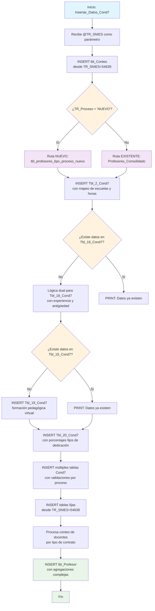

### Insertar_Datos_Cond7

Este procedimiento almacenado gestiona la inserción completa de datos docentes para la Condición 7 del sistema de Registro Calificado. Se especializa en procesar información del cuerpo profesoral según el tipo de proceso (NUEVO vs otros), incluyendo datos de contratación, formación académica, experiencia, vinculación, dedicación porcentual y evaluación docente. El procedimiento implementa lógica dual para manejar diferentes fuentes de datos según si el programa es nuevo o existente.

Realiza múltiples JOINs complejos entre sistemas internos y externos, calcula automáticamente experiencia y antigüedad, y genera estadísticas consolidadas del personal académico.

#### Diagrama de flujo



#### Procedimiento almacenado

```sql
-- EXEC [Dev].[Insertar_Datos_Cond7] @TR_SNIES = '202400120';

CREATE PROCEDURE [Dev].[Insertar_Datos_Cond7]

    @TR_SNIES NVARCHAR(255)

AS
BEGIN

PRINT 'Inicio de la inserción de datos en [REGISTRO_CALIFICADO].[RCAL].[Conteo]';

insert into [REGISTRO_CALIFICADO].[RCAL].[tbl_Conteo]
SELECT @TR_SNIES [TR_SNIES]
,[TR_Maximo]
,[TR_Minimo]
,[TR_TotalProfesores]
,[TR_NroEncuentros]
FROM [REGISTRO_CALIFICADO].[RCAL].[tbl_Conteo]
where TR_SNIES ='54639'

PRINT 'Inicio de la inserción de datos en [REGISTRO_CALIFICADO].[RCAL].[Conteo]';

PRINT 'Inicio de la inserción de datos en [REGISTRO_CALIFICADO].[RCAL].[Tbl_2_Cond7]';

IF EXISTS (
SELECT 1
FROM rcal.Acta
WHERE TR_SNIES = @TR_SNIES
AND TR_Proceso = 'NUEVO'
)
BEGIN
-- Inserta si el proceso es de tipo 'NUEVO' y no existe el registro duplicado
INSERT INTO [REGISTRO_CALIFICADO].[RCAL].[Tbl_2_Cond7] (
[TR_Profesor_Id]
, [TR_Profesor]
, [TR_NivelFormac]
, [TR_CyLac]
, [TR_Contrato]
, [TR_horasAsignadas]
, [TR_SNIES]
)
SELECT DISTINCT
a.NUM_IDENTIFICACION as TR_Profesor_Id
, a.NOM_LARGO as TR_Profesor
, c.Formacion as TR_NivelFormac
, CAST(E.OBS_REST AS nvarchar(max)) AS TR_CyLac
, c.Descripcion_Clase_Nomina AS TR_Contrato
, CASE
WHEN c.Descripcion_Clase_Nomina = 'DOCENTES TIEMPO COMPLETO' THEN 8
ELSE 6
END AS TR_horasAsignadas
, @TR_SNIES as TR_SNIES -- Este valor parece ser fijo para el proceso nuevo
FROM
[Dev].[tbl_profesores_tipo_proceso_nuevo] a
INNER JOIN
[CUN_REPOSITORIO].dbo.[PLANTA_ACTIVA_DOCENTES_ACTIVOS] c
ON a.NUM_IDENTIFICACION = c.Identificacion
INNER JOIN
[Dev].[kactus_BI_EMPLE] e
ON E.COD_EMPL = A.NUM_IDENTIFICACION
WHERE
a.nombre IN (
SELECT DISTINCT
CASE
WHEN TR_Escuela = 'Ingeniería' THEN 'Escuela de Ingeniería'
WHEN TR_Escuela = 'Diseño y Comunicación' THEN 'Escuela de Diseño y Comunicación'
WHEN TR_Escuela = 'Ciencias sociales, Jurídicas y Gobierno' THEN 'Escuela de Ciencias Jurídicas y Gobierno'
WHEN TR_Escuela = 'Transformación Empresarial' THEN 'Escuela de Transformación Empresarial'
ELSE TR_Escuela
END AS TR_Escuela
FROM
rcal.Acta
WHERE
TR_SNIES = @TR_SNIES

        )
    AND
        a.NUM_IDENTIFICACION IS NOT NULL
    AND
        NOT EXISTS (
            SELECT 1
            FROM [REGISTRO_CALIFICADO].[RCAL].[Tbl_2_Cond7] r
            WHERE r.TR_Profesor_Id = a.NUM_IDENTIFICACION
            AND r.TR_SNIES = @TR_SNIES
        );

END
ELSE
BEGIN
-- Inserta si el proceso no es de tipo 'NUEVO' y no existe el registro duplicado
INSERT INTO [REGISTRO_CALIFICADO].[RCAL].[Tbl_2_Cond7] (
[TR_Profesor_Id]
, [TR_Profesor]
, [TR_NivelFormac]
, [TR_CyLac]
, [TR_Contrato]
, [TR_horasAsignadas]
, [TR_SNIES]
)
SELECT DISTINCT
a.NUM_IDENTIFICACION as TR_Profesor_Id
, a.NOM_LARGO as TR_Profesor
, c.Formacion as TR_NivelFormac
, CAST(E.OBS_REST AS nvarchar(max)) AS TR_CyLac
, c.Descripcion_Clase_Nomina AS TR_Contrato
, CASE
WHEN c.Descripcion_Clase_Nomina = 'DOCENTES TIEMPO COMPLETO' THEN 8
ELSE 6
END AS TR_horasAsignadas
, @TR_SNIES as TR_SNIES
FROM
REGISTRO_CALIFICADO.[dev].[Profesores_Consolidado] a
INNER JOIN
[REGISTRO_CALIFICADO].[Dev].[MallasLauraUnificada] b
ON a.COD_UNIDAD = b.COD_UNIDAD
INNER JOIN
[CUN_REPOSITORIO].dbo.[PLANTA_ACTIVA_DOCENTES_ACTIVOS] c
ON a.NUM_IDENTIFICACION = c.Identificacion
INNER JOIN
REGISTRO_CALIFICADO.rcal.tbl_Escuelas d
ON A.COD_UNIDAD = D.TR_CodUnidad
INNER JOIN
[Dev].[kactus_BI_EMPLE] e
ON E.COD_EMPL = A.NUM_IDENTIFICACION
WHERE
a.COD_UNIDAD IN (
SELECT DISTINCT COD_UNIDAD
FROM [REGISTRO_CALIFICADO].[Dev].[MallasLauraUnificada]
WHERE ESTADO = 'VIGENTE' AND CODIGO_SNIES = @TR_SNIES
)
AND
a.NUM_IDENTIFICACION IS NOT NULL
AND
NOT EXISTS (
SELECT 1
FROM [REGISTRO_CALIFICADO].[RCAL].[Tbl_2_Cond7] r
WHERE r.TR_Profesor_Id = a.NUM_IDENTIFICACION
AND r.TR_SNIES = @TR_SNIES
);
END
PRINT 'Fin de la inserción de datos en [REGISTRO_CALIFICADO].[RCAL].[Tbl_2_Cond7]';

     PRINT 'Inicio de la inserción de datos en [REGISTRO_CALIFICADO].[RCAL].[Tbl_18_Cond7]';

    IF NOT EXISTS (
        SELECT 1
        FROM [REGISTRO_CALIFICADO].[RCAL].[Tbl_18_Cond7]
        WHERE TR_SNIES = @TR_SNIES
    )

BEGIN
IF EXISTS (
SELECT 1
FROM rcal.Acta
WHERE TR_SNIES = @TR_SNIES
AND TR_Proceso = 'NUEVO'
)
BEGIN
-- Inserta en Tbl_18_Cond7 si el proceso es de tipo 'NUEVO'
INSERT INTO [REGISTRO_CALIFICADO].[RCAL].[Tbl_18_Cond7] (
[TR_Profesor_Id]
, [TR_NombreDocente]
, [TR_NivelFormacion]
, [TR_Escalafon]
, [TR_Contrato]
, [TR_Dedicacion]
, [TR_ExpProfesional]
, [TR_ExpDocente]
, [TR_Antguedadinst]
, [TR_SNIES]
)
SELECT DISTINCT
a.num_identificacion AS TR_Profesor_Id
, a.nom_largo AS TR_NombreDocente
, c.Formacion AS TR_NivelFormacion
, c.Escalafon AS TR_Escalafon
, c.Descripcion_Clase_Nomina AS TR_Contrato
, c.Descripcion_Clase_Nomina AS TR_Dedicacion
, f.[Experiencia Profesional] AS [TR_ExpProfesional]
, f.Docencia AS [TR_ExpDocente]
, CONCAT(
FLOOR(DATEDIFF(DAY, c.Fecha_Inicio, GETDATE()) / 365), ' años y ',
DATEDIFF(DAY, c.Fecha_Inicio, GETDATE()) % 365, ' días'
) AS TR_Antiguedadinst
, @TR_SNIES AS TR_SNIES
FROM
[REGISTRO_CALIFICADO].[Dev].[tbl_profesores_tipo_proceso_nuevo] a
INNER JOIN
[CUN_REPOSITORIO].dbo.[PLANTA_ACTIVA_DOCENTES_ACTIVOS] c
ON a.NUM_IDENTIFICACION = c.Identificacion
INNER JOIN [CUN_REPOSITORIO].[dbo].[Experiencia_docentes] f
ON a.NUM_IDENTIFICACION = f.Identificacion
WHERE a.nombre = (
SELECT DISTINCT
CASE
WHEN TR_Escuela = 'Ingeniería' THEN 'Escuela de Ingeniería'
WHEN TR_Escuela = 'Diseño y Comunicación' THEN 'Escuela de Diseño y Comunicación'
WHEN TR_Escuela = 'Ciencias sociales, Jurídicas y Gobierno' THEN 'Escuela de Ciencias Jurídicas y Gobierno'
WHEN TR_Escuela = 'Transformación Empresarial' THEN 'Escuela de Transformación Empresarial'
ELSE TR_Escuela
END AS TR_Escuela
FROM
rcal.Acta
WHERE
TR_SNIES = @TR_SNIES
);
END
ELSE
BEGIN
-- Inserta en Tbl_18_Cond7 si el proceso no es de tipo 'NUEVO'
INSERT INTO [REGISTRO_CALIFICADO].[RCAL].[Tbl_18_Cond7] (
[TR_Profesor_Id]
, [TR_NombreDocente]
, [TR_NivelFormacion]
, [TR_Escalafon]
, [TR_Contrato]
, [TR_Dedicacion]
, [TR_ExpProfesional]
, [TR_ExpDocente]
, [TR_Antguedadinst]
, [TR_SNIES]
)
SELECT DISTINCT
a.NUM_IDENTIFICACION AS TR_Profesor_Id
, a.NOM_LARGO AS TR_NombreDocente
, c.Formacion AS TR_NivelFormacion
, c.Escalafon AS TR_Escalafon
, c.Descripcion_Clase_Nomina AS TR_Contrato
, c.Descripcion_Clase_Nomina AS TR_Dedicacion
, f.[Experiencia Profesional] AS [TR_ExpProfesional]
, f.Docencia AS [TR_ExpDocente]
, CONCAT(
FLOOR(DATEDIFF(DAY, c.Fecha_Inicio, GETDATE()) / 365), ' años y ',
DATEDIFF(DAY, c.Fecha_Inicio, GETDATE()) % 365, ' días'
) AS TR_Antiguedadinst
, @TR_SNIES AS TR_SNIES
FROM
REGISTRO_CALIFICADO.[dev].[Profesores_Consolidado] a
INNER JOIN
[CUN_REPOSITORIO].dbo.[PLANTA_ACTIVA_DOCENTES_ACTIVOS] c
ON a.NUM_IDENTIFICACION = c.Identificacion
INNER JOIN [CUN_REPOSITORIO].[dbo].[Experiencia_docentes] f
ON a.NUM_IDENTIFICACION = f.Identificacion
WHERE
a.COD_UNIDAD IN (SELECT DISTINCT COD_UNIDAD
FROM [REGISTRO_CALIFICADO].[Dev].[MallasLauraUnificada]
WHERE ESTADO = 'VIGENTE'
AND CODIGO_SNIES = @TR_SNIES);
END
END
ELSE
BEGIN
PRINT 'Los datos con el TR_SNIES proporcionado ya existen en la tabla destino.';
END;

    PRINT 'Fin de la inserción de datos en [REGISTRO_CALIFICADO].[RCAL].[Tbl_18_Cond7]';

     PRINT 'Inicio de la inserción de datos en [REGISTRO_CALIFICADO].[RCAL].[Tbl_19_Cond7]';

     IF NOT EXISTS (
        SELECT 1
        FROM [REGISTRO_CALIFICADO].[RCAL].[Tbl_19_Cond7]
        WHERE TR_SNIES = @TR_SNIES
    )

BEGIN
IF EXISTS (
SELECT 1
FROM rcal.Acta
WHERE TR_SNIES = @TR_SNIES
AND TR_Proceso = 'NUEVO'
)
BEGIN
-- Inserta en Tbl_19_Cond7 si el proceso es de tipo 'NUEVO'
INSERT INTO [REGISTRO_CALIFICADO].[RCAL].[Tbl_19_Cond7] (
[TR_Profesor_Id]
, [TR_NombreProfesor]
, [TR_FormacionAcadm]
, [TR_TipoVinculacion]
, [TR_FormacionPedag]
, [TE_FormacionModVirt]
, [TR_SNIES]
)
SELECT DISTINCT
a.NUM_IDENTIFICACION AS TR_Profesor_Id
, a.NOM_LARGO AS TR_NombreProfesor
, c.Formacion AS TR_FormacionAcadm
, c.Descripcion_Clase_Nomina AS TR_TipoVinculacion
, 1 AS TR_FormacionPedag
, 1 AS TE_FormacionModVirt
,@TR_SNIES AS TR_SNIES
FROM
[REGISTRO_CALIFICADO].[Dev].[tbl_profesores_tipo_proceso_nuevo] a
INNER JOIN
[CUN_REPOSITORIO].dbo.[PLANTA_ACTIVA_DOCENTES_ACTIVOS] c
ON a.NUM_IDENTIFICACION = c.Identificacion
WHERE a.nombre = (
SELECT DISTINCT
CASE
WHEN TR_Escuela = 'Ingeniería' THEN 'Escuela de Ingeniería'
WHEN TR_Escuela = 'Diseño y Comunicación' THEN 'Escuela de Diseño y Comunicación'
WHEN TR_Escuela = 'Ciencias sociales, Jurídicas y Gobierno' THEN 'Escuela de Ciencias Jurídicas y Gobierno'
WHEN TR_Escuela = 'Transformación Empresarial' THEN 'Escuela de Transformación Empresarial'
ELSE TR_Escuela
END AS TR_Escuela
FROM
rcal.Acta
WHERE
TR_SNIES = @TR_SNIES
);
END
ELSE
BEGIN
-- Inserta en Tbl_19_Cond7 si el proceso no es de tipo 'NUEVO'
INSERT INTO [REGISTRO_CALIFICADO].[RCAL].[Tbl_19_Cond7] (
[TR_Profesor_Id]
, [TR_NombreProfesor]
, [TR_FormacionAcadm]
, [TR_TipoVinculacion]
, [TR_FormacionPedag]
, [TE_FormacionModVirt]
, [TR_SNIES]
)
SELECT DISTINCT
a.NUM_IDENTIFICACION AS TR_Profesor_Id
, a.NOM_LARGO AS TR_NombreProfesor
, c.Formacion AS TR_FormacionAcadm
, c.Descripcion_Clase_Nomina AS TR_TipoVinculacion
, 1 AS TR_FormacionPedag
, 1 AS TE_FormacionModVirt
, @TR_SNIES AS TR_SNIES
FROM
REGISTRO_CALIFICADO.[dev].[Profesores_Consolidado] a
INNER JOIN
[CUN_REPOSITORIO].dbo.[PLANTA_ACTIVA_DOCENTES_ACTIVOS] c
ON a.NUM_IDENTIFICACION = c.Identificacion
WHERE
a.COD_UNIDAD IN (SELECT DISTINCT COD_UNIDAD
FROM [REGISTRO_CALIFICADO].[Dev].[MallasLauraUnificada]
WHERE ESTADO = 'VIGENTE' AND CODIGO_SNIES = @TR_SNIES);
END
END
ELSE
BEGIN
PRINT 'Los datos con el TR_SNIES proporcionado ya existen en la tabla destino.';
END

     PRINT 'Fin de la inserción de datos en [REGISTRO_CALIFICADO].[RCAL].[Tbl_19_Cond7]';

     PRINT 'Inicio de la inserción de datos en [REGISTRO_CALIFICADO].[RCAL].[Tbl_20_Cond7]';


     -- Verifica si el tipo de proceso es nuevo

IF EXISTS (
SELECT 1
FROM rcal.Acta
WHERE TR_SNIES = @TR_SNIES
AND TR_Proceso = 'nuevo' -- Asumiendo que 'tipo_proceso' es la columna que determina si es nuevo
)
BEGIN
-- Inserción si el proceso es nuevo
INSERT INTO [REGISTRO_CALIFICADO].[RCAL].[Tbl_20_Cond7] (
[Num]
,[TR_Profesor_Id]
,[Nombre_Profesor]
,[Vinculacion]
,[%_Dedicación_al_Programa]
,[%_Docencia]
,[%_Investigación]
,[%_Proyección Social]
,[%_Otros]
,[TR_SNIES]
)
SELECT DISTINCT
1 AS [Num]
, a.NUM_IDENTIFICACION AS TR_Profesor_Id
, a.NOM_LARGO AS Nombre_Profesor
, c.Descripcion_Clase_Nomina AS Vinculacion
, '50' AS [%_Dedicación_al_Programa]
, '35' AS [%_Docencia]
, '10' AS [%_Investigación]
, '5' AS [%_Proyección_Social]
, '5' AS [%_Otros]
, @TR_SNIES AS TR_SNIES
FROM
[Dev].[tbl_profesores_tipo_proceso_nuevo] a
INNER JOIN
[CUN_REPOSITORIO].dbo.[PLANTA_ACTIVA_DOCENTES_ACTIVOS] c
ON a.NUM_IDENTIFICACION = c.Identificacion
WHERE
a.nombre IN (SELECT DISTINCT
CASE
WHEN TR_Escuela = 'Ingeniería' THEN 'Escuela de Ingeniería'
WHEN TR_Escuela = 'Diseño y Comunicación' THEN 'Escuela de Diseño y Comunicación'
WHEN TR_Escuela = 'Ciencias sociales, Jurídicas y Gobierno' THEN 'Escuela de Ciencias Jurídicas y Gobierno'
WHEN TR_Escuela = 'Transformación Empresarial' THEN 'Escuela de Transformación Empresarial'
ELSE TR_Escuela
END AS TR_Escuela
FROM
rcal.Acta
WHERE
TR_SNIES = @TR_SNIES)
AND a.NUM_IDENTIFICACION IS NOT NULL
AND NOT EXISTS (
SELECT 1
FROM [REGISTRO_CALIFICADO].[RCAL].[Tbl_20_Cond7] t
WHERE t.TR_Profesor_Id = a.NUM_IDENTIFICACION
AND t.TR_SNIES = @TR_SNIES
);
END
ELSE
BEGIN
-- Inserción si el proceso no es nuevo
INSERT INTO [REGISTRO_CALIFICADO].[RCAL].[Tbl_20_Cond7] (
[Num]
,[TR_Profesor_Id]
,[Nombre_Profesor]
,[Vinculacion]
,[%_Dedicación_al_Programa]
,[%_Docencia]
,[%_Investigación]
,[%_Proyección Social]
,[%_Otros]
,[TR_SNIES]
)
SELECT DISTINCT
1 AS [Num]
, a.NUM_IDENTIFICACION AS TR_Profesor_Id
, a.NOM_LARGO AS Nombre_Profesor
, c.Descripcion_Clase_Nomina AS Vinculacion
, '50' AS [%_Dedicación_al_Programa]
, '35' AS [%_Docencia]
, '10' AS [%_Investigación]
, '5' AS [%_Proyección_Social]
, '5' AS [%_Otros]
, @TR_SNIES AS TR_SNIES
FROM
REGISTRO_CALIFICADO.[dev].[Profesores_Consolidado] a
INNER JOIN
[CUN_REPOSITORIO].dbo.[PLANTA_ACTIVA_DOCENTES_ACTIVOS] c
ON a.NUM_IDENTIFICACION = c.Identificacion
WHERE
a.COD_UNIDAD IN (
SELECT DISTINCT COD_UNIDAD
FROM [REGISTRO_CALIFICADO].[Dev].[MallasLauraUnificada]
WHERE ESTADO = 'VIGENTE'
AND CODIGO_SNIES = @TR_SNIES
)
AND a.NUM_IDENTIFICACION IS NOT NULL
AND NOT EXISTS (
SELECT 1
FROM [REGISTRO_CALIFICADO].[RCAL].[Tbl_20_Cond7] t
WHERE t.TR_Profesor_Id = a.NUM_IDENTIFICACION
AND t.TR_SNIES = @TR_SNIES
);
END

     PRINT 'Fin de la inserción de datos en [REGISTRO_CALIFICADO].[RCAL].[Tbl_20_Cond7]';

     PRINT 'Inicio de la inserción de datos en [REGISTRO_CALIFICADO].[RCAL].[Tbl_21_Cond7]';

     -- Suponiendo que tienes un parámetro @TR_SNIES que determina la lógica de inserción

-- Inserción condicional según las condiciones
IF EXISTS (
SELECT 1
FROM [rcal].[Acta]
WHERE TR_SNIES = @TR_SNIES
AND TR_Proceso = 'Nuevo'
)
BEGIN
INSERT INTO [REGISTRO_CALIFICADO].[RCAL].[Tbl_21_Cond7] (
[Tipo_de_Vinculacion],
[Maximo_Nivel_de_Formacion],
[Area_de_Conocimiento],
[Formacion_Adicional],
[TR_SNIES]
)
SELECT DISTINCT  
 c.Descripcion_Clase_Nomina AS Tipo_de_Vinculacion,
c.Formacion AS Maximo_Nivel_de_Formacion,
c.Nombre_Centro_Costo AS Area_de_Conocimiento,
c.Formacion AS Formacion_Adicional,  
 @TR_SNIES AS TR_SNIES
FROM
[Dev].[tbl_profesores_tipo_proceso_nuevo] a
INNER JOIN
[CUN_REPOSITORIO].dbo.[PLANTA_ACTIVA_DOCENTES_ACTIVOS] c
ON a.NUM_IDENTIFICACION = c.Identificacion
WHERE
a.nombre = (
SELECT DISTINCT
CASE
WHEN TR_Escuela = 'Ingeniería' THEN 'Escuela de Ingeniería'
WHEN TR_Escuela = 'Diseño y Comunicación' THEN 'Escuela de Diseño y Comunicación'
WHEN TR_Escuela = 'Ciencias sociales, Jurídicas y Gobierno' THEN 'Escuela de Ciencias Jurídicas y Gobierno'
WHEN TR_Escuela = 'Transformación Empresarial' THEN 'Escuela de Transformación Empresarial'
ELSE TR_Escuela
END AS TR_Escuela
FROM
rcal.Acta
WHERE
TR_SNIES = @TR_SNIES
)
AND
a.NUM_IDENTIFICACION IS NOT NULL
AND
a.NUM_IDENTIFICACION NOT IN (
SELECT TR_Profesor_Id
FROM [REGISTRO_CALIFICADO].[RCAL].[Tbl_33_Cond7]
WHERE TR_SNIES = @TR_SNIES
);
END
ELSE
BEGIN
INSERT INTO [REGISTRO_CALIFICADO].[RCAL].[Tbl_21_Cond7] (
[Tipo_de_Vinculacion],
[Maximo_Nivel_de_Formacion],
[Area_de_Conocimiento],
[Formacion_Adicional],
[TR_SNIES]
)
SELECT DISTINCT  
 c.Descripcion_Clase_Nomina AS Tipo_de_Vinculacion,
c.Formacion AS Maximo_Nivel_de_Formacion,
c.Nombre_Centro_Costo AS Area_de_Conocimiento,
c.Formacion AS Formacion_Adicional,  
 @TR_SNIES AS TR_SNIES
FROM
REGISTRO_CALIFICADO.[dev].[Profesores_Consolidado] a
INNER JOIN
[CUN_REPOSITORIO].dbo.[PLANTA_ACTIVA_DOCENTES_ACTIVOS] c
ON a.NUM_IDENTIFICACION = c.Identificacion
WHERE
a.COD_UNIDAD IN (
SELECT DISTINCT COD_UNIDAD
FROM [REGISTRO_CALIFICADO].[Dev].[MallasLauraUnificada]
WHERE ESTADO = 'VIGENTE'
AND CODIGO_SNIES = @TR_SNIES
)
AND
a.NUM_IDENTIFICACION IS NOT NULL
AND
a.NUM_IDENTIFICACION NOT IN (
SELECT TR_Profesor_Id
FROM [REGISTRO_CALIFICADO].[RCAL].[Tbl_33_Cond7]
WHERE TR_SNIES = @TR_SNIES
);
END;

     PRINT 'Fin de la inserción de datos en [REGISTRO_CALIFICADO].[RCAL].[Tbl_21_Cond7]';

     PRINT 'Inicio de la inserción de datos en [REGISTRO_CALIFICADO].[RCAL].[Tbl_23_Cond7]';

     IF EXISTS (
    SELECT 1
    FROM [rcal].[Acta]
    WHERE TR_SNIES = @TR_SNIES
      AND TR_Proceso = 'Nuevo'

)
BEGIN
INSERT INTO [REGISTRO_CALIFICADO].[RCAL].[Tbl_23_Cond7] (
[TR_Profesor_Id],
[TR_Profesor],
[TR_ExpProfesional],
[TR_ExpDocente],
TR_Antguedadinst,
[TR_SNIES]
)
SELECT DISTINCT TOP 10
a.NUM_IDENTIFICACION AS TR_Profesor_Id,
a.NOM_LARGO AS TR_Profesor,
f.[Experiencia Profesional] AS [TR_ExpProfesional],
f.Docencia AS [TR_ExpDocente],
CONCAT(
FLOOR(DATEDIFF(DAY, c.Fecha_Inicio, GETDATE()) / 365), ' años y ',
DATEDIFF(DAY, c.Fecha_Inicio, GETDATE()) % 365, ' días'
) AS TR_Antguedadinst,
@TR_SNIES AS TR_SNIES
FROM
[Dev].[tbl_profesores_tipo_proceso_nuevo] a
INNER JOIN
[CUN_REPOSITORIO].[dbo].[Experiencia_docentes] f
ON a.NUM_IDENTIFICACION = f.Identificacion
INNER JOIN
[CUN_REPOSITORIO].dbo.[PLANTA_ACTIVA_DOCENTES_ACTIVOS] c
ON a.NUM_IDENTIFICACION = c.Identificacion
WHERE
a.nombre = (
SELECT DISTINCT
CASE
WHEN TR_Escuela = 'Ingeniería' THEN 'Escuela de Ingeniería'
WHEN TR_Escuela = 'Diseño y Comunicación' THEN 'Escuela de Diseño y Comunicación'
WHEN TR_Escuela = 'Ciencias sociales, Jurídicas y Gobierno' THEN 'Escuela de Ciencias Jurídicas y Gobierno'
WHEN TR_Escuela = 'Transformación Empresarial' THEN 'Escuela de Transformación Empresarial'
ELSE TR_Escuela
END AS TR_Escuela
FROM
rcal.Acta
WHERE
TR_SNIES = @TR_SNIES
);
END
ELSE
BEGIN
INSERT INTO [REGISTRO_CALIFICADO].[RCAL].[Tbl_23_Cond7] (
[TR_Profesor_Id],
[TR_Profesor],
[TR_ExpProfesional],
[TR_ExpDocente],
TR_Antguedadinst,
[TR_SNIES]
)
SELECT DISTINCT top 10
a.NUM_IDENTIFICACION AS TR_Profesor_Id,
a.NOM_LARGO AS TR_Profesor,
f.[Experiencia Profesional] AS [TR_ExpProfesional],
f.Docencia AS [TR_ExpDocente],
CONCAT(
FLOOR(DATEDIFF(DAY, c.Fecha_Inicio, GETDATE()) / 365), ' años y ',
DATEDIFF(DAY, c.Fecha_Inicio, GETDATE()) % 365, ' días'
) AS TR_Antguedadinst,
@TR_SNIES AS TR_SNIES
FROM
REGISTRO_CALIFICADO.[dev].[Profesores_Consolidado] a
INNER JOIN
[CUN_REPOSITORIO].[dbo].[Experiencia_docentes] f
ON a.NUM_IDENTIFICACION = f.Identificacion
INNER JOIN
[CUN_REPOSITORIO].dbo.[PLANTA_ACTIVA_DOCENTES_ACTIVOS] c
ON a.NUM_IDENTIFICACION = c.Identificacion
WHERE
a.COD_UNIDAD IN (
SELECT DISTINCT COD_UNIDAD
FROM [REGISTRO_CALIFICADO].[Dev].[MallasLauraUnificada]
WHERE ESTADO = 'VIGENTE' AND CODIGO_SNIES = @TR_SNIES
);
END;

     PRINT 'Fin de la inserción de datos en [REGISTRO_CALIFICADO].[RCAL].[Tbl_23_Cond7]';

     PRINT 'Inicio de la inserción de datos en [REGISTRO_CALIFICADO].[RCAL].[Tbl_24_Cond7]';


    -- Verificar si el tipo de proceso es nuevo

IF EXISTS (
SELECT 1
FROM rcal.Acta
WHERE TR_SNIES = @TR_SNIES AND TR_Proceso = 'Nuevo' -- Asumiendo que 'Tipo_Proceso' es el campo que indica si es nuevo
)
BEGIN
-- Inserción si el tipo de proceso ES nuevo
INSERT INTO [REGISTRO_CALIFICADO].[RCAL].[Tbl_24_Cond7]
(
[Docente]
,[Formacion]
,[Vinculacion]
,[Cvlac]
,[TR_SNIES]
,[Asignación_Horaria]
)
SELECT DISTINCT top 10
a.NOM_LARGO AS Docente
, c.Formacion AS Formacion
, c.Descripcion_Clase_Nomina AS Vinculacion
, CAST(E.OBS_REST AS nvarchar(max)) AS Cvlac
, @TR_SNIES AS TR_SNIES
, c.Descripcion_Clase_Nomina AS Asignación_Horaria
FROM
[Dev].[tbl_profesores_tipo_proceso_nuevo] a
INNER JOIN
[CUN_REPOSITORIO].dbo.[PLANTA_ACTIVA_DOCENTES_ACTIVOS] c
ON a.NUM_IDENTIFICACION = c.Identificacion
INNER JOIN
[Dev].[kactus_BI_EMPLE] e
ON E.COD_EMPL = A.NUM_IDENTIFICACION
WHERE
a.NOMBRE IN (
SELECT DISTINCT
CASE
WHEN TR_Escuela = 'Ingeniería' THEN 'Escuela de Ingeniería'
WHEN TR_Escuela = 'Diseño y Comunicación' THEN 'Escuela de Diseño y Comunicación'
WHEN TR_Escuela = 'Ciencias sociales, Jurídicas y Gobierno' THEN 'Escuela de Ciencias Jurídicas y Gobierno'
WHEN TR_Escuela = 'Transformación Empresarial' THEN 'Escuela de Transformación Empresarial'
ELSE TR_Escuela
END AS TR_Escuela
FROM
rcal.Acta
WHERE
TR_SNIES = @TR_SNIES
)
AND a.NUM_IDENTIFICACION IS NOT NULL
AND NOT EXISTS (
SELECT 1
FROM [REGISTRO_CALIFICADO].[RCAL].[Tbl_24_Cond7] t
WHERE t.Docente = a.NOM_LARGO
AND t.Formacion = c.Formacion
AND t.Vinculacion = c.Descripcion_Clase_Nomina
AND t.TR_SNIES = @TR_SNIES
);
END
ELSE
BEGIN
-- Inserción si el tipo de proceso NO es nuevo
INSERT INTO [REGISTRO_CALIFICADO].[RCAL].[Tbl_24_Cond7]
(
[Docente]
,[Formacion]
,[Vinculacion]
,[Cvlac]
,[TR_SNIES]
,[Asignación_Horaria]
)
SELECT DISTINCT
a.NOM_LARGO AS Docente
, c.Formacion AS Formacion
, c.Descripcion_Clase_Nomina AS Vinculacion
, CAST(E.OBS_REST AS nvarchar(max)) AS Cvlac
, @TR_SNIES AS TR_SNIES
, c.Descripcion_Clase_Nomina AS Asignación_Horaria
FROM
REGISTRO_CALIFICADO.[dev].[Profesores_Consolidado] a
INNER JOIN
[CUN_REPOSITORIO].dbo.[PLANTA_ACTIVA_DOCENTES_ACTIVOS] c
ON a.NUM_IDENTIFICACION = c.Identificacion
INNER JOIN
[Dev].[kactus_BI_EMPLE] e
ON E.COD_EMPL = A.NUM_IDENTIFICACION
WHERE
a.COD_UNIDAD IN (
SELECT DISTINCT COD_UNIDAD
FROM [REGISTRO_CALIFICADO].[Dev].[MallasLauraUnificada]
WHERE ESTADO = 'VIGENTE' AND CODIGO_SNIES = @TR_SNIES
)
AND a.NUM_IDENTIFICACION IS NOT NULL
AND NOT EXISTS (
SELECT 1
FROM [REGISTRO_CALIFICADO].[RCAL].[Tbl_24_Cond7] t
WHERE t.Docente = a.NOM_LARGO
AND t.Formacion = c.Formacion
AND t.Vinculacion = c.Descripcion_Clase_Nomina
AND t.TR_SNIES = @TR_SNIES
);
END

     PRINT 'Fin de la inserción de datos en [REGISTRO_CALIFICADO].[RCAL].[Tbl_24_Cond7]';

     PRINT 'Inicio de la inserción de datos en [REGISTRO_CALIFICADO].[RCAL].[Tbl_25_Cond7]';

        INSERT INTO [REGISTRO_CALIFICADO].[RCAL].[Tbl_25_Cond7]
    	SELECT  [TR_Profesor_Id]
    		  ,[Perfil_Tecnico]
    		  ,[Perfil_Comportamental]
    		  ,[Rol_Docente]
    		  ,@TR_SNIES AS [TR_SNIES]
    	   FROM [REGISTRO_CALIFICADO].[RCAL].[Tbl_25_Cond7]
    	  WHERE TR_SNIES ='54639'

     PRINT 'Fin de la inserción de datos en [REGISTRO_CALIFICADO].[RCAL].[Tbl_25_Cond7]';

     PRINT 'Inicio de la inserción de datos en [REGISTRO_CALIFICADO].[RCAL].[Tbl_27_Cond7]';

        INSERT INTO [REGISTRO_CALIFICADO].[RCAL].[Tbl_27_Cond7]
    	SELECT  [Año]
    		  ,[Actividad]
    		  ,[Objetivo]
    		  ,@TR_SNIES AS [TR_SNIES]
    	  FROM [REGISTRO_CALIFICADO].[RCAL].[Tbl_27_Cond7]
    	  WHERE TR_SNIES = '54639'


     PRINT 'Fin de la inserción de datos en [REGISTRO_CALIFICADO].[RCAL].[Tbl_27_Cond7]';


     PRINT 'Inicio de la inserción de datos en [REGISTRO_CALIFICADO].[RCAL].[Tbl_33_Cond7]';

     IF EXISTS (
    SELECT 1
    FROM [rcal].[Acta]
    WHERE TR_SNIES = @TR_SNIES
      AND TR_Proceso = 'Nuevo'

)
BEGIN
-- Inserción si el tipo de proceso es nuevo, evitando duplicados
INSERT INTO [REGISTRO_CALIFICADO].[RCAL].[Tbl_33_Cond7] (
[TR_Profesor_Id]
,[Tipo_Vinculacion]
,[Nivel_Formacion]
,[Area_Conocimiento]
,[TR_SNIES]
,[TR_NombreProfesor]
)
SELECT DISTINCT  
 a.NUM_IDENTIFICACION AS TR_Profesor_Id
, c.Descripcion_Clase_Nomina AS Tipo_Vinculacion
, c.Formacion AS Nivel_Formacion
, c.Nombre_Centro_Costo AS Area_Conocimiento
, @TR_SNIES AS TR_SNIES
, a.NOM_LARGO AS TR_NombreProfesor
FROM
[Dev].[tbl_profesores_tipo_proceso_nuevo] a
INNER JOIN
[CUN_REPOSITORIO].dbo.[PLANTA_ACTIVA_DOCENTES_ACTIVOS] c
ON a.NUM_IDENTIFICACION = c.Identificacion
WHERE
a.nombre = (
SELECT DISTINCT
CASE
WHEN TR_Escuela = 'Ingeniería' THEN 'Escuela de Ingeniería'
WHEN TR_Escuela = 'Diseño y Comunicación' THEN 'Escuela de Diseño y Comunicación'
WHEN TR_Escuela = 'Ciencias sociales, Jurídicas y Gobierno' THEN 'Escuela de Ciencias Jurídicas y Gobierno'
WHEN TR_Escuela = 'Transformación Empresarial' THEN 'Escuela de Transformación Empresarial'
ELSE TR_Escuela
END AS TR_Escuela
FROM
rcal.Acta
WHERE
TR_SNIES = @TR_SNIES)
AND
a.NUM_IDENTIFICACION IS NOT NULL
AND
a.NUM_IDENTIFICACION NOT IN (
SELECT TR_Profesor_Id
FROM [REGISTRO_CALIFICADO].[RCAL].[Tbl_33_Cond7]
WHERE TR_SNIES = @TR_SNIES);
END
ELSE
BEGIN
-- Inserción si el tipo de proceso no es nuevo, evitando duplicados
INSERT INTO [REGISTRO_CALIFICADO].[RCAL].[Tbl_33_Cond7] (
[TR_Profesor_Id]
,[Tipo_Vinculacion]
,[Nivel_Formacion]
,[Area_Conocimiento]
,[TR_SNIES]
,[TR_NombreProfesor]
)
SELECT DISTINCT  
 a.NUM_IDENTIFICACION AS TR_Profesor_Id
, c.Descripcion_Clase_Nomina AS Tipo_Vinculacion
, c.Formacion AS Nivel_Formacion
, c.Nombre_Centro_Costo AS Area_Conocimiento
, @TR_SNIES AS TR_SNIES
, a.NOM_LARGO AS TR_NombreProfesor
FROM
REGISTRO_CALIFICADO.[dev].[Profesores_Consolidado] a
INNER JOIN
[CUN_REPOSITORIO].dbo.[PLANTA_ACTIVA_DOCENTES_ACTIVOS] c
ON a.NUM_IDENTIFICACION = c.Identificacion
WHERE
a.COD_UNIDAD IN (SELECT DISTINCT COD_UNIDAD
FROM [REGISTRO_CALIFICADO].[Dev].[MallasLauraUnificada]
WHERE ESTADO = 'VIGENTE' AND CODIGO_SNIES = @TR_SNIES)
AND
a.NUM_IDENTIFICACION IS NOT NULL
AND
a.NUM_IDENTIFICACION NOT IN (
SELECT TR_Profesor_Id
FROM [REGISTRO_CALIFICADO].[RCAL].[Tbl_33_Cond7]
WHERE TR_SNIES = @TR_SNIES);
END;

     PRINT 'Fin de la inserción de datos en [REGISTRO_CALIFICADO].[RCAL].[Tbl_33_Cond7]';

     PRINT 'Inicio de la inserción de datos en [REGISTRO_CALIFICADO].[RCAL].[Tbl23_Cond7_ESP]';

     IF NOT EXISTS (
        SELECT 1
        FROM [REGISTRO_CALIFICADO].[RCAL].[Tbl23_Cond7_ESP]
        WHERE TR_SNIES = @TR_SNIES
    )
    BEGIN

    --INSERT INTO [REGISTRO_CALIFICADO].[RCAL].[Tbl23_Cond7_ESP] (

-- [TR_Profesor_Id]
-- ,[Tipo_Vinculacion]
-- ,[Nivel_Formacion]
-- ,[Area_Conocimiento]
--,[Formacion_Adicional]
-- ,[TR_SNIES]
-- )

-- SELECT distinct
-- a.NUM_IDENTIFICACION as TR_Profesor_Id
-- , c.Descripcion_Clase_Nomina AS Tipo_Vinculacion
-- , c.Formacion as Nivel_Formacion
-- , c.Nombre_Centro_Costo as Area_Conocimiento
-- , c.Nombre_Centro_Costo AS Formacion_Adicional
-- , @TR_SNIES as TR_SNIES
-- FROM
-- REGISTRO_CALIFICADO.[dev].[Profesores_Consolidado] a
-- INNER JOIN
-- [REGISTRO_CALIFICADO].[Dev].[MallasLauraUnificada] b
-- ON a.COD_UNIDAD = b.COD_UNIDAD
-- INNER JOIN
-- [CUN_REPOSITORIO].dbo.[PLANTA_ACTIVA_DOCENTES_ACTIVOS] c
-- ON a.NUM_IDENTIFICACION = c.Identificacion
-- INNER JOIN
-- REGISTRO_CALIFICADO.rcal.tbl_Escuelas d
-- ON A.COD_UNIDAD = D.TR_CodUnidad
-- INNER JOIN
-- [Dev].[kactus_BI_EMPLE] e
-- ON E.COD_EMPL = A.NUM_IDENTIFICACION
-- WHERE
-- a.COD_UNIDAD IN (SELECT DISTINCT COD_UNIDAD
-- FROM [REGISTRO_CALIFICADO].[Dev].[MallasLauraUnificada]
-- WHERE ESTADO = 'VIGENTE' AND CODIGO_SNIES = @TR_SNIES)

INSERT INTO [REGISTRO_CALIFICADO].[RCAL].[Tbl23_Cond7_ESP]
SELECT [TR_Profesor_Id]
,[Tipo_Vinculacion]
,[Nivel_Formacion]
,[Area_Conocimiento]
,[Formacion_Adicional]
,@TR_SNIES
FROM [REGISTRO_CALIFICADO].[RCAL].[Tbl23_Cond7_ESP]
WHERE TR_SNIES = '202400120'

-- insert into [REGISTRO_CALIFICADO].[RCAL].[Tbl23_Cond7_ESP]
--SELECT [TR_Profesor_Id]
-- ,[Tipo_Vinculacion]
-- ,[Nivel_Formacion]
-- ,[Area_Conocimiento]
-- ,[Formacion_Adicional]
-- ,'202400121'
-- FROM [REGISTRO_CALIFICADO].[RCAL].[Tbl23_Cond7_ESP]
-- where TR_SNIES ='202400120'

    END
    ELSE
    BEGIN
        PRINT 'Los datos con el TR_SNIES proporcionado ya existen en la tabla destino.';
    END

     PRINT 'Fin de la inserción de datos en [REGISTRO_CALIFICADO].[RCAL].[Tbl23_Cond7_ESP]';


      PRINT 'Inicio de la inserción de datos en Contratacion de Docentes';

    		  INSERT INTO [REGISTRO_CALIFICADO].[graf].[Cond7_Figura_6]
    		([TR_NivelFormacion], [#CONTRATADOS] ,  TR_SNIES)
    	SELECT
    		TR_NivelFormacion,
    		COUNT(*) AS #CONTRATADOS ,
    		@TR_SNIES as TR_SNIES
    	FROM
    		rcal.Tbl_18_Cond7
    	WHERE
    		TR_SNIES = @TR_SNIES
    	GROUP BY
    		TR_NivelFormacion;


      PRINT 'Fin de la inserción de datos en Contratacion de Docentes';

PRINT 'Inicio de la inserción de datos en Profesores';

INSERT INTO [REGISTRO_CALIFICADO].[RCAL].[tbl_Profesor]
SELECT DISTINCT
@TR_SNIES AS TR_SNIES,
1 AS TR_Profesor_Id,
1 AS TR_NombreProfesor,
1 AS TR_FormacionAcadm,
1 AS TR_TipoVinculacion,
1 AS TR_FormacionPedag,
1 AS TE_FormacionVirtual,
1 AS TR_Dedicacion,
1 AS TR_Docencia,
1 AS TR_investigacion,
1 AS TR_ProySocial,
1 AS TR_Otros,
CAST(DocentesTiempoCompleto.Cantidad AS INT) AS TR_NumeroDocentesTiempoComplt,
ISNULL(CAST(DocentesMedioTiempo.Cantidad AS INT), 0) AS TR_NumeroDocentesMedioTiempo,
1 AS TR_Escuela,
1 AS TR_AreaConocimiento,
1 AS TR_ExpProfesional_años,
1 AS TR_ExpDocente_años,
1 AS TR_CyLac,
1 AS TR_horasAsignadas,
CAST(DocentesTotales.Cantidad AS INT) AS TR_NumeroDocentes,
1 AS TR_Vinculacion,
1 AS TR_Modificacion,
1 AS TR_Antiguedadinst
FROM [REGISTRO_CALIFICADO].[RCAL].[tbl_Profesor] p
LEFT JOIN (
SELECT
TR_SNIES,
COUNT(_) AS Cantidad
FROM [REGISTRO_CALIFICADO].[RCAL].[Tbl_2_Cond7]
WHERE TR_Contrato = 'DOCENTES TIEMPO COMPLETO'
GROUP BY TR_SNIES
) AS DocentesTiempoCompleto
ON DocentesTiempoCompleto.TR_SNIES = @TR_SNIES
LEFT JOIN (
SELECT
TR_SNIES,
COUNT(_) AS Cantidad
FROM [REGISTRO_CALIFICADO].[RCAL].[Tbl_2_Cond7]
WHERE TR_Contrato = 'DOCENTES MEDIO TIEMPO'
GROUP BY TR_SNIES
) AS DocentesMedioTiempo
ON DocentesMedioTiempo.TR_SNIES = @TR_SNIES
LEFT JOIN (
SELECT
TR_SNIES,
COUNT(\*) AS Cantidad
FROM [REGISTRO_CALIFICADO].[RCAL].[Tbl_2_Cond7]
GROUP BY TR_SNIES
) AS DocentesTotales
ON DocentesTotales.TR_SNIES = @TR_SNIES;

PRINT 'Fin de la inserción de datos en Profesores';

    PRINT 'Inicio de la inserción de datos en F7_ConteoProfEstud';


    INSERT INTO rcal.F7_ConteoProfEstud
    select TR_SNIES, TR_EstudiantesPrimerSemestre as F7_ConteoProfEstud   from rcal.Acta
    WHERE TR_SNIES =@TR_SNIES


    PRINT 'Fin de la inserción de datos en F7_ConteoProfEstud';

    insert into[REGISTRO_CALIFICADO].[RCAL].[tbl_ProfesorExperiencia]

SELECT top 10 [TR_Profesor_id]
,[TR_NombreDocente]
,[TR_ExpProfesional]
,[TR_ExpDocente]
,[TR_AntiguedadInstAnos]
,@TR_SNIES
FROM [REGISTRO_CALIFICADO].[RCAL].[tbl_ProfesorExperiencia]
where TR_SNIES = '202500195'

insert into [REGISTRO_CALIFICADO].[RCAL].[TBL_EVALUACION_DOCENTE]
SELECT
@TR_SNIES as [TR_SNIES]
,[EVALUACION]
,[PARTICIPACION]
FROM [REGISTRO_CALIFICADO].[RCAL].[TBL_EVALUACION_DOCENTE]
where TR_SNIES ='54639'

--DROP TABLE IF EXISTS #BASE

--SELECT
-- FORMAT(FechaCargue, 'yyyy') + '-S' + IIF(MONTH(FechaCargue) <= 6, '1', '2') AS SEMESTRE,
-- SUM(IIF(value = 'TC', 1, 0)) AS MEDIO_TIEMPO,
-- SUM(IIF(value = 'MT', 1, 0)) AS TIEMPO_COMPLETO,
-- ROUND(AVG(sue_basi) / 180.0, 2) AS HORA_CATEDRA,
-- '-' AS LUGAR_DESARROLLO
--INTO #BASE
--FROM dbo.Hub_Empleados
--CROSS APPLY STRING_SPLIT(NOM_CARG, '/')
--WHERE NOM_CARG LIKE '%DOCENTE%'
-- AND value IN ('TC', 'MT')
-- AND FechaCargue = (
-- SELECT MAX(h2.FechaCargue)
-- FROM dbo.Hub_Empleados h2
-- WHERE h2.Identificacion = dbo.Hub_Empleados.Identificacion
-- )
--GROUP BY FORMAT(FechaCargue, 'yyyy') + '-S' + IIF(MONTH(FechaCargue) <= 6, '1', '2')
--ORDER BY SEMESTRE;

--SELECT \*, SUM(MEDIO_TIEMPO + TIEMPO_COMPLETO) AS TOTAL FROM #BASE
--GROUP BY SEMESTRE , MEDIO_TIEMPO , TIEMPO_COMPLETO, HORA_CATEDRA, LUGAR_DESARROLLO

insert into [REGISTRO_CALIFICADO].[RCAL].[TBL_DOCENTESBENEFICIADOSFORMACION]
SELECT @TR_SNIES as TR_SNIES
,[NOMBRE]
,( SELECT TR_NombreProgramaPro FROM RCAL.Acta WHERE TR_SNIES = @TR_SNIES) AS [PROGRAMA]
,( SELECT TR_Regionales FROM RCAL.Acta WHERE TR_SNIES = @TR_SNIES) AS [REGIONAL]
,[NIVEL]
,[ANO]
,[MODALIDAD]
FROM [REGISTRO_CALIFICADO].[RCAL].[TBL_DOCENTESBENEFICIADOSFORMACION]
WHERE TR_SNIES = '54639'

END

```
#### Operaciones Principales por Tabla
1. Datos Básicos de Conteo:

- tbl_Conteo: Máximo, mínimo, total profesores, número de encuentros

2. Información Básica Docente (Tbl_2_Cond7):
```sql
-- Cálculo automático de horas asignadas:
CASE 
  WHEN Descripcion_Clase_Nomina = 'DOCENTES TIEMPO COMPLETO' THEN 8
  ELSE 6
END AS TR_horasAsignadas
```
3. Experiencia y Formación (Tbl_18_Cond7):
```sql
-- Cálculo automático de antigüedad:
CONCAT(
  FLOOR(DATEDIFF(DAY, Fecha_Inicio, GETDATE()) / 365), ' años y ',
  DATEDIFF(DAY, Fecha_Inicio, GETDATE()) % 365, ' días'
) AS TR_Antiguedadinst
```
4. Formación Pedagógica (Tbl_19_Cond7):

- Campos fijos: TR_FormacionPedag = 1, TE_FormacionModVirt = 1

5. Dedicación Porcentual (Tbl_20_Cond7):
```sql
-- Porcentajes fijos establecidos:
'50' AS [%_Dedicación_al_Programa]
'35' AS [%_Docencia]  
'10' AS [%_Investigación]
'5' AS [%_Proyección_Social]
'5' AS [%_Otros]
```
6. Tablas Consolidadas:

-Tbl_21_Cond7: Áreas de conocimiento y formación adicional
-Tbl_23_Cond7: TOP 10 docentes con experiencia completa
-Tbl_24_Cond7: TOP 10 docentes con CvLAC
-Tbl_33_Cond7: Vinculación y niveles de formación

#### Tablas afectadas

##### Principales de Condición 7:

- Tbl_2_Cond7: Datos básicos docentes
- Tbl_18_Cond7: Experiencia y formación detallada
- Tbl_19_Cond7: Formación pedagógica y virtual
- Tbl_20_Cond7: Distribución porcentual de dedicación
- Tbl_21_Cond7: Áreas de conocimiento
- Tbl_23_Cond7: TOP 10 experiencia profesional
- Tbl_24_Cond7: TOP 10 docentes con CvLAC
- Tbl_33_Cond7: Vinculación y formación

##### Especializadas:

- Tbl23_Cond7_ESP: Especialización en formación adicional
- Tbl_25_Cond7: Perfiles técnicos y comportamentales
- Tbl_27_Cond7: Actividades anuales y objetivos

##### Consolidadas:

- tbl_Conteo: Estadísticas generales
- tbl_Profesor: Consolidado final con conteos
- F7_ConteoProfEstud: Relación profesor-estudiante

##### Auxiliares:

- graf.Cond7_Figura_6: Visualización estadística
- tbl_ProfesorExperiencia: Experiencia específica
- TBL_EVALUACION_DOCENTE: Evaluaciones institucionales
- TBL_DOCENTESBENEFICIADOSFORMACION: Formación docente