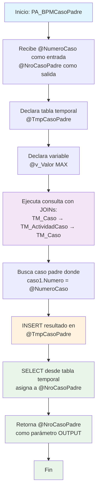

### PA_BPMCasoPadre

Este procedimiento almacenado es parte del sistema BPM4US (Business Process Management) de CUN y tiene como función encontrar el caso padre de un caso específico dentro de la jerarquía de procesos de negocio. Utiliza una consulta con JOINs entre las tablas de casos y actividades para navegar hacia arriba en la estructura jerárquica y devolver el número del caso padre mediante un parámetro de salida.

El procedimiento implementa una búsqueda en la relación padre-hijo de casos de BPM, utilizando una tabla temporal para almacenar el resultado antes de asignarlo al parámetro de salida.

#### Diagrama de flujo



#### Procedimiento almacenado

```sql


|
|PA_BPMCasoPadre|/**************************************\*\***************************************
Procedimiento [CUN].[PA_BPMCasoPadre]
Proyecto: BPM4US CUN
Descripción: Trae el valor de un detalle actividad dado el numero de caso, corresponde a una condicion en el proyecto en mención.
Creado por: MARIA CRISTINA DIAZ TORRES
Fecha de creación: 2024/08/14
TiGlobal SaS
Ejemplo de ejecución:

---

declare @VNroCasoPadre varchar(MAX)
exec [CUN].[PA_BPMCasoPadre] '000000002098 ', @VNroCasoPadre output
select @VNroCasoPadre NumeroCasoPadre

---

**************************************\*\*\***************************************/
CREATE Procedure [CUN].[PA_BPMCasoPadre] @NumeroCaso varchar(250) , @NroCasoPadre varchar(max) output
as

---

-- Declaracion de TABLAS

---

declare @TmpCasoPadre table (VrRetornado VARCHAR(250))

---

-- Declaracion de variables

---

declare @v_Valor varchar(MAX)

---

begin

---

-- INICIO --

---

    INSERT INTO  @TmpCasoPadre(VrRetornado)
    select caso.Numero
    from [BPM4US].[Bpm4usCUN].Casos.TM_Caso caso
    		inner join [BPM4US].[Bpm4usCUN].Casos.TM_ActividadCaso  act on caso.id = act.id_TM_Caso
    		inner join [BPM4US].[Bpm4usCUN].Casos.TM_Caso         caso1 on caso1.id_TM_ActividadCaso = act.id
    where caso1.Numero =  @NumeroCaso

---

    SELECT @NroCasoPadre = VrRetornado
    FROM @TmpCasoPadre

---

-- FIN --

---

END
```

#### Operaciones Principales

- Navegación jerárquica: JOIN complejo entre caso padre → actividad → caso hijo
- Búsqueda de relación: Localiza el caso padre usando el número del caso hijo
- Almacenamiento temporal: Usa tabla temporal para capturar resultado
- Asignación de salida: Transfiere resultado al parámetro OUTPUT

#### Tablas afectadas

- [BPM4US].[Bpm4usCUN].Casos.TM_Caso: Tabla principal de casos BPM (lectura)
- [BPM4US].[Bpm4usCUN].Casos.TM_ActividadCaso: Actividades de casos (lectura)
- @TmpCasoPadre: Tabla temporal (escritura/lectura)