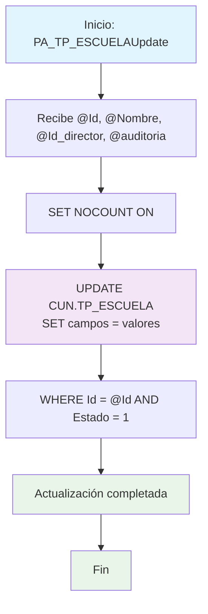

### PA_TP_ESCUELAUpdate

Procedimiento CRUD para actualizar un registro de escuela existente. Modifica nombre, director y auditoría de una escuela específica, validando que el registro esté activo antes de realizar la actualización.

#### Diagrama de flujo


#### Procedimiento almacenado
```sql
-- ***********************************
--|PA_TP_ESCUELAUpdate|/_
-- Empresa: TiGlobal SAS
-- Procedimiento: [API].[PA_TP_ESCUELAUpdate]
-- Creado Por: mc.diaz
-- Fecha: Aug 12 2024 9:55AM
-- Proyecto: ProyectoGenerado
--Descripcion: Parte del CRUD Básico, procedimiento para Actualizar un registro
-- ***********************************
Create Procedure [api].[PA_TP_ESCUELAUpdate] @Id Int, @Nombre VarChar(160), @Id_director NVarChar(450), @auditoria VarChar(MAX)
AS
Set Nocount ON
BEGIN
Update [CUN].[TP_ESCUELA]
set Nombre = @Nombre,
Id_director = @Id_director,
auditoria = @auditoria
where Id = @Id
and Estado=1
END

```
#### Operaciones Principales

- Actualización por clave: Modifica registro usando ID específico
- Actualización múltiple: Cambia nombre, director y auditoría simultáneamente
- Validación de estado: Solo actualiza registros activos (Estado = 1)
- Trazabilidad: Actualiza campo auditoría para seguimiento de cambios

#### Tablas afectadas

- [CUN].[TP_ESCUELA]: Tabla principal de escuelas (actualización)

#### Procedimientos Almacenados Anidados