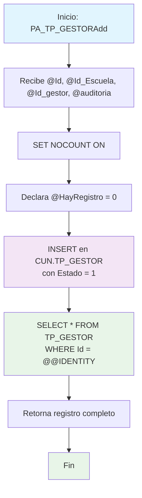

### PA_TP_GESTORAdd

Procedimiento CRUD para crear un nuevo registro de gestor en el sistema. Inserta un gestor asociado a una escuela específica con auditoría, estableciendo estado activo por defecto y retornando el registro completo recién creado.

#### Diagrama de flujo


#### Procedimiento almacenado
```sql
-- ***********************************
-- |PA_TP_GESTORAdd|/_
-- Empresa: TiGlobal SAS
-- Procedimiento: [API].[PA_TP_GESTORAdd]
-- Creado Por: mc.diaz
-- Fecha: Aug 12 2024 9:55AM
-- Proyecto: ProyectoGenerado
-- Descripcion: Parte del CRUD Básico, procedimiento para Crear un nuevo registros
-- ***********************************
Create Procedure [api].[PA_TP_GESTORAdd] @Id Int, @Id_Escuela Int, @Id_gestor NVarChar(450), @auditoria VarChar(MAX)
AS
Set Nocount ON
declare @HayRegistro int
BEGIN
set @HayRegistro = 0
insert into [CUN].[TP_GESTOR]
(Id_Escuela, Id_gestor, Auditoria, Estado)
values (@Id_Escuela, @Id_gestor, @Auditoria, 1)
Select _
from [CUN].[TP_GESTOR]
Where Id = @@identity
END
```
#### Operaciones Principales

- Inserción de gestor: Crea nuevo gestor asociado a una escuela
- Estado automático: Establece Estado = 1 (activo) por defecto
- Recuperación de ID: Usa @@IDENTITY para obtener ID generado
- Retorno completo: Devuelve todos los campos del registro recién insertado

#### Tablas afectadas

- [CUN].[TP_GESTOR]: Tabla principal de gestores (escritura/lectura)

#### Procedimientos Almacenados Anidados