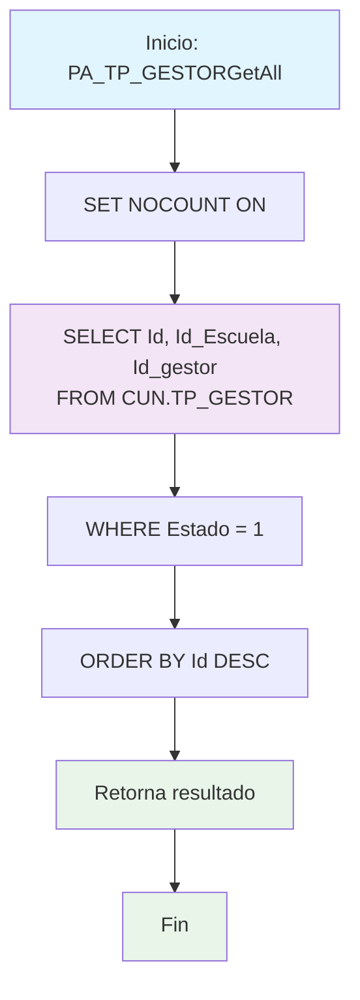

### PA_TP_GESTORAll


Procedimiento CRUD para consultar todos los gestores activos del sistema. Retorna una lista completa de gestores con ID, escuela asociada e identificador del gestor, excluyendo registros inactivos y campos tipo BLOB por rendimiento.

#### Diagrama de flujo


#### Procedimiento almacenado
```sql
-- |PA_TP_GESTORGetAll|/_
-- Empresa: TiGlobal SAS
-- Procedimiento: [API].[PA_TP_GESTORAll]
-- Creado Por: mc.diaz
-- Fecha: Aug 12 2024 9:55AM
-- Proyecto: ProyectoGenerado
--Descripcion: Parte del CRUD Básico, procedimiento de consulta de todos los registros no devuelve campos tipo BLOB

Create Procedure [api].[PA_TP_GESTORGetAll]
AS
Set Nocount ON
BEGIN
Select Id,Id_Escuela,Id_gestor
From [CUN].[TP_GESTOR]
where Estado=1
order by 1 desc
END
```
#### Operaciones Principales

- Consulta filtrada: Selecciona solo registros con Estado = 1 (activos)
- Campos específicos: Retorna solo ID, Id_Escuela e Id_gestor (excluye BLOB)
- Ordenamiento: Ordena por ID descendente (más recientes primero)
- Optimización: Usa SET NOCOUNT ON para mejor rendimiento

#### Tablas afectadas

- [CUN].[TP_GESTOR]: Tabla principal de gestores (solo lectura)

#### Procedimientos Almacenados Anidados