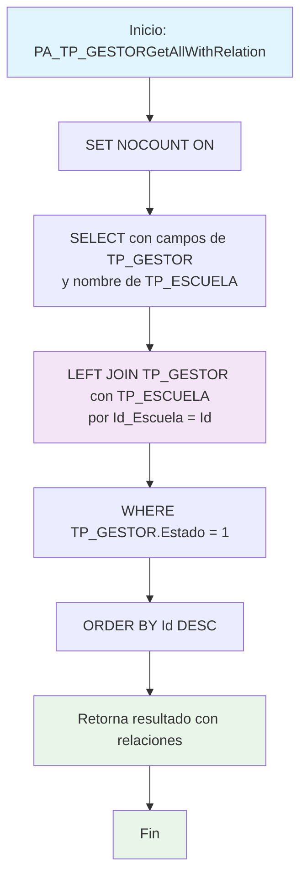

### PA_TP_GESTORGetAllWithRelation

Procedimiento CRUD para consultar todos los gestores activos con información relacional de la escuela. Retorna los datos del gestor junto con el nombre de la escuela asociada mediante LEFT JOIN, proporcionando una vista enriquecida de la relación gestor-escuela.

#### Diagrama de flujo


#### Procedimiento almacenado
```sql
/*
|PA_TP_GESTORGetAllWithRelation|/_
Empresa: TiGlobal SAS
Procedimiento: [API].[PA_TP_GESTORGetAllWithRelation]
Creado Por: mc.diaz
Fecha: Aug 12 2024 9:55AM
Proyecto: ProyectoGenerado
Descripcion: Parte del CRUD Básico, procedimiento de consulta de todos los registros no devuelve campos tipo BLOB
*/
Create Procedure [api].[PA_TP_GESTORGetAllWithRelation]
AS
Set Nocount ON
BEGIN
Select TP_Gestor.Id ,
TP_Gestor.Id_Escuela ,
TP_Gestor.Id_gestor ,
TP_Escuela.Nombre sId_Escuela
From CUN.TP_GESTOR
left join CUN.TP_Escuela on TP_Gestor.Id_Escuela = TP_Escuela.Id
Where TP_GESTOR.Estado = 1
order by 1 desc
END
```
#### Operaciones Principales

- JOIN relacional: LEFT JOIN entre gestores y escuelas para obtener nombres
- Datos enriquecidos: Incluye nombre de escuela como sId_Escuela
- Filtro por estado: Solo gestores activos (Estado = 1)
- Información completa: Combina datos de gestor con información descriptiva de escuela

#### Tablas afectadas

- [CUN].[TP_GESTOR]: Tabla principal de gestores (lectura)
- [CUN].[TP_ESCUELA]: Tabla de escuelas para obtener nombres (lectura)


#### Procedimientos Almacenados Anidados