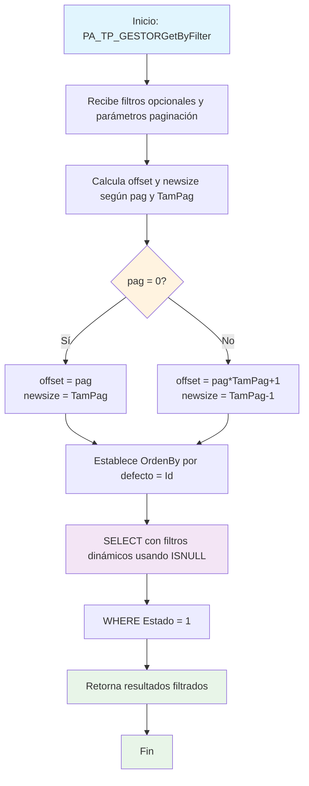

### PA_TP_GESTORGetByFilter

Procedimiento CRUD para consultar gestores con filtros dinámicos y paginación. Permite filtrar por múltiples campos opcionales y maneja cálculos de offset para paginación de resultados, aunque la implementación actual no aplica la paginación calculada.

#### Diagrama de flujo


#### Procedimiento almacenado
```sql
/*
|PA_TP_GESTORGetByFilter|/_
Empresa: TiGlobal SAS
Procedimiento: [API].[PA_TP_GESTORGetByFilter]
Creado Por: mc.diaz
Fecha: Aug 12 2024 9:55AM
Proyecto: ProyectoGenerado
Descripcion: Parte del CRUD Básico, procedimiento de consulta de todos los registros filtrados y paginados
*/
Create Procedure [api].[PA_TP_GESTORGetByFilter]
@Id Int = NULL,
@Id_Escuela Int = NULL,
@Id_gestor NVarChar(450) = NULL,
@auditoria VarChar(MAX) = NULL,
@TamPag int, @pag int, @OrdenBy nvarchar(255)
AS
Set Nocount ON
BEGIN
DECLARE @offset INT
DECLARE @newsize INT

    	IF(@pag=0)
    	begin
    	   SET @offset = @pag;
    	   SET @newsize = @Tampag
    	end
    	ELSE
    	begin
    		SET @offset = @pag*@Tampag+1;
    		SET @newsize = @Tampag-1
    	end
    set @OrdenBy=isnull(@OrdenBy,'Id')


      Select Id,Id_Escuela,Id_gestor,auditoria
      From [CUN].[TP_GESTOR]
      Where isnull(Id_Escuela,'')= isnull(@Id_Escuela,isnull(Id_Escuela,'')) And

isnull(auditoria,'')= isnull(@auditoria,isnull(auditoria,''))
and Estado=1

    END

```
#### Operaciones Principales

- Filtros opcionales: Usa ISNULL para manejar parámetros NULL de forma dinámica
- Cálculo de paginación: Calcula offset y newsize (aunque no se implementan)
- Filtrado condicional: Aplica filtros solo cuando los parámetros tienen valor
- Ordenamiento configurable: Permite especificar campo de ordenamiento

#### Tablas afectadas

- [CUN].[TP_GESTOR]: Tabla principal de gestores (solo lectura)

#### Procedimientos Almacenados Anidados