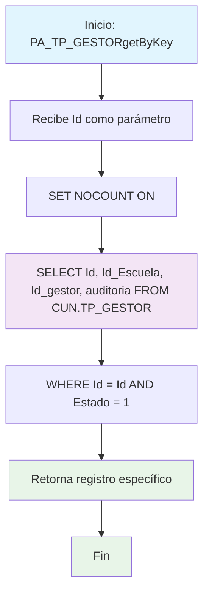

### PA_TP_GESTORgetByKey

Procedimiento CRUD para obtener un gestor específico por su ID. Retorna el registro completo incluyendo auditoría, validando que el registro esté activo antes de devolverlo.

#### Diagrama de flujo


#### Procedimiento almacenado
```sql
/*
|PA_TP_GESTORgetByKey|/_
Empresa: TiGlobal SAS
Procedimiento: [API].[PA_TP_GESTORgetByKey]
Creado Por: mc.diaz
Fecha: Aug 12 2024 9:55AM
Proyecto: ProyectoGenerado
Descripcion: Parte del CRUD Básico, procedimiento de obtención de un registro
*/
Create Procedure [api].[PA_TP_GESTORgetByKey] @Id Int
AS
Set Nocount ON
BEGIN
select Id,Id_Escuela,Id_gestor,auditoria
from [CUN].[TP_GESTOR]
where Id = @Id
and Estado=1
END
```
#### Operaciones Principales

- Búsqueda por clave primaria: Localiza registro usando ID específico
- Validación de estado: Solo retorna registros activos (Estado = 1)
- Retorno completo: Incluye todos los campos incluyendo auditoría
- Consulta única: Retorna máximo un registro o ninguno

#### Tablas afectadas

- [CUN].[TP_GESTOR]: Tabla principal de gestores (solo lectura)

#### Procedimientos Almacenados Anidados