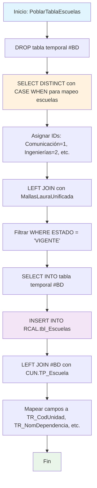

### PoblarTablaEscuelas

Procedimiento que pobla la tabla RCAL.tbl_Escuelas con información consolidada de escuelas académicas. Utiliza tabla temporal para mapear códigos de escuelas según nombres específicos, filtrar solo programas vigentes y correlacionar con el catálogo de escuelas institucional.

#### Diagrama de flujo


#### Procedimiento almacenado
```sql
CREATE PROCEDURE [Dev].[PoblarTablaEscuelas]
AS
BEGIN

DROP TABLE IF EXISTS #BD ;

SELECT DISTINCT
a.COD_UNIDAD,
CASE
WHEN a.NOM_DEPENDENCIA_NUEVA LIKE '%COMUNICACION%' THEN '1'
WHEN a.NOM_DEPENDENCIA_NUEVA = 'ESCUELA DE INGENIERIAS' THEN '2'
WHEN a.NOM_DEPENDENCIA_NUEVA = 'ESCUELA DE TRANSFORMACION EMPRESARIAL' THEN '3'
WHEN a.NOM_DEPENDENCIA_NUEVA = 'ESCUELA DE CIENCIAS JURIDICAS Y GOBIERNO' THEN '4'
ELSE '0' -- En caso de que no coincida con ninguna opción
END AS ID,
a.NOM_UNIDAD,
a.PENSUM
INTO #BD
FROM
[CUN_REPOSITORIO].[CUN].[nuevas_escuelas] a
LEFT JOIN DEV.MallasLauraUnificada b
on a.PENSUM = b.PENSUM
where b.ESTADO ='VIGENTE'
-- and b.CODIGO_SNIES = @TR_SNIES

INSERT INTO [REGISTRO_CALIFICADO].[RCAL].[tbl_Escuelas]
([TR_CodUnidad], [TR_NomDependencia], [TR_NomUnidad], [TR_Pensum])
SELECT DISTINCT
a.COD_UNIDAD AS TR_CodUnidad,
b.Nombre AS TR_NomDependencia,
a.NOM_UNIDAD AS TR_NomUnidad,
a.PENSUM AS TR_Pensum
FROM #BD a
LEFT JOIN CUN.TP_Escuela b
ON a.ID = b.id;

END;
```
#### Operaciones Principales

- Preparación temporal: DROP/CREATE tabla #BD para procesamiento intermedio
- Mapeo inteligente: CASE WHEN asigna IDs según patrones de nombres de escuelas
- Filtrado vigentes: WHERE ESTADO = 'VIGENTE' solo programas activos
- Correlación datos: LEFT JOIN con MallasLauraUnificada para validación
- Inserción final: INSERT con LEFT JOIN entre tabla temporal y catálogo escuelas
- Mapeo campos: Correspondencia a estructura final TR_CodUnidad, TR_NomDependencia, etc.

#### Tablas afectadas

##### Actualizadas:

- REGISTRO_CALIFICADO.RCAL.tbl_Escuelas: Tabla destino con información de escuelas consolidada

##### Consultadas:

- CUN_REPOSITORIO.CUN.nuevas_escuelas: Fuente principal de datos de escuelas
- DEV.MallasLauraUnificada: Validación de programas vigentes
- CUN.TP_Escuela: Catálogo de nombres de escuelas

##### Temporales:

- #BD: Tabla temporal con datos procesados y mapeados

#### Procedimientos Almacenados Anidados