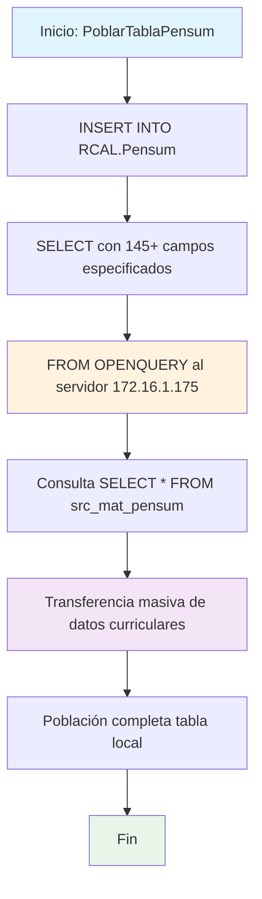

### PoblarTablaPensum

Procedimiento que pobla la tabla local RCAL.Pensum con datos completos de materias y pensum desde un servidor remoto. Utiliza OPENQUERY para extraer todos los registros de src_mat_pensum del servidor 172.16.1.175 e inserta 145+ campos relacionados con estructura curricular, notas, modalidades y configuraciones académicas.

#### Diagrama de flujo


#### Procedimiento almacenado
```sql
CREATE PROCEDURE RCAL.PoblarTablaPensum
AS
BEGIN

    -- Usar OPENQUERY para ejecutar la consulta en el servidor vinculado
    INSERT INTO RCAL.Pensum([TR_COD_UNIDAD]
      ,[TR_COD_PENSUM]
      ,[TR_COD_MATERIA]
      ,[TR_NUM_NIVEL]
      ,[TR_NOM_MATERIA]
      ,[TR_UNI_TEORICA]
      ,[TR_UNI_PRACTICA]
      ,[TR_UNI_ASESORIA]
      ,[TR_COD_ICFES]
      ,[TR_ID_ARE_CONOCIMIENTO]
      ,[TR_TIP_MATERIA]
      ,[TR_COD_TIP_MATERIA]
      ,[TR_HOR_DOCENTE]
      ,[TR_INT_HORARIA]
      ,[TIP_NOTA]
      ,[TR_NOT_MINIMA]
      ,[TR_NOT_MAXIMA]
      ,[TR_IND_HABILITABLE]
      ,[TR_IND_RECONOCIBLE]
      ,[TR_IND_NOTA_UNICA]
      ,[TR_VAL_POSIBLES]
      ,[TR_ID_TARIFA]
      ,[TR_TIP_AULA]
      ,[TR_ID_SEDE]
      ,[TR_ID_BLOQUE]
      ,[TR_FEC_INICIO]
      ,[TR_FEC_FIN]
      ,[TR_DES_BIBLIOGRAFIA]
      ,[TR_EST_MATERIA]
      ,[TR_FEC_ULT_ACT]
      ,[TR_FEC_CREACION]
      ,[TR_USU_CREACION]
      ,[TR_USU_ACTUALIZACION]
      ,[TR_DUR_SESION]
      ,[TR_NUM_MATERIAS]
      ,[TR_NOT_MIN_APROBACION]
      ,[TR_NOT_MIN_HABILITACION]
      ,[TR_ID_BLO_MATERIA]
      ,[TR_COD_MAT_PADRE]
      ,[TR_IND_MAT_HIJA]
      ,[TR_IND_CONCURRENTE]
      ,[TR_ID_PES_MATERIA]
      ,[TR_RE_COD_EST_CLASE]
      ,[TR_TE_TIP_EST_CLASE]
      ,[TR_ID_DOC_MATERIA]
      ,[TR_ID_SUB_AREA]
      ,[TR_IND_MAT_EQUIVALENCIA]
      ,[TR_NUM_HOR_PRE_TEORICA]
      ,[TR_NUM_HOR_PRE_PRACTICA]
      ,[TR_NUM_HOR_TRA_TEORICO]
      ,[TR_NUM_HOR_TRA_PRACTICO]
      ,[TR_NUM_HOR_ASESORIA]
      ,[TR_NUM_CREDITOS]
      ,[TR_NOT_MIN_HOMOLOGACION]
      ,[TR_IND_VALIDACION]
      ,[TR_NOT_MIN_VALIDACION]
      ,[TR_POR_FAL_PIERDE]
      ,[TR_REL_TRABAJO]
      ,[TR_IND_MAT_SIN_PROG]
      ,[TR_IND_CUR_VIRTUALES]
      ,[TR_PLATAFORMA]
      ,[TR_DES_CONTENIDO]
      ,[TR_NOT_REG_HABILITA]
      ,[TR_NOT_REG_VALIDACION]
      ,[TR_NOT_REG_HOMOLOGACION]
      ,[TR_COD_LIN_ASIGNATURA]
      ,[TR_IND_ELECTIVA]
      ,[TR_ID_DEPARTAMENTO]
      ,[TR_COD_CLASIFICADOR]
      ,[TR_REL_DOC_ESTUDIANTE]
      ,[TR_GEN_TIP_NOTA]
      ,[TR_EMP_TIP_NOTA]
      ,[TR_GEN_TIP_AULA]
      ,[TR_EMP_TIP_AULA]
      ,[TR_COD_MODALIDAD]
      ,[TR_TIP_MODALIDAD]
      ,[TR_EMP_TIP_MODALIDAD]
      ,[TR_EMP_TIP_MATERIA]
      ,[TR_EMP_EST_CLASE]
      ,[TR_ASISTENCIA_INICIAL]
      ,[TR_SENTIDO_INICIAL]
      ,[TR_TIP_SENTIDO_I]
      ,[TR_EMP_SENTIDO_I]
      ,[TR_ASISTENCIA_FINAL]
      ,[TR_SENTIDO_FINAL]
      ,[TR_TIP_SENTIDO_F]
      ,[TR_EMP_SENTIDO_F]
      ,[TR_NUM_TAR_INASISTENCIA]
      ,[TR_IND_ASI_BLOQUE]
      ,[TR_ASISTENCIA_INICIAL_DOC]
      ,[TR_SENTIDO_INICIAL_DOC]
      ,[TR_TIP_SENTIDO_I_DOC]
      ,[TR_EMP_SENTIDO_I_DOC]
      ,[TR_ASISTENCIA_FINAL_DOC]
      ,[TR_SENTIDO_FINAL_DOC]
      ,[TR_TIP_SENTIDO_F_DOC]
      ,[TR_EMP_SENTIDO_F_DOC]
      ,[TR_IND_MARCA_CONTINUA]
      ,[TR_UNI_EXIGIDAS]
      ,[TR_MENSAJE]
      ,[TR_TIP_IDIOMA]
      ,[TR_COD_TIP_IDIOMA]
      ,[TR_EMP_TIP_IDIOMA]
      ,[TR_NOT_APRO_HABILITACION]
      ,[TR_NOT_APRO_HOMOLOGACION]
      ,[TR_NOT_APRO_VALIDACION]
      ,[TR_IND_OPCION_GRADO]
      ,[TR_ASISTENCIA_INICIAL_ALUM]
      ,[TR_SENTIDO_INICIAL_ALUM]
      ,[TR_TIP_SENTIDO_I_ALUM]
      ,[TR_EMP_SENTIDO_I_ALUM]
      ,[TR_ASISTENCIA_FINAL_ALUM]
      ,[TR_SENTIDO_FINAL_ALUM]
      ,[TR_TIP_SENTIDO_F_ALUM]
      ,[TR_EMP_SENTIDO_F_ALUM]
      ,[TR_IND_HORAS_DOCENTE]
      ,[TR_ID_TIP_ACTIVIDAD]
      ,[TR_IND_HOMOLOGA_MOVILIDAD]
      ,[TR_IND_PERMITE_LINEA]
      ,[TR_IND_SIN_HORARIO]
      ,[TR_NUM_MIN_NOTAS]
      ,[TR_IND_APLICA_PRACTICA]
      ,[TR_IND_APLICA_CLINICA]
      ,[TR_NUM_MAX_HIJA]
      ,[TR_IND_PERMITE_CURSAR]
      ,[TR_UNI_EXT_PAG]
      ,[TR_OBJETIVO]
      ,[TR_JUSTIFICACION]
      ,[TR_METODOLOGIA]
      ,[TR_DETALLE_CURSO]
      ,[TR_RECURSOS_REQUERIDOS]
      ,[TR_IMAGEN_CURSO]
      ,[TR_IND_CURSO_LIBRE]
      ,[TR_NOM_IMAGEN_CURSO]
      ,[TR_EXT_IMAGEN_CURSO]
      ,[TR_TIP_NOTGRU]
      ,[TR_COD_NOTGRU]
      ,[TR_EMP_NOTGRU]
      ,[TR_TIP_CDAHIJA]
      ,[TR_COD_CDAHIJA]
      ,[TR_EMP_CDAHIJA]
      ,[TR_ID_CURSO]
      ,[TR_MOO_CUR_SEMILLA]
      ,[TR_TOT_UNI_CURSO]
      ,[TR_ID_ARE_ACADEMICA]
      ,[TR_UNI_CONVAL_INTERNAL]
      ,[TR_TIP_COM_VIRTUAL]
      ,[TR_COD_COM_VIRTUAL]
      ,[TR_EMP_COM_VIRTUAL]
      ,[TR_POR_ACADEMIA]
      ,[TR_POR_INVESTIGACION]
      ,[TR_POR_EXTENSION]
      ,[TR_IND_RECONOCIBLE_EXT]
      ,[TR_NOT_MIN_HOMOLOGACION_EXT]
      ,[TR_NOT_REG_HOMOLOGACION_EXT]
      ,[TR_NOT_APR_MIN_HOMOLOGACION_EXT]
      ,[TR_TIP_ELECTIVA]
      ,[TR_COD_ELECTIVA]
      ,[TR_EMP_ELECTIVA]
      ,[TR_IND_NO_CANCELA]
      ,[TR_IND_OFERTA_PRACTICA]
      ,[TR_IND_CUR_EXTERNO]) -- Ajusta esto según las columnas específicas
    SELECT COD_UNIDAD, COD_PENSUM, COD_MATERIA, NUM_NIVEL, NOM_MATERIA, UNI_TEORICA,
    	UNI_PRACTICA, UNI_ASESORIA, COD_ICFES, ID_ARE_CONOCIMIENTO, TIP_MATERIA, COD_TIP_MATERIA,
    	HOR_DOCENTE, INT_HORARIA, TIP_NOTA, NOT_MINIMA, NOT_MAXIMA, IND_HABILITABLE, IND_RECONOCIBLE,
    	IND_NOTA_UNICA, VAL_POSIBLES, ID_TARIFA, TIP_AULA, ID_SEDE, ID_BLOQUE, FEC_INICIO, FEC_FIN,
    	DES_BIBLIOGRAFIA, EST_MATERIA, FEC_ULT_ACT, FEC_CREACION, USU_CREACION, USU_ACTUALIZACION,
    	DUR_SESION, NUM_MATERIAS, NOT_MIN_APROBACION, NOT_MIN_HABILITACION, ID_BLO_MATERIA,
    	COD_MAT_PADRE, IND_MAT_HIJA, IND_CONCURRENTE, ID_PES_MATERIA, COD_EST_CLASE,
    	TIP_EST_CLASE, ID_DOC_MATERIA, ID_SUB_AREA, IND_MAT_EQUIVALENCIA, NUM_HOR_PRE_TEORICA,
    	NUM_HOR_PRE_PRACTICA, NUM_HOR_TRA_TEORICO, NUM_HOR_TRA_PRACTICO, NUM_HOR_ASESORIA,
    	NUM_CREDITOS, NOT_MIN_HOMOLOGACION, IND_VALIDACION, NOT_MIN_VALIDACION, POR_FAL_PIERDE,
    	REL_TRABAJO, IND_MAT_SIN_PROG, IND_CUR_VIRTUALES, PLATAFORMA, DES_CONTENIDO,
    	NOT_REG_HABILITA, NOT_REG_VALIDACION, NOT_REG_HOMOLOGACION, COD_LIN_ASIGNATURA, IND_ELECTIVA,
    	ID_DEPARTAMENTO, COD_CLASIFICADOR, REL_DOC_ESTUDIANTE, GEN_TIP_NOTA, EMP_TIP_NOTA, GEN_TIP_AULA,
    	EMP_TIP_AULA, COD_MODALIDAD, TIP_MODALIDAD, EMP_TIP_MODALIDAD, EMP_TIP_MATERIA, EMP_EST_CLASE,
    	ASISTENCIA_INICIAL, SENTIDO_INICIAL, TIP_SENTIDO_I, EMP_SENTIDO_I, ASISTENCIA_FINAL, SENTIDO_FINAL,
    	TIP_SENTIDO_F, EMP_SENTIDO_F, NUM_TAR_INASISTENCIA, IND_ASI_BLOQUE, ASISTENCIA_INICIAL_DOC, SENTIDO_INICIAL_DOC,
    	TIP_SENTIDO_I_DOC, EMP_SENTIDO_I_DOC, ASISTENCIA_FINAL_DOC, SENTIDO_FINAL_DOC, TIP_SENTIDO_F_DOC,
    	EMP_SENTIDO_F_DOC, IND_MARCA_CONTINUA, UNI_EXIGIDAS, MENSAJE, TIP_IDIOMA, COD_TIP_IDIOMA,
    	EMP_TIP_IDIOMA, NOT_APRO_HABILITACION, NOT_APRO_HOMOLOGACION, NOT_APRO_VALIDACION, IND_OPCION_GRADO,
    	ASISTENCIA_INICIAL_ALUM, SENTIDO_INICIAL_ALUM, TIP_SENTIDO_I_ALUM, EMP_SENTIDO_I_ALUM, ASISTENCIA_FINAL_ALUM,
    	SENTIDO_FINAL_ALUM, TIP_SENTIDO_F_ALUM, EMP_SENTIDO_F_ALUM, IND_HORAS_DOCENTE, ID_TIP_ACTIVIDAD,
    	IND_HOMOLOGA_MOVILIDAD, IND_PERMITE_LINEA, IND_SIN_HORARIO, NUM_MIN_NOTAS, IND_APLICA_PRACTICA,
    	IND_APLICA_CLINICA, NUM_MAX_HIJA, IND_PERMITE_CURSAR, UNI_EXT_PAG, OBJETIVO, JUSTIFICACION,
    	METODOLOGIA, DETALLE_CURSO, RECURSOS_REQUERIDOS, IMAGEN_CURSO, IND_CURSO_LIBRE, NOM_IMAGEN_CURSO,
    	EXT_IMAGEN_CURSO, TIP_NOTGRU, COD_NOTGRU, EMP_NOTGRU, TIP_CDAHIJA, COD_CDAHIJA, EMP_CDAHIJA, ID_CURSO,
    	MOO_CUR_SEMILLA, TOT_UNI_CURSO, ID_ARE_ACADEMICA, UNI_CONVAL_INTERNAL, TIP_COM_VIRTUAL, COD_COM_VIRTUAL,
    	EMP_COM_VIRTUAL, POR_ACADEMIA, POR_INVESTIGACION, POR_EXTENSION, IND_RECONOCIBLE_EXT,
    	NOT_MIN_HOMOLOGACION_EXT, NOT_REG_HOMOLOGACION_EXT, NOT_APR_MIN_HOMOLOGACION_EXT, TIP_ELECTIVA,
    	COD_ELECTIVA, EMP_ELECTIVA, IND_NO_CANCELA, IND_OFERTA_PRACTICA, IND_CUR_EXTERNO
    FROM OPENQUERY ([172.16.1.175],'

SELECT \* from src_mat_pensum
');
END;
```
#### Operaciones Principales

- Mapeo masivo: INSERT con 145+ campos desde COD_UNIDAD hasta IND_CUR_EXTERNO
- Consulta remota: OPENQUERY ejecuta SELECT * en servidor vinculado 172.16.1.175
- Transferencia completa: Migra toda la estructura curricular de src_mat_pensum
- Sincronización datos: Actualiza tabla local con información académica remota
- Preservación estructura: Mantiene correspondencia exacta campo a campo
- Población integral: Incluye datos de materias, créditos, horarios, modalidades y configuraciones

#### Tablas afectadas

##### Actualizadas:

- RCAL.Pensum: Tabla local destino con estructura curricular completa (145+ campos)

##### Consultadas remotas (via OPENQUERY):

- src_mat_pensum: Tabla fuente en servidor 172.16.1.175 con datos de pensum académico

#### Procedimientos Almacenados Anidados