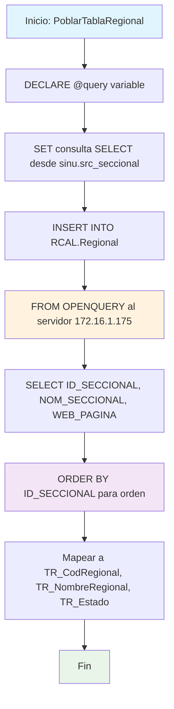

### PoblarTablaRegional

Procedimiento que pobla la tabla local RCAL.Regional con información de seccionales desde un servidor remoto. Utiliza OPENQUERY para extraer datos ordenados de regionales (ID, nombre y página web) del esquema sinu.src_seccional del servidor 172.16.1.175.

#### Diagrama de flujo


#### Procedimiento almacenado
```sql
CREATE PROCEDURE RCAL.PoblarTablaRegional
AS
BEGIN
-- Definir la consulta para obtener los datos de la tabla remota
DECLARE @query NVARCHAR(MAX);
SET @query = '
SELECT ID_SECCIONAL, NOM_SECCIONAL, WEB_PAGINA -- Ajusta esto según las columnas específicas
FROM sinu.src_seccional';

    -- Usar OPENQUERY para ejecutar la consulta en el servidor vinculado
    INSERT INTO RCAL.Regional (TR_CodRegional, TR_NombreRegional,TR_Estado ) -- Ajusta esto según las columnas específicas
    SELECT ID_SECCIONAL, NOM_SECCIONAL, WEB_PAGINA
    FROM OPENQUERY([172.16.1.175], '
        SELECT ID_SECCIONAL, NOM_SECCIONAL, WEB_PAGINA -- Ajusta esto según las columnas específicas
        FROM sinu.src_seccional
    	ORDER BY ID_SECCIONAL');

END;
```
#### Operaciones Principales

- Declaración consulta: Variable @query con SELECT desde tabla remota (no utilizada)
- Consulta distribuida: OPENQUERY ejecuta SELECT en servidor 172.16.1.175
- Extracción ordenada: ID_SECCIONAL, NOM_SECCIONAL, WEB_PAGINA con ORDER BY
- Mapeo campos: Correspondencia a TR_CodRegional, TR_NombreRegional, TR_Estado
- Inserción local: Población de tabla RCAL.Regional con datos remotos ordenados
- Sincronización: Actualiza catálogo local de regionales institucionales

#### Tablas afectadas

##### Actualizadas:

- RCAL.Regional: Tabla local destino con información de regionales (TR_CodRegional, TR_NombreRegional, TR_Estado)

##### Consultadas remotas (via OPENQUERY):

- sinu.src_seccional: Tabla fuente en servidor 172.16.1.175 con datos de seccionales

#### Procedimientos Almacenados Anidados