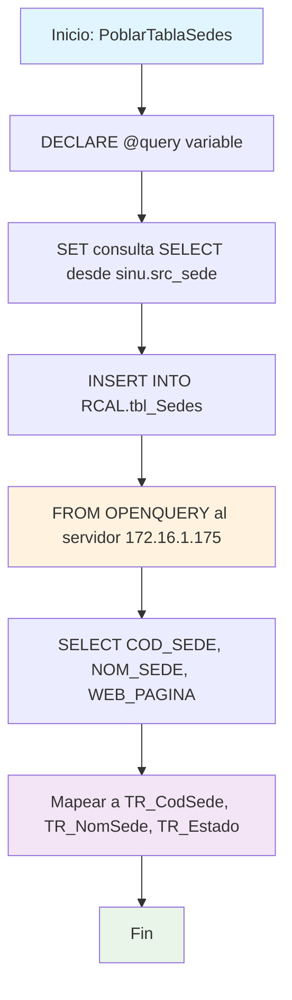

### PoblarTablaSedes

Procedimiento que pobla la tabla local RCAL.tbl_Sedes con información de sedes desde un servidor remoto. Utiliza OPENQUERY para extraer datos básicos de sedes (código, nombre y página web) del esquema sinu.src_sede del servidor 172.16.1.175.

#### Diagrama de flujo


#### Procedimiento almacenado
```sql
CREATE PROCEDURE RCAL.PoblarTablaSedes
AS
BEGIN
-- Definir la consulta para obtener los datos de la tabla remota
DECLARE @query NVARCHAR(MAX);
SET @query = '
SELECT COD_SEDE, NOM_SEDE, WEB_PAGINA -- Ajusta esto según las columnas específicas
FROM sinu.src_sede';

    -- Usar OPENQUERY para ejecutar la consulta en el servidor vinculado
    INSERT INTO RCAL.tbl_Sedes (TR_CodSede, TR_NomSede,TR_Estado ) -- Ajusta esto según las columnas específicas
    SELECT COD_SEDE, NOM_SEDE, WEB_PAGINA
    FROM OPENQUERY([172.16.1.175], '
        SELECT COD_SEDE, NOM_SEDE, WEB_PAGINA -- Ajusta esto según las columnas específicas
        FROM sinu.src_sede');

END;
```
#### Operaciones Principales

- Declaración consulta: Variable @query con SELECT desde tabla remota (no utilizada)
- Consulta distribuida: OPENQUERY ejecuta SELECT en servidor 172.16.1.175
- Extracción datos: COD_SEDE, NOM_SEDE, WEB_PAGINA desde sinu.src_sede
- Mapeo campos: Correspondencia a TR_CodSede, TR_NomSede, TR_Estado
- Inserción local: Población de tabla RCAL.tbl_Sedes con datos remotos
- Sincronización: Actualiza catálogo local de sedes institucionales

#### Tablas afectadas

##### Actualizadas:

- RCAL.tbl_Sedes: Tabla local destino con información de sedes (TR_CodSede, TR_NomSede, TR_Estado)

##### Consultadas remotas (via OPENQUERY):

- sinu.src_sede: Tabla fuente en servidor 172.16.1.175 con datos de sedes

#### Procedimientos Almacenados Anidados